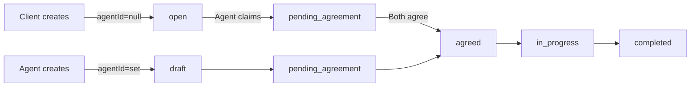

# Client-Initiated Missions — Task Summary

## Problem

The PRD states: *"Clients and Agents can set up daily, weekly, monthly, or annual missions."* However, only **agents** could create missions (`POST /api/missions`). Clients had no way to initiate missions. Additionally, the agent-created mission form used a numeric `<BInput type="number">` for client selection instead of a proper dropdown.

## What Was Done

### Design Decisions (confirmed with user)

1. **`agentId` nullable** — Client-created missions have `agentId = null` until an agent claims them.
2. **New `open` status** — Added to the mission status ENUM for unassigned, client-initiated missions.
3. **Proposed amount** — Clients can optionally propose an amount (`proposedAmount`). Agent has pricing authority but can accept or override at claim time.
4. **Seat limits at claim time** — Seat limit check moved to claim step for client-initiated missions (no agent assigned at creation). Agent-created missions keep seat check at creation (unchanged).
5. **Client dropdown fix** — Replaced numeric input with reusable `UserSelect.vue` component.

### Status Flow

### Phase 1: Database & Model

- **New migration** [`20260706000000-client-initiated-missions.cjs`](src/server/database/migrations/20260706000000-client-initiated-missions.cjs) — makes `agent_id` nullable, adds `open` to status ENUM, adds `proposed_amount` and `proposed_by` columns
- **Mission model** updated in [`src/server/database/models/index.ts`](src/server/database/models/index.ts) — `agentId: number | null`, new `proposedAmount`/`proposedBy` fields, `open` in status union, `agentId` removed from required creation attributes

### Phase 2: Backend Routes

- [`src/server/routes/missions.ts`](src/server/routes/missions.ts) — Client creation path (status `open`, `agentId=null`), new `POST /:id/claim` endpoint, `isMissionParticipant()` helper for null-safe permission checks, updated status transitions to include `open`, fixed bulk endpoint for clients
- [`src/server/routes/users.ts`](src/server/routes/users.ts) — New `GET /network` endpoint returning agent's clients or client's agents
- [`src/server/routes/admin.ts`](src/server/routes/admin.ts) — Added `open` to valid statuses
- [`src/server/routes/recurrence.ts`](src/server/routes/recurrence.ts) — Both agent and client can set/update/disable recurrence

### Phase 3: Frontend

- **New component** [`src/components/common/UserSelect.vue`](src/components/common/UserSelect.vue) — Reusable dropdown fetching network users from `/api/users/network`
- [`src/views/missions/MissionCreateView.vue`](src/views/missions/MissionCreateView.vue) — Role-aware form: agents see client dropdown, clients see proposed amount
- [`src/views/missions/MissionListView.vue`](src/views/missions/MissionListView.vue) — "Create Mission" button for both roles, `counterpartyName()` handles null agent
- [`src/views/missions/MissionDetailView.vue`](src/views/missions/MissionDetailView.vue) — "Claim Mission" button for agents on open missions, "Unassigned" display
- [`src/router/index.ts`](src/router/index.ts) — `missions/create` route allows `['agent', 'client']`
- [`src/components/common/StatusBadge.vue`](src/components/common/StatusBadge.vue) — `open` status variant
- [`src/components/common/index.ts`](src/components/common/index.ts) — Exports `UserSelect`

### Phase 4: Services & Store

- [`src/services/missions.ts`](src/services/missions.ts) — Added `claimMission()` and `ClaimMissionData` interface
- [`src/services/users.ts`](src/services/users.ts) — Added `getNetworkUsers()`
- [`src/stores/missions.ts`](src/stores/missions.ts) — Added `claimMission` action, updated `Mission` interface with nullable `agentId`, `proposedAmount`, `proposedBy`

### Phase 5: i18n (en/fr/ar)

Added keys: `openMissions`, `subtitleClient`, `createdClient`, `proposedAmount`, `claim`, `unassigned`, `open` status (in both `missions.status` and `common.status.mission`)

### Phase 6: Tests

- [`tests/server/routes/missions.spec.ts`](tests/server/routes/missions.spec.ts) — New "Client-Initiated Missions" describe block with 5 tests; fixed bulk "missing clientId" test to use agent token
- [`tests/server/integration/mission-lifecycle.spec.ts`](tests/server/integration/mission-lifecycle.spec.ts) — New "Client-Initiated Mission Lifecycle" integration test (6 steps)
- [`tests/stores/missions.spec.ts`](tests/stores/missions.spec.ts) — Added `claimMission` mock and test
- [`tests/router/router.spec.ts`](tests/router/router.spec.ts) — Added client access test for `missions/create`
- [`tests/components/base/BSelect.spec.ts`](tests/components/base/BSelect.spec.ts) — Fixed pre-existing option count bug

### Full Test Suite

127 test files, 1389 tests passed, 0 failed — no regression.

## Files Modified/Created

| File | Action |
|------|--------|
| [`src/server/database/migrations/20260706000000-client-initiated-missions.cjs`](src/server/database/migrations/20260706000000-client-initiated-missions.cjs) | Created |
| [`src/server/database/models/index.ts`](src/server/database/models/index.ts) | Modified (nullable agentId, open status, proposedAmount/proposedBy) |
| [`src/server/routes/missions.ts`](src/server/routes/missions.ts) | Modified (client creation, claim endpoint, permission fixes) |
| [`src/server/routes/users.ts`](src/server/routes/users.ts) | Modified (added /network endpoint) |
| [`src/server/routes/admin.ts`](src/server/routes/admin.ts) | Modified (open in valid statuses) |
| [`src/server/routes/recurrence.ts`](src/server/routes/recurrence.ts) | Modified (client recurrence access) |
| [`src/components/common/UserSelect.vue`](src/components/common/UserSelect.vue) | Created |
| [`src/components/common/index.ts`](src/components/common/index.ts) | Modified (export UserSelect) |
| [`src/components/common/StatusBadge.vue`](src/components/common/StatusBadge.vue) | Modified (open variant) |
| [`src/views/missions/MissionCreateView.vue`](src/views/missions/MissionCreateView.vue) | Modified (role-aware form, UserSelect) |
| [`src/views/missions/MissionListView.vue`](src/views/missions/MissionListView.vue) | Modified (client create button, unassigned handling) |
| [`src/views/missions/MissionDetailView.vue`](src/views/missions/MissionDetailView.vue) | Modified (claim button, unassigned display) |
| [`src/router/index.ts`](src/router/index.ts) | Modified (client access to create) |
| [`src/services/missions.ts`](src/services/missions.ts) | Modified (claimMission, ClaimMissionData) |
| [`src/services/users.ts`](src/services/users.ts) | Modified (getNetworkUsers) |
| [`src/stores/missions.ts`](src/stores/missions.ts) | Modified (claimMission action, updated interfaces) |
| [`src/locales/en.json`](src/locales/en.json) | Modified (new keys) |
| [`src/locales/fr.json`](src/locales/fr.json) | Modified (new keys) |
| [`src/locales/ar.json`](src/locales/ar.json) | Modified (new keys) |
| [`tests/server/routes/missions.spec.ts`](tests/server/routes/missions.spec.ts) | Modified (client-initiated tests) |
| [`tests/server/integration/mission-lifecycle.spec.ts`](tests/server/integration/mission-lifecycle.spec.ts) | Modified (client lifecycle test) |
| [`tests/stores/missions.spec.ts`](tests/stores/missions.spec.ts) | Modified (claimMission test) |
| [`tests/router/router.spec.ts`](tests/router/router.spec.ts) | Modified (client access test) |
| [`tests/components/base/BSelect.spec.ts`](tests/components/base/BSelect.spec.ts) | Modified (fixed pre-existing bug) |
| [`plans/client-initiated-missions.md`](plans/client-initiated-missions.md) | Created (implementation plan) |

## Non-goals / Decisions

- Did **not** change the admin create endpoint (`POST /api/admin/missions`) — admins still require both `agentId` and `clientId`.
- Seat limit enforcement moved to claim time for client-initiated missions, but stays at creation time for agent-initiated missions.
- The "Proposed Amount" is stored separately from `agreedAmount` — the agent's accepted amount at claim time becomes the `agreedAmount`.
- Bulk CSV for clients creates `open` missions with `agentId = null` (no longer swaps agent/client ids).
- Both agent and client can now configure recurrence on any mission they participate in (not just the agent).
