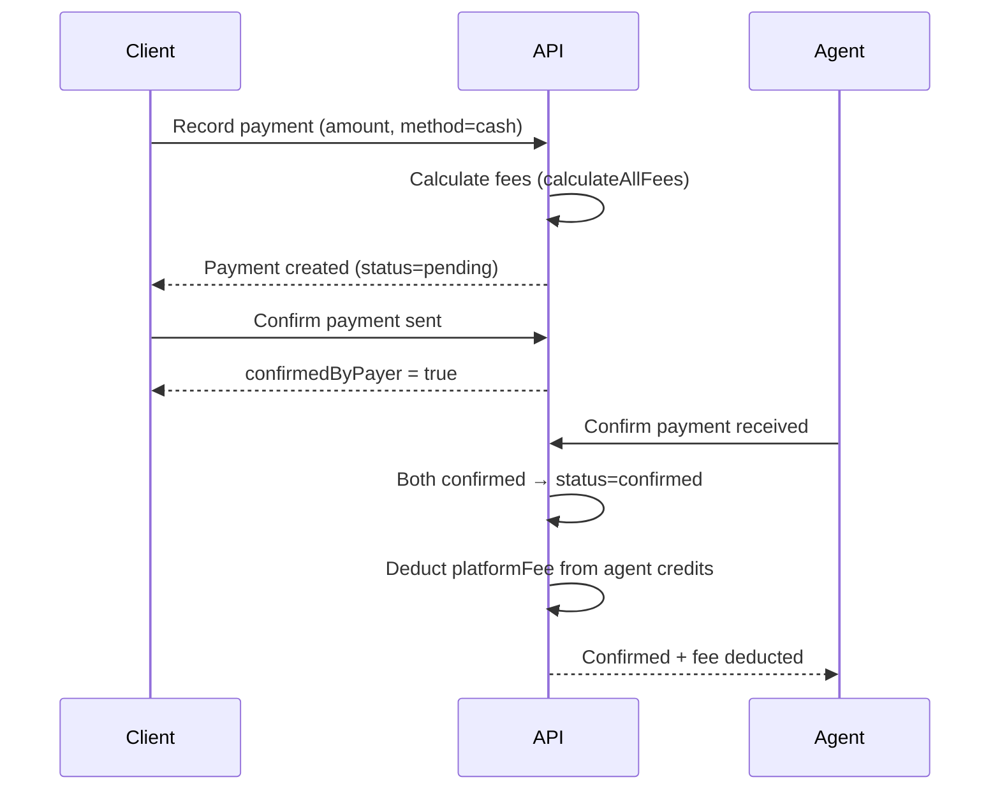

# Dossiat — Architecture

> Technical architecture and system design for the Dossiat SaaS platform.

---

## Tech Stack

| Layer | Technology |
|-------|------------|
| **Frontend** | Vue 3 (Composition API) + TypeScript + Pinia + Vue Router |
| **Backend** | Hono (Node.js) |
| **Database** | PostgreSQL (production) / SQLite (development) |
| **ORM** | Sequelize 6 |
| **Auth** | JWT (jose) with access/refresh token rotation |
| **Testing** | Vitest + @vue/test-utils |
| **Deployment** | Netlify (serverless functions + scheduled functions) |
| **Build** | Vite + vue-tsc |

---

## Directory Structure

```
src/
├── App.vue
├── main.ts
├── env.d.ts
├── assets/
│   └── main.css                    # Global styles (Bootstrap 5 + custom)
├── components/
│   └── base/                       # Reusable base components (BButton, BCard, BTable, etc.)
├── composables/                    # Vue composables (useAuth, useToast, etc.)
├── locales/                        # i18n translation files
├── router/
│   └── index.ts                    # Vue Router configuration
├── server/                         # Backend Hono app
│   ├── index.ts                    # App entry point + route mounting
│   ├── database/
│   │   ├── config/                 # Sequelize config (PostgreSQL/SQLite)
│   │   ├── models/                 # All Sequelize models (single index.ts)
│   │   ├── migrations/             # Database migrations
│   │   └── seeders/                # Seed data (plans, demo users, currencies)
│   ├── middleware/                  # Auth, validation, error handling, rate limiting
│   ├── routes/                     # API route handlers (Hono routers)
│   ├── services/                   # Business logic services
│   │   └── payment/                # Payment provider abstraction
│   └── utils/                      # Response helpers, JWT utilities
├── stores/                         # Pinia state stores
└── views/                          # Vue page components
netlify/
└── functions/
    ├── api.ts                      # Hono → Netlify adapter
    └── scheduler.ts                # Scheduled tasks (recurrent missions)
tests/
├── components/base/                # Component unit tests
├── server/
│   ├── database/                   # DB constraint + seeder tests
│   ├── middleware/                  # Middleware tests
│   ├── routes/                     # API route tests
│   ├── services/payment/           # Payment service tests
│   └── utils/                      # Utility tests
```

---

## Backend Architecture

### Entry Point

[`src/server/index.ts`](src/server/index.ts) creates the Hono app, applies global middleware (CORS, logger, rate limiter, error handler), and mounts all route modules under the `/api` prefix.

### Route Modules

| File | Mount Path | Description |
|------|-----------|-------------|
| [`auth.ts`](src/server/routes/auth.ts) | `/api/auth` | Registration, login, tokens, email verification |
| [`users.ts`](src/server/routes/users.ts) | `/api/users` | User profiles (agent/client) |
| [`missions.ts`](src/server/routes/missions.ts) | `/api/missions` | Mission CRUD, status transitions, attachments, disputes |
| [`recurrence.ts`](src/server/routes/recurrence.ts) | `/api` | Recurrent mission schedule management |
| [`messages.ts`](src/server/routes/messages.ts) | `/api` | Mission conversations, messaging |
| [`payments.ts`](src/server/routes/payments.ts) | `/api` | Payment recording, dual-party confirmation, credits, invoices |
| [`stripe.ts`](src/server/routes/stripe.ts) | `/api/payments/stripe` | Stripe checkout, webhooks, connect (stubbed) |
| [`paypal.ts`](src/server/routes/paypal.ts) | `/api/payments/paypal` | PayPal orders, webhooks, setup (stubbed) |
| [`subscriptions.ts`](src/server/routes/subscriptions.ts) | `/api/subscriptions` | Plan listing, subscribe, manage |
| [`disputes.ts`](src/server/routes/disputes.ts) | `/api/disputes` | Dispute management, reconciliation |
| [`notifications.ts`](src/server/routes/notifications.ts) | `/api/notifications` | User notifications (CRUD + mark read) |
| [`admin.ts`](src/server/routes/admin.ts) | `/api/admin` | Admin-only stats, user management, disputes |

### Middleware

| File | Purpose |
|------|---------|
| [`auth.ts`](src/server/middleware/auth.ts) | JWT access token verification via `jose` |
| [`roleGuard.ts`](src/server/middleware/roleGuard.ts) | Role-based access control (`agent`, `client`, `admin`) |
| [`validateRequest.ts`](src/server/middleware/validateRequest.ts) | Request body/query/params validation |
| [`errorHandler.ts`](src/server/middleware/errorHandler.ts) | Global error handler with consistent error format |
| [`rateLimiter.ts`](src/server/middleware/rateLimiter.ts) | Rate limiting to prevent abuse |

### API Conventions

- All responses use [`apiResponse.ts`](src/server/utils/apiResponse.ts) helpers: `successResponse()`, `errorResponse()`, `paginatedResponse()`
- Authenticated routes use `authenticate()` middleware
- Role-restricted routes chain `roleGuard('role')`
- Request validation uses `validateRequest()` with declarative schema objects

---

## Database Schema

Sequelize models are defined in a single [`models/index.ts`](src/server/database/models/index.ts) file with associations. Migrations in [`migrations/`](src/server/database/migrations/) handle schema changes.

### Core Entity Groups

#### User & Auth
- **`User`** — email, passwordHash, firstName, lastName, role (agent|client|admin), emailVerified
- **`AgentProfile`** — bio, specialties, acceptedClientTypes, uniqueInviteSlug, currency, timezone
- **`ClientProfile`** — companyName, companySize, industry
- **`RefreshToken`** / **`PasswordResetToken`** / **`EmailVerificationToken`** — Token management

#### Missions
- **`Mission`** — title, description, status (draft → pending_agreement → agreed → in_progress → completed/disputed/cancelled), type (one_time|recurrent), pricingType, agreedAmount, checklist
- **`RecurrentMissionConfig`** — frequency, interval, dayOfMonth/Week, nextRunAt, isActive
- **`MissionAttachment`** — file uploads as proof of work

#### Messaging
- **`Conversation`** — One per mission
- **`Message`** — sender, content, readAt
- **`MessageAttachment`** — File attachments on messages

#### Payments & Financials
- **`Payment`** — amount, method, fees, dual-party confirmation, status
- **`PlatformCredit`** — Agent credit balance for platform fees
- **`CreditTransaction`** — Purchase, deduction, refund, adjustment history
- **`Invoice`** — Agent billing invoices per period

#### Subscriptions
- **`SubscriptionPlan`** — 3 tiers (Small Business $29, Professional $99, Enterprise $499)
- **`Subscription`** — Client plan subscription with period tracking
- **`SubscriptionInvoice`** — Subscription billing records

#### Disputes
- **`Dispute`** — mission, initiator, reason, status, resolution
- **`DisputeMessage`** — Structured reconciliation messaging

#### Notifications
- **`Notification`** — type, title, body, data (JSON), readAt

---

## Payment System Architecture

The payment system is the core financial backbone of the platform. It supports both off-platform (cash/bank_transfer) and online gateway (Stripe/PayPal) payments.

### Flow: Cash / Bank Transfer (Fully Implemented)



### Fee Calculation

Managed by [`feeCalculator.ts`](src/server/services/payment/feeCalculator.ts):

| Step | Cash / Bank Transfer | Stripe / PayPal |
|------|---------------------|-----------------|
| **Gateway fee** | $0 | amount × 2.9% + $0.30 |
| **Platform fee** | max(amount × 1%, $1) | max((amount − gatewayFee) × 1%, $1) |
| **Net amount** | amount − platformFee | amount − platformFee − gatewayFee |
| **Fee collection** | Deducted from agent PlatformCredit balance | Handled by gateway automatically |

### Credit Deduction

When a cash/bank_transfer payment is confirmed by both parties:
1. Agent's [`PlatformCredit`](src/server/database/models/index.ts:587) balance is checked
2. If balance ≥ platformFee → deducted immediately, [`CreditTransaction`](src/server/database/models/index.ts:619) created (type: `deduction`)
3. If balance < platformFee → payment still confirms; outstanding fee tracked for billing cycle / invoice

### Provider Abstraction

[`src/server/services/payment/`](src/server/services/payment/) provides a pluggable provider pattern:

- **`PaymentProvider` interface** — `createCheckoutSession()`, `handleWebhook()`, `getAccountLink()`
- **`CashProvider`** — No-op (cash is handled by confirmation flow)
- **`StripeProvider`** — Stubbed (throws "not yet implemented")
- **`PayPalProvider`** — Stubbed (throws "not yet implemented")
- **Factory** — [`getPaymentProvider(method)`](src/server/services/payment/index.ts) returns the correct provider

---

## Frontend Architecture

### Component System

Base UI components in [`src/components/base/`](src/server/../../components/base/):

| Component | Description |
|-----------|-------------|
| `BAlert.vue` | Alert/notification banners |
| `BAvatar.vue` | User avatar with fallback initials |
| `BBadge.vue` | Status/label badges |
| `BButton.vue` | Button with variants (primary, secondary, danger, etc.) |
| `BCard.vue` | Content card container |
| `BCheckbox.vue` | Checkbox with label |
| `BDropdown.vue` | Dropdown menu |
| `BInput.vue` | Text input with validation |
| `BModal.vue` | Modal dialog |
| `BTable.vue` | Data table with sorting, pagination, selection |

All components use `<script lang="ts" setup>` syntax and follow Bootstrap 5 styling.

### Mission Components

| Component | Description |
|-----------|-------------|
| `MissionTimeline.vue` | Status timeline (created → agreed → in_progress → completed) |
| `MissionChecklist.vue` | Agreement checklist with progress tracking |
| `MissionAttachments.vue` | File upload and listing for mission proof |
| `RecurrentMissionSetup.vue` | Form for configuring recurrence frequency, interval, day |
| `RecurrentMissionList.vue` | List of active recurrence configs with edit/disable |
| `RecurrencePreview.vue` | Visual timeline of next 5 upcoming run dates |

### Messaging Components

| Component | Description |
|-----------|-------------|
| `MessageBubble.vue` | Individual message display with sender, timestamp, read status |
| `MessageComposer.vue` | Text input with send button, Enter-to-send, empty validation |

### State Management

Pinia stores in [`src/stores/`](src/stores/):
- `auth.ts` — User authentication state, tokens, login/logout
- `missions.ts` — Mission lists, filters, current mission
- `recurrence.ts` — Recurrence configs CRUD, loading state
- `messages.ts` — Conversations list, messages, unread counts, mark-as-read
- `notifications.ts` — Notifications list, mark as read
- `payments.ts` — Payment history, credit balance
- `subscriptions.ts` — Current plan, billing
- `ui.ts` — Sidebar, theme, loading states

### Composables

- `useMessagePolling.ts` — Polls unread message count every 30s, auto-cleanup on unmount

---

## Deployment

### Netlify Serverless

- **`netlify/functions/api.ts`** — Wraps the Hono app as a Netlify Function
- **`netlify/functions/scheduler.ts`** — Scheduled function (every 10 minutes) for recurrent mission generation
- **`netlify.toml`** — Routes `/api/*` to the serverless function

### Environment Variables

Key env vars (see [`.env.example`](.env.example)):
- `DB_*` — Database connection (PostgreSQL for prod, SQLite for dev)
- `JWT_SECRET` / `JWT_REFRESH_SECRET` — Token signing
- `STRIPE_SECRET_KEY` / `STRIPE_WEBHOOK_SECRET` — Stripe integration
- `PAYPAL_CLIENT_ID` / `PAYPAL_CLIENT_SECRET` — PayPal integration
- `SMTP_*` — Email delivery

---

## Testing Strategy

Tests use **Vitest** with SQLite in-memory database for backend tests.

| Test Type | Location | Coverage |
|-----------|----------|----------|
| Component tests | `tests/components/base/` | Base UI components |
| Mission component tests | `tests/components/mission/` | RecurrencePreview, RecurrentMissionSetup, RecurrentMissionList |
| Messaging component tests | `tests/components/messaging/` | MessageBubble, MessageComposer |
| Route tests | `tests/server/routes/` | API endpoint behavior |
| Middleware tests | `tests/server/middleware/` | Auth, validation, guards |
| Service tests | `tests/server/services/` | Business logic (fee calculation, providers) |
| Database tests | `tests/server/database/` | Constraints, seeders |
| Utility tests | `tests/server/utils/` | Response helpers |

Run all tests: `pnpm test`
Run in watch mode: `pnpm test:watch`
Run with coverage: `pnpm test:coverage`
