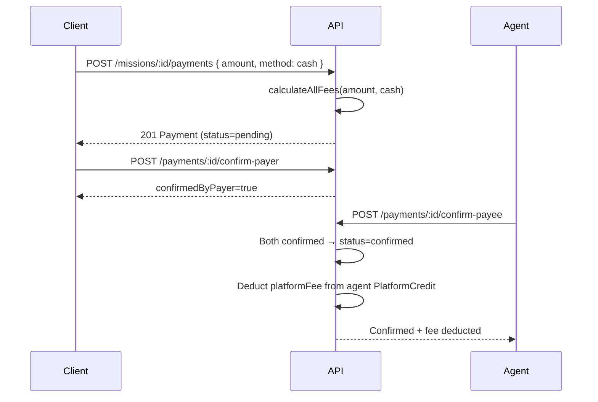

# Dossiat — API Documentation

> Comprehensive reference for the Dossiat REST API. All endpoints are mounted under the `/api` prefix.
>
> **Source of truth:** route files in [`src/server/routes/`](../src/server/routes/), mounted by [`src/server/index.ts`](../src/server/index.ts).

---

## Overview

| Property | Value |
|----------|-------|
| **Base URL** | `/api` (same-origin in production; `http://localhost:5173/api` in dev via Vite plugin) |
| **Protocol** | HTTPS (production), HTTP (dev) |
| **Content type** | `application/json` (except file uploads: `multipart/form-data`) |
| **Auth scheme** | JWT Bearer tokens |
| **Rate limit** | 200 requests / minute / IP (global, see [`rateLimiter.ts`](../src/server/middleware/rateLimiter.ts)) |

---

## Authentication

Dossiat uses **JWT access + refresh tokens** signed with `jose`.

### Token flow

1. `POST /api/auth/register` or `POST /api/auth/login` → returns `accessToken` (15 min) + `refreshToken` (7 days)
2. Include the access token on protected requests: `Authorization: Bearer <accessToken>`
3. When the access token expires, call `POST /api/auth/refresh` with the refresh token to get a new pair
4. `POST /api/auth/logout` revokes the refresh token

### Auth middleware

| Middleware | File | Purpose |
|-----------|------|---------|
| `authenticate()` | [`auth.ts`](../src/server/middleware/auth.ts) | Verifies the JWT access token, sets `c.get('auth')` = `{ userId, email, role }` |
| `roleGuard('agent' \| 'client' \| 'admin')` | [`roleGuard.ts`](../src/server/middleware/roleGuard.ts) | Restricts a route to a specific role |
| `adminOnly()` | [`roleGuard.ts`](../src/server/middleware/roleGuard.ts) | Admin-only guard (used by all `/api/admin/*` routes) |

### Roles

| Role | Scope |
|------|-------|
| `agent` | Manages missions as the service provider; receives payments; pays platform fees |
| `client` | Creates/commissions missions; makes payments; subscribes to plans |
| `admin` | Full platform management via `/api/admin/*` |

---

## Standardized Response Format

All responses use the helpers in [`apiResponse.ts`](../src/server/utils/apiResponse.ts).

### Success

```json
{
  "success": true,
  "data": { },
  "message": "Optional human-readable message"
}
```

### Paginated success

```json
{
  "success": true,
  "data": [ ],
  "meta": {
    "page": 1,
    "limit": 20,
    "total": 137,
    "totalPages": 7
  }
}
```

### Error

```json
{
  "success": false,
  "error": "Human-readable error message"
}
```

### Common error codes

| Status | Meaning |
|--------|---------|
| `400` | Bad request / invalid state transition |
| `401` | Missing or invalid auth token |
| `403` | Authenticated but not allowed (wrong role, not a participant) |
| `404` | Resource not found |
| `409` | Conflict (duplicate email, active subscription, etc.) |
| `422` | Validation error (missing/invalid body fields) |
| `429` | Rate limit exceeded |
| `501` | Feature not configured (e.g. Stripe/PayPal keys missing) |

---

## Health

### `GET /api/health`

Unauthenticated liveness check.

**Response:**

```json
{
  "status": "ok",
  "timestamp": "2026-07-13T20:00:00.000Z"
}
```

---

## Auth (`/api/auth`)

Source: [`auth.ts`](../src/server/routes/auth.ts)

### `POST /api/auth/register`

Register a new user. Creates the corresponding profile (`AgentProfile` or `ClientProfile`) and an email verification token.

**Body:**

| Field | Type | Required | Notes |
|-------|------|----------|-------|
| `email` | string | yes | Valid email format |
| `password` | string | yes | Min 8 characters |
| `firstName` | string | yes | |
| `lastName` | string | yes | |
| `role` | string | yes | `agent` or `client` |
| `acceptTerms` | boolean | yes | Must be `true` (ToS acceptance) |

**Response (201):** `{ id, email, firstName, lastName, role, emailVerified, accessToken, refreshToken, verificationToken }`

**Errors:** `409` email already registered, `422` validation.

---

### `POST /api/auth/login`

**Body:** `{ email, password }`

**Response:** `{ user: { id, email, firstName, lastName, role, emailVerified }, accessToken, refreshToken }`

**Errors:** `401` invalid email or password.

---

### `POST /api/auth/refresh`

**Body:** `{ refreshToken }`

Rotates the refresh token (old one is replaced).

**Response:** `{ accessToken, refreshToken }`

**Errors:** `401` invalid/expired/revoked refresh token.

---

### `POST /api/auth/logout`

**Body:** `{ refreshToken }`

Revokes the refresh token. Idempotent.

**Response:** `{ loggedOut: true }`

---

### `POST /api/auth/forgot-password`

**Body:** `{ email }`

Always returns success (does not leak whether the email exists). Generates a reset token valid for 1 hour.

**Response:** `{ message: "If the email exists, a reset link has been sent" }`

---

### `POST /api/auth/reset-password`

**Body:** `{ token, password }` (password min 8 chars)

Resets the password and invalidates all existing refresh tokens for the user.

**Response:** `{ message: "Password reset successful" }`

**Errors:** `400` invalid/expired token, `422` password too short.

---

### `GET /api/auth/verify-email/:token`

**Params:** `token` (path)

Marks the user's email as verified.

**Response:** `{ message: "Email verified successfully" }`

**Errors:** `400` invalid/expired token.

---

### `POST /api/auth/resend-verification`

**Body:** `{ email }`

Generates a new verification token (invalidates previous unused ones).

**Response:** `{ message: "Verification email sent" }`

**Errors:** `404` user not found, `400` already verified.

---

## Users & Profiles (`/api/users`)

Source: [`users.ts`](../src/server/routes/users.ts)

### `GET /api/users/me` 🔒

Returns the current user with their `agentProfile` or `clientProfile` (password hash excluded).

---

### `GET /api/users/me/export` 🔒

**GDPR data export.** Returns a full JSON bundle of the user's data: profile, missions (as agent + client), payments, disputes initiated, notifications.

---

### `DELETE /api/users/me` 🔒

**GDPR account deletion.** Anonymizes PII (name → "Deleted User", email → `deleted+<id>@dossiat.invalid`, password randomized) and revokes all refresh tokens. **Blocked** if the user has active missions (`pending_agreement`, `agreed`, or `in_progress`).

**Errors:** `409` active missions exist.

---

### `PUT /api/users/me` 🔒

**Body:** `{ firstName, lastName }` (both required)

---

### `PUT /api/users/me/password` 🔒

**Body:** `{ currentPassword, newPassword }` (newPassword min 8 chars)

**Errors:** `401` current password incorrect, `422` new password too short.

---

### `POST /api/users/me/avatar` 🔒

Upload a profile photo. **Content type:** `multipart/form-data` with field `avatar`.

- Allowed MIME types: `image/jpeg`, `image/png`, `image/webp`
- Max size: 5 MB (configurable via `MAX_AVATAR_SIZE`)
- Stored under `UPLOAD_DIR` (default `./uploads/avatars`), served at `/uploads/avatars/<filename>`

**Response:** `{ profilePhotoUrl }`

---

### `GET /api/users/agents/discover` 🔒 `client`

Search agents by name or specialty. Admins can access by sending `X-View-As-Role: client`.

**Query:**

| Param | Type | Default | Notes |
|-------|------|---------|-------|
| `q` | string | — | Search across firstName, lastName, specialties |
| `clientType` | string | — | `B2B`, `B2C`, or `Both` |
| `limit` | number | 20 | Max 100 |
| `offset` | number | 0 | |

Only returns agents whose user has `emailVerified: true`.

**Response:** array of `{ id, slug, firstName, lastName, bio, specialties, acceptedClientTypes, profilePhotoUrl }`

---

### `GET /api/users/agents/:slug` 🔓 (public, progressive visibility)

Public agent profile by invite slug. Visibility is **progressive**:

- **Unauthenticated:** `id, bio, specialties, acceptedClientTypes, profilePhotoUrl, user.{id, firstName, lastName}`
- **Authenticated:** also includes `timezone`
- **Owner:** also includes `currency` and `user.email`

**Errors:** `404` agent not found.

---

### `PUT /api/users/agents/me` 🔒 `agent`

Update agent profile.

**Body:** `{ bio, specialties, acceptedClientTypes, currency, timezone }` (all required; `acceptedClientTypes` ∈ `B2B|B2C|Both`)

---

### `POST /api/users/agents/me/invite-link` 🔒 `agent`

Regenerate the agent's unique invite slug.

**Response:** `{ inviteLink: "/agents/<slug>", slug }`

---

### `GET /api/users/network` 🔒

List users in the caller's **private network** (users with whom they share at least one mission).

**Query:** `?role=client|agent`

- Agents calling with `role=client` (or no role) → list their clients
- Clients calling with `role=agent` (or no role) → list their agents

**Response:** array of `{ id, firstName, lastName, email }`

---

### `GET /api/users/clients/me` 🔒 `client`

Returns the client profile with the associated user.

---

### `PUT /api/users/clients/me` 🔒 `client`

**Body:** `{ companyName, companySize, industry }` (all required)

---

### `GET /api/users/:id` 🔒

Minimal public user info by numeric id (`{ id, firstName, lastName, role }`). Used for displaying a pre-assigned agent's name. Non-numeric ids return `404`.

---

## Missions (`/api/missions`)

Source: [`missions.ts`](../src/server/routes/missions.ts)

### `GET /api/missions` 🔒

List missions for the current user, paginated.

**Query:**

| Param | Type | Notes |
|-------|------|-------|
| `page` | number | Default 1 |
| `limit` | number | Default 20 |
| `status` | string | Filter by status |
| `type` | string | `one_time` or `recurrent` |
| `startDate` | ISO date | `createdAt >=` |
| `endDate` | ISO date | `createdAt <=` |

- **Agents** see their own missions **plus** all `open` missions available to claim.
- **Clients** see only missions where they are the client.

**Response:** paginated, each row includes `agent` and `client` user objects.

---

### `POST /api/missions` 🔒

Create a mission. Behavior depends on role:

- **Agent:** requires `clientId`. Creates with `status: draft`. Checks the client's seat limit.
- **Client with `agentId`:** pre-assigns to a specific agent. Creates with `status: pending_agreement`. Checks the client's own seat limit.
- **Client without `agentId`:** creates an `open` mission (no agent yet).

**Body:**

| Field | Type | Required | Notes |
|-------|------|----------|-------|
| `title` | string | yes | |
| `pricingType` | string | yes | `fixed`, `hourly`, or `task_based` |
| `clientId` | number | agent only | Required for agent-created missions |
| `agentId` | number | client optional | Pre-assign to an agent |
| `description` | string | no | |
| `type` | string | no | `one_time` (default) or `recurrent` |
| `agreedAmount` | number | no | |
| `currency` | string | no | Default `USD` |
| `agreedChecklist` | array | no | |

**Response (201):** the created mission.

**Errors:** `403` seat limit reached, `404` agent not found, `422` validation.

---

### `POST /api/missions/bulk` 🔒

Bulk-create up to 100 missions. **Enterprise tier only** (clients must have `csv_import` feature on their active subscription plan).

**Body:** `{ missions: [{ title, pricingType, clientId?, agentId?, description?, type?, agreedAmount?, currency?, agreedChecklist? }, ...] }`

**Response (201):** `{ count, missions: [...] }`

**Errors:** `403` not Enterprise, `422` invalid array / missing fields / over 100.

---

### `GET /api/missions/:id` 🔒

Mission detail with `agent`, `client`, `recurrenceConfig`, and `attachments`.

Access: participant, admin, or agent viewing an `open` mission.

**Errors:** `403` access denied, `404` not found.

---

### `POST /api/missions/:id/claim` 🔒 `agent`

An agent claims an `open` mission.

**Body (optional):** `{ agreedAmount? }` — overrides the client's `proposedAmount`.

Sets `agentId`, `status: pending_agreement`. Checks the client's seat limit. Notifies the client.

**Errors:** `400` not open / already assigned, `403` seat limit, `404` not found.

---

### `PUT /api/missions/:id` 🔒

Update mission fields. Participant or admin only.

**Body:** `{ title (required), description?, agreedAmount?, currency?, agreedChecklist? }`

---

### `DELETE /api/missions/:id` 🔒

Cancel a mission (sets `status: cancelled`, does not hard-delete). Participant or admin only. Notifies the other party.

---

### `POST /api/missions/:id/agree` 🔒

Record one party's agreement to the checklist. Mission must be in `pending_agreement` status with an assigned agent.

When **both** `agreedByAgent` and `agreedByClient` are true, the mission transitions to `agreed` and both parties are notified.

**Errors:** `400` not in pending_agreement / no agent / already agreed by this party, `403` not a participant.

---

### `GET /api/missions/:id/agreement-status` 🔒

Returns `{ agreedByAgent, agreedByClient, bothAgreed }`.

---

### `PUT /api/missions/:id/status` 🔒

Transition mission status. Participant or admin only.

**Body:** `{ status }` where `status` ∈ `pending_agreement | in_progress | completed`

Valid transitions:

| From | To |
|------|----|
| `open` | `pending_agreement`, `cancelled` |
| `draft` | `pending_agreement`, `cancelled` |
| `pending_agreement` | `agreed`, `cancelled` |
| `agreed` | `in_progress`, `cancelled` |
| `in_progress` | `completed`, `disputed` |

Sets `startedAt` on `in_progress`, `completedAt` on `completed`. Notifies the other party.

**Errors:** `400` invalid transition.

---

### `POST /api/missions/:id/attachments` 🔒

Add an attachment record (proof of work). Participant or admin only.

**Body:** `{ fileUrl, fileName, fileType, fileSize }`

**Response (201):** the attachment record.

---

### `GET /api/missions/:id/attachments` 🔒

List attachments for a mission (newest first). Participant or admin only.

---

## Recurrence (`/api`)

Source: [`recurrence.ts`](../src/server/routes/recurrence.ts)

### `GET /api/recurrences` 🔒

List active recurrence configs for the caller's missions, ordered by `nextRunAt`. Each config includes the mission with agent/client users.

---

### `POST /api/missions/:id/recurrence` 🔒

Set up recurrence on a mission. Participant only. One config per mission.

**Body:**

| Field | Type | Required | Notes |
|-------|------|----------|-------|
| `frequency` | string | yes | `daily`, `weekly`, `monthly`, `annual` |
| `interval` | number | yes | Every N frequency units |
| `dayOfMonth` | number | no | For monthly/annual |
| `dayOfWeek` | number | no | For weekly |

Sets the mission `type` to `recurrent`. Computes `nextRunAt` via `calculateNextRun`.

**Response (201):** the config.

**Errors:** `400` already configured, `403` not a participant.

---

### `PUT /api/missions/:id/recurrence` 🔒

Update an existing recurrence config. Participant only.

**Body:** same as POST.

**Errors:** `404` not configured.

---

### `DELETE /api/missions/:id/recurrence` 🔒

Disable recurrence (sets `isActive: false`, mission `type` back to `one_time`). Participant only.

---

## Messaging (`/api`)

Source: [`messages.ts`](../src/server/routes/messages.ts)

### `GET /api/conversations` 🔒

List all conversations for the caller's missions, with the last message and unread count per conversation. Sorted by most recent activity.

**Response:** array of `{ id, missionId, missionTitle, counterpartyId, lastMessage, unreadCount, createdAt }`

---

### `GET /api/missions/:id/messages` 🔒

Paginated message thread for a mission. Participant only.

**Query:** `page` (default 1), `limit` (default 50). Ordered oldest-first. Each message includes `sender` and `attachments`.

---

### `POST /api/missions/:id/messages` 🔒

Send a message in a mission conversation. Participant only. Creates a conversation if none exists. Notifies the other party.

**Body:** `{ content }` (required)

**Response (201):** the message.

---

### `POST /api/messages/:id/read` 🔒

Mark a single message as read. The caller must be a participant of the message's mission.

---

### `GET /api/messages/unread-count` 🔒

Total unread messages across all the caller's conversations.

**Response:** `{ count }`

---

### `POST /api/conversations/:id/read-all` 🔒

Mark all unread messages in a conversation as read. Participant only.

---

## Payments (`/api`)

Source: [`payments.ts`](../src/server/routes/payments.ts)

### `GET /api/missions/:id/payments` 🔒

List payments for a mission. Participant or admin only.

---

### `POST /api/missions/:id/payments` 🔒

Record a payment. Participant or admin only. Mission must have an assigned agent. Fees are auto-calculated via `calculateAllFees`.

**Body:**

| Field | Type | Required | Notes |
|-------|------|----------|-------|
| `amount` | number | yes | |
| `method` | string | yes | `cash`, `stripe`, `paypal`, `bank_transfer` |
| `currency` | string | no | Default mission currency or `USD` |

**Response (201):** the payment (status `pending`).

---

### `POST /api/payments/:id/confirm-payer` 🔒

Payer confirms the payment was sent. Sets `confirmedByPayer`. If both confirmed, status → `confirmed`.

**Errors:** `403` only the payer can confirm.

---

### `POST /api/payments/:id/confirm-payee` 🔒

Payee confirms the payment was received. Sets `confirmedByPayee`. If both confirmed, status → `confirmed` and:

- For **off-platform** methods (`cash`, `bank_transfer`): deducts `platformFee` from the agent's `PlatformCredit` balance if sufficient, creating a `CreditTransaction` (type `deduction`). If insufficient, the fee is tracked for the billing cycle.
- Notifies both parties.

**Errors:** `403` only the payee can confirm.

---

### `GET /api/agents/me/credits` 🔒

Get the agent's platform credit balance. Returns `{ balance: 0, currency: 'USD' }` if no record exists.

---

### `POST /api/agents/me/credits/purchase` 🔒

Top up platform credits.

**Body:** `{ amount }` (required)

Creates a `CreditTransaction` (type `purchase`).

---

### `GET /api/agents/me/credit-transactions` 🔒

List the agent's credit transactions (newest first).

---

### `GET /api/agents/me/payments` 🔒

List payments where the caller is payer or payee (admin sees all). Each payment includes the mission.

---

### `GET /api/agents/me/invoices` 🔒

List the agent's platform invoices (newest first).

---

## Stripe (`/api/payments/stripe`)

Source: [`stripe.ts`](../src/server/routes/stripe.ts). All endpoints return `501` if `STRIPE_SECRET_KEY` is not set.

### `POST /api/payments/stripe/connect` 🔒 `agent`

Starts the Stripe Connect OAuth flow for the agent. Creates an Express account if none exists, then returns an account onboarding link.

**Response:** `{ accountId, url }`

---

### `POST /api/payments/stripe/create-checkout-session` 🔒

Create a Stripe Checkout session for a mission payment.

**Body:** `{ missionId, amount, currency? }`

**Response:** `{ sessionId, url }`

---

### `POST /api/payments/stripe/webhook` 🔓

Stripe webhook handler. Verifies the `stripe-signature` header against `STRIPE_WEBHOOK_SECRET`.

Handles:
- `checkout.session.completed` → creates a confirmed `Payment` (method `stripe`) with fees, notifies the payee
- `payment_intent.payment_failed` → marks the pending Stripe payment as `failed`

---

### `GET /api/payments/stripe/status` 🔒

Check the agent's Stripe connection status.

**Response:** `{ configured, connected, detailsSubmitted, accountId }`

---

## PayPal (`/api/payments/paypal`)

Source: [`paypal.ts`](../src/server/routes/paypal.ts). All endpoints return `501` if PayPal credentials are not set.

### `POST /api/payments/paypal/setup` 🔒 `agent`

Returns the agent's PayPal connection status and an onboarding URL.

**Response:** `{ connected, paypalEmail, onboardingUrl }`

---

### `POST /api/payments/paypal/create-order` 🔒

Create a PayPal order for a mission.

**Body:** `{ missionId, amount, currency? }`

**Response:** `{ orderId, approvalUrl, status }`

---

### `POST /api/payments/paypal/capture` 🔒

Capture an approved PayPal order.

**Body:** `{ orderId, missionId? }`

If `missionId` is provided and the mission has an agent, creates a confirmed `Payment` (method `paypal`) with fees and notifies the agent.

**Response:** `{ orderId, captureId, status, amount, currency }`

---

### `POST /api/payments/paypal/webhook` 🔓

PayPal webhook receiver (safety net; capture is handled by the capture endpoint).

---

### `GET /api/payments/paypal/status` 🔒

Check the agent's PayPal connection status.

**Response:** `{ configured, connected, paypalEmail }`

---

## Subscriptions (`/api/subscriptions`)

Source: [`subscriptions.ts`](../src/server/routes/subscriptions.ts)

### `GET /api/subscriptions/plans` 🔓

List active subscription plans.

---

### `POST /api/subscriptions` 🔒 `client`

Subscribe to a plan. Only one active subscription per client.

**Body:** `{ planId }`

Computes `currentPeriodEnd` based on the plan interval (monthly +1 month, annual +1 year). Notifies the user.

**Response (201):** the subscription.

**Errors:** `400` already subscribed, `404` plan/client profile not found.

---

### `GET /api/subscriptions/me` 🔒 `client`

Get the client's active subscription with the plan.

---

### `GET /api/subscriptions/me/invoices` 🔒 `client`

List invoices for the client's active subscription (newest first).

**Errors:** `404` no active subscription.

---

### `PUT /api/subscriptions/me` 🔒 `client`

Change the active subscription's plan (upgrade/downgrade).

**Body:** `{ planId }`

**Errors:** `404` no active subscription / plan not found.

---

### `DELETE /api/subscriptions/me` 🔒 `client`

Cancel the active subscription (sets `status: cancelled`). Notifies the user.

---

### `POST /api/subscriptions/me/portal` 🔒 `client`

Create a Stripe billing portal session (requires `stripeSubscriptionId` on the subscription).

**Response:** `{ url }`

**Errors:** `400` no Stripe billing portal available, `501` Stripe not configured.

---

## Disputes (`/api/disputes`)

Source: [`disputes.ts`](../src/server/routes/disputes.ts)

### `GET /api/disputes` 🔒

List disputes. Non-admins see only disputes they initiated. Paginated. Each row includes the mission and initiator.

---

### `GET /api/disputes/:id` 🔒

Dispute detail with mission, initiator, and messages (each message includes its sender).

---

### `POST /api/disputes/:id/messages` 🔒

Send a message in the dispute reconciliation room.

**Body:** `{ content }` (required)

**Response (201):** the message.

---

### `PUT /api/disputes/:id/resolve` 🔒

Mark a dispute as resolved with a resolution note. Notifies both mission parties.

**Body:** `{ resolution }` (required)

---

### `PUT /api/disputes/:id/escalate` 🔒

Escalate a dispute for admin review (status → `escalated`). Notifies both mission parties.

---

### `POST /api/missions/:id/dispute` 🔒

Initiate a dispute on a mission. Sets the mission `status: disputed`. Participant only.

**Body:** `{ reason }` (required)

**Response (201):** the created dispute. Notifies the other party.

---

## Notifications (`/api/notifications`)

Source: [`notifications.ts`](../src/server/routes/notifications.ts)

### `GET /api/notifications` 🔒

Paginated list of the caller's notifications (newest first).

**Query:** `page` (default 1), `limit` (default 20)

---

### `PUT /api/notifications/:id/read` 🔒

Mark a single notification as read. Owner only.

**Errors:** `403` not the owner, `404` not found.

---

### `PUT /api/notifications/read-all` 🔒

Mark all unread notifications as read.

---

## Admin (`/api/admin`)

Source: [`admin.ts`](../src/server/routes/admin.ts). **All admin routes require `authenticate()` + `adminOnly()`** (applied via `admin.use('*', authenticate(), adminOnly())`).

### Users

| Method | Path | Description |
|--------|------|-------------|
| `GET` | `/api/admin/users` | List users (paginated). Query: `page`, `limit`, `search` (firstName/lastName/email), `role` (`agent`/`client`/`admin`) |
| `GET` | `/api/admin/users/:id` | User detail with agent/client profiles |
| `POST` | `/api/admin/users` | Create user. Body: `{ email, firstName, lastName, role, password }` |
| `PUT` | `/api/admin/users/:id` | Update user. Body: `{ firstName?, lastName?, email?, role?, emailVerified? }`. Creates a profile if role changes. |
| `PATCH` | `/api/admin/users/:id/reset-password` | Reset password (min 8 chars). Invalidates all refresh tokens. Body: `{ password }` |
| `PATCH` | `/api/admin/users/:id/deactivate` | Deactivate (sets `emailVerified: false`) |
| `PATCH` | `/api/admin/users/:id/activate` | Activate (sets `emailVerified: true`) |
| `DELETE` | `/api/admin/users/:id` | Hard-delete a user |

### Missions

| Method | Path | Description |
|--------|------|-------------|
| `GET` | `/api/admin/missions` | List missions (paginated). Query: `page`, `limit`, `status`, `type`, `search` (title/description) |
| `GET` | `/api/admin/missions/:id` | Mission detail with agent, client, payments |
| `POST` | `/api/admin/missions` | Create mission. Body: `{ agentId, clientId, title, type?, pricingType, description?, agreedAmount?, currency?, agreedChecklist? }` |
| `PUT` | `/api/admin/missions/:id` | Update mission fields |
| `DELETE` | `/api/admin/missions/:id` | Hard-delete a mission |
| `PUT` | `/api/admin/missions/:id/status` | Override status. Body: `{ status }` ∈ `open|draft|pending_agreement|agreed|in_progress|completed|disputed|cancelled` |

### Payments

| Method | Path | Description |
|--------|------|-------------|
| `GET` | `/api/admin/payments` | List payments (paginated). Query: `page`, `limit`, `status`, `method` |
| `GET` | `/api/admin/payments/:id` | Payment detail with payer, payee, mission |
| `POST` | `/api/admin/payments` | Create payment. Body: `{ missionId, payerId, payeeId, amount, method, currency?, status? }`. Fees auto-calculated. |
| `PUT` | `/api/admin/payments/:id` | Update payment. Recalculates fees if `amount` or `method` changes. |
| `DELETE` | `/api/admin/payments/:id` | Hard-delete a payment |
| `PATCH` | `/api/admin/payments/:id/status` | Update status. Body: `{ status }` ∈ `pending|confirmed|failed|refunded`. Sets `confirmedAt` on `confirmed`. |

### Disputes

| Method | Path | Description |
|--------|------|-------------|
| `GET` | `/api/admin/disputes` | List disputes (paginated). Query: `page`, `limit`, `status`, `search` (reason) |
| `GET` | `/api/admin/disputes/:id` | Dispute detail with mission, initiator, messages |
| `POST` | `/api/admin/disputes` | Create dispute. Body: `{ missionId, initiatedBy, reason }` |
| `PUT` | `/api/admin/disputes/:id` | Update dispute. Body: `{ reason?, status?, resolution? }`. Sets `resolvedAt` on `resolved`. |
| `DELETE` | `/api/admin/disputes/:id` | Hard-delete a dispute |
| `PUT` | `/api/admin/disputes/:id/resolve` | Resolve dispute. Body: `{ resolution }` |
| `PUT` | `/api/admin/disputes/:id/escalate` | Escalate dispute |
| `PATCH` | `/api/admin/disputes/:id/status` | Update status. Body: `{ status }` ∈ `open|reconciling|resolved|escalated` |
| `POST` | `/api/admin/disputes/:id/messages` | Send a message as the admin. Body: `{ content }` |

### Subscription Plans

| Method | Path | Description |
|--------|------|-------------|
| `GET` | `/api/admin/subscription-plans` | List all plans (ordered by price) |
| `POST` | `/api/admin/subscription-plans` | Create plan. Body: `{ name, price, currency?, interval?, maxSeats?, maxRecurrentMissions?, features? }` |
| `PUT` | `/api/admin/subscription-plans/:id` | Update plan (any fields) |
| `DELETE` | `/api/admin/subscription-plans/:id` | Deactivate plan (sets `isActive: false`) |

### Stats

#### `GET /api/admin/stats`

Platform overview.

**Response:** `{ totalUsers, totalMissions, totalDisputes, openDisputes, totalRevenue }` (revenue = sum of `platformFee` on confirmed payments)

---

#### `GET /api/admin/stats/revenue`

Revenue breakdown by time period.

**Query:**

| Param | Type | Default | Notes |
|-------|------|---------|-------|
| `period` | string | `monthly` | `daily`, `weekly`, `monthly`, `yearly` |
| `from` | ISO date | 12 periods back | Start of range |
| `to` | ISO date | now | End of range |

**Response:**

```json
{
  "period": "monthly",
  "from": "...",
  "to": "...",
  "breakdown": [
    { "periodStart", "periodEnd", "label", "grossAmount", "platformFee", "gatewayFee", "netAmount", "paymentCount" }
  ],
  "totals": { "grossAmount", "platformFee", "gatewayFee", "netAmount", "paymentCount" },
  "byMethod": [
    { "method", "grossAmount", "platformFee", "gatewayFee", "netAmount", "paymentCount" }
  ]
}
```

---

#### `GET /api/admin/stats/activity`

Recent platform activity feed (missions, payments, disputes, user registrations merged and sorted by date).

**Query:** `limit` (default 20, max 100)

**Response:** array of `{ type, id, createdAt, summary, actor, context }` where `type` ∈ `mission_created|mission_completed|payment_confirmed|dispute_opened|dispute_resolved|user_registered`.

---

## Cash Payment Confirmation Flow



> See [Fee Calculation](FEE_CALCULATION.md) for the fee math.

---

## Related Documentation

- [Architecture](../ARCHITECTURE.md) — system design, database schema, payment system
- [Fee Calculation](FEE_CALCULATION.md) — platform fee logic
- [Deployment Guide](DEPLOYMENT.md) — production setup
- [Developer Guide](DEVELOPMENT.md) — local development
