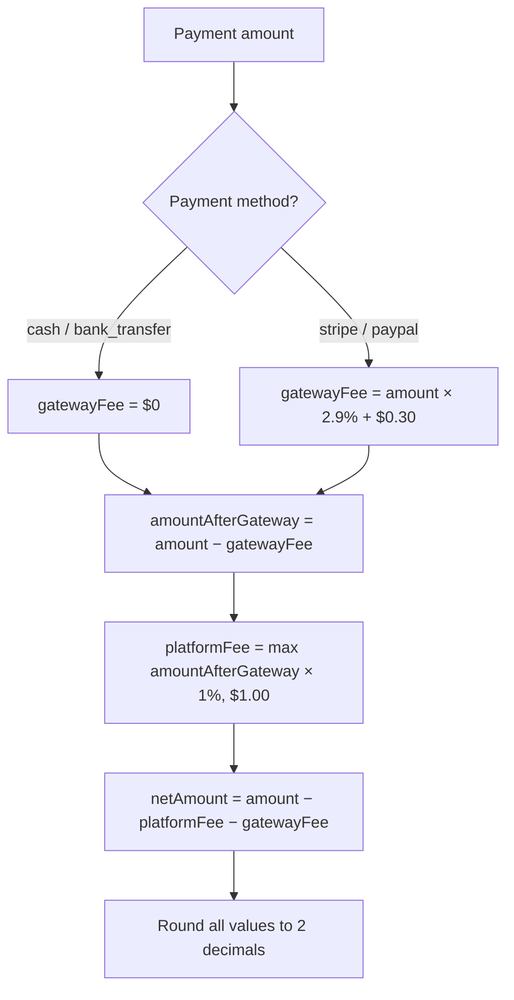

# Dossiat — Platform Fee Calculation

> Transparent documentation of how Dossiat calculates platform and gateway fees on agent labor payments.
>
> **Source of truth:** [`src/server/services/payment/feeCalculator.ts`](../src/server/services/payment/feeCalculator.ts)

---

## Overview

Dossiat charges a **platform fee** on agent labor for every confirmed payment. When a payment is processed through an online gateway (Stripe or PayPal), the gateway also charges a **gateway fee** that passes through to the payer. The platform fee is always calculated on the **net amount after gateway fees**, ensuring Dossiat only takes its cut on the amount actually being moved.

| Fee type | Who charges it | Who pays it | Collected by |
|----------|----------------|-------------|--------------|
| **Gateway fee** | Stripe / PayPal | Payer | Gateway (automatic) |
| **Platform fee** | Dossiat | Agent | Dossiat (via credits or invoicing) |

Cash and bank transfer payments have **no gateway fee** — only the platform fee applies.

---

## Constants

Defined in [`feeCalculator.ts`](../src/server/services/payment/feeCalculator.ts:9-12):

| Constant | Value | Meaning |
|----------|-------|---------|
| `GATEWAY_FEE_RATE` | `0.029` (2.9%) | Percentage gateway fee on online payments |
| `GATEWAY_FEE_FIXED` | `0.30` ($0.30) | Fixed per-transaction gateway fee |
| `PLATFORM_FEE_RATE` | `0.01` (1%) | Percentage platform fee on net amount |
| `PLATFORM_FEE_MINIMUM` | `1.0` ($1.00) | Minimum platform fee per payment |

---

## Calculation Rules

### Step 1 — Gateway fee

```text
gatewayFee = amount × 2.9% + $0.30   (Stripe / PayPal)
gatewayFee = $0                        (cash / bank_transfer)
```

### Step 2 — Amount after gateway

```text
amountAfterGateway = amount − gatewayFee
```

### Step 3 — Platform fee

```text
platformFee = max(amountAfterGateway × 1%, $1.00)
```

The platform fee is calculated on the net amount (after gateway fees are deducted), and is never less than $1.00.

### Step 4 — Net amount to agent

```text
netAmount = amount − platformFee − gatewayFee
```

### Rounding

All monetary values are rounded to **2 decimal places** (cents) using:

```text
Math.round(value × 100) / 100
```

The net amount is floored at `0` to avoid negative values on edge cases.

---

## Calculation Order



---

## Worked Examples

All amounts in USD. Rounded to 2 decimal places.

### Cash / Bank Transfer (no gateway fee)

| Amount | Gateway fee | Amount after gateway | Platform fee (1%, min $1) | Net to agent |
|--------|-------------|----------------------|---------------------------|--------------|
| $50.00 | $0.00 | $50.00 | $1.00 (minimum applies) | $49.00 |
| $100.00 | $0.00 | $100.00 | $1.00 (minimum applies) | $99.00 |
| $200.00 | $0.00 | $200.00 | $2.00 | $198.00 |
| $500.00 | $0.00 | $500.00 | $5.00 | $495.00 |
| $1,000.00 | $0.00 | $1,000.00 | $10.00 | $990.00 |

> Note: For amounts below $100, the 1% calculation would be under $1.00, so the **$1.00 minimum** kicks in.

### Stripe / PayPal (with gateway fee)

| Amount | Gateway fee (2.9% + $0.30) | Amount after gateway | Platform fee (1%, min $1) | Net to agent |
|--------|----------------------------|----------------------|---------------------------|--------------|
| $50.00 | $1.75 | $48.25 | $1.00 (minimum applies) | $47.25 |
| $100.00 | $3.20 | $96.80 | $1.00 (minimum applies) | $95.80 |
| $200.00 | $6.10 | $193.90 | $1.94 | $191.96 |
| $500.00 | $14.80 | $485.20 | $4.85 | $480.35 |
| $1,000.00 | $29.30 | $970.70 | $9.71 | $960.99 |

---

## Fee Collection

How the platform fee is actually collected depends on the payment method.

### Cash / Bank Transfer

When a cash or bank transfer payment is confirmed by **both** the payer and the payee:

1. The agent's [`PlatformCredit`](../src/server/database/models/index.ts) balance is checked.
2. If `balance ≥ platformFee` → the fee is **deducted immediately** from the agent's credit balance, and a [`CreditTransaction`](../src/server/database/models/index.ts) record is created with `type: 'deduction'`.
3. If `balance < platformFee` → the payment is still confirmed, but the outstanding fee is **tracked for the billing cycle** and added to the agent's next [`Invoice`](../src/server/database/models/index.ts).

Agents can top up their platform credit balance via `POST /api/agents/me/credits/purchase`.

### Stripe / PayPal

The gateway fee is collected automatically by the payment processor. The platform fee is still **recorded** on the [`Payment`](../src/server/database/models/index.ts) record for invoicing and reporting purposes, but is not deducted from the agent's credit balance (the gateway handles the money flow).

---

## Implementation Reference

| Function | Location | Purpose |
|----------|----------|---------|
| `calculateGatewayFee(amount, method)` | [`feeCalculator.ts:19`](../src/server/services/payment/feeCalculator.ts:19) | Gateway fee by method |
| `calculatePlatformFee(netAmount)` | [`feeCalculator.ts:31`](../src/server/services/payment/feeCalculator.ts:31) | Platform fee with $1 minimum |
| `calculateAllFees(amount, method)` | [`feeCalculator.ts:40`](../src/server/services/payment/feeCalculator.ts:40) | Full breakdown (`gatewayFee`, `platformFee`, `netAmount`) |

### TypeScript types

```ts
type PaymentMethod = 'cash' | 'stripe' | 'paypal' | 'bank_transfer'

interface FeeBreakdown {
  gatewayFee: number
  platformFee: number
  netAmount: number
}
```

---

## Related Documentation

- [Architecture — Payment System](../ARCHITECTURE.md#payment-system-architecture)
- [API Documentation — Payments](API.md#payments)
- [Deployment Guide](DEPLOYMENT.md)
