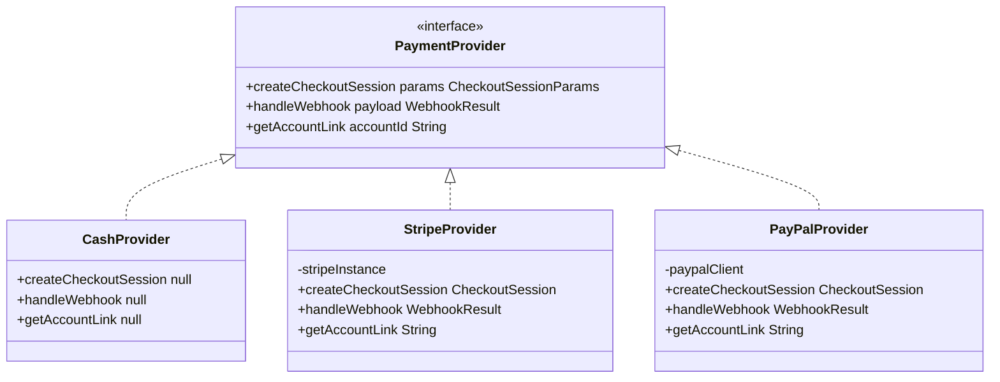
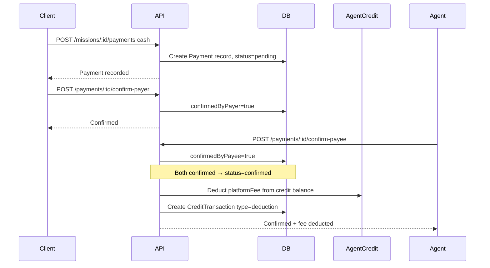
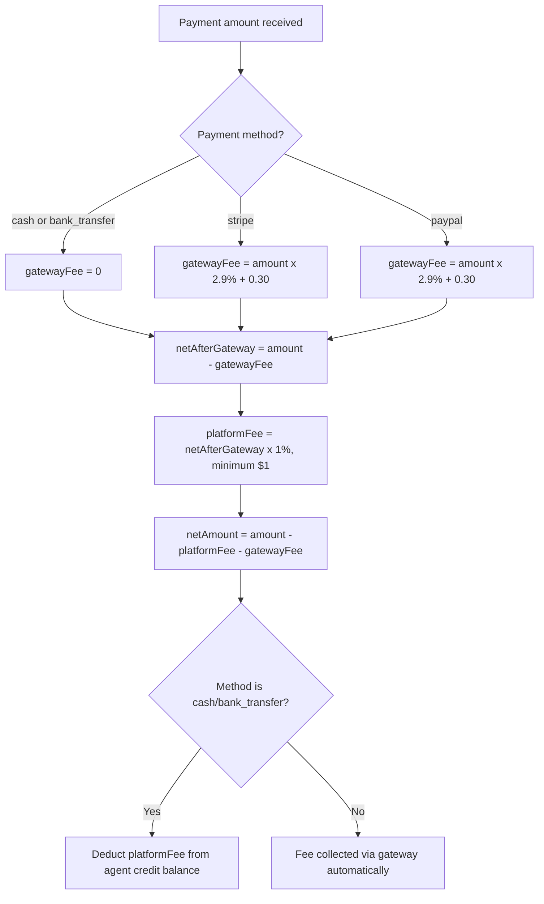

# Plan: 3h — Stripe / PayPal Integration Groundwork + Full Cash Payment Support

> **Goal:** Provide a clean abstraction layer for payment providers (Stripe & PayPal) for future integration, while fully implementing the cash/off-platform payment flow including platform fee deduction from agent credits.

---

## Current State Analysis

### What exists today

| Component | Status | Details |
|-----------|--------|---------|
| [`Payment`](src/server/database/models/index.ts:496) model | Done | Supports `cash`, `stripe`, `paypal`, `bank_transfer` methods |
| [`PlatformCredit`](src/server/database/models/index.ts:587) model | Done | Agent credit balance tracking |
| [`CreditTransaction`](src/server/database/models/index.ts:619) model | Done | Purchase, deduction, refund, adjustment types |
| [`Invoice`](src/server/database/models/index.ts:654) model | Done | Agent billing invoice |
| Payment routes in [`payments.ts`](src/server/routes/payments.ts:1) | Done | Record, confirm payer/payee, credit CRUD, invoices |
| Fee calculation | Partial | `calculatePlatformFee` exists but is applied on gross amount |
| Credit deduction on cash payment | **Missing** | No automatic fee deduction from credits when cash payment is confirmed |

### Key gaps to fill

1. **No payment provider abstraction** — Stripe/PayPal logic would be mixed directly into route handlers
2. **No automatic platform fee deduction** from agent credits for cash/off-platform payments
3. **Fee calculation** should compute platform fee on net amount (after gateway fees), not gross — though for cash, gateway fee is 0 so the result is the same, the logic must be correct for future gateway use
4. **No webhook infrastructure** for Stripe/PayPal callbacks
5. **No checkout session flow** scaffolding

---

## Architecture Design

### Payment Provider Abstraction

A pluggable provider pattern where each payment gateway implements the same interface. Cash payments bypass the provider entirely.



### Cash Payment Full Flow



### Fee Calculation Logic



---

## Implementation Plan

### Phase 1: Payment Provider Abstraction Layer

Create a pluggable provider system that Stripe/PayPal can plug into later.

#### 1.1 Create [`src/server/services/payment/types.ts`](src/server/services/payment/types.ts)
Define TypeScript interfaces:
- `CheckoutSessionParams` — missionId, amount, currency, payerId, payeeId, successUrl, cancelUrl
- `CheckoutSession` — id, url, status
- `WebhookResult` — event type, paymentId, status, metadata
- `PaymentProvider` interface with methods: `createCheckoutSession`, `handleWebhook`, `getAccountLink`

#### 1.2 Create [`src/server/services/payment/feeCalculator.ts`](src/server/services/payment/feeCalculator.ts)
Extract and improve fee calculation from current [`calculatePlatformFee()`](src/server/routes/payments.ts:10):
- `calculateGatewayFee(amount, method)` — returns 0 for cash/bank_transfer, 2.9% + $0.30 for stripe/paypal
- `calculatePlatformFee(netAmount)` — 1% of net amount after gateway fees, minimum $1
- `calculateAllFees(amount, method)` — returns `{ gatewayFee, platformFee, netAmount }`

#### 1.3 Create [`src/server/services/payment/cashProvider.ts`](src/server/services/payment/cashProvider.ts)
- Implements `PaymentProvider` interface
- All methods return null/no-op (cash is handled directly by confirmation flow)
- Used as the default provider for cash/bank_transfer methods

#### 1.4 Create [`src/server/services/payment/stripeProvider.ts`](src/server/services/payment/stripeProvider.ts)
- Implements `PaymentProvider` interface
- Stubbed methods that throw `"Stripe integration not yet implemented"` with descriptive logs
- Checks for `STRIPE_SECRET_KEY` env var; if missing, throws informative error

#### 1.5 Create [`src/server/services/payment/paypalProvider.ts`](src/server/services/payment/paypalProvider.ts)
- Implements `PaymentProvider` interface
- Stubbed methods that throw `"PayPal integration not yet implemented"` with descriptive logs
- Checks for `PAYPAL_CLIENT_ID` env var; if missing, throws informative error

#### 1.6 Create [`src/server/services/payment/index.ts`](src/server/services/payment/index.ts)
- `getPaymentProvider(method)` — returns the correct provider based on payment method
- `isGatewayMethod(method)` — returns true for stripe/paypal

---

### Phase 2: Full Cash Payment Logic

#### 2.1 Platform Fee Deduction from Credits

Update [`confirm-payee`](src/server/routes/payments.ts:85) route to:

1. When both payer and payee confirm → payment status becomes `confirmed`
2. If method is `cash` or `bank_transfer`:
   - Look up agent's `PlatformCredit` balance
   - If balance >= platformFee: deduct fee, create `CreditTransaction` (type: `deduction`)
   - If balance < platformFee: keep payment confirmed but flag credit balance as insufficient (leave for invoicing/billing cycle)
3. If method is `stripe` or `paypal`:
   - Fee is handled by gateway; no credit deduction needed

#### 2.2 Refactor Payment Recording Route

Update [`POST /missions/:id/payments`](src/server/routes/payments.ts:29) to:
- Use the new `calculateAllFees()` utility
- For stripe/paypal methods, return a checkout session URL (stubbed for now — returns null with appropriate message)
- Validate that `stripe`/`paypal` methods are only used if the respective providers are configured

---

### Phase 3: Stripe/PayPal Endpoint Scaffolding

#### 3.1 Create [`src/server/routes/stripe.ts`](src/server/routes/stripe.ts)
Stubbed Stripe-specific routes:
- `POST /api/payments/stripe/connect` — Agent OAuth connect flow (stubbed: returns `{ message: "Stripe Connect not yet configured" }`)
- `POST /api/payments/stripe/create-checkout-session` — Create checkout session for a mission (stubbed)
- `POST /api/payments/stripe/webhook` — Webhook handler for Stripe events (stubbed: validates signature, returns 200)

#### 3.2 Create [`src/server/routes/paypal.ts`](src/server/routes/paypal.ts)
Stubbed PayPal-specific routes:
- `POST /api/payments/paypal/setup` — PayPal account setup (stubbed)
- `POST /api/payments/paypal/create-order` — Create PayPal order for a mission (stubbed)
- `POST /api/payments/paypal/webhook` — Webhook handler for PayPal events (stubbed)

#### 3.3 Register Routes in [`src/server/index.ts`](src/server/index.ts)
- Import and mount `stripeRoutes` at `/api/payments/stripe`
- Import and mount `paypalRoutes` at `/api/payments/paypal`

---

### Phase 4: Tests

#### 4.1 Create [`tests/server/services/payment/feeCalculator.spec.ts`](tests/server/services/payment/feeCalculator.spec.ts)
- Test `calculateGatewayFee` for all methods
- Test `calculatePlatformFee` with amounts above and below $1 minimum
- Test `calculateAllFees` end-to-end

#### 4.2 Update [`tests/server/routes/payments.spec.ts`](tests/server/routes/payments.spec.ts)
- Test cash payment flow with credit deduction
- Test that confirmed cash payment deducts from agent credits
- Test insufficient credit scenario

#### 4.3 Create [`tests/server/routes/stripe.spec.ts`](tests/server/routes/stripe.spec.ts)
- Test that stubbed endpoints return appropriate responses

#### 4.4 Create [`tests/server/routes/paypal.spec.ts`](tests/server/routes/paypal.spec.ts)
- Test that stubbed endpoints return appropriate responses

---

### Phase 5: TODO & Config Updates

#### 5.1 Update [`docs/TODO.md`](docs/TODO.md)
Check off completed items in section 3h:
- [x] Implement smart fee calculation (refined)
- [x] Implement fee deduction from platform credits for cash/off-platform missions
- Stripe/PayPal items remain unchecked but now have clear stubs

#### 5.2 Update [`.env.example`](.env.example)
No changes needed — Stripe/PayPal env vars already exist.

#### 5.3 Update [`AGENTS.md`](AGENTS.md)
Add documentation about the payment provider abstraction and directory structure.

---

## File Tree — New & Modified Files

```
src/server/services/payment/
├── index.ts              # Provider factory + helpers
├── types.ts              # TypeScript interfaces
├── feeCalculator.ts      # Fee calculation utilities
├── cashProvider.ts       # Cash provider (no-op stub)
├── stripeProvider.ts     # Stripe provider (stubbed)
└── paypalProvider.ts     # PayPal provider (stubbed)

src/server/routes/
├── stripe.ts             # Stripe route stubs
└── paypal.ts             # PayPal route stubs

tests/server/services/payment/
└── feeCalculator.spec.ts # Fee calculator tests

tests/server/routes/
├── stripe.spec.ts        # Stripe route tests
└── paypal.spec.ts        # PayPal route tests
```

**Modified files:**
- [`src/server/routes/payments.ts`](src/server/routes/payments.ts) — Refactored to use `calculateAllFees`, add credit deduction
- [`src/server/index.ts`](src/server/index.ts) — Mount new stripe/paypal routes
- [`docs/TODO.md`](docs/TODO.md) — Update checkboxes
- [`AGENTS.md`](AGENTS.md) — Update structure docs

---

## Design Decisions

1. **Provider abstraction via interface** — not a base class, keeping it lightweight and allowing different SDK patterns
2. **Cash provider returns no-ops** — no checkout session needed; the confirmation flow is the "gateway"
3. **Stripe/PayPal stubs throw descriptive errors** — clear messaging when integration is attempted without configuration
4. **Credit deduction is automatic on cash confirm** — not a separate action the agent must trigger
5. **Insufficient credits don't block payment confirmation** — the payment is still confirmed; the outstanding fee is tracked for the billing cycle / invoice
6. **No new npm dependencies** — Stripe/PayPal SDKs will be added when actual integration is implemented
7. **Fee calculation extracted to utility** — reusable across routes and testable in isolation

---

## Out of Scope

- Actual Stripe SDK integration (OAuth, checkout sessions, webhooks)
- Actual PayPal SDK integration (orders, webhooks)
- Stripe billing portal for subscriptions (TODO 3i)
- Frontend payment pages (TODO 5g)
- Invoice generation on billing cycle end (TODO 3m)
- Real payment processing or money movement
