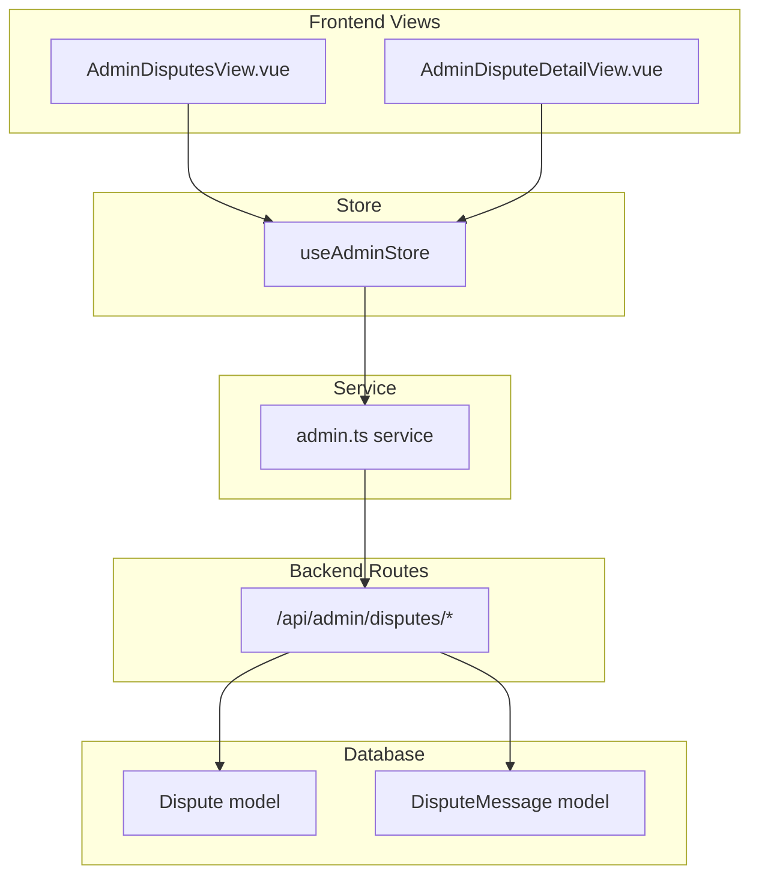

# Admin Disputes CRUD — Implementation Plan

## Context

The admin dispute management feature has basic read functionality implemented but is missing full CRUD operations and comprehensive tests. This plan covers adding all missing backend endpoints, frontend service/store functions, view enhancements, and tests across all layers.

---

## Gap Analysis

### Backend Routes [`src/server/routes/admin.ts`](src/server/routes/admin.ts)

| Operation | Endpoint | Status |
|-----------|----------|--------|
| List all disputes | `GET /api/admin/disputes` | ✅ Exists — needs search filter |
| Get dispute detail | `GET /api/admin/disputes/:id` | ✅ Exists |
| Create dispute | `POST /api/admin/disputes` | ❌ Missing |
| Update dispute | `PUT /api/admin/disputes/:id` | ❌ Missing |
| Delete dispute | `DELETE /api/admin/disputes/:id` | ❌ Missing |
| Resolve dispute | `PUT /api/admin/disputes/:id/resolve` | ✅ Exists |
| Escalate dispute | `PUT /api/admin/disputes/:id/escalate` | ❌ Missing |
| Send message | `POST /api/admin/disputes/:id/messages` | ❌ Missing |
| Update status | `PATCH /api/admin/disputes/:id/status` | ❌ Missing |

### Backend Tests [`tests/server/routes/admin.spec.ts`](tests/server/routes/admin.spec.ts)

| Test | Status |
|------|--------|
| List disputes | ✅ Exists — 2 tests |
| Status filter | ✅ Exists |
| Get dispute detail | ❌ Missing |
| 404 for non-existent | ❌ Missing |
| Create dispute | ❌ Missing |
| Update dispute | ❌ Missing |
| Delete dispute | ❌ Missing |
| Resolve dispute | ❌ Missing |
| Escalate dispute | ❌ Missing |
| Send message | ❌ Missing |
| Update status | ❌ Missing |
| Validation errors | ❌ Missing |

### Frontend Service [`src/services/admin.ts`](src/services/admin.ts)

| Function | Status |
|----------|--------|
| `getDisputes()` | ✅ Exists |
| `getDispute()` | ✅ Exists |
| `resolveDispute()` | ✅ Exists |
| `createDispute()` | ❌ Missing |
| `updateDispute()` | ❌ Missing |
| `deleteDispute()` | ❌ Missing |
| `escalateDispute()` | ❌ Missing |
| `sendDisputeMessage()` | ❌ Missing |
| `updateDisputeStatus()` | ❌ Missing |

### Frontend Store [`src/stores/admin.ts`](src/stores/admin.ts)

| Action | Status |
|--------|--------|
| `fetchDisputes()` | ✅ Exists |
| `fetchDispute()` | ✅ Exists |
| `resolveDispute()` | ✅ Exists |
| `createDispute()` | ❌ Missing |
| `updateDispute()` | ❌ Missing |
| `deleteDispute()` | ❌ Missing |
| `escalateDispute()` | ❌ Missing |
| `sendDisputeMessage()` | ❌ Missing |
| `updateDisputeStatus()` | ❌ Missing |

### Frontend Views

| View | Status | Notes |
|------|--------|-------|
| [`AdminDisputesView.vue`](src/views/admin/AdminDisputesView.vue) | ✅ Exists | Needs delete button + create button |
| [`AdminDisputeDetailView.vue`](src/views/admin/AdminDisputeDetailView.vue) | ✅ Exists | Needs status update, escalate, message sending |

### Frontend Tests

| Test File | Status |
|-----------|--------|
| `tests/components/admin/AdminDisputesView.spec.ts` | ❌ Missing |
| `tests/components/admin/AdminDisputeDetailView.spec.ts` | ❌ Missing |

### Service Tests [`tests/services/admin.spec.ts`](tests/services/admin.spec.ts)

| Test | Status |
|------|--------|
| `getDisputes()` | ✅ Exists |
| `getDispute()` | ✅ Exists |
| `resolveDispute()` | ✅ Exists |
| `createDispute()` | ❌ Missing |
| `updateDispute()` | ❌ Missing |
| `deleteDispute()` | ❌ Missing |
| `escalateDispute()` | ❌ Missing |
| `sendDisputeMessage()` | ❌ Missing |

### Store Tests [`tests/stores/admin.spec.ts`](tests/stores/admin.spec.ts)

| Test | Status |
|------|--------|
| `fetchDisputes()` | ✅ Exists |
| `fetchDispute()` | ❌ Missing |
| `resolveDispute()` | ❌ Missing |
| `createDispute()` | ❌ Missing |
| `updateDispute()` | ❌ Missing |
| `deleteDispute()` | ❌ Missing |
| `escalateDispute()` | ❌ Missing |
| `sendDisputeMessage()` | ❌ Missing |

### i18n

| Key | Status |
|-----|--------|
| `admin.disputes.*` base keys | ✅ Exists |
| Create/delete/escalate/message keys | ❌ Missing |

---

## Implementation Steps

### Phase 1: Backend Routes

**File:** [`src/server/routes/admin.ts`](src/server/routes/admin.ts)

1. **Enhance `GET /api/admin/disputes`** — Add `search` query param to filter by reason text (using `Op.like`)

2. **Add `POST /api/admin/disputes`** — Admin creates dispute on behalf of a user
   - Body: `{ missionId, initiatedBy, reason }`
   - Validates mission exists, initiator user exists
   - Creates dispute with status `open`
   - Returns created dispute with includes

3. **Add `PUT /api/admin/disputes/:id`** — Admin updates dispute
   - Body: `{ reason?, status? }`
   - Validates status is one of: `open`, `reconciling`, `resolved`, `escalated`
   - Returns updated dispute

4. **Add `DELETE /api/admin/disputes/:id`** — Admin deletes dispute
   - Deletes associated DisputeMessages first (CASCADE may handle this)
   - Returns success

5. **Add `PUT /api/admin/disputes/:id/escalate`** — Escalate dispute
   - Sets status to `escalated`
   - Returns updated dispute

6. **Add `POST /api/admin/disputes/:id/messages`** — Admin sends message in dispute room
   - Body: `{ content }`
   - Uses admin's userId as senderId
   - Creates DisputeMessage
   - Returns created message

7. **Add `PATCH /api/admin/disputes/:id/status`** — Quick status update
   - Body: `{ status }`
   - Validates status value
   - Returns updated dispute

---

### Phase 2: Backend Route Tests

**File:** [`tests/server/routes/admin.spec.ts`](tests/server/routes/admin.spec.ts)

Add the following test blocks:

1. **`GET /api/admin/disputes/:id`**
   - Returns dispute detail with messages and mission context
   - Returns 404 for non-existent dispute
   - Returns 422 for invalid ID

2. **`POST /api/admin/disputes`**
   - Creates dispute with valid data
   - Returns 422 without required fields
   - Returns 404 with non-existent mission

3. **`PUT /api/admin/disputes/:id`**
   - Updates dispute reason
   - Returns 404 for non-existent dispute
   - Rejects invalid status

4. **`DELETE /api/admin/disputes/:id`**
   - Deletes dispute
   - Returns 404 for non-existent dispute

5. **`PUT /api/admin/disputes/:id/resolve`**
   - Resolves dispute with resolution note
   - Returns 404 for non-existent dispute
   - Returns 422 without resolution

6. **`PUT /api/admin/disputes/:id/escalate`**
   - Escalates dispute
   - Returns 404 for non-existent dispute

7. **`POST /api/admin/disputes/:id/messages`**
   - Sends message in dispute room
   - Returns 422 without content
   - Returns 404 for non-existent dispute

8. **`PATCH /api/admin/disputes/:id/status`**
   - Updates dispute status
   - Returns 422 for invalid status
   - Returns 404 for non-existent dispute

---

### Phase 3: Frontend Service

**File:** [`src/services/admin.ts`](src/services/admin.ts)

Add these functions:

```ts
// Disputes (new)
export function createDispute(data: { missionId: number; initiatedBy: number; reason: string }) {
  return post('/admin/disputes', data)
}

export function updateDispute(id: string, data: { reason?: string; status?: string }) {
  return put(`/admin/disputes/${id}`, data)
}

export function deleteDispute(id: string) {
  return del(`/admin/disputes/${id}`)
}

export function escalateDispute(id: string) {
  return put(`/admin/disputes/${id}/escalate`)
}

export function sendDisputeMessage(id: string, content: string) {
  return post(`/admin/disputes/${id}/messages`, { content })
}

export function updateDisputeStatus(id: string, status: string) {
  return patch(`/admin/disputes/${id}/status`, { status })
}
```

---

### Phase 4: Frontend Service Tests

**File:** [`tests/services/admin.spec.ts`](tests/services/admin.spec.ts)

Add tests for each new service function:

| Test | Mock | Assert |
|------|------|--------|
| `createDispute()` | `mockPost` | `POST /admin/disputes` with body |
| `updateDispute()` | `mockPut` | `PUT /admin/disputes/:id` with body |
| `deleteDispute()` | `mockDel` | `DELETE /admin/disputes/:id` |
| `escalateDispute()` | `mockPut` | `PUT /admin/disputes/:id/escalate` |
| `sendDisputeMessage()` | `mockPost` | `POST /admin/disputes/:id/messages` with content |
| `updateDisputeStatus()` | `mockPatch` | `PATCH /admin/disputes/:id/status` with status |

---

### Phase 5: Frontend Store

**File:** [`src/stores/admin.ts`](src/stores/admin.ts)

Add these actions:

```ts
async function createDispute(data: { missionId: number; initiatedBy: number; reason: string }) {
  try {
    const response = await adminApi.createDispute(data) as ApiResponse<AdminDispute>
    disputes.value.unshift(response.data!)
    return response.data
  } catch (err: any) {
    error.value = err.response?.data?.error || err.message || 'Failed to create dispute'
    throw err
  }
}

async function updateDispute(id: string, data: { reason?: string; status?: string }) {
  try {
    const response = await adminApi.updateDispute(id, data) as ApiResponse<AdminDispute>
    const idx = disputes.value.findIndex((d) => d.id === Number(id))
    if (idx >= 0) disputes.value[idx] = response.data!
    if (selectedDispute.value?.id === Number(id)) selectedDispute.value = response.data!
    return response.data
  } catch (err: any) {
    error.value = err.response?.data?.error || err.message || 'Failed to update dispute'
    throw err
  }
}

async function deleteDispute(id: string) {
  try {
    await adminApi.deleteDispute(id)
    disputes.value = disputes.value.filter((d) => d.id !== Number(id))
  } catch (err: any) {
    error.value = err.response?.data?.error || err.message || 'Failed to delete dispute'
    throw err
  }
}

async function escalateDispute(id: string) {
  try {
    const response = await adminApi.escalateDispute(id) as ApiResponse<AdminDispute>
    selectedDispute.value = { ...selectedDispute.value!, ...response.data! }
    return response.data
  } catch (err: any) {
    error.value = err.response?.data?.error || err.message || 'Failed to escalate dispute'
    throw err
  }
}

async function sendDisputeMessage(id: string, content: string) {
  try {
    const response = await adminApi.sendDisputeMessage(id, content) as ApiResponse<any>
    if (selectedDispute.value?.id === Number(id)) {
      selectedDispute.value.messages = [...(selectedDispute.value.messages || []), response.data!]
    }
    return response.data
  } catch (err: any) {
    error.value = err.response?.data?.error || err.message || 'Failed to send message'
    throw err
  }
}

async function updateDisputeStatus(id: string, status: string) {
  try {
    const response = await adminApi.updateDisputeStatus(id, status) as ApiResponse<AdminDispute>
    selectedDispute.value = { ...selectedDispute.value!, ...response.data! }
    return response.data
  } catch (err: any) {
    error.value = err.response?.data?.error || err.message || 'Failed to update dispute status'
    throw err
  }
}
```

Export all new functions in the return block.

---

### Phase 6: Frontend Store Tests

**File:** [`tests/stores/admin.spec.ts`](tests/stores/admin.spec.ts)

Add tests for each new store action:

| Test | Description |
|------|-------------|
| `fetchDispute()` | Loads dispute from API, sets error on failure |
| `resolveDispute()` | Updates dispute status, sets error on failure |
| `createDispute()` | Adds new dispute to store, throws on failure |
| `updateDispute()` | Updates dispute in list and selectedDispute |
| `deleteDispute()` | Removes dispute from store list |
| `escalateDispute()` | Updates selectedDispute status to escalated |
| `sendDisputeMessage()` | Appends message to selectedDispute messages |
| `updateDisputeStatus()` | Updates selectedDispute status |

---

### Phase 7: Frontend View Enhancements

#### 7a. [`AdminDisputesView.vue`](src/views/admin/AdminDisputesView.vue)

Enhance with:
- Delete button in actions column (with confirm dialog)
- Create dispute button/modal
- Search input for filtering by reason text

#### 7b. [`AdminDisputeDetailView.vue`](src/views/admin/AdminDisputeDetailView.vue)

Enhance with:
- Status update section (dropdown + save button)
- Escalate button (with confirm dialog)
- Delete button (with confirm dialog + redirect)
- Message sending form at bottom
- Better message display with sender info and timestamps

---

### Phase 8: Component Tests

#### 8a. `tests/components/admin/AdminDisputesView.spec.ts`

| Test | Description |
|------|-------------|
| Renders container | `.ds-admin-page` exists |
| Renders title | Title element contains dispute text |
| Shows loading state | Spinner shown when loading |
| Calls fetchDisputes on mount | Store action called |
| Renders dispute table rows | Table rows rendered |
| Shows status filter | Filter select exists |
| Shows create button | Create dispute button exists |
| Click view navigates to detail | RouterLink to detail page |

#### 8b. `tests/components/admin/AdminDisputeDetailView.spec.ts`

| Test | Description |
|------|-------------|
| Renders container | `.ds-admin-page` exists |
| Renders back link | Link back to disputes list exists |
| Calls fetchDispute on mount | Store action called |
| Shows loading state | Spinner when loading |
| Shows dispute info | Status badge and reason displayed |
| Shows resolve form | Resolution input visible when not resolved |
| Shows escalate button | Button visible when not resolved |
| Shows messages | Messages rendered when present |

---

### Phase 9: i18n Updates

**Files:** [`src/locales/en.json`](src/locales/en.json), [`src/locales/fr.json`](src/locales/fr.json), [`src/locales/ar.json`](src/locales/ar.json)

Add missing keys under `admin.disputes`:

```json
{
  "admin": {
    "disputes": {
      "createDispute": "Create Dispute",
      "editDispute": "Edit Dispute",
      "deleteDispute": "Delete Dispute",
      "deleteTitle": "Delete Dispute",
      "deleteConfirm": "Are you sure you want to delete this dispute? This action cannot be undone.",
      "created": "Dispute created successfully.",
      "createError": "Failed to create dispute.",
      "updated": "Dispute updated successfully.",
      "updateError": "Failed to update dispute.",
      "deleted": "Dispute deleted successfully.",
      "deleteError": "Failed to delete dispute.",
      "escalated": "Dispute escalated successfully.",
      "escalateError": "Failed to escalate dispute.",
      "messageSent": "Message sent successfully.",
      "messageError": "Failed to send message.",
      "statusUpdated": "Dispute status updated.",
      "statusUpdateError": "Failed to update status.",
      "escalate": "Escalate",
      "escalateConfirm": "Are you sure you want to escalate this dispute?",
      "sendMessage": "Send Message",
      "messagePlaceholder": "Type a message...",
      "allStatuses": "All Statuses",
      "search": "Search by reason...",
      "createTitle": "Create New Dispute",
      "reasonRequired": "Reason is required.",
      "missionRequired": "Mission is required.",
      "selectMission": "Select a mission",
      "initiatedByRequired": "Initiator is required.",
      "selectInitiator": "Select initiator",
      "create": "Create",
      "creating": "Creating...",
      "manageStatus": "Manage Status",
      "currentStatus": "Current Status",
      "changeStatus": "Change Status",
      "save": "Save",
      "cancel": "Cancel"
    }
  }
}
```

---

### Phase 10: Run Tests & Verify

```bash
pnpm test
```

Ensure all tests pass, including existing ones (no regressions).

---

## Files Summary

### Modified Files

| File | Changes |
|------|---------|
| [`src/server/routes/admin.ts`](src/server/routes/admin.ts) | Add 6 new dispute endpoints + search filter |
| [`tests/server/routes/admin.spec.ts`](tests/server/routes/admin.spec.ts) | Add ~20 dispute route tests |
| [`src/services/admin.ts`](src/services/admin.ts) | Add 6 new dispute service functions |
| [`tests/services/admin.spec.ts`](tests/services/admin.spec.ts) | Add 6 dispute service tests |
| [`src/stores/admin.ts`](src/stores/admin.ts) | Add 6 new dispute store actions |
| [`tests/stores/admin.spec.ts`](tests/stores/admin.spec.ts) | Add ~10 dispute store tests |
| [`src/views/admin/AdminDisputesView.vue`](src/views/admin/AdminDisputesView.vue) | Add delete, create, search |
| [`src/views/admin/AdminDisputeDetailView.vue`](src/views/admin/AdminDisputeDetailView.vue) | Add status update, escalate, delete, messaging |
| [`src/locales/en.json`](src/locales/en.json) | Add admin dispute i18n keys |
| [`src/locales/fr.json`](src/locales/fr.json) | Add admin dispute i18n keys |
| [`src/locales/ar.json`](src/locales/ar.json) | Add admin dispute i18n keys |

### New Files

| File | Description |
|------|-------------|
| `tests/components/admin/AdminDisputesView.spec.ts` | Component tests for dispute list |
| `tests/components/admin/AdminDisputeDetailView.spec.ts` | Component tests for dispute detail |

---

## Architecture Diagram



---

## Execution Order (TDD)

1. **Backend routes** — Add new endpoints to [`src/server/routes/admin.ts`](src/server/routes/admin.ts)
2. **Backend tests** — Write all dispute route tests in [`tests/server/routes/admin.spec.ts`](tests/server/routes/admin.spec.ts)
3. **Frontend service** — Add functions to [`src/services/admin.ts`](src/services/admin.ts)
4. **Frontend service tests** — Add tests to [`tests/services/admin.spec.ts`](tests/services/admin.spec.ts)
5. **Frontend store** — Add actions to [`src/stores/admin.ts`](src/stores/admin.ts)
6. **Frontend store tests** — Add tests to [`tests/stores/admin.spec.ts`](tests/stores/admin.spec.ts)
7. **i18n** — Add keys to all 3 locale files
8. **Views** — Enhance [`AdminDisputesView.vue`](src/views/admin/AdminDisputesView.vue) and [`AdminDisputeDetailView.vue`](src/views/admin/AdminDisputeDetailView.vue)
9. **Component tests** — Create test files for both views
10. **Run full test suite** — `pnpm test`
