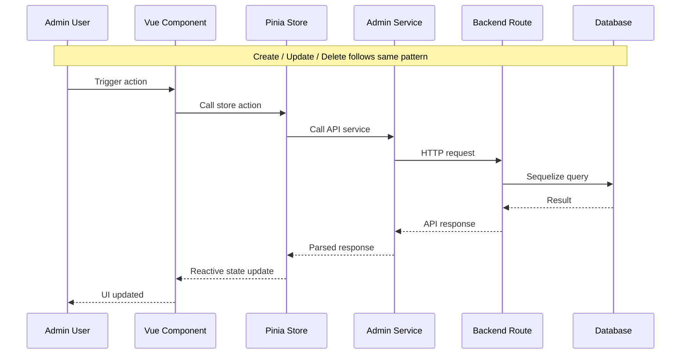

# Admin Missions — Full CRUD Plan

## Current State

The admin panel has **read-only** mission operations:

| Operation | Backend | Frontend Service | Frontend Store | Frontend View |
|-----------|---------|-----------------|----------------|---------------|
| List missions | ✅ GET /api/admin/missions | ✅ getMissions | ✅ fetchMissions | ✅ AdminMissionsView |
| View mission | ✅ GET /api/admin/missions/:id | ✅ getMission | ✅ fetchMission | ✅ AdminMissionDetailView |
| Update status | ✅ PUT /api/admin/missions/:id/status | ✅ updateMissionStatus | ✅ updateMissionStatus | ✅ AdminMissionDetailView |
| **Create mission** | ❌ | ❌ | ❌ | ❌ |
| **Edit mission** | ❌ | ❌ | ❌ | ❌ |
| **Delete mission** | ❌ | ❌ | ❌ | ❌ |

## Architecture Flow

## Step-by-Step Implementation (TDD)

### Phase 1: Backend — New Endpoints

**Tests first** in `tests/server/routes/admin.spec.ts`:

1. **POST /api/admin/missions** — Create a mission
   - Body: `agentId`, `clientId`, `title`, `description?`, `type`, `pricingType`, `agreedAmount?`, `currency`, `agreedChecklist?`
   - Validates required fields, agentId/clientId existence, valid enums
   - Returns created mission with agent/client associations

2. **PUT /api/admin/missions/:id** — Update mission fields
   - Body: any of `title`, `description`, `type`, `pricingType`, `agreedAmount`, `currency`, `agreedChecklist`
   - Returns updated mission

3. **DELETE /api/admin/missions/:id** — Delete a mission
   - Hard delete with cascade (payments, disputes, attachments, messages all cascade)
   - Returns `{ id }` on success

**Implement** endpoints in `src/server/routes/admin.ts` following existing patterns.

### Phase 2: Frontend Service

**Tests first** in `tests/services/admin.spec.ts`:

1. Add `createMission(data)` — `POST /admin/missions`
2. Add `updateMission(id, data)` — `PUT /admin/missions/${id}`
3. Add `deleteMission(id)` — `DELETE /admin/missions/${id}`

**Implement** in `src/services/admin.ts`.

### Phase 3: Frontend Store

**Tests first** in `tests/stores/admin.spec.ts`:

1. Add `createMission(data)` action — prepends to missions array
2. Add `updateMission(id, data)` action — updates in missions array and selectedMission
3. Add `deleteMission(id)` action — removes from missions array

**Implement** in `src/stores/admin.ts`.

### Phase 4: Frontend Views

#### AdminMissionsView.vue Updates
- Add "Create Mission" button in header (like AdminUsersView)
- Add "Edit" and "Delete" action buttons per row (alongside existing "View")
- Add Create/Edit modal with form fields:
  - Title (text)
  - Description (textarea)
  - Agent (select — fetch users with role=agent)
  - Client (select — fetch users with role=client)
  - Type (select: one_time, recurrent)
  - Pricing Type (select: fixed, hourly, task_based)
  - Amount (number)
  - Currency (select: USD, EUR, etc.)
  - Checklist items (dynamic add/remove list)
- Delete action uses ConfirmDialog

#### AdminMissionDetailView.vue Updates
- Add "Edit" and "Delete" buttons
- Edit opens a modal with pre-filled form
- Delete triggers confirmation dialog, then redirects to list

### Phase 5: i18n

Add translation keys to all 3 locale files (`en.json`, `fr.json`, `ar.json`):

New keys under `admin.missions`:
- `createMission`, `editMission`, `deleteMission`
- `createTitle`, `editTitle`, `deleteTitle`, `deleteConfirm`
- `created`, `createError`, `updated`, `updateError`, `deleted`, `deleteError`
- `description`, `pricingType`, `amount`, `currency`, `checklist`
- `selectAgent`, `selectClient`, `agentRequired`, `clientRequired`
- Form field labels and placeholders

### Phase 6: Tests & Validation

- Run `pnpm test` — all tests pass
- Run `pnpm i18n:sync` — translations validated
- Write component tests for new view interactions

## Files to Modify

| File | Changes |
|------|---------|
| `tests/server/routes/admin.spec.ts` | Add ~12 new tests for create/update/delete |
| `src/server/routes/admin.ts` | Add 3 new endpoints (~60 lines) |
| `tests/services/admin.spec.ts` | Add ~6 new tests |
| `src/services/admin.ts` | Add 3 new functions |
| `tests/stores/admin.spec.ts` | Add ~8 new tests |
| `src/stores/admin.ts` | Add 3 new actions + fetchUsers for form selects |
| `src/views/admin/AdminMissionsView.vue` | Add Create/Edit/Delete UI with modal form |
| `src/views/admin/AdminMissionDetailView.vue` | Add Edit/Delete buttons |
| `src/locales/en.json` | Add ~25 new keys |
| `src/locales/fr.json` | Add ~25 new keys |
| `src/locales/ar.json` | Add ~25 new keys |

## Design Decisions

1. **Create/Edit via modal** on the list page (consistent with AdminUsersView pattern)
2. **No separate route** for create/edit — keeps navigation simple
3. **Agent/Client selection** via dropdown (fetch all users with appropriate role)
4. **Hard delete** for missions (consistent with delete pattern for users)
5. **Checklist editor** in form — simple dynamic list with add/remove items
6. **All destructive actions** use ConfirmDialog (established pattern)
