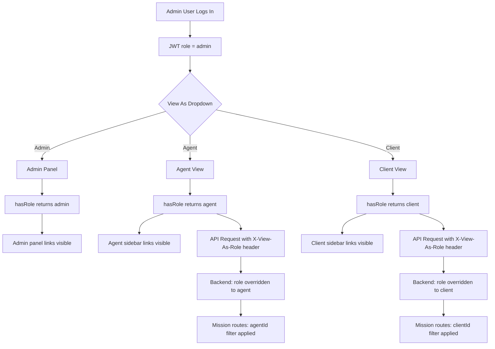
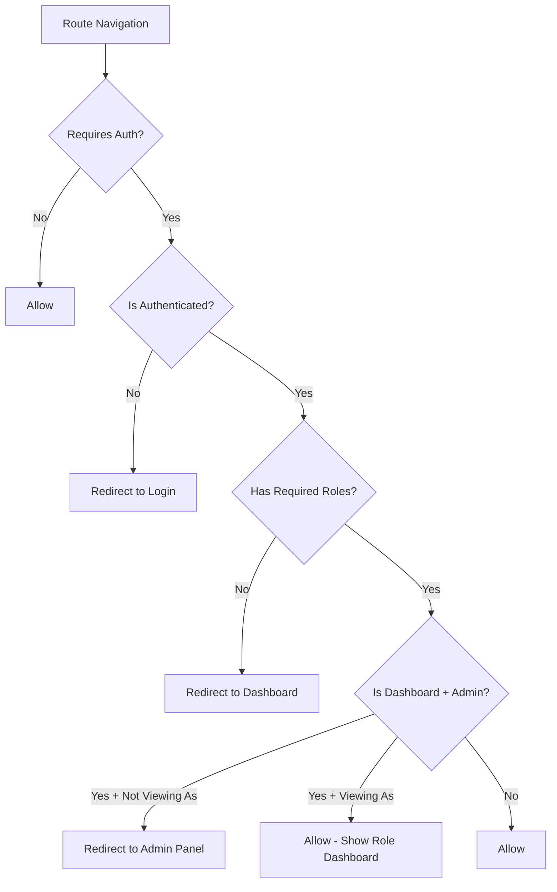

# Admin Role Switching — Plan

## Problem

Admin users are forced into the admin panel (`/app/admin`) via a hard redirect in the router guard ([`router/index.ts:373-376`](src/router/index.ts:373)). The admin panel uses a completely separate layout ([`AdminLayout.vue`](src/views/admin/AdminLayout.vue)) with its own sidebar ([`AdminSidebar.vue`](src/views/admin/AdminSidebar.vue)), making it impossible for admins to access the user-facing app as an agent or client.

The root cause is threefold:
1. **Router guard** — redirects `dashboard` → `admin` for admins
2. **`hasRole()`** ([`stores/auth.ts:39-41`](src/stores/auth.ts:39)) — strict equality on `user.role`, so admin never matches `'agent'` or `'client'`
3. **Sidebar visibility** — links with `roles: ['agent']` or `roles: ['client']` are hidden from admin users

## Solution: "View As" Role Switching

A frontend-first approach where admins can temporarily "act as" an agent or client. The real JWT role stays `admin`; a `viewAsRole` overlay controls the UI. A single HTTP header (`X-View-As-Role`) is sent with API requests so the backend applies the effective role when processing data.

### Why This Approach

- **Minimal backend changes** — only 2 files need updating (auth middleware + roleGuard)
- **No extra accounts** — the admin's single account is reused
- **One-click switch** — a dropdown in the top navbar lets admins pick a role
- **One-click return** — a persistent banner + sidebar link brings them back to admin
- **Secure by design** — the header is only trusted from `admin` role users

---

## Changes by File

### 1. [`src/stores/auth.ts`](src/stores/auth.ts) — Add `viewAsRole` state

- Add `viewAsRole` ref (`'admin' | 'agent' | 'client'`, defaults to `'admin'`)
- Add `computed` property `effectiveRole` that returns `viewAsRole.value || user.value?.role`
- Update `hasRole(role)` to check against `effectiveRole` instead of `user.value?.role`
- Add `setViewAsRole(role)` action to set the view-as role
- Add `clearViewAsRole()` action to reset back to `'admin'`
- Add `computed` `isViewingAs` — true when admin is not viewing as admin
- Persist `viewAsRole` in `localStorage` under key `dossiat_view_as_role`

```ts
// New computed
const effectiveRole = computed(() => {
  if (viewAsRole.value && viewAsRole.value !== 'admin') return viewAsRole.value
  return user.value?.role ?? 'admin'
})

function hasRole(role: string): boolean {
  return effectiveRole.value === role
}

function setViewAsRole(role: 'agent' | 'client' | 'admin') {
  viewAsRole.value = role
  localStorage.setItem(VIEW_AS_ROLE_KEY, role)
}

function clearViewAsRole() {
  viewAsRole.value = 'admin'
  localStorage.removeItem(VIEW_AS_ROLE_KEY)
}
```

### 2. [`src/services/api.ts`](src/services/api.ts) — Send `X-View-As-Role` header

In the request interceptor, read `viewAsRole` from `localStorage` and attach it as a header:

```ts
// After attaching Authorization header
const viewAsRole = localStorage.getItem(VIEW_AS_ROLE_KEY)
if (viewAsRole && viewAsRole !== 'admin' && config.headers) {
  config.headers['X-View-As-Role'] = viewAsRole
}
```

### 3. [`src/router/index.ts`](src/router/index.ts) — Modify admin redirect guard

**Current** (line 372-376):
```ts
if (to.name === 'dashboard' && authStore.hasRole('admin')) {
  return next({ name: 'admin' })
}
```

**Change to**: Only redirect to admin when NOT in "view as" mode:
```ts
if (to.name === 'dashboard' && authStore.hasRole('admin') && !authStore.isViewingAs) {
  return next({ name: 'admin' })
}
```

Also update the role-based access control block (line 364-370) to work correctly with the new `hasRole()` that uses `effectiveRole`.

### 4. [`src/components/layout/TopNavbar.vue`](src/components/layout/TopNavbar.vue) — Add role switcher

Add a role-switcher section in the user dropdown menu, visible only to admin users:

- Below the user info header, show a "View As" section with three options: Admin, Agent, Client
- Each option is a clickable item; the active one has a checkmark
- When switching, call `authStore.setViewAsRole()` and navigate to the appropriate dashboard
- Show a visual indicator when in "view as" mode

```html
<!-- Only visible for admin users -->
<div v-if="authStore.user?.role === 'admin'" class="ds-topnavbar__user-menu-divider" />
<div v-if="authStore.user?.role === 'admin'" class="ds-topnavbar__user-menu-section">
  <div class="ds-topnavbar__user-menu-section-title">
    {{ t('layout.topbar.viewAs') }}
  </div>
  <button
    v-for="opt in viewAsOptions"
    :key="opt.value"
    class="ds-topnavbar__user-menu-item"
    :class="{ 'ds-topnavbar__user-menu-item--active': authStore.viewAsRole === opt.value }"
    @click="switchViewAs(opt.value)"
  >
    <i :class="['bi', opt.value === authStore.viewAsRole ? 'bi-check-circle-fill' : 'bi-circle']" />
    <span>{{ opt.label }}</span>
  </button>
</div>
```

The `switchViewAs` function:
```ts
function switchViewAs(role: 'admin' | 'agent' | 'client') {
  authStore.setViewAsRole(role)
  showUserMenu.value = false
  if (role === 'admin') {
    router.push({ name: 'admin' })
  } else {
    router.push({ name: 'dashboard' })
  }
}
```

### 5. [`src/components/layout/Sidebar.vue`](src/components/layout/Sidebar.vue) — Add Admin Panel link for admins

Add a new link to `systemLinks` that is visible only to admin users, but **also visible when viewing as agent/client** (so they can navigate back to admin):

```ts
{ to: '/app/admin', icon: 'bi-shield-lock', label: 'layout.sidebar.admin', roles: ['admin'] }
```

The existing link at line 40 already does this. The key change is that `isVisible()` now uses `effectiveRole`, so when the admin is "viewing as agent", this link would be hidden. Instead, we need a special case: **always show the admin link if the user's real role is admin**, regardless of `viewAsRole`.

Update `isVisible()`:
```ts
function isVisible(link: { roles?: string[] }) {
  if (!link.roles) return true
  // Admin users always see admin links, even when viewing as another role
  if (link.roles.includes('admin') && authStore.user?.role === 'admin') return true
  return link.roles.some((role) => authStore.hasRole(role))
}
```

### 6. [`src/views/admin/AdminSidebar.vue`](src/views/admin/AdminSidebar.vue) — Add "Back to App" link

Add a "Back to App" link at the bottom of the admin sidebar (before logout). This link navigates to the dashboard and sets the view-as role to agent (or just navigates to dashboard with the last used view-as role):

```ts
// In <script>
function goBackToApp() {
  authStore.setViewAsRole('agent') // Default to agent view
  router.push('/app/dashboard')
}
```

```html
<!-- In template, before the footer -->
<RouterLink to="/app/admin" class="ds-sidebar__link" @click="handleNavClick">
  <i class="bi bi-arrow-left-circle" />
  <span class="ds-sidebar__link-label">{{ t('admin.sidebar.backToApp') }}</span>
</RouterLink>
```

Note: The `backToApp` i18n key already exists in all three locales.

### 7. Backend: [`src/server/middleware/auth.ts`](src/server/middleware/auth.ts) — Read `X-View-As-Role` header

After setting `c.set('auth', ...)`, check if the user is admin and the header is present:

```ts
// After setting auth
const viewAsRole = c.req.header('X-View-As-Role')
if (auth.role === 'admin' && viewAsRole && ['agent', 'client'].includes(viewAsRole)) {
  c.set('auth', { ...auth, role: viewAsRole as AuthPayload['role'] })
}
```

This means the backend will treat the admin as if they are an agent or client for the duration of that request.

### 8. Backend: [`src/server/middleware/roleGuard.ts`](src/server/middleware/roleGuard.ts) — No changes needed

Since the auth middleware already overrides the role, the existing `roleGuard()` will naturally work with the effective role.

### 9. Backend: [`src/server/routes/admin.ts`](src/server/routes/admin.ts) — Protect admin routes

The admin routes use `adminOnly()` which calls `roleGuard('admin')`. Since the `X-View-As-Role` header overrides the role, an admin "viewing as agent" would be blocked from admin API routes. **This is correct behavior** — when acting as an agent, the admin shouldn't be able to access admin APIs.

However, we should add explicit protection to ensure the header can only be used by admin users. The auth middleware already checks `auth.role === 'admin'` before applying the override, so this is secure.

### 10. i18n keys — All 3 locales

Add to each locale file:

**English** ([`en.json`](src/locales/en.json)):
```json
"layout": {
  "topbar": {
    "viewAs": "View As",
    "admin": "Admin",
    "agent": "Agent",
    "client": "Client"
  }
}
```

**French** ([`fr.json`](src/locales/fr.json)):
```json
"layout": {
  "topbar": {
    "viewAs": "Voir en tant que",
    "admin": "Admin",
    "agent": "Agent",
    "client": "Client"
  }
}
```

**Arabic** ([`ar.json`](src/locales/ar.json)):
```json
"layout": {
  "topbar": {
    "viewAs": "عرض كـ",
    "admin": "المدير",
    "agent": "الوكيل",
    "client": "العميل"
  }
}
```

### 11. Visual Indicator — "View As" Banner

Add a persistent banner at the top of the content area when `isViewingAs` is true. This can be added to [`AppLayout.vue`](src/components/layout/AppLayout.vue):

```html
<div v-if="authStore.isViewingAs" class="ds-view-as-banner">
  <i class="bi bi-eye" />
  <span>{{ t('layout.viewAsBanner', { role: t('common.status.role.' + authStore.viewAsRole) }) }}</span>
  <button @click="backToAdmin" class="ds-view-as-banner__back">
    {{ t('layout.topbar.admin') }}
  </button>
</div>
```

---

## Data Flow Diagram



---

## Route Guard Flow



---

## Files Modified Summary

| File | Change |
|------|--------|
| `src/stores/auth.ts` | Add `viewAsRole`, `effectiveRole`, `isViewingAs`, `setViewAsRole()`, `clearViewAsRole()`. Update `hasRole()` |
| `src/services/api.ts` | Add `X-View-As-Role` header in request interceptor |
| `src/router/index.ts` | Skip admin redirect when `isViewingAs` is true |
| `src/components/layout/TopNavbar.vue` | Add "View As" dropdown section for admin users |
| `src/components/layout/Sidebar.vue` | Show admin link to admin users even when viewing as another role |
| `src/components/layout/AppLayout.vue` | Add "View As" banner when in view-as mode |
| `src/views/admin/AdminSidebar.vue` | Add "Back to App" link in footer |
| `src/server/middleware/auth.ts` | Read `X-View-As-Role` header and override role for admin users |
| `src/locales/en.json` | Add `viewAs` and `viewAsBanner` keys |
| `src/locales/fr.json` | Add `viewAs` and `viewAsBanner` keys |
| `src/locales/ar.json` | Add `viewAs` and `viewAsBanner` keys |

## Security Considerations

1. **Header is only trusted from admin users** — The backend checks `auth.role === 'admin'` before applying the `X-View-As-Role` override. Non-admin users sending this header will be ignored.
2. **Admin routes remain protected** — When viewing as agent/client, admin API routes (`/api/admin/*`) return 403 because the effective role is no longer `admin`.
3. **JWT is unchanged** — The actual JWT token always contains `role: 'admin'`, ensuring the user can always authenticate as admin when needed.
4. **Client-side only state** — The `viewAsRole` is stored in `localStorage` and can be cleared by logging out or switching back to admin view.
