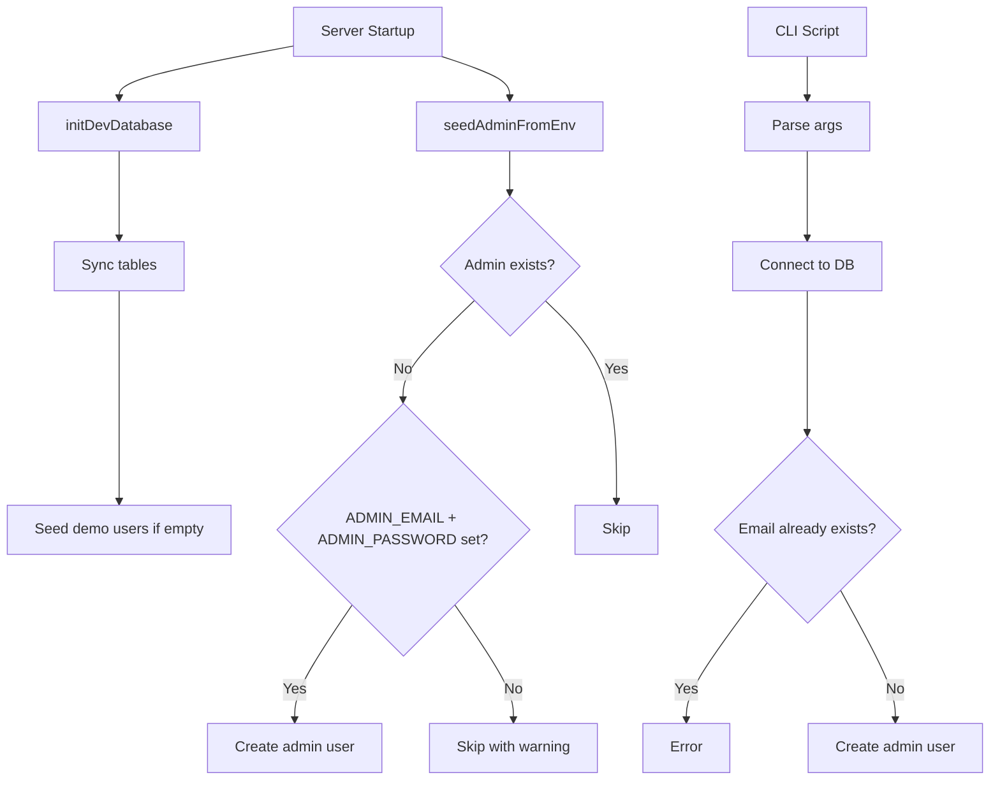

# Plan: Admin User Seeding (Env Var) + CLI Script

## Context

The app supports an `admin` role in the User model, but the registration endpoint only accepts `agent` or `client`. There's no way to create an admin user through the UI or API. We need two mechanisms:

1. **Option 2**: Seed admin from env vars on server startup (primary)
2. **Option 3**: CLI script to create admins on-demand (fallback/complement)

## Current State

- [`src/server/routes/auth.ts`](src/server/routes/auth.ts:20) — registration only accepts `agent` or `client` roles
- [`src/server/dev-init.ts`](src/server/dev-init.ts:8) — already seeds demo users on startup when DB is empty
- [`src/server/database/models/index.ts`](src/server/database/models/index.ts:14) — User model already supports `admin` role
- [`src/server/middleware/roleGuard.ts`](src/server/middleware/roleGuard.ts:26) — `adminOnly()` middleware already exists
- [`src/server/routes/admin.ts`](src/server/routes/admin.ts:13) — admin API routes exist and require `admin` role

## Architecture



## Implementation Steps

### Step 1: Create admin seed utility

**File**: `src/server/utils/seed-admin.ts`

A reusable function that:
- Checks if any user with `role: 'admin'` already exists
- If not, reads `ADMIN_EMAIL` and `ADMIN_PASSWORD` from env
- Validates both are set and password meets minimum length
- Creates the admin user with `emailVerified: true`
- Logs success or warning messages
- Returns the created user or null

### Step 2: Integrate into server startup

**File**: `src/server/dev-init.ts`

Call `seedAdminFromEnv()` after demo user seeding in `initDevDatabase()`. This ensures the admin is created on every server start (idempotent — skips if admin already exists).

### Step 3: Create CLI script

**File**: `scripts/create-admin.mjs`

A standalone Node.js script that:
- Parses `--email` and `--password` arguments (also supports `ADMIN_EMAIL`/`ADMIN_PASSWORD` env vars as fallback)
- Validates inputs
- Connects to the database using the existing Sequelize config
- Creates the admin user (or errors if email already exists)
- Exits with appropriate codes (0 = success, 1 = error)

Add a `create-admin` npm script in `package.json`.

### Step 4: Update .env.example

**File**: `.env.example`

Add the new env vars with placeholder values:
```
# --- Admin Bootstrap ---
# Set these to auto-create an admin user on first startup
ADMIN_EMAIL=
ADMIN_PASSWORD=
```

### Step 5: Write tests

**File**: `tests/server/utils/seed-admin.spec.ts`

Test the seed utility:
- Creates admin when no admin exists and env vars are set
- Skips when admin already exists
- Skips when env vars are not set
- Validates password length
- Handles edge cases (empty string env vars, etc.)

Some tests involving DB state isolation may need `.skip` due to SQLite limitations.

### Step 6: Write tests for CLI script

**File**: `tests/server/scripts/create-admin.spec.ts`

Test the CLI script behavior by importing its core logic:
- Creates admin with valid args
- Rejects duplicate email
- Rejects missing required args

### Step 7: Update registration to explicitly reject `admin` role

**File**: `src/server/routes/auth.ts`

The registration validation already restricts to `['agent', 'client']`, but add a comment making it explicit that admin creation is intentional through env seeding only. This documents the security design.

## Files to Create/Modify

| File | Action |
|------|--------|
| `src/server/utils/seed-admin.ts` | **Create** — seed utility |
| `src/server/dev-init.ts` | **Modify** — integrate seed call |
| `scripts/create-admin.mjs` | **Create** — CLI script |
| `package.json` | **Modify** — add `create-admin` script |
| `.env.example` | **Modify** — add admin env vars |
| `tests/server/utils/seed-admin.spec.ts` | **Create** — unit tests |
| `tests/server/scripts/create-admin.spec.ts` | **Create** — CLI tests |

## Test Strategy

- Tests that need a clean DB state may use `.skip` when SQLite race conditions make isolation unreliable
- Each test that modifies DB state should clean up after itself in `afterAll`
- The seed utility tests will mock env vars using `process.env` manipulation
- CLI script tests will test the core logic function, not the CLI parsing

## Verification

1. Run `pnpm test` to verify all tests pass
2. Test the CLI script manually: `pnpm create-admin --email=admin@dossiat.com --password=Admin123!`
3. Verify server startup creates admin when env vars are set
4. Verify registration still rejects `admin` role
