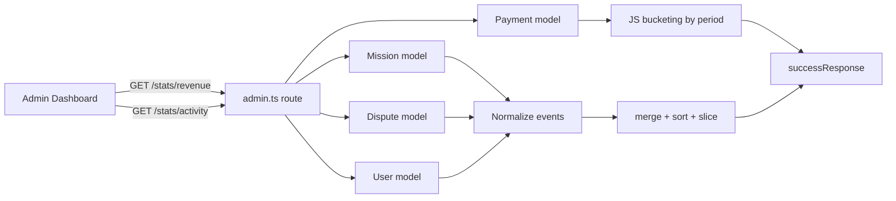

# Plan: Admin Stats — Revenue Breakdown & Activity Feed

> Implements the two remaining unchecked items in [`docs/TODO.md`](docs/TODO.md:528-530):
> - `GET /api/admin/stats/revenue` — revenue breakdown by period
> - `GET /api/admin/stats/activity` — recent platform activity feed

---

## 1. Context & Current State

### Existing infrastructure
- All admin routes live in [`src/server/routes/admin.ts`](src/server/routes/admin.ts) and are guarded by `authenticate()` + `adminOnly()` middleware applied at the router level (line 13).
- An existing `GET /api/admin/stats` endpoint (lines 919-938) returns aggregate counts: `totalUsers`, `totalMissions`, `totalDisputes`, `openDisputes`, `totalRevenue` (sum of `platform_fee` on confirmed payments).
- Response helpers in [`src/server/utils/apiResponse.ts`](src/server/utils/apiResponse.ts): `successResponse`, `paginatedResponse`, `errorResponse`.
- Frontend service [`src/services/admin.ts`](src/services/admin.ts) wraps all admin endpoints; Pinia store [`src/stores/admin.ts`](src/stores/admin.ts) holds `stats` state and `fetchStats()` action.
- Admin dashboard view [`src/views/admin/AdminDashboardView.vue`](src/views/admin/AdminDashboardView.vue) renders stat cards from `adminStore.stats`.
- i18n keys already exist: `admin.dashboard.recentActivity`, `admin.dashboard.recentPayments` (in en/fr/ar).

### Relevant models (from [`src/server/database/models/index.ts`](src/server/database/models/index.ts))
- **Payment**: `id, missionId, payerId, payeeId, amount, currency, method, platformFee, gatewayFee, netAmount, status (pending|confirmed|failed|refunded), confirmedByPayer, confirmedByPayee, confirmedAt, createdAt`. Associations: `payer` (User), `payee` (User), `mission` (Mission).
- **Mission**: `id, agentId, clientId, title, status, type, pricingType, agreedAmount, currency, createdAt`. Associations: `agent`, `client` (User).
- **Dispute**: `id, missionId, initiatedBy, reason, status, resolvedAt, createdAt`. Associations: `mission`, `initiator` (User).
- **User**: `id, email, firstName, lastName, role, emailVerified, createdAt`.
- **Notification**: `id, userId, type, title, body, data (JSON), readAt, createdAt`.

### Testing patterns
- Backend route tests: [`tests/server/routes/admin.spec.ts`](tests/server/routes/admin.spec.ts) — uses `app.request('/api/admin/...')` with `Authorization: Bearer ${adminToken}`. Setup creates admin/agent/client users in `beforeAll`.
- Service tests: [`tests/services/admin.spec.ts`](tests/services/admin.spec.ts) — mocks `@/services/api` and asserts `get/post/put/patch/del` called with correct args.
- Store tests: [`tests/stores/admin.spec.ts`](tests/stores/admin.spec.ts) — mocks the service module.

---

## 2. Design Decisions

### `GET /api/admin/stats/revenue` — Revenue breakdown by period

**Purpose**: Provide time-series revenue data for charting on the admin dashboard.

**Query params**:
| Param | Type | Default | Allowed values |
|-------|------|---------|----------------|
| `period` | string | `monthly` | `daily`, `weekly`, `monthly`, `yearly` |
| `from` | ISO date | 12 periods back from now | — |
| `to` | ISO date | now | — |

**Response shape** (`successResponse`):
```json
{
  "success": true,
  "data": {
    "period": "monthly",
    "from": "2025-08-01",
    "to": "2026-07-08",
    "breakdown": [
      {
        "periodStart": "2025-08-01",
        "periodEnd": "2025-08-31",
        "label": "Aug 2025",
        "grossAmount": 12500.00,
        "platformFee": 125.00,
        "gatewayFee": 365.00,
        "netAmount": 12010.00,
        "paymentCount": 42
      }
    ],
    "totals": {
      "grossAmount": 150000.00,
      "platformFee": 1500.00,
      "gatewayFee": 4380.00,
      "netAmount": 144120.00,
      "paymentCount": 500
    },
    "byMethod": [
      { "method": "cash", "grossAmount": 50000, "platformFee": 500, "paymentCount": 200 },
      { "method": "stripe", "grossAmount": 75000, "platformFee": 750, "paymentCount": 250 },
      { "method": "paypal", "grossAmount": 25000, "platformFee": 250, "paymentCount": 50 }
    ]
  }
}
```

**Implementation approach**:
- Only count payments with `status = 'confirmed'` (consistent with existing `/stats` endpoint).
- Use Sequelize `fn('SUM', col(...))` with `GROUP BY` date bucket.
- Date bucketing must work on both **PostgreSQL** (production) and **SQLite** (dev/test). To stay dialect-agnostic, fetch confirmed payments in the date range with `attributes: ['amount', 'platformFee', 'gatewayFee', 'netAmount', 'method', 'confirmedAt', 'createdAt']`, then bucket in JS. This avoids dialect-specific `date_trunc`/`strftime` SQL and keeps the query portable. The dataset for an admin revenue report is bounded (12 periods × N payments) and acceptable to aggregate in JS.
- Use `confirmedAt` (falling back to `createdAt` when `confirmedAt` is null) as the bucketing timestamp.
- Period bucketing helper computes `periodStart`/`periodEnd`/`label` per bucket.

### `GET /api/admin/stats/activity` — Recent platform activity feed

**Purpose**: Unified feed of recent platform events for the admin dashboard.

**Query params**:
| Param | Type | Default | Range |
|-------|------|---------|-------|
| `limit` | int | 20 | 1–100 |

**Response shape** (`successResponse`):
```json
{
  "success": true,
  "data": [
    {
      "type": "mission_created",
      "id": "mission:42",
      "createdAt": "2026-07-08T10:00:00.000Z",
      "summary": "Mission 'Logo design' created",
      "actor": { "id": 5, "firstName": "Jane", "lastName": "Doe", "role": "agent" },
      "context": { "missionId": 42, "title": "Logo design", "status": "draft" }
    },
    {
      "type": "payment_confirmed",
      "id": "payment:17",
      "createdAt": "2026-07-08T09:30:00.000Z",
      "summary": "Payment of $250.00 confirmed",
      "actor": { "id": 3, "firstName": "Bob", "lastName": "Smith", "role": "client" },
      "context": { "paymentId": 17, "amount": 250, "currency": "USD", "method": "stripe", "missionId": 12 }
    },
    {
      "type": "dispute_opened",
      "id": "dispute:9",
      "createdAt": "2026-07-08T08:00:00.000Z",
      "summary": "Dispute opened on mission 'Website redesign'",
      "actor": { "id": 7, "firstName": "Alice", "lastName": "Lee", "role": "client" },
      "context": { "disputeId": 9, "missionId": 12, "reason": "Quality issues" }
    },
    {
      "type": "user_registered",
      "id": "user:55",
      "createdAt": "2026-07-08T07:00:00.000Z",
      "summary": "New agent registered: jane@example.com",
      "actor": { "id": 55, "firstName": "Jane", "lastName": "Doe", "role": "agent" },
      "context": { "userId": 55, "email": "jane@example.com", "role": "agent" }
    }
  ]
}
```

**Implementation approach**:
- Fetch the most recent records from each source table (Mission, Payment, Dispute, User) in parallel using `Promise.all`.
- Each query selects only the columns needed plus the minimal `include` for the actor user (id, firstName, lastName, role).
- Normalize each record into a common `{ type, id, createdAt, summary, actor, context }` shape.
- Merge all events into a single array, sort by `createdAt` DESC, slice to `limit`.
- Event types: `mission_created`, `mission_completed`, `payment_confirmed`, `dispute_opened`, `dispute_resolved`, `user_registered`.
  - `mission_completed`: missions with `status = 'completed'` (use `completedAt` if available, else `updatedAt`).
  - `payment_confirmed`: payments with `status = 'confirmed'` (use `confirmedAt`).
  - `dispute_resolved`: disputes with `status = 'resolved'` (use `resolvedAt`).
- Cap each source query at `limit` records to keep queries cheap before the merge/sort/slice.

---

## 3. Mermaid — Data flow



---

## 4. Implementation Steps (TDD)

### Step 1 — Backend route tests (write first)
File: [`tests/server/routes/admin.spec.ts`](tests/server/routes/admin.spec.ts) (append new `describe` blocks before the closing of the file).

Add `GET /api/admin/stats/revenue` tests:
- returns 200 and a `breakdown` array with `periodStart`/`periodEnd`/`label`/`grossAmount`/`platformFee`/`gatewayFee`/`netAmount`/`paymentCount` per bucket
- returns `totals` object with summed fields and `paymentCount`
- returns `byMethod` array with per-method aggregates
- respects `period=daily` query (buckets differ from monthly)
- respects `from`/`to` date range (excludes payments outside range)
- only counts `confirmed` payments (a `pending` payment created in the test is excluded)
- rejects non-admin (403) and unauthenticated (401) — covered by existing auth tests but add one explicit check
- returns empty breakdown (not error) when no confirmed payments exist

Add `GET /api/admin/stats/activity` tests:
- returns 200 and an array of activity items with `type`, `id`, `createdAt`, `summary`, `actor`, `context`
- items are sorted by `createdAt` DESC
- respects `limit` query (default 20, capped at 100)
- includes events of multiple types (`mission_created`, `user_registered`, `payment_confirmed`, `dispute_opened`) when seeded
- rejects non-admin (403) and unauthenticated (401)

Seed data: reuse the existing `adminId/agentId/clientId` and the `testPaymentMissionId`/`testDisputeMissionId` already created in the file's `beforeAll`. Create a confirmed payment and a completed mission inside the new `describe` blocks' own `beforeAll`/`afterAll` to keep tests isolated.

### Step 2 — Implement backend routes
File: [`src/server/routes/admin.ts`](src/server/routes/admin.ts) — append two new routes after the existing `GET /stats` block (after line 938).

Add a small internal helper section (not exported) for:
- `bucketPeriod(period, date)` → `{ start: Date, end: Date, label: string }`
- `generatePeriodBuckets(period, from, to)` → array of buckets
- `normalizeActivity(...)` → maps each model row to the activity shape

Use `fn`, `col`, `Op.between`/`Op.gte`/`Op.lte` from sequelize (already imported). Add `literal` import if needed for raw SQL (prefer JS bucketing to avoid dialect issues).

### Step 3 — Frontend service functions
File: [`src/services/admin.ts`](src/services/admin.ts) — add under the `// ─── Stats ───` section:
```ts
export function getRevenueStats(params?: { period?: string; from?: string; to?: string }) {
  return get('/admin/stats/revenue', { params })
}

export function getActivityFeed(params?: { limit?: number }) {
  return get('/admin/stats/activity', { params })
}
```

### Step 4 — Frontend service tests
File: [`tests/services/admin.spec.ts`](tests/services/admin.spec.ts) — add `describe` blocks for `getRevenueStats()` and `getActivityFeed()` asserting the mocked `get` is called with the correct URL and params.

### Step 5 — Pinia store actions + state
File: [`src/stores/admin.ts`](src/stores/admin.ts):
- Add interfaces: `RevenueStats`, `RevenueBucket`, `RevenueTotals`, `RevenueByMethod`, `ActivityItem`, `ActivityActor`.
- Add state refs: `revenueStats`, `activityFeed`.
- Add actions: `fetchRevenueStats(params?)`, `fetchActivityFeed(params?)` following the existing `fetchStats` pattern (set loading, try/catch, set error).
- Export the new state and actions in the store return object.

### Step 6 — Pinia store tests
File: [`tests/stores/admin.spec.ts`](tests/stores/admin.spec.ts) — add tests for `fetchRevenueStats` and `fetchActivityFeed` (success path populates state, error path sets `error`), mocking the service module.

### Step 7 — Dashboard view integration
File: [`src/views/admin/AdminDashboardView.vue`](src/views/admin/AdminDashboardView.vue):
- Call `adminStore.fetchActivityFeed()` in `onMounted` alongside `fetchStats()`.
- Render a "Recent Activity" section below the stat cards using the existing i18n key `admin.dashboard.recentActivity`.
- Each activity item shows: icon by `type`, `summary`, actor name, relative time.
- (Revenue chart is optional for this task; the endpoint + store wiring is the deliverable. A simple revenue summary card can be added if time permits, but the TODO only requires the endpoints.)

### Step 8 — i18n keys
Add any missing keys for activity event labels to [`src/locales/en.json`](src/locales/en.json), [`src/locales/fr.json`](src/locales/fr.json), [`src/locales/ar.json`](src/locales/ar.json) under `admin.dashboard.activity`:
- `mission_created`, `mission_completed`, `payment_confirmed`, `dispute_opened`, `dispute_resolved`, `user_registered`
Run `pnpm i18n:sync` to validate.

### Step 9 — Update docs
- Check off the two items in [`docs/TODO.md`](docs/TODO.md:528-530).
- Update [`ARCHITECTURE.md`](ARCHITECTURE.md) admin routes section if it lists endpoints.

### Step 10 — Run tests
- `pnpm test` (or targeted: `pnpm vitest run tests/server/routes/admin.spec.ts tests/services/admin.spec.ts tests/stores/admin.spec.ts`).
- Ensure all existing tests still pass and new tests pass.

---

## 5. Files to be modified/created

| File | Action |
|------|--------|
| [`src/server/routes/admin.ts`](src/server/routes/admin.ts) | Add 2 routes + helpers |
| [`tests/server/routes/admin.spec.ts`](tests/server/routes/admin.spec.ts) | Add 2 describe blocks |
| [`src/services/admin.ts`](src/services/admin.ts) | Add 2 service functions |
| [`tests/services/admin.spec.ts`](tests/services/admin.spec.ts) | Add 2 describe blocks |
| [`src/stores/admin.ts`](src/stores/admin.ts) | Add state + 2 actions + interfaces |
| [`tests/stores/admin.spec.ts`](tests/stores/admin.spec.ts) | Add 2 describe blocks |
| [`src/views/admin/AdminDashboardView.vue`](src/views/admin/AdminDashboardView.vue) | Render activity feed |
| [`src/locales/en.json`](src/locales/en.json), [`src/locales/fr.json`](src/locales/fr.json), [`src/locales/ar.json`](src/locales/ar.json) | Add activity event keys |
| [`docs/TODO.md`](docs/TODO.md) | Check off items 528-530 |
| [`ARCHITECTURE.md`](ARCHITECTURE.md) | Update admin routes list (if applicable) |

No new dependencies. No migrations needed (uses existing columns: `confirmedAt`, `resolvedAt`, `completedAt`, `createdAt`).

---

## 6. Risks & Notes

- **Dialect portability**: JS-side bucketing avoids PostgreSQL/SQLite `date_trunc`/`strftime` divergence. Confirmed payments volume for a 12-period report is bounded.
- **Performance**: Activity feed caps each source query at `limit` (max 100) before merge/sort/slice — bounded cost.
- **Auth**: Both routes inherit the router-level `authenticate()` + `adminOnly()` middleware, so no per-route guard needed.
- **No secrets / no third-party libs**: adheres to AGENTS.md rules.
