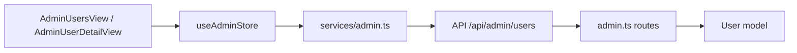

# Admin Users — Complete CRUD Operations

## Problem

The admin users page ([`AdminUsersView.vue`](src/views/admin/AdminUsersView.vue)) and detail page ([`AdminUserDetailView.vue`](src/views/admin/AdminUserDetailView.vue)) only support:

- List (with search + role filter)
- Create (email, firstName, lastName, role, password)
- View detail
- Change role (detail page only)
- Activate / Deactivate (toggles `emailVerified`)
- Delete

Missing common admin operations:

1. **Edit name** (firstName, lastName)
2. **Edit email**
3. **Reset password** (admin sets a new password for the user)
4. Inline edit from the list row (currently must navigate to detail to change role)

The backend [`PUT /api/admin/users/:id`](src/server/routes/admin.ts:100) only accepts `role` and `emailVerified`. There is no reset-password endpoint.

## Goal

Complete the user CRUD so an admin can edit a user's name, email, role, and reset their password — from both the list page (quick actions) and the detail page (full form). No regression to existing list/create/activate/deactivate/delete flows.

## Scope

In scope:
- Backend route extensions ([`src/server/routes/admin.ts`](src/server/routes/admin.ts))
- Frontend service ([`src/services/admin.ts`](src/services/admin.ts))
- Frontend store ([`src/stores/admin.ts`](src/stores/admin.ts))
- Admin users list view ([`src/views/admin/AdminUsersView.vue`](src/views/admin/AdminUsersView.vue))
- Admin user detail view ([`src/views/admin/AdminUserDetailView.vue`](src/views/admin/AdminUserDetailView.vue))
- i18n keys (en, fr, ar)
- Tests (route, service, store, component)

Out of scope:
- Editing `agentProfile` / `clientProfile` sub-fields (separate concern)
- Email verification re-send flow (already exists in [`auth.ts`](src/server/routes/auth.ts:282))
- Avatar upload (exists in [`users.ts`](src/server/routes/users.ts:220))
- Soft-delete / restore (current delete is hard-delete; keeping as-is)

## Architecture / Data Flow



New endpoints:

| Method | Path | Purpose |
|--------|------|---------|
| `PUT` | `/api/admin/users/:id` | Extended: accept `firstName`, `lastName`, `email`, `role`, `emailVerified` |
| `PATCH` | `/api/admin/users/:id/reset-password` | New: admin sets a new password (hashed) |

## Detailed Steps

### 1. Backend — [`src/server/routes/admin.ts`](src/server/routes/admin.ts)

#### 1a. Extend `PUT /api/admin/users/:id`

Current validator only allows `role`. Extend to allow optional `firstName`, `lastName`, `email`, `role`, `emailVerified`.

- Add validators: `firstName: validators.optional()`, `lastName: validators.optional()`, `email: validators.optional()` (keep `role: validators.isIn(...)`).
- In handler, build `updates` from all provided fields.
- If `email` provided:
  - Validate format with regex `/^[^\s@]+@[^\s@]+\.[^\s@]+$/` → 422 if invalid.
  - Lowercase it.
  - Check uniqueness excluding current user id (`User.findOne({ where: { email, id: { [Op.ne]: id } } })`) → 409 if taken.
- Keep existing "No valid fields to update" guard.
- Return updated user with profiles (existing behavior).

#### 1b. Add `PATCH /api/admin/users/:id/reset-password`

- Validator: `body: { password: validators.required() }`.
- Validate `password.length >= 8` → 422 otherwise (consistent with [`auth.ts`](src/server/routes/auth.ts:30) and [`users.ts`](src/server/routes/users.ts:71)).
- Load user; 404 if missing.
- `bcrypt.hash(password, 12)` → `user.update({ passwordHash })`.
- Invalidate existing refresh tokens for the user (reuse pattern from [`auth.ts`](src/server/routes/auth.ts:257): `RefreshToken.destroy({ where: { userId: id } })`). Import `RefreshToken` from models.
- Return `{ id }` (never return the hash). Message: "Password reset successfully".

### 2. Frontend service — [`src/services/admin.ts`](src/services/admin.ts)

- Extend `updateUser` signature:
  ```ts
  export function updateUser(id: string, data: {
    firstName?: string
    lastName?: string
    email?: string
    role?: string
    emailVerified?: boolean
  }) { return put(`/admin/users/${id}`, data) }
  ```
- Add:
  ```ts
  export function resetUserPassword(id: string, password: string) {
    return patch(`/admin/users/${id}/reset-password`, { password })
  }
  ```

### 3. Frontend store — [`src/stores/admin.ts`](src/stores/admin.ts)

- Extend `updateUser` action's `data` type to match the service.
- Add `resetUserPassword(id: string, password: string)` action that calls the service and returns the result (no list mutation needed; optionally invalidate `selectedUser`).
- Export `resetUserPassword` in the store return object.

### 4. Admin user detail view — [`src/views/admin/AdminUserDetailView.vue`](src/views/admin/AdminUserDetailView.vue)

Add two new sections above "Account Actions":

#### 4a. Edit Profile section
- "Edit Profile" card with fields: `firstName`, `lastName`, `email`, `role`.
- Inline edit pattern (like existing role editor): show current values, "Edit" button toggles form.
- On save: call `adminStore.updateUser(userId, { firstName, lastName, email, role })`.
- Toast success `admin.users.updated` / error `admin.users.updateError`.
- Re-fetch via `adminStore.fetchUser(userId)` after save to refresh profiles.

#### 4b. Reset Password section
- "Reset Password" button in Account Actions card (or its own card).
- Opens a `BModal` with two `BInput` (type=password): `newPassword` and `confirmPassword`.
- Client validation: min 8 chars, passwords match.
- On submit: `adminStore.resetUserPassword(userId, newPassword)`.
- Toast `admin.users.passwordReset` / `admin.users.passwordResetError`.

### 5. Admin users list view — [`src/views/admin/AdminUsersView.vue`](src/views/admin/AdminUsersView.vue)

- Add an "Edit" button in row actions (between "View" and activate/deactivate) that opens an Edit modal pre-filled with the row's `firstName`, `lastName`, `email`, `role`.
- Edit modal reuses the same form layout as Create modal (plus role select). On save → `adminStore.updateUser(row.id, ...)` then `loadData()`.
- Add a "Reset Password" button in row actions that opens the reset-password modal (same component pattern as detail page). On submit → `adminStore.resetUserPassword(row.id, ...)`.
- Keep all existing buttons (View, Activate/Deactivate, Delete).

### 6. i18n — [`src/locales/en.json`](src/locales/en.json), [`fr.json`](src/locales/fr.json), [`ar.json`](src/locales/ar.json)

Add under `admin.users`:

```
"editUser": "Edit User",
"edit": "Edit",
"editProfile": "Edit Profile",
"editProfileHint": "Update the user's personal information.",
"resetPassword": "Reset Password",
"resetPasswordTitle": "Reset Password",
"resetPasswordHint": "Set a new password for this user. They will need to log in again.",
"newPassword": "New Password",
"confirmPassword": "Confirm Password",
"passwordMinLength": "Password must be at least 8 characters.",
"passwordMismatch": "Passwords do not match.",
"resetting": "Resetting...",
"passwordReset": "Password reset successfully.",
"passwordResetError": "Failed to reset password.",
"emailInvalid": "Invalid email format.",
"emailTaken": "A user with this email already exists.",
"updating": "Updating..."
```

Mirror the same keys in `fr.json` and `ar.json` with proper translations.

### 7. Tests

#### 7a. Route tests — [`tests/server/routes/admin.spec.ts`](tests/server/routes/admin.spec.ts)

Extend `PUT /api/admin/users/:id` describe block:
- it('updates firstName and lastName')
- it('updates email and lowercases it')
- it('rejects invalid email format', 422)
- it('rejects duplicate email', 409)
- it('rejects empty update body', 422)

Add new describe block `PATCH /api/admin/users/:id/reset-password`:
- it('resets the password (admin can login with new password)')
- it('rejects password shorter than 8 chars', 422)
- it('returns 404 for non-existent user')
- it('invalidates existing refresh tokens')

#### 7b. Service tests — [`tests/services/admin.spec.ts`](tests/services/admin.spec.ts)

- Extend `updateUser` test to assert the extended payload is sent.
- Add `resetUserPassword` test asserting `patch('/admin/users/:id/reset-password', { password })` is called.

#### 7c. Store tests — [`tests/stores/admin.spec.ts`](tests/stores/admin.spec.ts)

- Extend `updateUser` test for the new fields.
- Add `resetUserPassword` action test (success + error path).

#### 7d. Component tests

- Add [`tests/components/admin/AdminUserDetailView.spec.ts`](tests/components/admin/) (new file): assert edit-profile form renders, save calls `updateUser` with correct payload; reset-password modal validates min length and mismatch.
- Extend or add [`tests/components/admin/AdminUsersView.spec.ts`](tests/components/admin/) (new file): assert Edit and Reset Password buttons exist and open modals.

### 8. No-regression verification

- Run `pnpm test` — all existing tests must still pass.
- Manually verify (where possible): list, create, view, activate/deactivate, delete still work; new edit + reset-password work.

## Files to Create / Modify

| File | Action |
|------|--------|
| [`src/server/routes/admin.ts`](src/server/routes/admin.ts) | Modify (extend PUT, add reset-password) |
| [`src/services/admin.ts`](src/services/admin.ts) | Modify (extend updateUser, add resetUserPassword) |
| [`src/stores/admin.ts`](src/stores/admin.ts) | Modify (extend updateUser, add resetUserPassword) |
| [`src/views/admin/AdminUserDetailView.vue`](src/views/admin/AdminUserDetailView.vue) | Modify (edit profile + reset password) |
| [`src/views/admin/AdminUsersView.vue`](src/views/admin/AdminUsersView.vue) | Modify (edit + reset-password row actions) |
| [`src/locales/en.json`](src/locales/en.json) | Modify (add keys) |
| [`src/locales/fr.json`](src/locales/fr.json) | Modify (add keys) |
| [`src/locales/ar.json`](src/locales/ar.json) | Modify (add keys) |
| [`tests/server/routes/admin.spec.ts`](tests/server/routes/admin.spec.ts) | Modify (extend + new tests) |
| [`tests/services/admin.spec.ts`](tests/services/admin.spec.ts) | Modify |
| [`tests/stores/admin.spec.ts`](tests/stores/admin.spec.ts) | Modify |
| `tests/components/admin/AdminUserDetailView.spec.ts` | Create |
| `tests/components/admin/AdminUsersView.spec.ts` | Create |

## Security Considerations

- Reset-password endpoint is behind `authenticate() + adminOnly()` (already applied via `admin.use('*', ...)`).
- Never return `passwordHash` in any response.
- Invalidate refresh tokens on password reset to force re-login.
- Email change checks uniqueness to avoid collisions.
- Password min length 8 enforced server-side (not only client-side).

## Non-Goals / Risks

- We do **not** add a separate "active/inactive" boolean column. The existing activate/deactivate toggles `emailVerified`, which is the established pattern in this codebase. Changing that semantics is out of scope and would be a regression.
- We do **not** send an email notification on password reset (email sending is stubbed `TODO` in [`auth.ts`](src/server/routes/auth.ts:222) and not wired up). A follow-up task can add notifications once the mailer exists.
