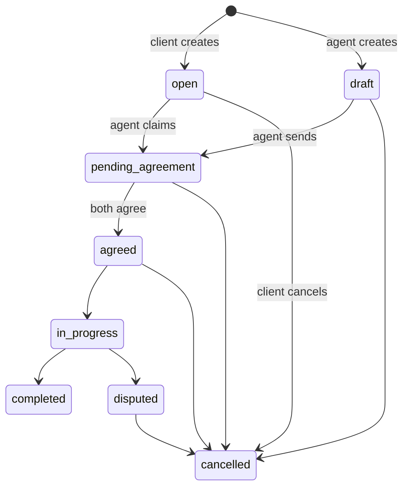

# Plan: Client-Initiated Missions

## Goal

Allow **clients** to create missions (in addition to agents). A client-created mission starts with `agentId = null` (unassigned) and enters a new `open` status. An agent can then **claim** the mission, after which the existing agreement workflow proceeds. This aligns the implementation with the PRD wording: *"Clients and Agents can set up… missions."*

## Design Decisions (confirmed with user)

1. **agentId nullable** — Client-created missions have `agentId = null` until an agent claims them.
2. **New `open` status** — Added to the mission status ENUM for unassigned, client-initiated missions.
3. **Client can optionally propose an amount** — `agreedAmount` becomes a *proposed* amount. The agent has pricing authority but can accept the client's proposed amount during the claim/agreement step.
4. **Seat limits** — Seat limits only apply once an agent is assigned (at claim time), not at mission creation by a client. This matches the spec: seats track *unique agents with active missions* per client.
5. **Fix the client dropdown glitch** — Replace the numeric `<BInput type="number">` for client selection in [`MissionCreateView.vue`](src/views/missions/MissionCreateView.vue:115) with a proper dropdown populated from the agent's client network.

## Architecture Overview

```mermaid
graph TD
    subgraph AgentFlow[Agent-initiated flow - unchanged]
        A1[Agent creates mission] --> A2[Status: draft]
        A2 --> A3[Agent sends for agreement]
        A3 --> A4[pending_agreement]
        A4 --> A5[Both agree -> agreed]
        A5 --> A6[in_progress -> completed]
    end

    subgraph ClientFlow[Client-initiated flow - NEW]
        C1[Client creates mission] --> C2[Status: open<br/>agentId = null]
        C2 --> C3{Agent claims}
        C3 -->|Agent accepts proposed amount| C4[Status: pending_agreement<br/>agentId set]
        C3 -->|Agent sets new amount| C4
        C4 --> C5[Both agree -> agreed]
        C5 --> C6[in_progress -> completed]
    end

    subgraph AdminFlow[Admin flow - unchanged]
        AD1[Admin creates mission] --> AD2[Status: draft<br/>both ids required]
    end
```



## Status Flow (updated)



## Implementation Steps

### Phase 1: Database & Model

#### 1.1 New migration: `20260706000000-client-initiated-missions.cjs`

- Alter `missions.agent_id` to `allowNull: true`.
- Replace the `status` ENUM to include `'open'`:
  - New ENUM: `('open', 'draft', 'pending_agreement', 'agreed', 'in_progress', 'completed', 'disputed', 'cancelled')`.
  - SQLite (dev) note: SQLite doesn't support `ALTER TYPE` on ENUM; Sequelize handles this via `sync` in dev. For Postgres production, use `ALTER TYPE ... ADD VALUE`.
- Add column `proposed_amount` (DECIMAL(10,2), allowNull: true) — stores the client's optional proposed amount (distinct from `agreed_amount` which is finalized at agreement).
- Add column `proposed_by` (INTEGER, allowNull: true, references users) — tracks who proposed the amount (client or agent).
- Add index on `missions` for `status = 'open'` to support agent discovery of open missions.

**Down migration**: reverse all the above.

#### 1.2 Update Mission model in [`src/server/database/models/index.ts`](src/server/database/models/index.ts:240)

- `agentId` type: `number | null`
- `status` type: add `'open'` to the union.
- `proposedAmount`: `number | null`
- `proposedBy`: `number | null`
- In `Mission.init(...)`: set `agentId: { allowNull: true, ... }`, add `proposedAmount` and `proposedBy` columns, update `status` ENUM to include `'open'`.

### Phase 2: Backend Routes

#### 2.1 `POST /api/missions` — [`src/server/routes/missions.ts`](src/server/routes/missions.ts:59)

- **Agent path** (unchanged behavior): requires `clientId`, sets `agentId = auth.userId`, status `draft`.
- **Client path** (NEW): `clientId` is optional/ignored (defaults to `auth.userId`), `agentId = null`, status `open`.
  - `agreedAmount` from client is stored as `proposedAmount` (not `agreedAmount`).
  - Skip `checkSeatLimit` (no agent assigned yet).
- Validation: `clientId` required only when `auth.role === 'agent'`.

#### 2.2 New endpoint: `POST /api/missions/:id/claim` — [`src/server/routes/missions.ts`](src/server/routes/missions.ts)

- Auth required, role must be `agent`.
- Mission must be in `open` status with `agentId = null`.
- Agent can optionally set/override `agreedAmount` in the claim request body.
  - If agent accepts the client's `proposedAmount`, copy it to `agreedAmount`.
  - If agent provides a new amount, use that as `agreedAmount`.
- Sets `agentId = auth.userId`, transitions status `open -> pending_agreement`.
- Run `checkSeatLimit(clientId)` at this point — if exceeded, reject the claim.
- Notify the client that an agent claimed their mission.
- Create the `Conversation` row if not already present.

#### 2.3 `POST /api/missions/bulk` — [`src/server/routes/missions.ts`](src/server/routes/missions.ts:106)

- **Client path**: missions created with `agentId = null`, status `open` (instead of the current swap logic that misuses `clientId`/`agentId`).
- **Agent path**: unchanged (status `draft`, agent is the creator).
- Fix the existing bug where the bulk endpoint swaps `agentId`/`clientId` confusingly for clients (lines 147-148). Client-created bulk missions should have `agentId = null`.
- Keep the Enterprise `csv_import` feature gate for clients.

#### 2.4 `PUT /api/missions/:id/status` — status transitions

- Update `validTransitions` to include `open`:
  ```ts
  open: ['pending_agreement', 'cancelled'],  // pending_agreement via claim endpoint, cancelled by client
  ```
- Note: the `open -> pending_agreement` transition is primarily driven by the claim endpoint, but listing it here keeps the transition map consistent.

#### 2.5 `POST /api/missions/:id/agree` — [`src/server/routes/missions.ts`](src/server/routes/missions.ts:251)

- No change needed — by the time a mission is in `pending_agreement`, `agentId` is set (via claim or agent creation). The existing `agreedByAgent`/`agreedByClient` logic works.
- Add a guard: if `mission.agentId === null`, reject with 400 ("Mission has no assigned agent").

#### 2.6 `GET /api/missions` — list endpoint

- **Agent view**: show agent's own missions (as agent) PLUS open missions available to claim.
  - Update the `where` clause: `agentId = auth.userId OR status = 'open'`.
- **Client view**: show client's own missions (as client), including `open` ones they created.
- Add optional `?open=true` filter for agents to discover claimable missions.

#### 2.7 `GET /api/missions/:id` — permission check

- Allow agents to view `open` missions (so they can inspect before claiming).
- Allow the client who created an `open` mission to view it.
- Existing check: `mission.agentId !== auth.userId && mission.clientId !== auth.userId && auth.role !== 'admin'` — update to also allow `mission.status === 'open' && auth.role === 'agent'`.

#### 2.8 `PUT /api/missions/:id` and `DELETE /api/missions/:id`

- For `open` missions with `agentId = null`: only the client (creator) or admin can edit/cancel.
- Update the permission check: `mission.agentId !== auth.userId && mission.clientId !== auth.userId` — handle `agentId === null` gracefully (don't allow `null === auth.userId` to accidentally pass).

#### 2.9 Admin routes — [`src/server/routes/admin.ts`](src/server/routes/admin.ts:278)

- `POST /api/admin/missions`: keep requiring both `agentId` and `clientId` (admin creates fully-formed missions). No change.
- `PUT /api/admin/missions/:id/status`: add `'open'` to `validStatuses` array (line 394).

#### 2.10 Recurrence routes — [`src/server/routes/recurrence.ts`](src/server/routes/recurrence.ts:54)

- `POST /missions/:id/recurrence`: currently checks `mission.agentId !== auth.userId`. For client-initiated missions, allow the **client** to set recurrence (per PRD: "Clients and Agents can set up… missions").
  - Update guard: `if (mission.agentId !== auth.userId && mission.clientId !== auth.userId)`.
  - This enables the "less steps" recurrence setup the user mentioned, since the mission record already exists.

### Phase 3: Frontend

#### 3.1 New reusable component: `UserSelect.vue`

- Location: [`src/components/common/UserSelect.vue`](src/components/common/UserSelect.vue) (new).
- A dropdown that fetches a list of users (clients or agents) and displays them by name.
- Props: `role` ('client' | 'agent'), `modelValue` (number | string), `label`, `placeholder`, `error`.
- Emits `update:modelValue` with the selected user ID (as string for v-model compatibility with BSelect).
- Uses a new API endpoint to fetch the user list (see 3.2).

#### 3.2 New API endpoint: `GET /api/users/network`

- [`src/server/routes/users.ts`](src/server/routes/users.ts) — add endpoint.
- For **agents**: returns list of clients who have missions with this agent (their network).
- For **clients**: returns list of agents who have missions with this client, OR all verified agents (for discovery/claiming).
- Returns minimal fields: `id`, `firstName`, `lastName`, `email`.
- This replaces the numeric input with a real dropdown.

#### 3.3 Update `MissionCreateView.vue` — [`src/views/missions/MissionCreateView.vue`](src/views/missions/MissionCreateView.vue)

- Replace the `<BInput type="number" v-model="clientId">` (lines 115-122) with `<UserSelect role="client" v-model="clientId" />`.
- Make the form **role-aware**:
  - If `authStore.hasRole('agent')`: show client selector (current behavior).
  - If `authStore.hasRole('client')`: hide client selector (client is the creator); show optional "proposed amount" field instead of "agreed amount".
- Update `handleSubmit` to send the right payload based on role.
- Update validation: `clientId` required only for agents.

#### 3.4 Update `MissionListView.vue` — [`src/views/missions/MissionListView.vue`](src/views/missions/MissionListView.vue:43)

- Show "Create Mission" button for **both** agents and clients:
  - `v-if="authStore.hasRole('agent') || authStore.hasRole('client')"`.
- Add a filter/tab for agents to view `open` missions available to claim.
- Update `counterpartyName()` to handle `mission.agent === null` (show "Unassigned" for open missions).

#### 3.5 Update `MissionDetailView.vue` — [`src/views/missions/MissionDetailView.vue`](src/views/missions/MissionDetailView.vue)

- Add a **"Claim Mission"** button visible to agents when `mission.status === 'open'` and `mission.agentId === null`.
  - On click, optionally prompt for amount (or accept proposed amount), then call `POST /api/missions/:id/claim`.
- Handle `mission.agent === null` in the Agent/Client party cards (show "Unassigned" or "Awaiting agent").
- Update `canSendForAgreement`, `canStart`, etc. to account for `open` status.
- Allow client to cancel an `open` mission (no agent to notify).

#### 3.6 Update router — [`src/router/index.ts`](src/router/index.ts:89)

- Change `missions/create` route meta from `roles: ['agent']` to `roles: ['agent', 'client']`.
- Keep `missions/bulk` as `roles: ['client']` (already correct).

#### 3.7 Update `StatusBadge.vue` and i18n

- Add `open` status styling to [`src/components/common/StatusBadge.vue`](src/components/common/StatusBadge.vue).
- Add i18n keys to all three locale files (`en.json`, `fr.json`, `ar.json`):
  - `missions.status.open`: "Open" / "Ouvert" / "مفتوح"
  - `missions.create.fields.proposedAmount`: "Proposed Amount"
  - `missions.create.fields.proposedAmountPlaceholder`: "0.00"
  - `missions.detail.actions.claim`: "Claim Mission"
  - `missions.detail.unassigned`: "Unassigned"
  - `missions.detail.proposedAmount`: "Proposed Amount"
  - `missions.list.filters.open`: "Open Missions"
  - `missions.create.subtitleClient`: "Post a mission request for agents to claim."
  - `missions.create.createdClient`: "Mission posted. Waiting for an agent to claim."

### Phase 4: Services & Store

#### 4.1 `src/services/missions.ts`

- Add `claimMission(id, data?)` function: `POST /missions/:id/claim`.
- Update `CreateMissionData` interface: `clientId` optional, add `proposedAmount?`.

#### 4.2 `src/stores/missions.ts`

- Add `claimMission` action wrapping the service call.
- Update `Mission` interface: `agentId?: number | null`, add `proposedAmount?: number | null`, `proposedBy?: number | null`.
- Update `createMission` to handle the client path (no `clientId` needed).

### Phase 5: Tests

#### 5.1 Update `tests/server/routes/missions.spec.ts`

- Add test: client creates a mission (status `open`, `agentId` null).
- Add test: agent claims an open mission (status -> `pending_agreement`, `agentId` set).
- Add test: client cannot claim (403).
- Add test: agent cannot claim a mission already claimed (400).
- Add test: seat limit enforced at claim time.
- Update existing bulk tests: client bulk creates `open` missions with `agentId = null`.
- Keep existing agent-creation tests passing (backward compatible).

#### 5.2 Update `tests/server/integration/mission-lifecycle.spec.ts`

- Add a second lifecycle: client creates -> agent claims -> both agree -> in_progress -> completed.
- Keep the existing agent-initiated lifecycle intact.

#### 5.3 Update `tests/server/routes/admin.spec.ts`

- Add `'open'` to the valid statuses tested in `PUT /api/admin/missions/:id/status`.

#### 5.4 Update `tests/components/missions/` and `tests/stores/missions.spec.ts`

- Update component tests for `MissionCreateView` to handle the client role path.
- Update store tests for the new `claimMission` action.
- Update `MissionListView` tests for the client "Create" button.

#### 5.5 New test: `tests/components/common/UserSelect.spec.ts`

- Test rendering, option population, emit on change, error display.

#### 5.6 Update `tests/server/database/schema-consistency.spec.ts` and `check-constraints.spec.ts`

- Add assertions for `agentId` nullable, `proposedAmount` column, `open` status in ENUM.

#### 5.7 Update `tests/router/router.spec.ts`

- Add test: client can access `missions/create`.
- Add test: agent can access `missions/create` (existing).

### Phase 6: Cleanup & Verification

- Run `pnpm test` — fix any failures.
- Run `pnpm lint` if configured.
- Verify the bulk endpoint no longer has the agent/client id swap confusion.
- Verify `checkSeatLimit` is called at claim time, not at client creation time.
- Update `AGENTS.md` if any structural changes affect documentation.
- Update `docs/TODO.md` to check off relevant items.

## Files to Create

| File | Purpose |
|------|---------|
| `src/server/database/migrations/20260706000000-client-initiated-missions.cjs` | Schema changes |
| `src/components/common/UserSelect.vue` | Reusable user dropdown |
| `tests/components/common/UserSelect.spec.ts` | Tests for UserSelect |

## Files to Modify

| File | Changes |
|------|---------|
| `src/server/database/models/index.ts` | Mission model: nullable agentId, new columns, open status |
| `src/server/routes/missions.ts` | Client creation, claim endpoint, bulk fix, list/detail perms |
| `src/server/routes/users.ts` | New `/network` endpoint for user dropdown |
| `src/server/routes/admin.ts` | Add `open` to valid statuses |
| `src/server/routes/recurrence.ts` | Allow client to set recurrence |
| `src/services/missions.ts` | claimMission, updated CreateMissionData |
| `src/services/users.ts` | getNetworkUsers function |
| `src/stores/missions.ts` | claimMission action, updated interfaces |
| `src/views/missions/MissionCreateView.vue` | Role-aware form, UserSelect, proposed amount |
| `src/views/missions/MissionListView.vue` | Client create button, open filter, unassigned display |
| `src/views/missions/MissionDetailView.vue` | Claim button, unassigned handling |
| `src/router/index.ts` | Allow client on missions/create |
| `src/components/common/StatusBadge.vue` | open status styling |
| `src/components/common/index.ts` | Export UserSelect |
| `src/locales/en.json` | New i18n keys |
| `src/locales/fr.json` | New i18n keys |
| `src/locales/ar.json` | New i18n keys |
| `tests/server/routes/missions.spec.ts` | Client creation + claim tests |
| `tests/server/integration/mission-lifecycle.spec.ts` | Client-initiated lifecycle |
| `tests/server/routes/admin.spec.ts` | open status |
| `tests/server/database/schema-consistency.spec.ts` | Schema assertions |
| `tests/server/database/check-constraints.spec.ts` | Constraint assertions |
| `tests/stores/missions.spec.ts` | claimMission action |
| `tests/router/router.spec.ts` | Client access to create |
| `tests/components/missions/MissionListView.spec.ts` (if exists) | Client button |
| `docs/TODO.md` | Check off items |

## Risks & Mitigations

1. **SQLite ENUM alteration** — SQLite doesn't support `ALTER COLUMN` for ENUM. In dev, Sequelize `sync({ force: true })` recreates tables. The migration must detect dialect and handle accordingly (for SQLite, the model `sync` handles it; for Postgres, use `ALTER TYPE ADD VALUE`).

2. **Backward compatibility** — All existing agent-created missions remain `draft` status. The `open` status is only for client-created missions. No data migration needed for existing rows.

3. **Seat limit timing** — Moving the seat check from creation to claim time is a behavior change. Document this clearly. Existing agent-created missions still check seats at creation (unchanged).

4. **Bulk endpoint refactor** — The current bulk endpoint has confusing agent/client id swapping. This plan cleans it up but changes behavior. Existing tests will need updating.
