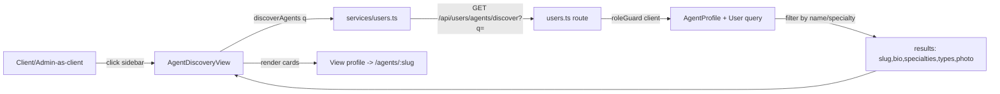

# Plan: Fix Agent Discovery Feature

## Problem

The "Discover Agents" feature (`/app/discover`) is non-functional. A client clicking the sidebar link lands on [`AgentDiscoveryView.vue`](src/views/client/AgentDiscoveryView.vue), but [`searchAgents()`](src/views/client/AgentDiscoveryView.vue:29) is a stub that always returns an empty array:

```ts
// TODO: Replace with actual API call when agent discovery endpoint is available
agents.value = []
```

There is **no backend endpoint** for agent discovery/search. The existing [`GET /api/users/network`](src/server/routes/users.ts:182) only returns `id/firstName/lastName/email` (no bio, specialties, slug, or photo) and is meant for assignment dropdowns, not discovery.

## Admin / Role Handling (already correct — no change needed)

- [`auth.ts`](src/server/middleware/auth.ts:38) swaps `auth.role` to the `X-View-As-Role` header value for admins, so `roleGuard('client')` passes when an admin views as client.
- [`api.ts`](src/services/api.ts:24) automatically sends `X-View-As-Role` from localStorage.
- [`router/index.ts`](src/router/index.ts:372) uses `hasRole` (effective role) for non-admin routes, so admins viewing as client can reach `/app/discover`.

Therefore admins acting as clients will be able to use discovery once the endpoint + view are wired.

## Architecture



## Changes

### 1. Backend: `GET /api/users/agents/discover` — [`src/server/routes/users.ts`](src/server/routes/users.ts)

Add a new route **before** the existing `/agents/:slug` route (so the static `discover` path isn't captured by the `:slug` param).

- Middleware: `authenticate()`, `roleGuard('client')` (admin view-as-client passes via `X-View-As-Role`).
- Query params:
  - `q` (optional) — search string matched against agent first/last name (ILIKE) and specialties (JSON array contains).
  - `clientType` (optional) — `B2B` | `B2C` | `Both` to filter `acceptedClientTypes`.
  - `limit` / `offset` (optional, defaults 20/0, capped at 100).
- Query: `AgentProfile.findAll` with `include: [{ model: User, as: 'user', attributes: ['id','firstName','lastName'] }]`, `where` built from filters. Only agents with `emailVerified = true` (verified badge in UI).
- Response shape (matches [`DiscoveredAgent`](src/views/client/AgentDiscoveryView.vue:15) interface):
  ```ts
  { id, slug: uniqueInviteSlug, firstName, lastName, bio, specialties, acceptedClientTypes, profilePhotoUrl }
  ```
- Exclude the caller's own profile is N/A (caller is a client, not an agent).

### 2. Frontend service — [`src/services/users.ts`](src/services/users.ts)

Add:
```ts
export function discoverAgents(params?: { q?: string; clientType?: 'B2B'|'B2C'|'Both'; limit?: number; offset?: number }) {
  return get('/users/agents/discover', { params })
}
```

### 3. Frontend view — [`src/views/client/AgentDiscoveryView.vue`](src/views/client/AgentDiscoveryView.vue)

- Replace stub `searchAgents()` to call `discoverAgents({ q: searchQuery.value })` and populate `agents`.
- Add `onMounted` to load all agents initially (empty query) so the page isn't blank.
- Add error handling (`error` ref + toast or inline message).
- Keep existing template (cards, empty state, loading) — already correct.

### 4. i18n — already present

[`agentDiscovery.*`](src/locales/en.json:448) keys exist in en/fr/ar. No new keys required. (Optional: add an `error` key if we show an error message — reuse `common.emptyState` or add `agentDiscovery.error`.)

### 5. Tests (Vitest)

- **Backend** — new `tests/server/routes/users.discover.spec.ts` (follow [`users.avatar.spec.ts`](tests/server/routes/users.avatar.spec.ts) pattern):
  - 401 without auth.
  - 403 for agent role.
  - 200 for client; returns array with expected fields.
  - `q` filters by name and specialty.
  - `clientType` filter works.
  - Admin with `X-View-As-Role: client` header gets 200.
- **Frontend** — update [`tests/components/client/AgentDiscoveryView.spec.ts`](tests/components/client/AgentDiscoveryView.spec.ts):
  - Mock `discoverAgents` (vi.mock `@/services/users`).
  - Assert initial load calls service and renders cards.
  - Assert search triggers service with query.
- **Service** — update [`tests/services/users.spec.ts`](tests/services/users.spec.ts) to cover `discoverAgents`.

### 6. Docs

- Check [`docs/TODO.md`](docs/TODO.md) for a discover checkbox and mark it done if present.
- No `AGENTS.md` structural change (no new router/model).

## Execution Order

1. Add backend route + tests → run `pnpm test users.discover`.
2. Add service function + service test.
3. Wire view + update view test.
4. Run full `pnpm test`.
5. Update TODO.md checkbox.

## Risks / Notes

- Route ordering: `discover` must be declared before `agents/:slug` in Hono (first match wins). Verify in implementation.
- `specialties` is stored as JSON; SQLite/Postgres JSON containment differs — use a portable approach (load then filter in JS, or use Sequelize `Op.contains` for Postgres / fallback). Keep it simple: filter name via ILIKE in DB, filter specialties in JS to stay dialect-agnostic (dev = SQLite).
- No third-party libs; reuse existing `get`/`authenticate`/`roleGuard`/`successResponse`.
