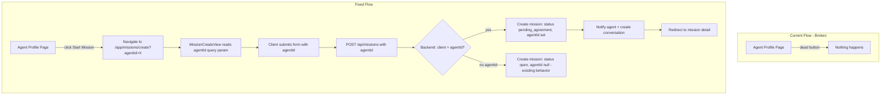

# Plan: Fix Agent Profile Design & "Start a Mission" CTA

## Problem

The Agent Profile page ([`src/views/agent/AgentProfileView.vue`](src/views/agent/AgentProfileView.vue)) accessed via User → Search Agent → Show Profile has two issues:

1. **No styling** — The page uses `ds-agent-profile__*` classes but there are **zero matching CSS rules** in [`src/assets/main.css`](src/assets/main.css). The hero, sections, badges, CTA, and register prompt render completely unstyled.

2. **Dead "Start a Mission" button** — The `<BButton>` at [`AgentProfileView.vue:142`](src/views/agent/AgentProfileView.vue:142) has no `@click` handler, no `to` prop, and no `href`. Clicking it does nothing.

## Confirmed Behavior

The "Start a Mission" button should **navigate to `/app/missions/create` passing the agent's `userId` as a query param**, and the backend should support **client-created missions pre-assigned to a specific agent** (status `pending_agreement` instead of `open`). This minimizes user effort — the agent is pre-selected, no claim step needed.

## Architecture Overview



## Implementation Steps

### Phase 1: Backend — Support client-created missions with pre-assigned agent

#### 1.1 Update `POST /api/missions` client path — [`src/server/routes/missions.ts:112-129`](src/server/routes/missions.ts:112)

Currently the client path always creates `agentId = null`, status `open`. Add support for an optional `agentId`:

- If `body.agentId` is provided AND the authenticated user is a client:
  - Validate the `agentId` refers to a real user with `role: 'agent'` (404 if not found).
  - Run `checkSeatLimit(auth.userId)` — seat limits apply once an agent is assigned (consistent with the claim flow at [`missions.ts:266`](src/server/routes/missions.ts:266)).
  - Create the mission with:
    - `agentId: body.agentId`
    - `clientId: auth.userId`
    - `status: 'pending_agreement'` (skips the open/claim step — goes straight to agreement)
    - `agreedAmount: body.agreedAmount || null` (client's amount becomes the proposed/agreed amount)
    - `proposedAmount: body.agreedAmount || null`
    - `proposedBy: auth.userId`
  - Create the `Conversation` row.
  - Notify the agent: `createNotification(body.agentId, 'mission.created', ...)`.
- If `body.agentId` is NOT provided (existing behavior):
  - Keep current logic: `agentId = null`, status `open`, `proposedAmount`/`proposedBy` set, no conversation, no notification.

This keeps the existing open-mission flow intact while adding the pre-assigned path.

#### 1.2 Update `POST /api/missions/bulk` client path — [`src/server/routes/missions.ts:195-212`](src/server/routes/missions.ts:195)

Apply the same `agentId` logic to bulk client missions for consistency:
- If `entry.agentId` is provided: validate, check seat limit, create with `status: 'pending_agreement'`, create conversation, notify agent.
- If not: existing `open` behavior.

### Phase 2: Frontend Service & Store

#### 2.1 Update `CreateMissionData` interface — [`src/services/missions.ts:10-18`](src/services/missions.ts:10)

Add optional `agentId?: string` to `CreateMissionData`:

```ts
export interface CreateMissionData {
  title: string
  description?: string
  clientId?: string
  agentId?: string          // NEW — for client-created missions pre-assigned to an agent
  pricingType: 'fixed' | 'hourly' | 'task_based'
  agreedAmount?: number
  currency?: string
  agreedChecklist?: string[]
}
```

No store changes needed — `createMission` already passes the data object through.

### Phase 3: Frontend — MissionCreateView (client path with agentId)

#### 3.1 Read `agentId` from query param — [`src/views/missions/MissionCreateView.vue`](src/views/missions/MissionCreateView.vue)

- Import `useRoute` and read `route.query.agentId`.
- Add a reactive `agentId` ref initialized from the query param.
- When `isClient` AND `agentId` is set:
  - Show a read-only display of the selected agent's name (fetch via the existing public profile endpoint or a lightweight lookup). For minimum effort, show the agentId in a disabled input or a small info banner: "Mission will be assigned to this agent."
  - Alternatively, fetch the agent's name using `getAgentProfile` is not ideal (needs slug). Simpler: use the existing `getNetworkUsers('agent')` to populate a dropdown, pre-select the matching agent, and allow changing it. This reuses existing infrastructure.

#### 3.2 Add agent selector for clients — [`MissionCreateView.vue`](src/views/missions/MissionCreateView.vue)

- For clients, add a `<UserSelect role="agent" v-model="agentId">` field (the `UserSelect` component already supports `role="agent"` via [`getNetworkUsers`](src/services/users.ts:59)).
- Pre-select the agent from the query param.
- The field is optional — if left empty, the mission is created as `open` (existing behavior). If selected, it's pre-assigned.

#### 3.3 Update `handleSubmit` — [`MissionCreateView.vue:68-88`](src/views/missions/MissionCreateView.vue:68)

- For clients: include `agentId: agentId.value || undefined` in the `createMission` payload.
- Update the success toast: if `agentId` was set, show "Mission created and sent to the agent for agreement." If not, keep the existing "Mission posted. Waiting for an agent to claim." message.

### Phase 4: Frontend — Fix the AgentProfileView CTA

#### 4.1 Wire up the "Start a Mission" button — [`src/views/agent/AgentProfileView.vue:140-145`](src/views/agent/AgentProfileView.vue:140)

Replace the dead button with a `RouterLink`-backed `BButton`:

```vue
<BButton
  variant="accent"
  size="lg"
  icon="bi-clipboard-plus"
  :to="`/app/missions/create?agentId=${agentProfileStore.publicProfile.user.id}`"
>
  {{ t('agentProfile.view.startMission') }}
</BButton>
```

The `BButton` component already renders as a `<RouterLink>` when `to` is set ([`BButton.vue:29-33`](src/components/base/BButton.vue:29)). The public profile endpoint returns `user.id` ([`users.ts:190`](src/server/routes/users.ts:190)), so it's available in `agentProfileStore.publicProfile.user.id`.

#### 4.2 Guard the CTA for clients only

The "Start a Mission" CTA currently shows for any authenticated non-owner. But mission creation with a pre-assigned agent only makes sense for **clients**. Update the `v-if`:

- Show the "Start a Mission" CTA only when `!isOwnProfile && authStore.isAuthenticated && authStore.hasRole('client')`.
- For authenticated agents viewing another agent's profile, there's no meaningful CTA (agents don't hire agents). Hide it.
- The unauthenticated "Register" CTA stays as-is.

### Phase 5: Frontend — Style the AgentProfileView

#### 5.1 Add scoped styles to [`AgentProfileView.vue`](src/views/agent/AgentProfileView.vue)

Add a `<style scoped>` block with styles for all the `ds-agent-profile__*` classes used in the template. Use the design tokens from [`docs/UI.md`](docs/UI.md) (colors, spacing, radius, typography). Key elements to style:

| Class | Element | Style approach |
|-------|---------|----------------|
| `.ds-agent-profile` | Root container | max-width, margin auto, padding, flex column gap |
| `.ds-agent-profile__hero` | Hero section | flex row, gap, align center, padding, surface bg, radius |
| `.ds-agent-profile__hero-info` | Hero text wrapper | flex column, gap |
| `.ds-agent-profile__name` | Agent name | font-size 2xl/3xl, font-weight 600, text color |
| `.ds-agent-profile__badges` | Badge row | flex row, gap, wrap |
| `.ds-agent-profile__section` | Section cards | margin-top, full width |
| `.ds-agent-profile__bio` | Bio text | text-md, line-height, text-muted |
| `.ds-agent-profile__tags` | Specialty tags | flex row, gap, wrap |
| `.ds-agent-profile__cta` | CTA container | margin-top, flex center |
| `.ds-agent-profile__register-prompt` | Register card | flex column, gap, align center, text-center |
| `.ds-agent-profile__register-text` | Register text | text-muted |
| `.ds-loading` | Loading spinner | flex center, padding, spinner animation |
| `.ds-empty-state` | Not found | flex column center, gap, muted |

Use the existing design tokens (`--ds-surface`, `--ds-border`, `--ds-text`, `--ds-text-muted`, `--ds-accent`, `--ds-radius-lg`, `--ds-space-*`, etc.) for consistency with the rest of the app.

Add responsive rules: hero stacks vertically on mobile (≤768px).

#### 5.2 Reuse existing global styles where possible

The template already references `.ds-loading` and `.ds-empty-state` which have global definitions in [`main.css:1244-1265`](src/assets/main.css:1244) and [`main.css:1756-1773`](src/assets/main.css:1756). Keep using those global classes; only add the `ds-agent-profile__*` specific styles as scoped.

### Phase 6: i18n

#### 6.1 Add new translation keys

Add to all three locale files ([`en.json`](src/locales/en.json), [`fr.json`](src/locales/fr.json), [`ar.json`](src/locales/ar.json)) under `agentProfile.view`:

- `startMissionHint`: "Start a mission with this agent" / "Démarrer une mission avec cet agent" / "ابدأ مهمة مع هذا الوكيل"

Add under `missions.create`:

- `fields.agent`: "Agent" / "Agent" / "الوكيل"
- `fields.agentPlaceholder`: "Select an agent (optional)" / "Sélectionner un agent (facultatif)" / "اختر وكيلًا (اختياري)"
- `fields.agentHint`: "Leave empty to post as an open mission any agent can claim." / "Laisser vide pour publier une mission ouverte que tout agent peut réclamer." / "اتركه فارغًا لنشر مهمة مفتوحة يمكن لأي وكيل المطالبة بها."
- `createdPreAssigned`: "Mission created and sent to the agent for agreement." / "Mission créée et envoyée à l'agent pour accord." / "تم إنشاء المهمة وإرسالها إلى الوكيل للموافقة."

### Phase 7: Tests

#### 7.1 Backend tests — [`tests/server/routes/missions.spec.ts`](tests/server/routes/missions.spec.ts)

Add to the "Client-Initiated Missions" describe block:

- `POST /api/missions - client creates a mission pre-assigned to an agent`:
  - Send `agentId` in the body.
  - Assert status 201, `status: 'pending_agreement'`, `agentId` set, `agreedAmount`/`proposedAmount` set, conversation created.
- `POST /api/missions - client pre-assigns to invalid agentId returns 404`:
  - Send a non-existent agentId. Assert 404.
- `POST /api/missions - client pre-assigns to a non-agent user returns 404/400`:
  - Send another client's id as agentId. Assert error.

#### 7.2 Frontend component test — [`tests/components/agent/AgentProfileView.spec.ts`](tests/components/agent/AgentProfileView.spec.ts)

- Add test: when authenticated as a client and viewing another agent's profile, the "Start a Mission" button renders as a link to `/app/missions/create?agentId=X`.
- Add test: when authenticated as an agent viewing another agent's profile, the "Start a Mission" CTA is NOT shown.
- Update the mock auth store to support `hasRole` returning true for 'client' in the relevant test.

#### 7.3 Frontend component test — `tests/components/missions/MissionCreateView.spec.ts` (create if missing, or add to existing)

- Add test: client path reads `agentId` from query param and pre-selects it.
- Add test: client submit with `agentId` sends it in the payload.

### Phase 8: Verification

- Run `pnpm test` — fix any failures.
- Manually verify: navigate to an agent profile as a client, click "Start a Mission", confirm redirect to create page with agent pre-selected, submit, confirm mission created with `pending_agreement` status.
- Verify the agent profile page is now visually styled (hero, sections, CTA).
- Update [`docs/TODO.md`](docs/TODO.md) if there's a relevant checkbox.

## Files to Modify

| File | Changes |
|------|---------|
| [`src/server/routes/missions.ts`](src/server/routes/missions.ts) | Client path: optional `agentId` → `pending_agreement` mission; bulk path same |
| [`src/services/missions.ts`](src/services/missions.ts) | Add `agentId?` to `CreateMissionData` |
| [`src/views/missions/MissionCreateView.vue`](src/views/missions/MissionCreateView.vue) | Read `agentId` query param, add agent selector for clients, include in submit |
| [`src/views/agent/AgentProfileView.vue`](src/views/agent/AgentProfileView.vue) | Wire CTA to RouterLink with agentId, guard for clients only, add scoped styles |
| [`src/locales/en.json`](src/locales/en.json) | New i18n keys |
| [`src/locales/fr.json`](src/locales/fr.json) | New i18n keys |
| [`src/locales/ar.json`](src/locales/ar.json) | New i18n keys |
| [`tests/server/routes/missions.spec.ts`](tests/server/routes/missions.spec.ts) | Tests for pre-assigned client missions |
| [`tests/components/agent/AgentProfileView.spec.ts`](tests/components/agent/AgentProfileView.spec.ts) | Tests for CTA link + client-only visibility |

## Files to Create

| File | Purpose |
|------|---------|
| `tests/components/missions/MissionCreateView.spec.ts` (if not exists) | Tests for agentId query param handling |

## Risks & Mitigations

1. **Seat limit at creation** — Pre-assigning an agent means the seat limit must be checked at creation time (not claim time). This is consistent with the agent-initiated flow ([`missions.ts:85-88`](src/server/routes/missions.ts:85)). If the client has reached their seat limit, return 403 with a clear message.

2. **Backward compatibility** — The existing open-mission flow (no `agentId`) is unchanged. Clients who don't pass `agentId` still get `open` missions. No migration needed.

3. **Agent validation** — Must verify the `agentId` refers to a user with `role: 'agent'` to prevent clients from assigning missions to other clients or admins. Return 404 if the agent user doesn't exist or isn't an agent.

4. **Notification & conversation** — Pre-assigned missions need a conversation row and agent notification (unlike open missions which have no agent to notify yet). This matches the agent-initiated flow pattern.
