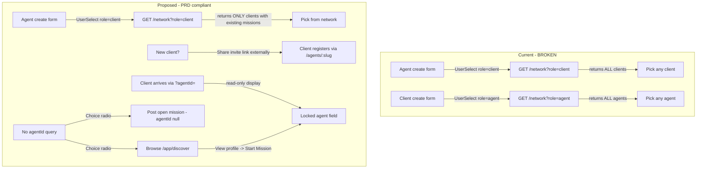

# Plan: Fix Mission Counterparty Discovery (Private Network Model)

## Problem

[`MissionCreateView.vue`](src/views/missions/MissionCreateView.vue:113) exposes a [`UserSelect`](src/components/common/UserSelect.vue:1) dropdown for **both** roles that lists **every** user of the opposite role via [`GET /api/users/network`](src/server/routes/users.ts:256). This turns the mission create form into a global user picker, violating the PRD's "Private Network" model ([`docs/PRD-v0.md:6-13`](docs/PRD-v0.md:6)) which states discovery must happen only via (a) the agent's invite link or (b) the client's "Discover Agents" feature.

The [`/network`](src/server/routes/users.ts:252) endpoint comment even admits it: *"ALL clients are returned, not only those with existing missions."*

## Goal

Enforce the PRD's private-network model:
- **Agents** can only create missions for clients in their **actual network** (clients with whom they have at least one existing mission). New clients must be onboarded via the invite link ([`InviteLinkShare.vue`](src/components/agent/InviteLinkShare.vue:1)).
- **Clients** never browse a dropdown of all agents. They either (a) arrive from discovery/invite link with `?agentId=` pre-filled, or (b) post an **open mission** for any agent to claim.
- No regressions: all existing tests pass; backend mission-creation paths (agent, client pre-assigned, client open) remain intact.

## Architecture (current vs. proposed)



## Design Decisions

1. **`/network` becomes relationship-based** — When an agent requests `role=client`, return only clients who have at least one mission with that agent. When a client requests `role=agent`, return only agents with whom they have at least one mission (for re-assignment convenience). This is the core fix.
2. **Client create form: remove the agent `UserSelect`** — Replace with a read-only locked display when `?agentId=` is present, or a choice between "Post open mission" and "Browse agents" when no `agentId` is present.
3. **Agent create form: keep `UserSelect` but it now reflects the real network** — No frontend change needed beyond the backend `/network` fix; the dropdown will naturally show only network clients. Add an empty-state hint pointing to the invite link when the network is empty.
4. **No backend mission-creation logic changes** — The `POST /missions` agent path (requires `clientId`), client pre-assigned path (requires valid `agentId`), and client open path (`agentId = null`) all remain unchanged. Only the `/network` endpoint and the frontend form change.
5. **`UserSelect` component stays** — It's still used by the agent create form (now backed by the fixed `/network`). The client create form no longer uses it.

## Implementation Steps

### Phase 1: Backend — Fix `/network` endpoint

#### 1.1 Update [`GET /api/users/network`](src/server/routes/users.ts:256)

Change the endpoint to be relationship-based:

- **Agent requesting `role=client`**: Return only clients who have at least one mission where `agentId = auth.userId`. Query: `Mission.findAll({ where: { agentId: auth.userId }, attributes: ['clientId'], group: ['clientId'] })` then fetch those users.
- **Client requesting `role=agent`**: Return only agents who have at least one mission where `clientId = auth.userId`. Same pattern, reversed.
- Remove the "return all users" behavior.
- Keep the response shape (`id`, `firstName`, `lastName`, `email`) unchanged so [`UserSelect.vue`](src/components/common/UserSelect.vue:1) doesn't need changes.

**File:** [`src/server/routes/users.ts`](src/server/routes/users.ts:256) — replace lines 252-281.

### Phase 2: Frontend — Fix client create form

#### 2.1 Update [`MissionCreateView.vue`](src/views/missions/MissionCreateView.vue)

**Remove the agent `UserSelect` (lines 123-130)** and replace with role-aware logic:

- Add a computed `preAssignedAgentId` from `route.query.agentId`.
- If `isClient`:
  - If `preAssignedAgentId` is present: show a **read-only** display of the agent's name (fetched via a new lightweight call — see 2.2), with a "Choose a different agent" link to `/app/discover`. Keep `agentId` ref set to the query value.
  - If no `preAssignedAgentId`: show a **radio choice**:
    - Option A: "Post an open mission (any agent can claim)" — sets `agentId = ''`, mission will be created with `agentId = null`, status `open`.
    - Option B: "Browse agents to assign" — a link/button to `/app/discover` (does not submit; navigates away).
- If `isAgent`: keep the existing `UserSelect role="client"` (now backed by the fixed `/network`).
- Update `handleSubmit`:
  - Client path: if `agentId` is set (from query), send `agentId` (existing pre-assigned path). If not set, send no `agentId` (existing open path).
  - The existing `missionsStore.createMission` already handles both via `agentId: isClient.value && agentId.value ? agentId.value : undefined` — keep this logic.
- Update validation: `clientId` required only for agents (already the case). No new required fields for clients.

**File:** [`src/views/missions/MissionCreateView.vue`](src/views/missions/MissionCreateView.vue:113) — replace lines 113-130 and adjust script.

#### 2.2 Add agent name fetch for read-only display

When the client arrives with `?agentId=<id>`, we need to display the agent's name. Options:
- **Option A (recommended):** Reuse the existing [`GET /api/users/agents/:slug`](src/server/routes/users.ts:168) — but we have the user `id`, not the `slug`. The invite-link/discovery flow passes `agentId` (the user id), not the slug.
- **Option B:** Add a minimal `GET /api/users/:id` endpoint returning `id, firstName, lastName, role` for any authenticated user. This is useful generally and avoids over-fetching.
- **Option C (simplest, no new endpoint):** The `AgentProfileView.vue` CTA already navigates with `?agentId=${agentProfileStore.publicProfile.user.id}`. We can add a new backend route `GET /api/users/agents/by-id/:id` that returns minimal public info (firstName, lastName) for an agent by user id. Or extend the existing `/agents/:slug` to also accept numeric ids.

**Decision: Option B** — Add `GET /api/users/:id` returning `{ id, firstName, lastName, role }` (public-safe minimal fields). Add a service function `getUserById(id)` in [`src/services/users.ts`](src/services/users.ts). Use it in `MissionCreateView` to fetch and display the pre-assigned agent's name in a read-only field.

**Files:**
- [`src/server/routes/users.ts`](src/server/routes/users.ts) — add `GET /:id` route (authenticated, returns minimal public fields).
- [`src/services/users.ts`](src/services/users.ts) — add `getUserById(id)`.
- [`src/views/missions/MissionCreateView.vue`](src/views/missions/MissionCreateView.vue) — fetch and display agent name on mount when `agentId` query is present.

### Phase 3: i18n

#### 3.1 Add new keys to all three locale files

Add to `missions.create` in [`en.json`](src/locales/en.json:548), [`fr.json`](src/locales/fr.json), [`ar.json`](src/locales/ar.json):

```json
"assignmentMode": "Assignment",
"assignmentOpen": "Post as open mission",
"assignmentOpenHint": "Any agent can discover and claim this mission.",
"assignmentBrowse": "Browse agents to assign",
"assignmentBrowseHint": "Find an agent through discovery, then start a mission from their profile.",
"browseAgents": "Browse Agents",
"changeAgent": "Choose a different agent",
"selectedAgent": "Selected Agent",
"noNetworkClients": "You have no clients in your network yet. Share your invite link to onboard a new client.",
"shareInviteLink": "Share Invite Link"
```

**Files:** [`src/locales/en.json`](src/locales/en.json:548), [`src/locales/fr.json`](src/locales/fr.json), [`src/locales/ar.json`](src/locales/ar.json).

### Phase 4: Tests

#### 4.1 Backend — Update/add [`tests/server/routes/missions.spec.ts`](tests/server/routes/missions.spec.ts)

No changes needed to existing mission route tests — the `POST /missions` behavior is unchanged. Verify all existing tests still pass.

#### 4.2 Backend — New test file [`tests/server/routes/users.network.spec.ts`](tests/server/routes/users.network.spec.ts)

Test the fixed `/network` endpoint:
- Agent requests `role=client` → returns only clients with existing missions with this agent.
- Agent with no missions → returns empty array.
- Client requests `role=agent` → returns only agents with existing missions with this client.
- Client with no missions → returns empty array.
- Unauthenticated → 401.
- Response shape: `{ id, firstName, lastName, email }`.

Follow the pattern in [`tests/server/routes/users.discover.spec.ts`](tests/server/routes/users.discover.spec.ts:1).

#### 4.3 Backend — New test for `GET /api/users/:id`

Add to [`tests/server/routes/users.network.spec.ts`](tests/server/routes/users.network.spec.ts) or a new `users.spec.ts`:
- Returns minimal fields for a valid user id.
- 404 for non-existent id.
- 401 without auth.

#### 4.4 Frontend — New test [`tests/components/missions/MissionCreateView.spec.ts`](tests/components/missions/MissionCreateView.spec.ts)

Currently no test exists for `MissionCreateView`. Add one:
- **Agent role:** renders `UserSelect` for client; mocks `getNetworkUsers` to return network clients; asserts dropdown populated.
- **Client role with `?agentId=`:** renders read-only agent name display; mocks `getUserById`; asserts name shown; asserts no agent dropdown.
- **Client role without `?agentId=`:** renders assignment-mode radio (open vs. browse); asserts "Browse Agents" link points to `/app/discover`.
- **Submit as client (open):** asserts `createMission` called with no `agentId`.
- **Submit as client (pre-assigned):** asserts `createMission` called with `agentId`.
- **Submit as agent:** asserts `createMission` called with `clientId`.

Mock `@/services/users` (`getNetworkUsers`, `getUserById`) and `@/stores/missions` (`createMission`).

#### 4.5 Frontend — Update [`tests/services/users.spec.ts`](tests/services/users.spec.ts)

Add test for `getUserById(id)` calling `GET /users/:id`.

#### 4.6 Check and test

##### 4.6.1 check translations value

```bash
pnpm i18n:sync
```

##### 4.6.2 Type check

```bash
pnpm lint
```

##### 4.6.3 Run full test suite

```bash
pnpm test
```

All tests must pass. Fix any regressions.

### Phase 5: Verification & Cleanup

- Verify the agent create form dropdown only shows network clients (not all clients).
- Verify the client create form no longer shows an agent dropdown.
- Verify a client arriving from `/agents/:slug` "Start Mission" CTA sees the agent's name locked in.
- Verify a client with no `agentId` can choose to post an open mission.
- Verify open missions still appear in the agent's mission list and can be claimed.
- Update [`docs/TODO.md`](docs/TODO.md) if there's a relevant checkbox.
- No `AGENTS.md` structural changes (no new routers/models).

## Files to Create

| File | Purpose |
|------|---------|
| `tests/server/routes/users.network.spec.ts` | Tests for fixed `/network` + new `/:id` endpoint |
| `tests/components/missions/MissionCreateView.spec.ts` | Tests for role-aware create form |

## Files to Modify

| File | Changes |
|------|---------|
| [`src/server/routes/users.ts`](src/server/routes/users.ts) | Fix `/network` to be relationship-based; add `GET /:id` |
| [`src/services/users.ts`](src/services/users.ts) | Add `getUserById(id)` |
| [`src/views/missions/MissionCreateView.vue`](src/views/missions/MissionCreateView.vue) | Remove client agent `UserSelect`; add read-only agent display + assignment-mode radio |
| [`src/locales/en.json`](src/locales/en.json) | New i18n keys |
| [`src/locales/fr.json`](src/locales/fr.json) | New i18n keys |
| [`src/locales/ar.json`](src/locales/ar.json) | New i18n keys |
| [`tests/services/users.spec.ts`](tests/services/users.spec.ts) | Add `getUserById` test |

## Files NOT Changed (verified unaffected)

- [`src/server/routes/missions.ts`](src/server/routes/missions.ts) — mission creation logic unchanged.
- [`src/stores/missions.ts`](src/stores/missions.ts) — `createMission` already handles optional `agentId`.
- [`src/services/missions.ts`](src/services/missions.ts) — `CreateMissionData` already has optional `agentId`.
- [`src/components/common/UserSelect.vue`](src/components/common/UserSelect.vue) — still used by agent form; no change needed.
- [`src/views/missions/MissionListView.vue`](src/views/missions/MissionListView.vue) — already handles `open` status and unassigned display.
- [`src/views/missions/MissionDetailView.vue`](src/views/missions/MissionDetailView.vue) — claim flow already implemented.
- [`src/router/index.ts`](src/router/index.ts) — `missions/create` already allows `['agent', 'client']`.

## Risks & Mitigations

1. **Agent with empty network can't create missions** — This is intentional per PRD (must onboard via invite link). Add an empty-state hint in the `UserSelect` or below it pointing to the invite link. The agent can still access [`InviteLinkShare.vue`](src/components/agent/InviteLinkShare.vue:1) from their profile/settings.

2. **Existing tests that rely on `/network` returning all users** — Searched tests; no test currently asserts `/network` behavior. The only `/network` consumer is [`UserSelect.vue`](src/components/common/UserSelect.vue:1) used in `MissionCreateView`. Safe to change.

3. **Client pre-assigned path still works** — The `?agentId=` flow from [`AgentProfileView.vue:146`](src/views/agent/AgentProfileView.vue:146) is unchanged; we only change how the form *displays* the pre-assigned agent (read-only vs. dropdown).

4. **`GET /api/users/:id` route ordering** — Must be declared **after** specific routes like `/me`, `/network`, `/agents/discover`, `/agents/:slug`, `/agents/me`, `/clients/me` to avoid the `:id` param capturing those paths. Place it near the end of the router, or use a regex constraint to ensure `:id` is numeric.

## Execution Order

1. Backend: fix `/network` endpoint + add `GET /:id` route.
2. Backend tests: add `users.network.spec.ts`; run `pnpm test users.network`.
3. Frontend service: add `getUserById`; update service test.
4. Frontend view: update `MissionCreateView.vue` (remove client agent dropdown, add read-only display + radio).
5. i18n: add new keys to en/fr/ar.
6. Frontend tests: add `MissionCreateView.spec.ts`.
7. Run full `pnpm test` — fix any failures.
8. Update `docs/TODO.md` if applicable.
