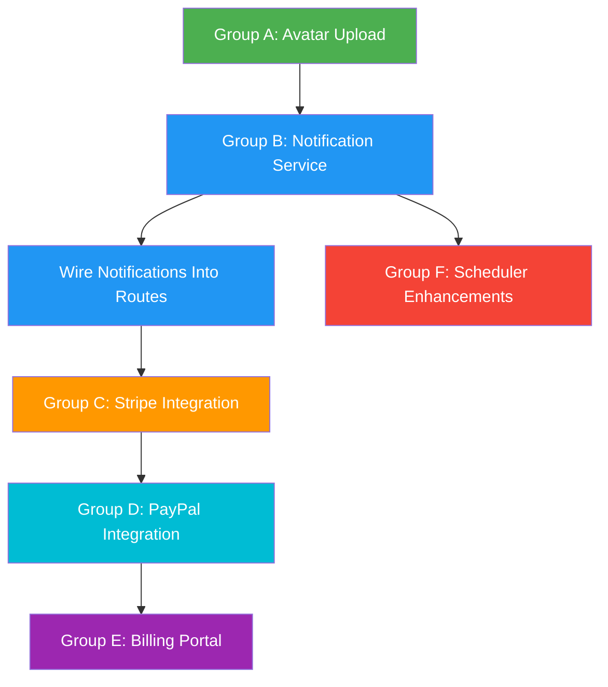

# Plan: Complete Remaining Section 3 Tasks

**Date:** 2026-06-20
**Status:** Draft

## Scope

All unchecked items from `docs/TODO.md` sections 3c–3m, organized into implementable groups.

---

## Architecture Decision: `better-auth`

**Decision:** Keep the existing custom auth system.

**Rationale:**
- `better-auth` has no Sequelize adapter — only supports Prisma, Drizzle, Mongoose, Kysely
- Custom auth is deeply embedded: 120+ middleware usages across 12 route files
- 4 custom auth models with migrations already in place
- 15+ tests validate the current auth flow
- Switching would require a massive rewrite with no functional benefit at this stage

---

## Group A: Avatar Upload (3c)

### A1. `POST /api/users/me/avatar`

**Approach:** Use Hono's built-in `c.req.parseBody()` for multipart form data. Store the file on disk (local dev) or object storage (production). Update `AgentProfile.profilePhotoUrl` or `User` accordingly.

**File changes:**
- **Modify:** [`src/server/routes/users.ts`](src/server/routes/users.ts) — add avatar upload endpoint
- **Create:** `src/server/utils/fileStorage.ts` — abstraction for file storage (local disk for dev, configurable for production)
- **Create:** `tests/server/routes/users.avatar.spec.ts` — tests for avatar upload

**Implementation details:**
```
POST /api/users/me/avatar
  - authenticate() middleware
  - Parse multipart body with c.req.parseBody()
  - Validate file type: image/jpeg, image/png, image/webp only
  - Validate max size: 5MB
  - Generate unique filename: {userId}-{timestamp}.{ext}
  - Save to uploads/avatars/ directory
  - Update user's AgentProfile.profilePhotoUrl
  - Return the new URL
  - Delete old avatar file if replacing
```

**Add to .gitignore:** `uploads/`

---

## Group B: Notification Service (3k)

### B1. Create notification service utility

**Create:** `src/server/services/notification.ts`

**Implementation details:**
```typescript
// Service with helper functions for creating notifications
createNotification(userId, type, title, body, data?)
bulkCreateNotifications(userIds[], type, title, body, data?)
```

**Notification types to define:**
```typescript
type NotificationType =
  | 'mission.created'
  | 'mission.agreed'
  | 'mission.status_changed'
  | 'mission.completed'
  | 'mission.cancelled'
  | 'message.received'
  | 'payment.recorded'
  | 'payment.confirmed'
  | 'payment.failed'
  | 'dispute.created'
  | 'dispute.resolved'
  | 'dispute.escalated'
  | 'subscription.activated'
  | 'subscription.cancelled'
  | 'subscription.plan_changed'
  | 'recurrence.mission_generated'
  | 'invoice.generated'
```

### B2. Wire notification creation into existing routes

**Modify the following route files to trigger notifications on key events:**

| Route file | Event | Notification |
|-----------|-------|-------------|
| [`missions.ts`](src/server/routes/missions.ts) | Mission created | `mission.created` to client |
| [`missions.ts`](src/server/routes/missions.ts) | Mission agreed | `mission.agreed` to agent + client |
| [`missions.ts`](src/server/routes/missions.ts) | Status changed | `mission.status_changed` to other party |
| [`missions.ts`](src/server/routes/missions.ts) | Mission cancelled | `mission.cancelled` to other party |
| [`messages.ts`](src/server/routes/messages.ts) | Message sent | `message.received` to recipient |
| [`payments.ts`](src/server/routes/payments.ts) | Payment recorded | `payment.recorded` to payee |
| [`payments.ts`](src/server/routes/payments.ts) | Payment confirmed | `payment.confirmed` to both parties |
| [`disputes.ts`](src/server/routes/disputes.ts) | Dispute created | `dispute.created` to other party |
| [`disputes.ts`](src/server/routes/disputes.ts) | Dispute resolved | `dispute.resolved` to both parties |
| [`disputes.ts`](src/server/routes/disputes.ts) | Dispute escalated | `dispute.escalated` to both parties + admins |
| [`subscriptions.ts`](src/server/routes/subscriptions.ts) | Subscription activated | `subscription.activated` |
| [`subscriptions.ts`](src/server/routes/subscriptions.ts) | Subscription cancelled | `subscription.cancelled` |

**Key principle:** Notifications are fire-and-forget — failures should log but never block the main operation.

---

## Group C: Stripe Integration (3h)

### C1. Implement real Stripe Connect OAuth flow

**Modify:** [`src/server/routes/stripe.ts`](src/server/routes/stripe.ts:9)

**Implementation details:**
```typescript
POST /api/payments/stripe/connect
  - Check STRIPE_SECRET_KEY configured
  - Get agent's AgentProfile (check for existing stripeAccountId)
  - If no account: create Stripe Express account via stripe.accounts.create()
  - Generate account link via stripe.accountLinks.create()
  - Store stripeAccountId on AgentProfile
  - Return redirect URL for agent onboarding
```

**Model change:** AgentProfile needs `stripeAccountId` field
- **Modify:** `src/server/database/models/index.ts` — add `stripeAccountId: string | null` to AgentProfile
- **Modify:** `src/server/database/migrations/` — new migration to add column

### C2. Implement Stripe checkout session creation

**Modify:** [`src/server/routes/stripe.ts`](src/server/routes/stripe.ts:26)

**Implementation details:**
```typescript
POST /api/payments/stripe/create-checkout-session
  - Validate missionId and amount in body
  - Validate mission exists and user is authorized
  - Get mission details for success/cancel URLs
  - Create Stripe Checkout Session via stripe.checkout.sessions.create()
  - Include platform fee via application_fee_amount
  - Return session URL for client redirect
```

### C3. Implement Stripe webhook handler

**Modify:** [`src/server/routes/stripe.ts`](src/server/routes/stripe.ts:44)

**Implementation details:**
```typescript
POST /api/payments/stripe/webhook
  - Read raw body for signature verification
  - Verify signature with stripe.webhooks.constructEvent()
  - Handle event types:
    - checkout.session.completed → update Payment status to confirmed
    - payment_intent.succeeded → update Payment status
    - payment_intent.payment_failed → update Payment status to failed
    - account.updated → update agent's stripe connection status
  - Return 200 immediately (async processing)
```

**Important:** Webhook endpoint must NOT use JSON body parser — needs raw body.

### C4. Update payment provider for real Stripe

**Modify:** [`src/server/services/payment/stripeProvider.ts`](src/server/services/payment/stripeProvider.ts)

Replace stubbed implementation with real Stripe SDK calls.

---

## Group D: PayPal Integration (3h)

### D1. Implement real PayPal integration

**Modify:** [`src/server/routes/paypal.ts`](src/server/routes/paypal.ts)

**Implementation details:**
```
POST /api/payments/paypal/setup
  - Check PAYPAL_CLIENT_ID + PAYPAL_CLIENT_SECRET configured
  - Create PayPal client instance
  - Return setup/onboarding URL

POST /api/payments/paypal/create-order
  - Validate missionId and amount
  - Create PayPal order via paypal-server-sdk
  - Return approval URL for client redirect

POST /api/payments/paypal/webhook
  - Verify webhook signature
  - Handle event types: PAYMENT.CAPTURE.COMPLETED, etc.
  - Update Payment status in database

GET /api/payments/paypal/status
  - Check agent's PayPal connection status
```

### D2. Update payment provider for real PayPal

**Modify:** [`src/server/services/payment/paypalProvider.ts`](src/server/services/payment/paypalProvider.ts)

Replace stubbed implementation with real PayPal SDK calls.

---

## Group E: Subscription Billing Portal (3i)

### E1. Stripe billing portal integration

**Modify:** [`src/server/routes/subscriptions.ts`](src/server/routes/subscriptions.ts)

**Implementation details:**
```typescript
POST /api/subscriptions/me/portal
  - authenticate() + roleGuard('client')
  - Get client's subscription with stripeSubscriptionId
  - Create Stripe billing portal session via stripe.billingPortal.sessions.create()
  - Return portal URL for redirect
```

**Note:** This depends on C1-C3 being complete since subscriptions need Stripe subscription IDs.

---

## Group F: Scheduler Enhancements (3m)

### F1. Stale mission cleanup / status transitions

**Modify:** [`netlify/functions/scheduler.ts`](netlify/functions/scheduler.ts)

**Implementation details:**
```
Stale mission detection:
  - Missions in 'draft' status older than 7 days → auto-cancel
  - Missions in 'pending_agreement' status older than 30 days → auto-cancel
  - Missions in 'in_progress' status older than 90 days → flag for review (create notification)

Status transitions:
  - Check for missions where both parties have agreed but status is still 'pending_agreement'
  - Auto-transition to 'agreed'
```

### F2. Invoice generation for agents on billing cycle end

**Modify:** [`netlify/functions/scheduler.ts`](netlify/functions/scheduler.ts)

**Implementation details:**
```
On scheduler run:
  - Find all agents with confirmed payments in the current billing cycle
  - Group payments by agent and calculate total platform fees
  - If periodEnd is reached:
    - Create Invoice record with totalFees
    - If agent has outstanding fees (insufficient credits), mark as 'sent'
    - If agent has sufficient credits, auto-deduct and mark as 'paid'
    - Create notification for agent
```

### F3. Notification dispatch for upcoming recurrent missions

**Modify:** [`netlify/functions/scheduler.ts`](netlify/functions/scheduler.ts)

**Implementation details:**
```
Before creating recurrent missions:
  - Find configs where nextRunAt is within the next 24 hours
  - Send reminder notification to agent and client
  - Title: "Upcoming recurring mission: {title}"
  - Body: "A recurring mission is scheduled to run tomorrow"
```

---

## Implementation Order



**Rationale for order:**
1. **Avatar (A)** — Simple, self-contained, no cross-cutting concerns
2. **Notification Service (B)** — Foundation needed before Stripe/PayPal (they create notifications)
3. **Wire Notifications (E)** — Integrates into existing routes, no new route files
4. **Stripe (C)** — Most complex, needs notification service from B
5. **PayPal (D)** — Parallel to Stripe, same patterns
6. **Billing Portal (E)** — Depends on Stripe subscriptions existing
7. **Scheduler (F)** — Uses notification service, can be done in parallel with C/D

---

## TDD Approach

For each group:
1. **Write tests first** using the existing test patterns (see [`tests/server/routes/`](tests/server/routes/) for examples)
2. **Implement the feature** to make tests pass
3. **Refactor** if needed
4. **Run full suite** to verify no regressions

**Test patterns to follow:**
- Register user in `beforeAll` to get auth token
- Use `app.request()` for endpoint testing
- Mock Stripe/PayPal SDK calls where needed
- Clean up test data in `beforeAll`

---

## Files to Create

| File | Purpose |
|------|---------|
| `src/server/services/notification.ts` | Notification creation service |
| `src/server/utils/fileStorage.ts` | File upload/storage utility |
| `src/server/database/migrations/20260620000000-add-stripe-fields.cjs` | Add stripeAccountId to agent_profiles |
| `tests/server/routes/users.avatar.spec.ts` | Avatar upload tests |
| `tests/server/services/notification.spec.ts` | Notification service tests |
| `tests/server/utils/fileStorage.spec.ts` | File storage tests |
| `tests/server/routes/stripe.real.spec.ts` | Real Stripe integration tests |
| `tests/server/routes/paypal.real.spec.ts` | Real PayPal integration tests |
| `tests/server/routes/subscriptions.portal.spec.ts` | Billing portal tests |
| `tests/server/scheduler.spec.ts` | Scheduler enhancement tests |

## Files to Modify

| File | Changes |
|------|---------|
| `src/server/routes/users.ts` | Add avatar upload endpoint |
| `src/server/routes/stripe.ts` | Replace stubs with real implementation |
| `src/server/routes/paypal.ts` | Replace stubs with real implementation |
| `src/server/routes/subscriptions.ts` | Add billing portal endpoint |
| `src/server/routes/missions.ts` | Add notification triggers |
| `src/server/routes/messages.ts` | Add notification triggers |
| `src/server/routes/payments.ts` | Add notification triggers |
| `src/server/routes/disputes.ts` | Add notification triggers |
| `src/server/database/models/index.ts` | Add stripeAccountId to AgentProfile |
| `src/server/services/payment/stripeProvider.ts` | Real Stripe implementation |
| `src/server/services/payment/paypalProvider.ts` | Real PayPal implementation |
| `netlify/functions/scheduler.ts` | Stale cleanup, invoices, recurrence notifications |
| `docs/TODO.md` | Update checkboxes |
| `.gitignore` | Add uploads/ |
| `.env.example` | Update with any new env vars if needed |

## Environment Variables

All needed env vars already exist in `.env.example`:
- `STRIPE_SECRET_KEY` ✓
- `STRIPE_WEBHOOK_SECRET` ✓
- `STRIPE_PUBLISHABLE_KEY` ✓
- `PAYPAL_CLIENT_ID` ✓
- `PAYPAL_CLIENT_SECRET` ✓
- `PAYPAL_MODE` ✓

New optional env var:
- `UPLOAD_DIR` — Override upload directory (default: `./uploads`)
- `MAX_AVATAR_SIZE` — Max file size in bytes (default: 5242880 / 5MB)
