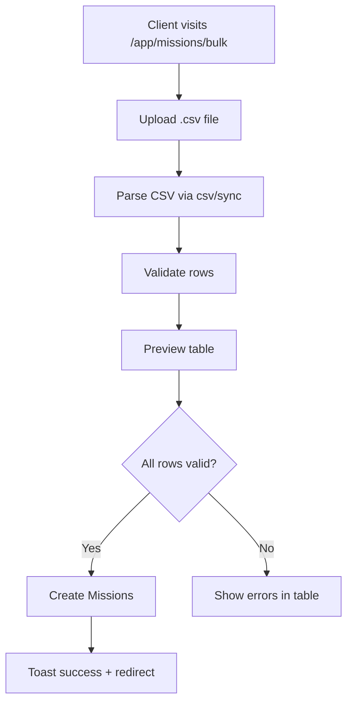

# Plan: Remove `exceljs` and revert Bulk Create to CSV-only

## Context

The `/app/missions/bulk` route crashed in the browser with
`TypeError: import_util.default.inherits is not a function` because `exceljs`
ships a Node entry that uses Node core modules (`util.inherits`, `stream`, …)
which Vite cannot polyfill. A first attempt aliased `exceljs` to its browser
bundle, but the user has decided to drop `exceljs` entirely and revert to the
original CSV-only design (matching `plans/section-9-csv-bulk-missions.md`'s
"CSV-only" intent and the pricing copy "Bulk CSV mission creation").

## Goal

Bulk mission creation supports **CSV only** (parse + template download). All
`exceljs` code, dependencies, config aliases, and tests are removed. The
existing `csv` package (`csv/sync`) remains for parsing.

## Affected Files

| File | Change |
|------|--------|
| [`package.json`](package.json:37) | Remove `"exceljs": "^4.4.0"` from `dependencies` |
| [`vite.config.mts`](vite.config.mts:12) | Remove the `exceljs` alias + comment block |
| [`vitest.config.ts`](vitest.config.ts:10) | Remove the `exceljs` alias + comment block |
| [`src/views/missions/BulkMissionCreateView.vue`](src/views/missions/BulkMissionCreateView.vue:6) | Remove `import ExcelJS`; remove XLSX parse branch; remove `downloadXlsxTemplate()`; CSV-only accept + validation; update template hint |
| [`src/locales/en.json`](src/locales/en.json:655) | Update `missions.bulk` keys: subtitle, errorFileFormat → CSV-only; remove `downloadTemplateXlsx` |
| [`src/locales/ar.json`](src/locales/ar.json:947) | Same key updates (ar) |
| [`src/locales/fr.json`](src/locales/fr.json:947) | Same key updates (fr) |
| [`tests/components/missions/BulkMissionCreateView.spec.ts`](tests/components/missions/BulkMissionCreateView.spec.ts:22) | Remove the `vi.mock('exceljs', …)` block; remove XLSX-template button assertion |
| [`tests/components/missions/BulkMissionCreateView.exceljs.spec.ts`](tests/components/missions/BulkMissionCreateView.exceljs.spec.ts:1) | **Delete** this file (no longer relevant once exceljs is gone) |
| [`skills/exceljs/SKILL.md`](skills/exceljs/SKILL.md:1) | **Delete** the exceljs skill directory (no longer used) |
| [`plans/section-9-csv-bulk-missions.md`](plans/section-9-csv-bulk-missions.md:26) | Update dependency table + remove XLSX references (doc accuracy) |

## Step-by-step

### 1. Remove the `exceljs` dependency
- Edit [`package.json`](package.json:37): delete the `"exceljs": "^4.4.0"` line.
- Run `pnpm remove exceljs` (or `pnpm install` after editing) to update
  `pnpm-lock.yaml`.

### 2. Revert Vite config aliases
- [`vite.config.mts`](vite.config.mts:12): remove the `exceljs:` alias line and
  the multi-line comment block explaining it. Keep the `@` alias.
- [`vitest.config.ts`](vitest.config.ts:10): remove the `exceljs:` alias line
  and its comment block. Keep the `@` alias.

### 3. Simplify `BulkMissionCreateView.vue` to CSV-only
In [`src/views/missions/BulkMissionCreateView.vue`](src/views/missions/BulkMissionCreateView.vue:1):
- Delete `import ExcelJS from 'exceljs'` (line 6).
- In `handleFile()`:
  - Change accepted extensions check to `['csv']` only.
  - Remove the `else` branch that loads XLSX via `ExcelJS.Workbook` (lines
    115–140). Keep the CSV `parse(text, …)` branch.
  - Update the error toast for invalid format to reference CSV only.
- Delete the entire `downloadXlsxTemplate()` function (lines 175–211).
- In the template:
  - Remove the "Download XLSX Template" `<BButton>` (lines 254–256).
  - Change `FileUpload` `accept=".csv,.xlsx,.xls"` → `accept=".csv"`.
  - Update the hint span `CSV, XLSX, XLS` → `CSV`.

### 4. Update i18n locale files
For each of `en.json`, `ar.json`, `fr.json` under `missions.bulk`:
- `subtitle`: "Upload a CSV file to create multiple missions at once." (drop
  "or XLSX").
- `errorFileFormat`: "Please upload a CSV file" (drop "or XLSX").
- Remove the `downloadTemplateXlsx` key entirely.
- Leave `downloadTemplateCsv`, `upload`, and all other keys unchanged.

### 5. Update tests
- [`tests/components/missions/BulkMissionCreateView.spec.ts`](tests/components/missions/BulkMissionCreateView.spec.ts:22):
  - Delete the `vi.mock('exceljs', …)` block (lines 22–45).
  - Remove the assertion that expects "Download XLSX Template" text (lines
    104–108 region). Keep the "Download CSV Template" assertion.
- Delete [`tests/components/missions/BulkMissionCreateView.exceljs.spec.ts`](tests/components/missions/BulkMissionCreateView.exceljs.spec.ts:1)
  (the regression test for the browser-bundle alias is obsolete once exceljs is
  removed).

### 6. Remove the exceljs skill
- Delete the directory [`skills/exceljs/`](skills/exceljs/SKILL.md:1) (no longer
  referenced by any code).

### 7. Update the CSV bulk plan doc
- [`plans/section-9-csv-bulk-missions.md`](plans/section-9-csv-bulk-missions.md:26):
  remove `exceljs` from the dependency table and the XLSX parsing/template
  sections so the doc reflects the CSV-only implementation.

### 8. Add a regression test for CSV-only behavior
In [`tests/components/missions/BulkMissionCreateView.spec.ts`](tests/components/missions/BulkMissionCreateView.spec.ts:1):
- Add a test asserting the `FileUpload` component is rendered with
  `accept=".csv"` (no xlsx/xls).
- Add a test asserting `handleFile` rejects a `.xlsx` file with the
  `errorFileFormat` toast (guards against accidentally re-adding XLSX support
  without a browser-safe library).
- Add a test asserting `downloadCsvTemplate()` produces a Blob with
  `text/csv` content type and the expected headers.

### 9. Verify
- Run `pnpm test` (Vitest) — all existing tests + new CSV-only tests pass.
- Run `pnpm build` — production build succeeds with no `exceljs` in the
  output chunks (the `BulkMissionCreateView` chunk should shrink dramatically).
- Manually navigate to `/app/missions/bulk` as a `client` — page loads, CSV
  upload + template download work, no console errors.

## Mermaid — Bulk Create flow after change

## Risks / Notes
- No DB migration needed — bulk creation API is unchanged.
- `csv` package (`csv/sync`) is already a dependency and works in the browser
  via Vite's existing handling (no Node core modules).
- Removing `exceljs` reduces the `BulkMissionCreateView` chunk from ~983 kB to a
  small size, improving load performance.
- The pricing copy "Bulk CSV mission creation" already matches the CSV-only
  direction, so no marketing/locale changes are needed there.
