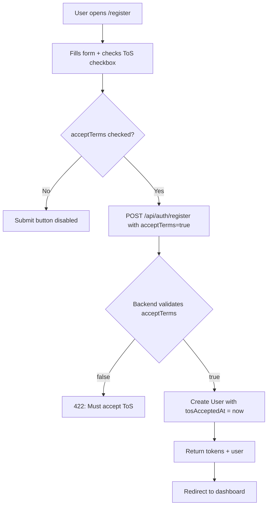

# Section 10 — Legal & Compliance

> Plan for implementing the Legal & Compliance tasks from [`docs/TODO.md`](../docs/TODO.md) Section 10.
> Per user instruction: if we don't touch code, just check translations and type checking at the end — no full test run (too slow).

---

## Overview

Section 10 has 6 unchecked items:

1. Draft Terms of Service document — explicitly stating Dossiat is a software provider, not an employer, financial institution, or legal representative
2. Create Privacy Policy document
3. Add ToS acceptance checkbox to user registration flow
4. Add ToS/Privacy Policy links in footer and registration page
5. Implement data retention policies per Enterprise tier custom rules
6. Ensure GDPR compliance (data export, account deletion)

---

## Architecture Decisions

### Legal Pages Approach
- Create **static Vue views** for Terms of Service and Privacy Policy (not markdown files) — consistent with the existing app architecture (Vue + i18n).
- Content stored in **i18n locale files** so the legal pages are translatable (EN/FR/AR).
- Routes: `/terms` and `/privacy` — public, no auth required.
- Reuse the existing `AuthLayout.vue` shell (centered card) or a simple standalone layout for legal pages.

### ToS Acceptance
- **Database**: Add `tosAcceptedAt` (DATE, nullable) column to `users` table via a new migration.
- **Model**: Update `User` model in [`src/server/database/models/index.ts`](../src/server/database/models/index.ts) with the new field.
- **Backend**: `POST /api/auth/register` must accept a `acceptTerms: boolean` field and reject registration if `false`. Store `tosAcceptedAt = new Date()` on the user record.
- **Frontend**: Add a checkbox + link to [`src/views/auth/RegisterView.vue`](../src/views/auth/RegisterView.vue). Disable submit button until checked. Pass `acceptTerms` in the register payload.
- **Store/Service**: Update [`src/services/auth.ts`](../src/services/auth.ts) `RegisterParams` and [`src/stores/auth.ts`](../src/stores/auth.ts) `register()` to include `acceptTerms`.

### Footer & Registration Links
- Update [`src/views/LandingPage.vue`](../src/views/LandingPage.vue) footer — replace `href="#"` on Terms/Privacy with `RouterLink` to `/terms` and `/privacy`.
- Update [`src/views/auth/RegisterView.vue`](../src/views/auth/RegisterView.vue) — add inline links to ToS and Privacy Policy in the checkbox label.

### Data Retention (Enterprise tier)
- Document the retention policy in the Privacy Policy page (configurable retention period for Enterprise tier).
- Add a `dataRetentionDays` field to `SubscriptionPlan` features JSON (Enterprise tier) — used by the scheduler to purge old mission data. **Minimal implementation**: document the policy and add a config constant; full scheduler purge logic is out of scope for this section (belongs to scheduler enhancements).

### GDPR Compliance
- **Data Export**: `GET /api/users/me/export` — returns a JSON bundle of all user data (profile, missions, messages, payments, disputes). Add to [`src/server/routes/users.ts`](../src/server/routes/users.ts).
- **Account Deletion**: `DELETE /api/users/me` — soft-delete (anonymize PII, keep records for audit) or hard-delete depending on active missions. Add to [`src/server/routes/users.ts`](../src/server/routes/users.ts).
- **Frontend**: Add "Export my data" and "Delete my account" buttons in [`src/views/settings/SettingsView.vue`](../src/views/settings/SettingsView.vue) under a new "Data & Privacy" section.

---

## Implementation Steps

### Step 1 — Migration: Add `tosAcceptedAt` to users
- **File**: `src/server/database/migrations/20260713000000-add-tos-acceptance.cjs`
- Add `tos_accepted_at` DATE nullable column to `users` table.
- Down: remove the column.

### Step 2 — Model: Update User model
- **File**: [`src/server/database/models/index.ts`](../src/server/database/models/index.ts)
- Add `tosAcceptedAt: Date | null` to `UserModel` and `User` class.
- Add to `User.init()` column definition.

### Step 3 — Backend: Register endpoint accepts ToS
- **File**: [`src/server/routes/auth.ts`](../src/server/routes/auth.ts)
- Add `acceptTerms: validators.required()` to the register validation.
- Validate `acceptTerms === true`, else throw 422 "You must accept the Terms of Service".
- Set `tosAcceptedAt: new Date()` on `User.create()`.

### Step 4 — Backend: GDPR endpoints (data export + account deletion)
- **File**: [`src/server/routes/users.ts`](../src/server/routes/users.ts)
- `GET /me/export` — authenticate, gather user profile, agent/client profile, missions (as agent + client), messages, payments, disputes, notifications. Return as JSON.
- `DELETE /me` — authenticate, check no active missions (status in_progress/pending_agreement/agreed). If clear: anonymize PII (set firstName/lastName to "Deleted User", email to `deleted+<id>@dossiat.invalid`, clear passwordHash, revoke all tokens). Return success.

### Step 5 — Frontend Service & Store: Update register params
- **File**: [`src/services/auth.ts`](../src/services/auth.ts) — add `acceptTerms: boolean` to `RegisterParams`.
- **File**: [`src/stores/auth.ts`](../src/stores/auth.ts) — add `acceptTerms` to `register()` params and pass through.
- **File**: [`src/services/users.ts`](../src/services/users.ts) — add `exportMyData()` and `deleteMyAccount()` functions.

### Step 6 — Frontend: Register view ToS checkbox
- **File**: [`src/views/auth/RegisterView.vue`](../src/views/auth/RegisterView.vue)
- Add `acceptTerms` ref (default `false`).
- Add checkbox with i18n label linking to `/terms` and `/privacy`.
- Disable submit button unless `acceptTerms === true`.
- Pass `acceptTerms` to `authStore.register()`.

### Step 7 — Frontend: Legal views (Terms + Privacy)
- **File**: `src/views/legal/TermsView.vue` — static ToS content from i18n keys.
- **File**: `src/views/legal/PrivacyView.vue` — static Privacy Policy content from i18n keys.
- Both use a simple readable layout (container, prose styling).

### Step 8 — Router: Add legal routes
- **File**: [`src/router/index.ts`](../src/router/index.ts)
- Add `/terms` → `TermsView.vue` (public, no auth).
- Add `/privacy` → `PrivacyView.vue` (public, no auth).

### Step 9 — Frontend: Footer links
- **File**: [`src/views/LandingPage.vue`](../src/views/LandingPage.vue)
- Replace `<a href="#">{{ t('footer.terms') }}</a>` with `<RouterLink to="/terms">{{ t('footer.terms') }}</RouterLink>`.
- Same for privacy and cookies (cookies can point to privacy for now).

### Step 10 — Frontend: Settings data & privacy section
- **File**: [`src/views/settings/SettingsView.vue`](../src/views/settings/SettingsView.vue)
- Add a "Data & Privacy" card with "Export my data" (triggers download) and "Delete my account" (confirm dialog → calls API → logout).

### Step 11 — i18n: Add legal translation keys
- **File**: [`src/locales/en.json`](../src/locales/en.json) — add `legal` section with `terms.*` and `privacy.*` keys, plus `auth.register.acceptTerms`, `auth.register.acceptTermsHint`, `settings.dataPrivacy.*`.
- **File**: [`src/locales/fr.json`](../src/locales/fr.json) — same keys, French translations.
- **File**: [`src/locales/ar.json`](../src/locales/ar.json) — same keys, Arabic translations.
- Run `pnpm i18n:sync` to validate all locales match.

### Step 12 — Update TODO & AGENTS docs
- **File**: [`docs/TODO.md`](../docs/TODO.md) — check off the 6 Section 10 items.
- **File**: [`AGENTS.md`](../AGENTS.md) — note new legal routes and GDPR endpoints if structure changes.

### Step 13 — Verify (no full tests)
- Run `pnpm i18n:sync` — confirm all locales in sync.
- Run `pnpm lint` (vue-tsc --noEmit) — confirm no type errors.
- Skip `pnpm test` per user instruction (too slow, and we're not touching existing test-covered logic beyond adding optional fields).

---

## Mermaid Diagram — Registration ToS Flow



---

## GDPR Data Export Shape

```json
{
  "user": { "id", "email", "firstName", "lastName", "role", "emailVerified", "tosAcceptedAt", "createdAt" },
  "agentProfile": { ... } | null,
  "clientProfile": { ... } | null,
  "missions": [ { ...mission, counterparty, payments, messages } ],
  "payments": [ ... ],
  "disputes": [ ... ],
  "notifications": [ ... ]
}
```

---

## Account Deletion Rules

- **Block** if user has missions with status `pending_agreement`, `agreed`, or `in_progress` → return 409 "Cannot delete account with active missions".
- **Allow** if no active missions → anonymize PII:
  - `firstName` = "Deleted"
  - `lastName` = "User"
  - `email` = `deleted+<id>@dossiat.invalid`
  - `passwordHash` = random hash (prevents login)
  - Revoke all refresh tokens
- Historical records (completed/cancelled missions, payments, disputes) are **retained** for audit trail but no longer linked to identifiable PII.

---

## Files to Create

| File | Purpose |
|------|---------|
| `src/server/database/migrations/20260713000000-add-tos-acceptance.cjs` | Migration for `tos_accepted_at` |
| `src/views/legal/TermsView.vue` | Terms of Service page |
| `src/views/legal/PrivacyView.vue` | Privacy Policy page |

## Files to Modify

| File | Change |
|------|--------|
| `src/server/database/models/index.ts` | Add `tosAcceptedAt` to User model |
| `src/server/routes/auth.ts` | Validate `acceptTerms` on register |
| `src/server/routes/users.ts` | Add `GET /me/export` and `DELETE /me` |
| `src/services/auth.ts` | Add `acceptTerms` to `RegisterParams` |
| `src/services/users.ts` | Add `exportMyData()` and `deleteMyAccount()` |
| `src/stores/auth.ts` | Pass `acceptTerms` through register |
| `src/views/auth/RegisterView.vue` | Add ToS checkbox + links |
| `src/views/LandingPage.vue` | Footer links to /terms and /privacy |
| `src/views/settings/SettingsView.vue` | Data & Privacy section |
| `src/router/index.ts` | Add `/terms` and `/privacy` routes |
| `src/locales/en.json` | Legal + register + settings keys |
| `src/locales/fr.json` | Same keys, French |
| `src/locales/ar.json` | Same keys, Arabic |
| `docs/TODO.md` | Check off Section 10 items |

---

## Out of Scope (deferred)

- Email sending for data export / deletion confirmation (email transport is stubbed project-wide).
- Full scheduler purge job for Enterprise data retention (documented in Privacy Policy; implementation belongs to scheduler section).
- Cookie policy as a separate page (cookies link points to Privacy Policy for now).
- DPA (Data Processing Agreement) page — Enterprise-only, can be added later.
