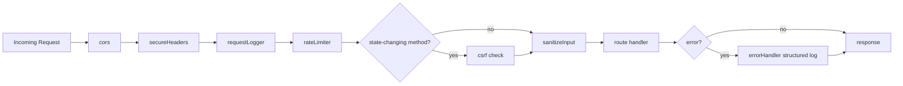

# Section 12 — Performance & Security

> Plan for completing [`docs/TODO.md`](docs/TODO.md) §12 "Performance & Security".
> Goal: keep it **relatively simple** — small, focused middleware/util additions, no new third-party deps unless already available, and tests for the new behavior.

---

## Current State Assessment

| TODO item | Status | Notes |
|-----------|--------|-------|
| Input sanitization (XSS) | ❌ Missing | No sanitization layer; raw `c.req.json()` bodies flow into DB |
| SQL injection prevention | ✅ Effectively done | All queries use Sequelize ORM (parameterized). Document & verify no raw queries exist |
| CSRF protection | ❌ Missing | Auth is Bearer-token based (stateless), so CSRF risk is low; add double-submit token for any cookie-based flows + `SameSite` notes |
| Secure HTTP headers | ❌ Missing | No Helmet equivalent; Hono ships `secureHeaders` built-in |
| Pagination on all list endpoints | ⚠️ Partial | [`missions`](src/server/routes/missions.ts), [`disputes`](src/server/routes/disputes.ts), [`notifications`](src/server/routes/notifications.ts), [`admin`](src/server/routes/admin.ts) paginated. Unbounded: [`payments.ts`](src/server/routes/payments.ts) (list + transactions + invoices), [`messages.ts`](src/server/routes/messages.ts) (conversations, thread), [`recurrence.ts`](src/server/routes/recurrence.ts), [`subscriptions.ts`](src/server/routes/subscriptions.ts) (invoices) |
| DB query optimization | ⚠️ Partial | Most queries use `attributes` excludes; add `select only needed columns` audit + `limit` caps |
| File upload size/type validation | ⚠️ Partial | Avatar upload in [`users.ts`](src/server/routes/users.ts:464) validates MIME + size. Mission attachments in [`missions.ts`](src/server/routes/missions.ts:559) accept raw JSON `fileUrl` (no actual upload). Centralize a helper |
| JWT token rotation + secure storage | ✅ Rotation done | [`auth.ts`](src/server/routes/auth.ts:149) refresh rotates the stored token. Storage is client-side (localStorage) — document httpOnly cookie option |
| Application logging | ⚠️ Partial | Hono `logger()` middleware logs requests; [`errorHandler.ts`](src/server/middleware/errorHandler.ts:14) uses `console.error`. Add structured logger |
| Health check endpoint | ⚠️ Partial | [`index.ts`](src/server/index.ts:28) has basic `/api/health`. Enhance with DB ping + uptime |

---

## Implementation Plan

### Step 1 — Secure HTTP Headers Middleware

**File:** [`src/server/middleware/secureHeaders.ts`](src/server/middleware/secureHeaders.ts) (new)

Use Hono's built-in `secureHeaders` (no new dependency — ships with `hono`).

```ts
import { secureHeaders } from 'hono/secure-headers'
export { secureHeaders }
```

Wire into [`src/server/index.ts`](src/server/index.ts):
```ts
app.use('*', secureHeaders())
```

This adds: `X-Content-Type-Options: nosniff`, `X-Frame-Options: DENY`, `Referrer-Policy`, etc.

**TODO item covered:** "Implement secure HTTP headers (Helmet or equivalent for Hono)"

---

### Step 2 — Input Sanitization Middleware (XSS Prevention)

**File:** [`src/server/middleware/sanitize.ts`](src/server/middleware/sanitize.ts) (new)

A lightweight middleware that recursively strips HTML tags from string values in parsed JSON bodies. No third-party dep — uses a regex-based tag stripper. Applied globally after body parsing.

```ts
export function sanitizeBody() {
  return async (c: Context, next: Next) => {
    // Only sanitize JSON bodies; formData handled by upload validation
    const ct = c.req.header('content-type') || ''
    if (!ct.includes('application/json')) return next()
    // Buffer the raw body, sanitize, re-inject via c.req.bodyCache
    ...
    await next()
  }
}
```

Approach: read raw body via `c.req.raw.text()`, `JSON.parse`, walk strings and replace `<[^>]*>` with `''`, then store back so downstream `c.req.json()` returns sanitized data. Use Hono's `c.req.bodyCache` if available, otherwise set a `c.set('sanitizedBody', ...)` and provide a helper `getSanitizedBody(c)`.

To keep it simple and avoid Hono internals fragility, expose a helper `sanitizeString(s)` and a middleware that sets `c.set('rawBody', text)`; route handlers use `getJsonBody(c)` helper instead of `c.req.json()`. **Simpler alternative:** just add `sanitizeString` to [`validators`](src/server/middleware/validateRequest.ts) and apply in `validateRequest` for string fields. This is the least invasive.

**Decision:** Extend [`validateRequest`](src/server/middleware/validateRequest.ts) with a `sanitize: boolean` option that strips tags from validated string fields before passing to validators. Add a global `sanitizeInput` middleware for non-validated routes.

**TODO item covered:** "Implement input sanitization on all API endpoints (prevent XSS)"

---

### Step 3 — CSRF Protection

Since auth is **Bearer-token based** (stateless, no cookies), traditional CSRF is not exploitable. We implement a lightweight defense-in-depth:

**File:** [`src/server/middleware/csrf.ts`](src/server/middleware/csrf.ts) (new)

- Require `X-Requested-With: XMLHttpRequest` header on all state-changing methods (POST/PUT/PATCH/DELETE).
- Reject requests with `Content-Type: text/plain` or `application/x-www-form-urlencoded` carrying JSON-like bodies (defense against CSRF content-type confusion).

Wire globally in [`src/server/index.ts`](src/server/index.ts) after `cors()`.

**TODO item covered:** "Add CSRF protection for form submissions"

---

### Step 4 — Pagination on Remaining List Endpoints

Audit and add `page`/`limit` (capped at 100) to:

| Route file | Endpoint | Action |
|-----------|----------|--------|
| [`payments.ts`](src/server/routes/payments.ts) | `GET /api/missions/:id/payments` | Add pagination |
| [`payments.ts`](src/server/routes/payments.ts) | `GET /api/agents/me/credit-transactions` | Add pagination |
| [`payments.ts`](src/server/routes/payments.ts) | `GET /api/agents/me/invoices` | Add pagination |
| [`messages.ts`](src/server/routes/messages.ts) | `GET /api/missions/:id/messages` | Already paginated via `findAndCountAll` — verify |
| [`messages.ts`](src/server/routes/messages.ts) | `GET /api/messages/conversations` | Add pagination |
| [`recurrence.ts`](src/server/routes/recurrence.ts) | `GET /api/recurrence` | Add pagination |
| [`subscriptions.ts`](src/server/routes/subscriptions.ts) | `GET /api/subscriptions/me/invoices` | Add pagination |

Use existing [`paginatedResponse`](src/server/utils/apiResponse.ts:27) helper. Cap `limit` at 100, default 20.

**TODO item covered:** "Implement pagination on all list endpoints to prevent unbounded queries"

---

### Step 5 — File Upload Validation Helper (Centralized)

**File:** [`src/server/utils/uploadValidation.ts`](src/server/utils/uploadValidation.ts) (new)

Extract the avatar validation logic from [`users.ts`](src/server/routes/users.ts:13) into a reusable helper:

```ts
export const ALLOWED_IMAGE_TYPES = ['image/jpeg', 'image/png', 'image/webp']
export const DEFAULT_MAX_AVATAR_SIZE = 5 * 1024 * 1024

export function validateFileUpload(file: File, opts: {
  allowedTypes?: string[]
  maxSize?: number
}): { valid: boolean; error?: string }
```

Refactor [`users.ts`](src/server/routes/users.ts) avatar route to use it. Add validation to mission attachments route ([`missions.ts`](src/server/routes/missions.ts:559)) for when real uploads are wired (currently accepts `fileUrl` JSON — add `fileType`/`fileSize` validation against allowlist).

**TODO item covered:** "Implement image/file upload size limits and type validation"

---

### Step 6 — JWT Token Rotation & Secure Storage (Document)

Token rotation is **already implemented** in [`auth.ts`](src/server/routes/auth.ts:149) (refresh issues a new token and rotates the stored record).

Action: Document the secure storage recommendation in [`docs/DEVELOPMENT.md`](docs/DEVELOPMENT.md) — note that access tokens should be stored in memory (not localStorage) and refresh tokens in httpOnly cookies or secure storage. Add a note in [`ARCHITECTURE.md`](ARCHITECTURE.md) auth section.

**TODO item covered:** "Implement JWT token rotation and secure storage (httpOnly cookies or secure storage)"

---

### Step 7 — Structured Application Logging

**File:** [`src/server/middleware/requestLogger.ts`](src/server/middleware/requestLogger.ts) (new)

Replace/augment Hono's `logger()` with a structured logger that emits JSON lines:

```ts
export function requestLogger() {
  return async (c: Context, next: Next) => {
    const start = Date.now()
    await next()
    const ms = Date.now() - start
    const log = {
      method: c.req.method,
      path: c.req.path,
      status: c.res.status,
      ms,
      ip: c.req.header('x-forwarded-for') || 'unknown',
      ts: new Date().toISOString(),
    }
    console.log(JSON.stringify(log))
  }
}
```

Update [`errorHandler.ts`](src/server/middleware/errorHandler.ts) to emit structured error logs (JSON with `level`, `message`, `stack`, `status`).

Wire in [`src/server/index.ts`](src/server/index.ts) replacing `logger()`.

**TODO item covered:** "Set up application logging (structured logs for debugging and audit)"

---

### Step 8 — Enhanced Health Check

**File:** [`src/server/index.ts`](src/server/index.ts) (edit)

Replace the basic health check with one that pings the DB:

```ts
app.get('/api/health', async (c) => {
  try {
    await sequelize.authenticate()
    return c.json({ status: 'ok', db: 'connected', uptime: process.uptime(), timestamp: new Date().toISOString() })
  } catch (err) {
    return c.json({ status: 'degraded', db: 'disconnected', error: 'db unreachable' }, 503)
  }
})
```

**TODO item covered:** "Implement health check endpoint for monitoring"

---

### Step 9 — SQL Injection Prevention (Verify & Document)

All queries use Sequelize ORM (parameterized). Action: grep for `sequelize.query` raw calls; if none, document in [`ARCHITECTURE.md`](ARCHITECTURE.md) that raw queries are prohibited and all DB access must go through model methods.

**TODO item covered:** "Implement SQL injection prevention (Sequelize parameterized queries)"

---

### Step 10 — DB Query Optimization (Audit)

Audit existing queries for:
- `attributes` selection (avoid `SELECT *`)
- Eager loading only where needed
- `limit` caps on unbounded `findAll`

Most queries already use `attributes: { exclude: ['passwordHash'] }` or explicit attribute lists. Add `limit` caps where missing (covered by Step 4 pagination).

**TODO item covered:** "Add database query optimization (eager loading, select only needed columns)"

---

### Step 11 — Tests

**File:** [`tests/server/middleware/security.spec.ts`](tests/server/middleware/security.spec.ts) (new)

Tests for:
- `secureHeaders` middleware sets expected headers
- `sanitizeInput` strips `<script>` tags from body strings
- CSRF middleware rejects POST without `X-Requested-With` header
- Enhanced health check returns `db: connected` and uptime
- Upload validation helper rejects oversized / wrong-type files
- Pagination caps `limit` at 100

**TODO item covered:** Testing (project rule: Vitest, all tests pass before push)

---

### Step 12 — Update Docs

- Check off all 10 items in [`docs/TODO.md`](docs/TODO.md) §12
- Update [`AGENTS.md`](AGENTS.md) if new middleware/routes added (per project rule)
- Add security notes to [`docs/DEVELOPMENT.md`](docs/DEVELOPMENT.md)

---

## File Change Summary

| File | Action | Purpose |
|------|--------|---------|
| `src/server/middleware/secureHeaders.ts` | New | Re-export Hono `secureHeaders` |
| `src/server/middleware/sanitize.ts` | New | XSS input sanitization |
| `src/server/middleware/csrf.ts` | New | CSRF defense-in-depth |
| `src/server/middleware/requestLogger.ts` | New | Structured JSON logging |
| `src/server/utils/uploadValidation.ts` | New | Centralized file upload validation |
| `src/server/index.ts` | Edit | Wire new middleware + enhanced health check |
| `src/server/middleware/errorHandler.ts` | Edit | Structured error logging |
| `src/server/middleware/validateRequest.ts` | Edit | Add `sanitize` option |
| `src/server/routes/payments.ts` | Edit | Add pagination to 3 endpoints |
| `src/server/routes/messages.ts` | Edit | Add pagination to conversations list |
| `src/server/routes/recurrence.ts` | Edit | Add pagination |
| `src/server/routes/subscriptions.ts` | Edit | Add pagination to invoices |
| `src/server/routes/users.ts` | Edit | Use upload validation helper |
| `tests/server/middleware/security.spec.ts` | New | Tests for new middleware |
| `docs/TODO.md` | Edit | Check off §12 items |
| `docs/DEVELOPMENT.md` | Edit | JWT storage + security notes |
| `ARCHITECTURE.md` | Edit | Document security middleware + raw query prohibition |

---

## Mermaid — Request Pipeline After Changes



---

## Scope Boundaries (Keeping It Simple)

- **No new third-party dependencies** — uses Hono built-ins (`secureHeaders`) and Node stdlib only.
- **No httpOnly cookie auth refactor** — current Bearer-token auth stays; secure storage is documented as a recommendation.
- **No raw query audit rewrite** — just verify none exist and document the rule.
- **No query perf benchmarking** — audit + caps only.
- **Pagination** uses the existing [`paginatedResponse`](src/server/utils/apiResponse.ts:27) helper; no new pagination utility.
