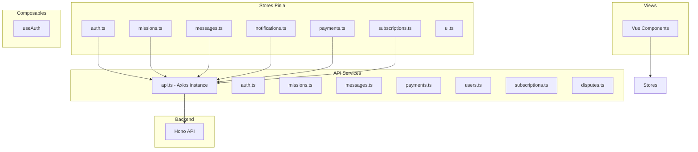

# Plan: Section 4a–4b — Frontend API Services & Pinia Stores

## Overview

Implement the API client layer and Pinia state management for the Dossiat frontend using a **TDD approach**. Tests are written first, then implementation follows to make them pass.

---

## Architecture

---

## TDD Workflow Per Module

For each service/store:

1. **Red** — Write test file with failing tests
2. **Green** — Implement minimal code to pass
3. **Refactor** — Clean up while keeping tests green

---

## Step-by-Step Plan

### Phase 1: API Client Foundation (4a)

#### 1. `src/services/api.ts` — Axios Instance

**Tests first:** `tests/services/api.spec.ts`
- Mock axios module
- Test base URL configuration from env
- Test auth interceptor attaches Authorization header
- Test error interceptor handles 401 and attempts token refresh
- Test error interceptor retries original request after refresh
- Test non-401 errors propagate normally

**Implementation:**
- Create axios instance with `baseURL` from `import.meta.env.VITE_API_BASE_URL`
- Request interceptor: attach `Bearer` token from localStorage
- Response interceptor: on 401, call refresh endpoint, update tokens, retry
- Export typed helper functions: `get<T>`, `post<T>`, `put<T>`, `del<T>`

#### 2. `src/services/auth.ts` — Auth API

**Tests first:** `tests/services/auth.spec.ts`
- Test `login()` calls POST `/api/auth/login` with credentials
- Test `register()` calls POST `/api/auth/register` with form data
- Test `logout()` calls POST `/api/auth/logout`
- Test `refreshToken()` calls POST `/api/auth/refresh`
- Test `forgotPassword()` calls POST `/api/auth/forgot-password`
- Test `resetPassword()` calls POST `/api/auth/reset-password`
- Test `verifyEmail()` calls GET `/api/auth/verify-email/:token`
- Test `resendVerification()` calls POST `/api/auth/resend-verification`

**Implementation:**
- Export each function that calls the corresponding API endpoint via `api` instance

#### 3. `src/services/missions.ts` — Mission API

**Tests first:** `tests/services/missions.spec.ts`
- Test `getMissions(params)` — GET `/api/missions` with query params
- Test `createMission(data)` — POST `/api/missions`
- Test `getMission(id)` — GET `/api/missions/:id`
- Test `updateMission(id, data)` — PUT `/api/missions/:id`
- Test `deleteMission(id)` — DELETE `/api/missions/:id`
- Test `agreeMission(id)` — POST `/api/missions/:id/agree`
- Test `updateMissionStatus(id, status)` — PUT `/api/missions/:id/status`
- Test `uploadAttachment(id, file)` — POST `/api/missions/:id/attachments`
- Test `getAttachments(id)` — GET `/api/missions/:id/attachments`

**Implementation:**
- Export each function wrapping the `api` instance calls

#### 4. `src/services/messages.ts` — Messaging API

**Tests first:** `tests/services/messages.spec.ts`
- Test `getMessages(missionId)` — GET `/api/missions/:id/messages`
- Test `sendMessage(missionId, content)` — POST `/api/missions/:id/messages`
- Test `markAsRead(messageId)` — POST `/api/messages/:id/read`
- Test `getUnreadCount()` — GET `/api/messages/unread-count`

#### 5. `src/services/payments.ts` — Payment API

**Tests first:** `tests/services/payments.spec.ts`
- Test `getPayments(missionId)` — GET `/api/missions/:id/payments`
- Test `recordPayment(missionId, data)` — POST `/api/missions/:id/payments`
- Test `confirmPayer(paymentId)` — POST `/api/payments/:id/confirm-payer`
- Test `confirmPayee(paymentId)` — POST `/api/payments/:id/confirm-payee`
- Test `getCreditBalance()` — GET `/api/agents/me/credits`
- Test `purchaseCredits(amount)` — POST `/api/agents/me/credits/purchase`
- Test `getCreditTransactions()` — GET `/api/agents/me/credit-transactions`
- Test `getInvoices()` — GET `/api/agents/me/invoices`

#### 6. `src/services/users.ts` — User API

**Tests first:** `tests/services/users.spec.ts`
- Test `getMe()` — GET `/api/users/me`
- Test `updateMe(data)` — PUT `/api/users/me`
- Test `changePassword(data)` — PUT `/api/users/me/password`
- Test `uploadAvatar(file)` — POST `/api/users/me/avatar`
- Test `getAgentProfile(slug)` — GET `/api/agents/:slug`
- Test `updateAgentProfile(data)` — PUT `/api/agents/me`
- Test `getClientProfile()` — GET `/api/clients/me`
- Test `updateClientProfile(data)` — PUT `/api/clients/me`

#### 7. `src/services/subscriptions.ts` — Subscription API

**Tests first:** `tests/services/subscriptions.spec.ts`
- Test `getPlans()` — GET `/api/subscriptions/plans`
- Test `subscribe(planId)` — POST `/api/subscriptions`
- Test `getMySubscription()` — GET `/api/subscriptions/me`
- Test `updateSubscription(planId)` — PUT `/api/subscriptions/me`
- Test `cancelSubscription()` — DELETE `/api/subscriptions/me`

#### 8. `src/services/disputes.ts` — Dispute API

**Tests first:** `tests/services/disputes.spec.ts`
- Test `getDisputes()` — GET `/api/disputes`
- Test `getDispute(id)` — GET `/api/disputes/:id`
- Test `sendMessage(disputeId, content)` — POST `/api/disputes/:id/messages`
- Test `resolveDispute(id, resolution)` — PUT `/api/disputes/:id/resolve`
- Test `escalateDispute(id)` — PUT `/api/disputes/:id/escalate`

---

### Phase 2: Pinia Stores (4b)

#### 9. `src/stores/auth.ts` — Auth Store

**Tests first:** `tests/stores/auth.spec.ts`
- Test initial state (no user, no tokens)
- Test `login()` action — calls auth service, stores user + tokens in state and localStorage
- Test `register()` action — calls auth service, stores user + tokens
- Test `logout()` action — calls auth service, clears state and localStorage
- Test `refreshTokens()` action — refreshes tokens from localStorage
- Test `loadUser()` — restores user from localStorage on app init
- Test computed `isAuthenticated` — true when tokens exist
- Test computed `currentUser` — returns user object
- Test computed `hasRole()` — role check helper

**Implementation:**
- Pinia store using composition API (`defineStore` with setup function)
- State: `user`, `accessToken`, `refreshToken`, `loading`, `error`
- Actions: `login`, `register`, `logout`, `refreshTokens`, `loadUser`
- Getters: `isAuthenticated`, `currentUser`, `hasRole`

#### 10. `src/stores/missions.ts` — Missions Store

**Tests first:** `tests/stores/missions.spec.ts`
- Test initial state (empty list, no filters, no current mission)
- Test `fetchMissions()` — loads missions list from API
- Test `fetchMission(id)` — loads single mission details
- Test `createMission(data)` — creates and appends to list
- Test `updateMission(id, data)` — updates mission in list
- Test `deleteMission(id)` — removes from list
- Test computed `filteredMissions` — applies status/type filters
- Test computed `activeMissions` — missions with status in_progress or agreed

#### 11. `src/stores/messages.ts` — Messages Store

**Tests first:** `tests/stores/messages.spec.ts`
- Test `fetchMessages(missionId)` — loads messages for a mission
- Test `sendMessage(missionId, content)` — sends and appends message
- Test `markAsRead(messageId)` — marks message as read
- Test `fetchUnreadCount()` — loads unread count
- Test computed `unreadCount` — returns count

#### 12. `src/stores/notifications.ts` — Notifications Store

**Tests first:** `tests/stores/notifications.spec.ts`
- Test `fetchNotifications()` — loads notifications list
- Test `markAsRead(id)` — marks single notification as read
- Test `markAllAsRead()` — marks all as read
- Test computed `unreadCount` — count of unread notifications

#### 13. `src/stores/payments.ts` — Payments Store

**Tests first:** `tests/stores/payments.spec.ts`
- Test `fetchPayments(missionId)` — loads payments for mission
- Test `fetchCreditBalance()` — loads credit balance
- Test `fetchInvoices()` — loads invoice list

#### 14. `src/stores/subscriptions.ts` — Subscriptions Store

**Tests first:** `tests/stores/subscriptions.spec.ts`
- Test `fetchPlans()` — loads available plans
- Test `fetchMySubscription()` — loads current subscription
- Test computed `currentPlan` — returns active plan details

#### 15. `src/stores/ui.ts` — UI Store

**Tests first:** `tests/stores/ui.spec.ts`
- Test `sidebarCollapsed` toggle
- Test `setLoading(key, value)` — global loading state
- Test computed `isLoading()` — check if any key is loading

---

## File Creation Order

| # | File | Type |
|---|------|------|
| 1 | `tests/services/api.spec.ts` | Test |
| 2 | `src/services/api.ts` | Implementation |
| 3 | `tests/services/auth.spec.ts` | Test |
| 4 | `src/services/auth.ts` | Implementation |
| 5 | `tests/services/missions.spec.ts` | Test |
| 6 | `src/services/missions.ts` | Implementation |
| 7 | `tests/services/messages.spec.ts` | Test |
| 8 | `src/services/messages.ts` | Implementation |
| 9 | `tests/services/payments.spec.ts` | Test |
| 10 | `src/services/payments.ts` | Implementation |
| 11 | `tests/services/users.spec.ts` | Test |
| 12 | `src/services/users.ts` | Implementation |
| 13 | `tests/services/subscriptions.spec.ts` | Test |
| 14 | `src/services/subscriptions.ts` | Implementation |
| 15 | `tests/services/disputes.spec.ts` | Test |
| 16 | `src/services/disputes.ts` | Implementation |
| 17 | `tests/stores/auth.spec.ts` | Test |
| 18 | `src/stores/auth.ts` | Implementation |
| 19 | `tests/stores/missions.spec.ts` | Test |
| 20 | `src/stores/missions.ts` | Implementation |
| 21 | `tests/stores/messages.spec.ts` | Test |
| 22 | `src/stores/messages.ts` | Implementation |
| 23 | `tests/stores/notifications.spec.ts` | Test |
| 24 | `src/stores/notifications.ts` | Implementation |
| 25 | `tests/stores/payments.spec.ts` | Test |
| 26 | `src/stores/payments.ts` | Implementation |
| 27 | `tests/stores/subscriptions.spec.ts` | Test |
| 28 | `src/stores/subscriptions.ts` | Implementation |
| 29 | `tests/stores/ui.spec.ts` | Test |
| 30 | `src/stores/ui.ts` | Implementation |

---

## Testing Strategy

- **API services:** Mock axios calls using `vi.mock('axios')`. Test request/response mapping.
- **Pinia stores:** Use `createPinia` + `setActivePinia` from `@pinia/testing`. Mock service layer via `vi.mock('@/services/...')`.
- **Environment:** Tests run in `jsdom` environment (already configured in `vitest.config.ts`).
- **Patterns:** Each test file uses `describe`/`it`/`expect` from vitest globals. Setup with `beforeEach` to reset modules and state.

---

## Key Design Decisions

1. **Single axios instance** in `api.ts` — all services share it, ensuring consistent auth headers and error handling.
2. **Service layer is thin** — just maps function calls to HTTP requests. No state management in services.
3. **Stores consume services** — Pinia stores call service functions and manage state.
4. **localStorage for persistence** — tokens and user data stored client-side, loaded on app init via `auth.loadUser()`.
5. **Composition API stores** — using the setup function pattern for consistency with `<script setup>`.
6. **Shared test utilities** — create a `tests/helpers/setup.ts` for common mock factories if needed.
