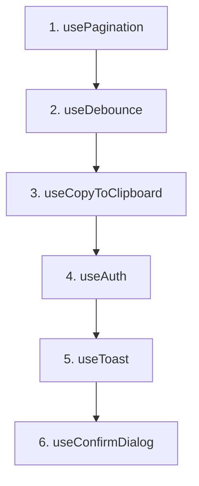

# Section 4c — Composables (TDD Plan)

> Implements the 6 composables listed in [`docs/TODO.md`](docs/TODO.md:237) under **4c. Composables**, using a strict test-first (TDD) approach to prevent regressions.

---

## Context

- Section 4a (services) and 4b (stores) are **complete**.
- The [`src/composables/`](src/composables/) directory does not exist yet.
- `@vueuse/core` is installed but unused — we will leverage it for `useClipboard` and debounce utilities.
- Existing test patterns use `vitest` with `vi.mock()`, `@vue/test-utils`, and `setActivePinia` for store-dependent composables.
- Test environment: `jsdom` (configured in [`vitest.config.ts`](vitest.config.ts:15)).

---

## Composable Specifications

### 1. `useAuth`

Wraps the [`useAuthStore`](src/stores/auth.ts:30) to provide ergonomic computed helpers for templates.

| Export | Type | Description |
|--------|------|-------------|
| `isAuthenticated` | `ComputedRef<boolean>` | Delegates to store |
| `currentUser` | `ComputedRef<User \| null>` | Delegates to store |
| `hasRole` | `(role: string) => boolean` | Delegates to store |
| `loading` | `Ref<boolean>` | Store loading state |
| `error` | `Ref<string \| null>` | Store error state |
| `login` | `async function` | Delegates to store |
| `logout` | `async function` | Delegates to store |

### 2. `useToast`

A lightweight reactive toast notification system. Toasts are stored in a reactive array; consumer components render them.

| Export | Type | Description |
|--------|------|-------------|
| `toasts` | `Ref<Toast[]>` | Current active toasts |
| `addToast` | `(toast: Omit<Toast, 'id'>) => number` | Push toast, returns id |
| `removeToast` | `(id: number) => void` | Remove toast by id |
| `success` | `(message: string, options?) => number` | Shorthand for variant=success |
| `error` | `(message: string, options?) => number` | Shorthand for variant=danger |
| `warning` | `(message: string, options?) => number` | Shorthand for variant=warning |
| `info` | `(message: string, options?) => number` | Shorthand for variant=info |

Toast interface: `{ id: number; variant: 'info' | 'success' | 'warning' | 'danger'; message: string; title?: string; duration?: number }`

Auto-dismiss after configurable `duration` (default 5000ms) using `setTimeout` + cleanup via `onUnmounted`.

### 3. `useConfirmDialog`

A promise-based confirmation dialog composable.

| Export | Type | Description |
|--------|------|-------------|
| `showConfirm` | `(options: ConfirmOptions) => Promise<boolean>` | Shows dialog, resolves true/false |
| `isVisible` | `Ref<boolean>` | Whether dialog is currently shown |
| `title` | `Ref<string>` | Current dialog title |
| `message` | `Ref<string>` | Current dialog message |
| `confirmLabel` | `Ref<string>` | Confirm button label |
| `cancelLabel` | `Ref<string>` | Cancel button label |
| `confirm` | `() => void` | Resolve as true |
| `cancel` | `() => void` | Resolve as false |

The `showConfirm` function stores an internal promise resolver, sets visible state, and resolves when confirm/cancel is called.

### 4. `usePagination`

Manages pagination state for list views.

| Export | Type | Description |
|--------|------|-------------|
| `page` | `Ref<number>` | Current page (1-indexed) |
| `perPage` | `Ref<number>` | Items per page (default 20) |
| `total` | `Ref<number>` | Total item count |
| `totalPages` | `ComputedRef<number>` | Derived from total/perPage |
| `hasNext` | `ComputedRef<boolean>` | Can go to next page |
| `hasPrev` | `ComputedRef<boolean>` | Can go to previous page |
| `next` | `() => void` | Increment page if hasNext |
| `prev` | `() => void` | Decrement page if hasPrev |
| `goTo` | `(p: number) => void` | Set page directly |
| `reset` | `() => void` | Reset to page 1 |

Accepts optional `{ initialPage?, initialPerPage? }` options.

### 5. `useDebounce`

Wraps `useDebounceFn` from `@vueuse/core` for debounced search/filter input.

| Export | Type | Description |
|--------|------|-------------|
| `debouncedValue` | `Ref<string>` | Auto-debounced ref |
| `immediateValue` | `Ref<string>` | The non-debounced input value |
| `update` | `(val: string) => void` | Set immediate value, debouncedValue updates after delay |

Accepts options: `{ delay?: number; initialValue?: string }` (default delay 300ms).

Alternatively, we can re-export `useDebounceFn` from VueUse with a convenience wrapper. The simpler approach: create a `useDebouncedRef` that returns both `value` (immediate) and `debounced` (delayed) refs.

### 6. `useCopyToClipboard`

Wraps `useClipboard` from `@vueuse/core`.

| Export | Type | Description |
|--------|------|-------------|
| `copy` | `(text: string) => Promise<boolean>` | Copy text, returns success |
| `copied` | `Ref<boolean>` | Whether last copy succeeded |
| `isSupported` | `ComputedRef<boolean>` | Whether Clipboard API is available |

---

## File Structure

```
src/composables/
├── useAuth.ts
├── useToast.ts
├── useConfirmDialog.ts
├── usePagination.ts
├── useDebounce.ts
└── useCopyToClipboard.ts

tests/composables/
├── useAuth.spec.ts
├── useToast.spec.ts
├── useConfirmDialog.spec.ts
├── usePagination.spec.ts
├── useDebounce.spec.ts
└── useCopyToClipboard.spec.ts
```

---

## TDD Execution Order

Each composable follows: **write tests → verify fail → implement → verify pass**.



**Rationale for order:** Start with the simplest composables (no store dependency, no async), then build up to the more complex ones.

1. **usePagination** — Pure reactive state, no dependencies. Simplest to test.
2. **useDebounce** — Uses `@vueuse/core`, requires timing-based tests with `vi.useFakeTimers`.
3. **useCopyToClipboard** — Uses `@vueuse/core`, requires mocking `navigator.clipboard`.
4. **useAuth** — Depends on Pinia auth store; requires `setActivePinia` in tests.
5. **useToast** — Requires `onUnmounted` lifecycle mocking for auto-dismiss cleanup.
6. **useConfirmDialog** — Promise-based; requires testing async resolution patterns.

---

## Vitest Config Update

Add `tests/composables/**` to the `jsdom` environment glob in [`vitest.config.ts`](vitest.config.ts:15):

```
environmentMatchGlobs: [
  ['tests/server/**', 'node'],
  ['tests/components/**', 'jsdom'],
  ['tests/composables/**', 'jsdom'],
  ['tests/App.spec.ts', 'jsdom'],
],
```

---

## Test Patterns

### usePagination test outline
- Default state (page 1, perPage 20, total 0)
- totalPages computed correctly
- hasNext / hasPrev computed correctly
- next/prev/goTo/reset functions
- Edge cases: next on last page, prev on first page

### useDebounce test outline
- DebouncedValue updates after delay
- Rapid updates collapse to single debounced value
- Custom delay option works

### useCopyToClipboard test outline
- copy returns true on success
- copy returns false when not supported
- copied flag toggles correctly

### useAuth test outline
- isAuthenticated reflects store state
- currentUser reflects store user
- hasRole delegates correctly
- login/logout delegates to store

### useToast test outline
- addToast adds toast with auto-generated id
- removeToast removes by id
- Convenience methods set correct variant
- Auto-dismiss after duration
- Cleanup on unmount

### useConfirmDialog test outline
- showConfirm resolves to true when confirm() called
- showConfirm resolves to false when cancel() called
- isVisible reflects dialog state

---

## TODO Checklist

- [ ] 1. Create `tests/composables/` directory
- [ ] 2. Update `vitest.config.ts` to add composables environment glob
- [ ] 3. Write `tests/composables/usePagination.spec.ts` — all tests
- [ ] 4. Create `src/composables/usePagination.ts` — implement until tests pass
- [ ] 5. Write `tests/composables/useDebounce.spec.ts` — all tests
- [ ] 6. Create `src/composables/useDebounce.ts` — implement until tests pass
- [ ] 7. Write `tests/composables/useCopyToClipboard.spec.ts` — all tests
- [ ] 8. Create `src/composables/useCopyToClipboard.ts` — implement until tests pass
- [ ] 9. Write `tests/composables/useAuth.spec.ts` — all tests
- [ ] 10. Create `src/composables/useAuth.ts` — implement until tests pass
- [ ] 11. Write `tests/composables/useToast.spec.ts` — all tests
- [ ] 12. Create `src/composables/useToast.ts` — implement until tests pass
- [ ] 13. Write `tests/composables/useConfirmDialog.spec.ts` — all tests
- [ ] 14. Create `src/composables/useConfirmDialog.ts` — implement until tests pass
- [ ] 15. Run full test suite — verify no regressions
- [ ] 16. Update `docs/TODO.md` — check off completed items
- [ ] 17. Create `.memory/section-4c-composables/summary.md`
