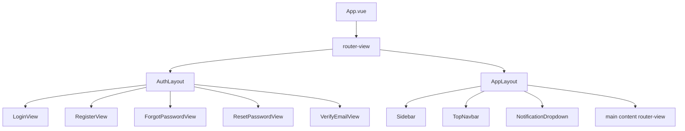
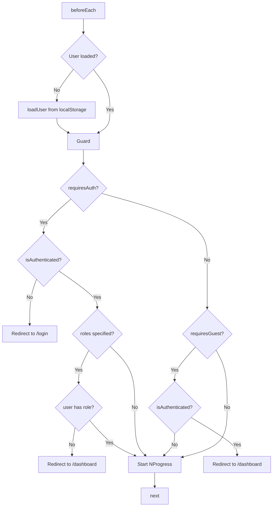

# Section 4e–4g — Router Configuration, Auth Pages & App Layout

## Overview

Implement Vue Router with navigation guards, NProgress loading bar, authentication pages (Login, Register, Forgot Password, Reset Password, Verify Email), and app layout components (AppLayout, AuthLayout, Sidebar, TopNavbar, NotificationDropdown).

## Existing Infrastructure

- **Auth store** ([`src/stores/auth.ts`](src/stores/auth.ts)) — `isAuthenticated`, `hasRole()`, `loadUser()`, `login()`, `register()`, `logout()`
- **Auth service** ([`src/services/auth.ts`](src/services/auth.ts)) — `login()`, `register()`, `logout()`, `forgotPassword()`, `resetPassword()`, `verifyEmail()`, `resendVerification()`
- **UI store** ([`src/stores/ui.ts`](src/stores/ui.ts)) — `sidebarCollapsed`, `toggleSidebar()`, `theme`
- **Notifications store** ([`src/stores/notifications.ts`](src/stores/notifications.ts)) — `notifications`, `unreadCount`, `fetchNotifications()`, `markAsRead()`, `markAllAsRead()`
- **Base components** — BButton, BInput, BCard, BAvatar, BDropdown, BAlert, BModal, BCheckbox, BBadge
- **nprogress** — already in `package.json` dependencies
- **i18n** — 3 locales (en, fr, ar) with `useI18n()` pattern

## Architecture



### Route Meta Schema

```typescript
interface RouteMeta {
  requiresAuth?: boolean
  requiresGuest?: boolean
  roles?: Array<'agent' | 'client' | 'admin'>
  title?: string
}
```

### Navigation Guard Flow



## Plan

### Phase 1: Tests First (TDD)

1. **Router tests** — [`tests/router/router.spec.ts`](tests/router/router.spec.ts)
   - Test route definitions exist for all pages
   - Test route meta fields (requiresAuth, requiresGuest, roles)
   - Test navigation guard: unauthenticated user redirected to /login when accessing protected route
   - Test navigation guard: authenticated user redirected to /dashboard when accessing /login
   - Test navigation guard: role-based access control
   - Test NProgress start/stop on route changes

2. **LoginView tests** — [`tests/components/auth/LoginView.spec.ts`](tests/components/auth/LoginView.spec.ts)
   - Test renders email and password inputs
   - Test "Forgot Password" link present
   - Test "Register" link present
   - Test form submission calls auth store login
   - Test error display on failed login
   - Test loading state during submission

3. **RegisterView tests** — [`tests/components/auth/RegisterView.spec.ts`](tests/components/auth/RegisterView.spec.ts)
   - Test renders all form fields (firstName, lastName, email, password, role)
   - Test role selection (Agent/Client)
   - Test form submission calls auth store register
   - Test error display on failed registration

4. **ForgotPasswordView tests** — [`tests/components/auth/ForgotPasswordView.spec.ts`](tests/components/auth/ForgotPasswordView.spec.ts)
   - Test renders email input
   - Test form submission calls forgotPassword service
   - Test success message display

5. **ResetPasswordView tests** — [`tests/components/auth/ResetPasswordView.spec.ts`](tests/components/auth/ResetPasswordView.spec.ts)
   - Test renders password and confirm password inputs
   - Test reads token from route params
   - Test form submission calls resetPassword service

6. **VerifyEmailView tests** — [`tests/components/auth/VerifyEmailView.spec.ts`](tests/components/auth/VerifyEmailView.spec.ts)
   - Test reads token from route params
   - Test calls verifyEmail on mount
   - Test success/error states

7. **AppLayout tests** — [`tests/components/layout/AppLayout.spec.ts`](tests/components/layout/AppLayout.spec.ts)
   - Test renders Sidebar, TopNavbar, and router-view
   - Test sidebar collapsed state toggles layout class

8. **AuthLayout tests** — [`tests/components/layout/AuthLayout.spec.ts`](tests/components/layout/AuthLayout.spec.ts)
   - Test renders centered card layout
   - Test renders router-view inside card

9. **Sidebar tests** — [`tests/components/layout/Sidebar.spec.ts`](tests/components/layout/Sidebar.spec.ts)
   - Test renders navigation links for agent role
   - Test renders navigation links for client role
   - Test active link highlighting based on current route
   - Test collapse toggle

10. **TopNavbar tests** — [`tests/components/layout/TopNavbar.spec.ts`](tests/components/layout/TopNavbar.spec.ts)
    - Test renders search input
    - Test renders notification bell with unread count
    - Test renders user avatar with dropdown

11. **NotificationDropdown tests** — [`tests/components/layout/NotificationDropdown.spec.ts`](tests/components/layout/NotificationDropdown.spec.ts)
    - Test renders notification list
    - Test mark-as-read functionality
    - Test mark-all-as-read functionality
    - Test empty state

### Phase 2: Implementation

12. **Update router** — [`src/router/index.ts`](src/router/index.ts)
    - Add route definitions for all pages with lazy loading
    - Add route meta fields (requiresAuth, requiresGuest, roles)
    - Add beforeEach navigation guard with auth checking
    - Add afterEach guard for NProgress completion
    - Import and configure NProgress with custom styles

13. **Add NProgress CSS** — [`src/assets/main.css`](src/assets/main.css)
    - Add custom NProgress styles matching the dark theme

14. **Create Auth Views**
    - [`src/views/auth/LoginView.vue`](src/views/auth/LoginView.vue)
    - [`src/views/auth/RegisterView.vue`](src/views/auth/RegisterView.vue)
    - [`src/views/auth/ForgotPasswordView.vue`](src/views/auth/ForgotPasswordView.vue)
    - [`src/views/auth/ResetPasswordView.vue`](src/views/auth/ResetPasswordView.vue)
    - [`src/views/auth/VerifyEmailView.vue`](src/views/auth/VerifyEmailView.vue)

15. **Create Layout Components**
    - [`src/components/layout/AppLayout.vue`](src/components/layout/AppLayout.vue)
    - [`src/components/layout/AuthLayout.vue`](src/components/layout/AuthLayout.vue)
    - [`src/components/layout/Sidebar.vue`](src/components/layout/Sidebar.vue)
    - [`src/components/layout/TopNavbar.vue`](src/components/layout/TopNavbar.vue)
    - [`src/components/layout/NotificationDropdown.vue`](src/components/layout/NotificationDropdown.vue)

16. **Add i18n keys** — Update [`src/locales/en.json`](src/locales/en.json), [`src/locales/fr.json`](src/locales/fr.json), [`src/locales/ar.json`](src/locales/ar.json)
    - Add auth page translations (login, register, forgotPassword, resetPassword, verifyEmail)
    - Add layout translations (sidebar nav items, topbar, notifications)

17. **Update vitest config** — [`vitest.config.ts`](vitest.config.ts)
    - Add `tests/router/**` to jsdom environment

### Phase 3: Verify & Cleanup

18. Run full test suite — ensure no regressions
19. Check off completed items in [`docs/TODO.md`](docs/TODO.md)
20. Create task summary in [`.memory/section-4e-4g-router-auth-layout/summary.md`](.memory/section-4e-4g-router-auth-layout/summary.md)

## Key Design Decisions

1. **Lazy loading** — All auth and layout views use dynamic `import()` for code splitting. Only LandingPage and Demo are eagerly loaded since they're entry points.

2. **Route meta fields** — `requiresAuth: true` for all authenticated routes, `requiresGuest: true` for login/register. `roles` array for admin-only routes. This keeps guard logic simple and declarative.

3. **Navigation guard pattern** — Single `beforeEach` guard checks auth state. Calls `loadUser()` once on first navigation if tokens exist in localStorage but user is null (page refresh scenario).

4. **NProgress** — Custom CSS to match the dark theme with `--ds-accent` color. Configured to show spinner only for slow navigations (>200ms).

5. **Auth layout** — Centered card on dark background with gradient accents, reusing the visual style from the landing page. No sidebar, minimal chrome.

6. **App layout** — Sidebar + TopNavbar + main content area. Sidebar uses the UI store's `sidebarCollapsed` state. TopNavbar is fixed at top.

7. **Sidebar role-based links** — Agent sees: Dashboard, Missions, Messages, Payments, Credits, Settings. Client sees: Dashboard, Missions, Messages, Payments, Subscriptions, Settings. Both see Notifications.

8. **i18n** — All user-facing strings go through `t()`. Auth pages get their own namespace (`auth.login.email`, `auth.login.password`, etc.). Layout gets `layout.sidebar.*` namespace.
