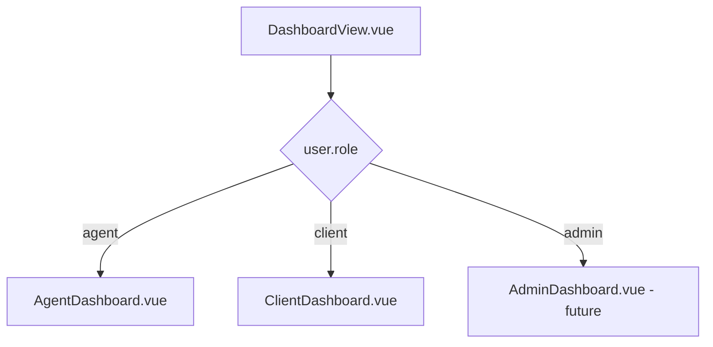
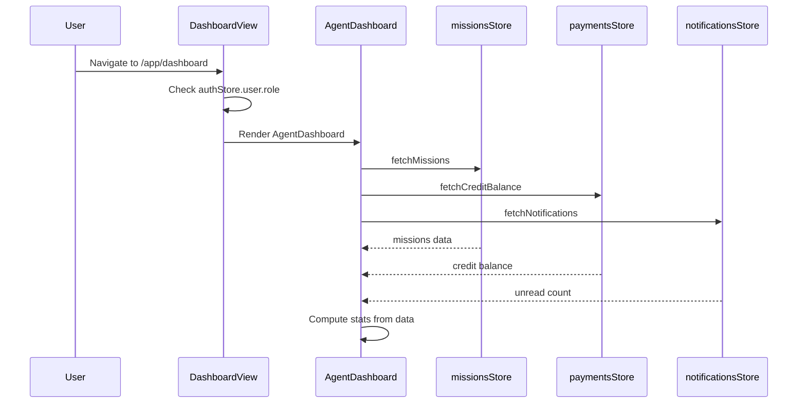
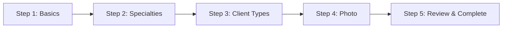

# Section 5a & 5b — Dashboard & Agent Profile Pages

## Overview

Implementation plan for the core dashboard pages (role-aware) and agent profile/onboarding views. These are the first actual app views to be built beyond the placeholder `DashboardView.vue`.

---

## Architecture Decisions

### Role-Based Dashboard Rendering

The existing `DashboardView.vue` at `/app/dashboard` will become a **wrapper** that checks the user's role via `useAuthStore().hasRole()` and renders the appropriate sub-component:



### New Agent Profile Store

A dedicated `agentProfile` store will be created since the existing `auth` store only holds basic user info (id, email, firstName, lastName, role). The agent profile data (bio, specialties, currency, uniqueInviteSlug, profilePhotoUrl, acceptedClientTypes) requires its own store that calls the existing API endpoints:

- `GET /api/users/me` — returns user with nested `agentProfile`
- `PUT /api/users/agents/me` — update agent profile
- `POST /api/users/agents/me/invite-link` — regenerate invite link
- `GET /api/users/agents/:slug` — public agent profile view
- `POST /api/users/me/avatar` — upload profile photo

### File Organization

```
src/views/
  DashboardView.vue              (existing - refactor to wrapper)
  agent/
    AgentDashboard.vue            (new)
    AgentProfileSetup.vue         (new - onboarding wizard)
    AgentProfileView.vue          (new - public view)
    AgentSettingsView.vue         (new - settings/edit)
  client/
    ClientDashboard.vue           (new)
src/components/
  agent/
    InviteLinkShare.vue           (new)
```

### Data Flow



---

## Component Specifications

### 1. DashboardView.vue (Refactor)

**Current state:** Empty placeholder
**New behavior:** Role dispatcher

- Checks `authStore.hasRole('agent')` or `authStore.hasRole('client')`
- Renders `<AgentDashboard />` or `<ClientDashboard />` accordingly
- Shows a loading spinner while auth state resolves
- Redirects to login if not authenticated (already handled by router guard)

### 2. AgentDashboard.vue

**Purpose:** Overview dashboard for agents

**Stats Cards Row:**
- Active Missions (count from `missionsStore.activeMissions`)
- Credit Balance (from `paymentsStore.creditBalance`)
- Unread Messages (from `messagesStore.unreadCount`)
- Pending Agreements (missions with status `pending_agreement`)

**Sections:**
- **Active Missions** — BTable showing top 5 active missions with status badges, click-through to detail
- **Recent Activity** — Simple timeline of recent mission status changes
- **Quick Actions** — BButton links to create mission, view credits, share invite link

**Data Loading:**
- Calls `missionsStore.fetchMissions()` on mount
- Calls `paymentsStore.fetchCreditBalance()` on mount
- Calls `messagesStore.fetchUnreadCount()` on mount

### 3. ClientDashboard.vue

**Purpose:** Overview dashboard for clients

**Stats Cards Row:**
- Active Missions (count)
- Pending Agreements (missions awaiting client agreement)
- Unread Messages
- Total Spending (sum of confirmed payments)

**Sections:**
- **Active Missions** — BTable of active missions
- **Pending Agreements** — Cards showing missions that need client confirmation
- **Recent Payments** — BTable of recent payments with status

### 4. AgentProfileSetup.vue

**Purpose:** Multi-step onboarding wizard for newly registered agents

**Steps (wizard flow):**



**Step 1 — Basics:**
- BInput for bio (textarea, max 500 chars)
- BInput for timezone (dropdown or text input)
- Currency selector (dropdown from known currencies list — uses existing seeder helper)

**Step 2 — Specialties:**
- Checkbox/tag selection from predefined list: Legal, Finance, Real Estate, Admin, IT/Tech, HR, Consulting, Other
- Allow custom tag input

**Step 3 — Client Types:**
- Radio selection: B2B, B2C, Both

**Step 4 — Photo:**
- BAvatar display of current photo
- File upload input for profile photo (calls `uploadAvatar`)

**Step 5 — Review & Complete:**
- Summary of all selections
- BButton to save (calls `updateAgentProfile` + optional `uploadAvatar`)
- Success state redirects to dashboard

**Route:** `/app/onboarding` (added to router, meta: `requiresAuth: true, roles: ['agent']`)

### 5. AgentProfileView.vue

**Purpose:** Public-facing agent profile (viewable by anyone with the link)

**Progressive Visibility:**
- **Unauthenticated visitors:** See name, avatar, bio, specialties, accepted client types. No currency info.
- **Authenticated agent (own profile):** See all fields including currency.
- **Authenticated client:** See name, avatar, bio, specialties, and a "Start Mission" CTA button.

**Layout:**
- Hero section with avatar, name, role badge, verified badge
- Bio section
- Specialties tags
- Accepted client types badge
- Invite link share section (if own profile)
- CTA button (if visitor)

**Route:** `/agents/:slug` (public, no auth required — but auth context is used for progressive visibility)

### 6. AgentSettingsView.vue

**Purpose:** Edit agent profile settings

**Sections:**
- Profile photo upload (with preview + crop placeholder)
- Bio editor (textarea)
- Specialties editor (same as onboarding)
- Accepted client types
- Currency selector
- Timezone selector
- Invite link management section (renders `InviteLinkShare`)

**Route:** `/app/settings` — Replace the current placeholder. The settings page will have role-specific sections; agent settings will be shown for agents.

### 7. InviteLinkShare.vue

**Purpose:** Reusable component for displaying and sharing the agent's invite link

**Features:**
- Displays the full invite link URL in a read-only BInput
- "Copy to clipboard" button (uses existing `useCopyToClipboard` composable)
- Share via WhatsApp button (generates `https://wa.me/?text=...` URL)
- Share via email button (generates `mailto:?subject=...&body=...` link)
- "Regenerate link" button (calls `POST /api/users/agents/me/invite-link`)

**Props:**
- `slug: string` — The agent's unique invite slug

**Events:**
- `regenerated` — Emitted when a new slug is generated

---

## Route Changes

| Path | Component | Meta | Notes |
|------|-----------|------|-------|
| `/app/dashboard` | `DashboardView.vue` | `requiresAuth` | Refactored to role dispatcher |
| `/app/onboarding` | `AgentProfileSetup.vue` | `requiresAuth, roles: ['agent']` | New route |
| `/app/settings` | `AgentSettingsView.vue` | `requiresAuth` | Replaces placeholder |
| `/agents/:slug` | `AgentProfileView.vue` | None (public) | New route outside `/app` prefix |

The `/app/settings` route currently uses the placeholder `DashboardView.vue`. It will be updated to use `AgentSettingsView.vue` for agents (and a client settings variant later).

---

## i18n Keys Structure

New keys to add under `dashboard` and `agentProfile` namespaces:

```json
{
  "dashboard": {
    "activeMissions": "Active Missions",
    "creditBalance": "Credit Balance",
    "unreadMessages": "Unread Messages",
    "pendingAgreements": "Pending Agreements",
    "recentActivity": "Recent Activity",
    "quickActions": "Quick Actions",
    "createMission": "Create Mission",
    "viewCredits": "View Credits",
    "shareInviteLink": "Share Invite Link",
    "totalSpending": "Total Spending",
    "recentPayments": "Recent Payments",
    "noMissions": "No active missions yet.",
    "noPayments": "No payments yet."
  },
  "agentProfile": {
    "setup": {
      "title": "Complete Your Profile",
      "subtitle": "Set up your agent profile to start receiving clients.",
      "stepBasics": "Basics",
      "stepSpecialties": "Specialties",
      "stepClientTypes": "Client Types",
      "stepPhoto": "Photo",
      "stepReview": "Review",
      "bio": "Bio",
      "bioPlaceholder": "Tell clients about your expertise and experience...",
      "timezone": "Timezone",
      "currency": "Operating Currency",
      "specialties": "Your Specialties",
      "specialtiesHint": "Select all that apply.",
      "clientTypes": "Accepted Client Types",
      "clientTypesB2B": "Business to Business",
      "clientTypesB2C": "Business to Consumer",
      "clientTypesBoth": "Both",
      "uploadPhoto": "Upload Photo",
      "changePhoto": "Change Photo",
      "review": "Review Your Profile",
      "complete": "Complete Profile",
      "completed": "Your profile is ready!"
    },
    "view": {
      "verified": "Verified Agent",
      "accepts": "Accepts",
      "b2b": "Business clients",
      "b2c": "Individual clients",
      "both": "All client types",
      "startMission": "Start a Mission",
      "shareProfile": "Share Profile"
    },
    "settings": {
      "title": "Agent Settings",
      "save": "Save Changes",
      "saved": "Profile updated successfully.",
      "inviteLink": "Invite Link",
      "inviteLinkHint": "Share this link with potential clients.",
      "regenerate": "Regenerate",
      "regenerateConfirm": "Regenerating will invalidate the old link."
    }
  }
}
```

---

## Store Design

### `agentProfile` Store

```typescript
// src/stores/agentProfile.ts
interface AgentProfileState {
  profile: AgentProfile | null
  loading: boolean
  error: string | null
  inviteSlug: string | null
}

// Actions:
// fetchProfile() — GET /users/me, extract agentProfile
// updateProfile(data) — PUT /agents/me
// regenerateInviteLink() — POST /agents/me/invite-link
// uploadAvatar(file) — POST /users/me/avatar
// fetchPublicProfile(slug) — GET /users/agents/:slug
```

---

## Testing Strategy

Each view and component will have a corresponding spec file:

| Component | Test File | Key Test Cases |
|-----------|-----------|----------------|
| `DashboardView` | `tests/components/DashboardView.spec.ts` | Renders AgentDashboard for agent, ClientDashboard for client |
| `AgentDashboard` | `tests/components/agent/AgentDashboard.spec.ts` | Displays stats, renders active missions table, handles empty state |
| `ClientDashboard` | `tests/components/client/ClientDashboard.spec.ts` | Displays stats, shows pending agreements, handles empty state |
| `AgentProfileSetup` | `tests/components/agent/AgentProfileSetup.spec.ts` | Wizard navigation, form validation, submits profile data |
| `AgentProfileView` | `tests/components/agent/AgentProfileView.spec.ts` | Progressive visibility, shows CTA for visitors, full data for owner |
| `AgentSettingsView` | `tests/components/agent/AgentSettingsView.spec.ts` | Form pre-fill, save changes, invite link section |
| `InviteLinkShare` | `tests/components/agent/InviteLinkShare.spec.ts` | Copy to clipboard, share links, regenerate flow |

---

## Execution Order

1. Add i18n keys to all 3 locale files
2. Create `agentProfile` service functions in [`users.ts`](src/services/users.ts)
3. Create `agentProfile` Pinia store
4. Refactor [`DashboardView.vue`](src/views/DashboardView.vue) as role dispatcher
5. Create `AgentDashboard.vue`
6. Create `ClientDashboard.vue`
7. Create `InviteLinkShare.vue` (standalone component, no deps on other new views)
8. Create `AgentProfileSetup.vue`
9. Create `AgentProfileView.vue`
10. Create `AgentSettingsView.vue`
11. Update [`router/index.ts`](src/router/index.ts) with new routes
12. Write all test files
13. Run test suite and fix any failures
14. Update [`docs/TODO.md`](docs/TODO.md) to check off completed items
