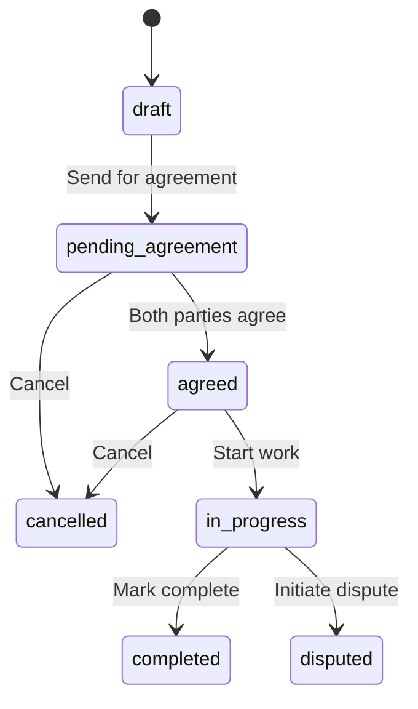
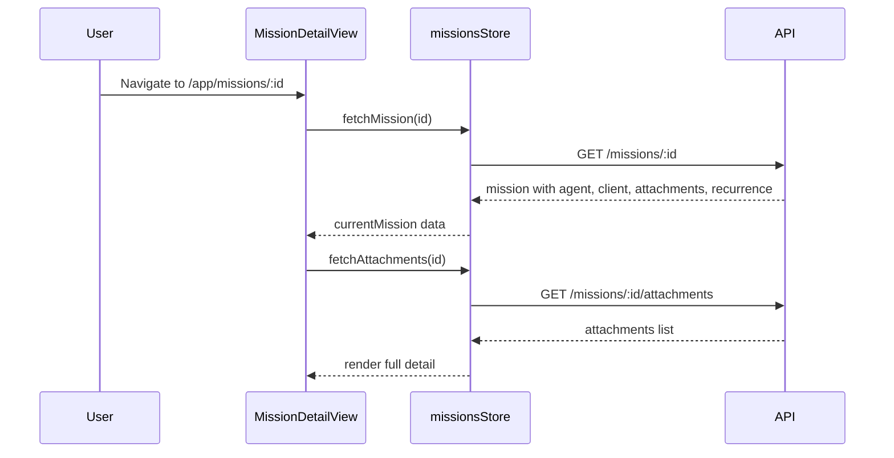
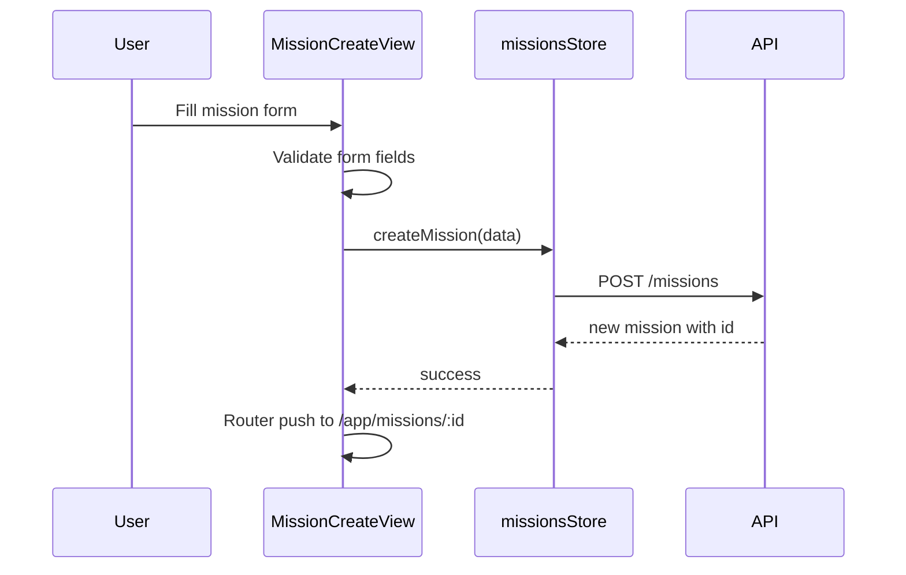
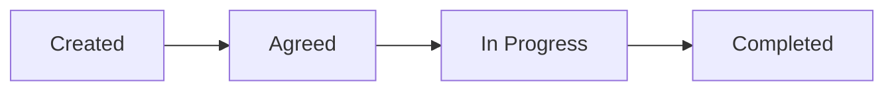

# Section 5d — Mission Pages

## Overview

Implementation plan for the core mission workflow pages: listing, detail view, creation, agreement, and supporting sub-components (timeline, checklist, attachments). These are the central pages of the application — the entire platform revolves around mission lifecycle management.

---

## Architecture Decisions

### Mission Status Flow

The mission lifecycle is central to the UI. All pages must reflect and enforce valid status transitions:



### Store Extension

The existing [`missionsStore`](src/stores/missions.ts) already handles CRUD operations. It needs to be extended with:
- `agreeMission(id)` — calls existing [`agreeMission()`](src/services/missions.ts:40) service
- `updateMissionStatus(id, status)` — calls existing [`updateMissionStatus()`](src/services/missions.ts:44) service
- `fetchAttachments(missionId)` — calls existing [`getAttachments()`](src/services/missions.ts:56) service
- `uploadAttachment(missionId, file)` — calls existing [`uploadAttachment()`](src/services/missions.ts:48) service
- Enhanced `Mission` interface to include `agent`, `client`, `attachments`, `recurrenceConfig` (matching the server response from [`GET /api/missions/:id`](src/server/routes/missions.ts:98))

### Shared Components

Three sub-components are extracted as reusable pieces:
- [`MissionTimeline.vue`](#2-missiontimelinevue) — status progression visualization
- [`MissionChecklist.vue`](#3-missionchecklistvue) — interactive agreement/completion checklist
- [`MissionAttachments.vue`](#4-missionattachmentsvue) — file upload and display

These live under `src/components/mission/` to be reused across detail and agreement views.

### File Organization

```
src/views/
  missions/
    MissionListView.vue           (new - list with filters)
    MissionDetailView.vue         (new - full detail page)
    MissionCreateView.vue         (new - create form)
    MissionAgreementView.vue      (new - agreement checklist view)
src/components/
  mission/
    MissionTimeline.vue           (new - status timeline)
    MissionChecklist.vue          (new - interactive checklist)
    MissionAttachments.vue        (new - file upload/display)
```

### Data Flow — Mission Detail



### Data Flow — Mission Create



---

## Component Specifications

### 1. MissionListView.vue

**Purpose:** Filterable, sortable list of the current user's missions

**Route:** `/app/missions` → name `missions`

**Header:**
- Page title: "Missions"
- "Create Mission" CTA button (agents only — hidden for clients)

**Filter Bar:**
- Status dropdown filter (All, Draft, Pending Agreement, Agreed, In Progress, Completed, Disputed, Cancelled)
- Type filter (All, One-time, Recurrent)
- Date range filter (start date, end date inputs)
- Clear filters button

**Mission Table (BTable):**
| Column | Description |
|--------|-------------|
| Title | Mission title — clickable link to detail |
| Status | BBadge with color-coded status |
| Type | One-time or Recurrent badge |
| Pricing | Fixed/Hourly/Task-based label |
| Amount | `currency agreedAmount` — or "—" if not set |
| Counterparty | Agent name (for clients) or Client name (for agents) |
| Created | Formatted date |
| Actions | View button |

**Empty State:**
- Icon + "No missions found" message
- CTA to create first mission (for agents)

**Pagination:**
- Uses existing `usePagination` composable
- Shows total count and per-page selector

**Data Loading:**
- Calls `missionsStore.fetchMissions()` on mount with current filters/pagination
- Re-fetches when filters change (debounced)

### 2. MissionDetailView.vue

**Purpose:** Full mission detail with all information, actions, and sub-components

**Route:** `/app/missions/:id` → name `mission-detail`

**Header Section:**
- Mission title (large)
- Status badge (color-coded)
- Type badge (one-time / recurrent)
- Pricing type + agreed amount display
- Created date, started date, completed date (when applicable)

**Info Cards Row:**
- Agent card: name, avatar, email
- Client card: name, avatar, email

**Mission Timeline:**
- Renders `<MissionTimeline :status="mission.status" :startedAt="mission.startedAt" :completedAt="mission.completedAt" :createdAt="mission.createdAt" />`

**Description Section:**
- Full mission description text (or "No description provided" placeholder)

**Checklist Section:**
- Renders `<MissionChecklist :agreedChecklist="mission.agreedChecklist" :completedChecklist="mission.completedChecklist" :status="mission.status" :missionId="mission.id" />`

**Attachments Section:**
- Renders `<MissionAttachments :missionId="mission.id" :attachments="mission.attachments" :status="mission.status" />`

**Action Buttons (role-dependent):**

| User Role | Current Status | Available Actions |
|-----------|---------------|-------------------|
| Agent | draft | Send for Agreement, Edit, Cancel |
| Agent | agreed | Start Mission, Cancel |
| Agent | in_progress | Mark Complete |
| Client | pending_agreement | Agree, Decline |
| Both | in_progress | Initiate Dispute |

**Status Transition Buttons:**
- "Send for Agreement" → calls `updateMissionStatus(id, 'pending_agreement')`
- "Start Mission" → calls `updateMissionStatus(id, 'in_progress')`
- "Mark Complete" → calls `updateMissionStatus(id, 'completed')`
- "Agree" → calls `agreeMission(id)` then `updateMissionStatus(id, 'agreed')`
- "Cancel" → confirmation dialog → calls `deleteMission(id)` (which sets status to cancelled)
- "Initiate Dispute" → navigates to dispute creation (future section 5i, for now link to `/app/disputes`)

**Back Link:**
- "Back to Missions" link at top

### 3. MissionCreateView.vue

**Purpose:** Form to create a new mission (agents only)

**Route:** `/app/missions/create` → name `mission-create`

**Guard:** `roles: ['agent']` — only agents can create missions

**Form Fields:**
| Field | Type | Required | Notes |
|-------|------|----------|-------|
| Title | BInput text | Yes | Max 200 chars |
| Client | BInput/BDropdown | Yes | Search/select from connected clients |
| Description | BInput textarea | No | Max 2000 chars |
| Pricing Type | Radio group | Yes | Fixed, Hourly, Task-based |
| Agreed Amount | BInput number | No | Shown based on pricing type |
| Currency | BDropdown | Yes | Default from agent profile currency |
| Checklist Items | Dynamic list | No | Add/remove checklist items |
| Mission Type | Radio group | Yes | One-time (default), Recurrent |

**Checklist Builder:**
- Dynamic list of text inputs
- "Add item" button to add new rows
- Remove button (×) on each row
- Minimum 0, suggested 3-5 items for agreement scope

**Submit:**
- Validates required fields
- Calls `missionsStore.createMission(data)`
- On success, navigates to `/app/missions/:id` (the new mission detail)

**Cancel:**
- "Cancel" button navigates back to `/app/missions`

### 4. MissionAgreementView.vue

**Purpose:** Dedicated agreement view where both parties review and accept the mission checklist before work begins

**Note:** This view can also be inlined within `MissionDetailView` as a section. The dedicated view provides a focused, distraction-free agreement experience.

**Route:** `/app/missions/:id/agree` → name `mission-agree`

**Layout:**
- Centered card layout (similar to auth pages)
- Mission title and description at top

**Checklist Display:**
- Renders `<MissionChecklist>` with agreement mode
- Each item is a checkbox
- User must check ALL items to proceed
- Agent and client see the same checklist
- Status shows who has agreed (future: dual-party tracking — currently simplified to single agree)

**Agreement Section:**
- "I agree to the scope and terms above" checkbox (required)
- BButton "Confirm Agreement" → calls `agreeMission(id)` + `updateMissionStatus(id, 'agreed')`
- On success, redirects to mission detail

**Decline Section:**
- "Decline" button with confirmation dialog
- Calls `deleteMission(id)` (cancels mission)
- Redirects to mission list

**Access Control:**
- Only accessible when `mission.status === 'pending_agreement'`
- Redirects to mission detail if status doesn't match

### 5. MissionTimeline.vue

**Purpose:** Visual status progression component

**Props:**
```typescript
interface Props {
  status: string
  createdAt: string
  startedAt?: string | null
  completedAt?: string | null
}
```

**Display:**
A horizontal timeline (vertical on mobile) showing status milestones:



Each step shows:
- Status label
- Timestamp (if reached)
- Visual indicator: ✓ (completed), ● (current), ○ (pending)

**Statuses displayed in order:**
1. Created — always shown, uses `createdAt`
2. Agreed — shown when status >= `agreed`
3. In Progress — shown when status >= `in_progress`, uses `startedAt`
4. Completed — shown when status >= `completed`, uses `completedAt`

**Styling:**
- Uses the project's dark theme (navy background, gradient accents)
- Active/current step has accent color
- Completed steps have check icon
- Pending steps are dimmed/muted

### 6. MissionChecklist.vue

**Purpose:** Interactive checklist for mission scope agreement and completion tracking

**Props:**
```typescript
interface Props {
  agreedChecklist: string[]
  completedChecklist: string[]
  status: string
  missionId: number
  editable?: boolean
}
```

**Events:**
```typescript
emit('update:completedChecklist', items: string[])
```

**Modes:**

1. **Agreement Mode** (when `status === 'pending_agreement'`):
   - Show agreedChecklist items as checkboxes
   - User checks each item to confirm they agree
   - "Check all" toggle at top
   - Read-only display of items (editing checklist is done in the create/edit flow)

2. **Completion Mode** (when `status === 'in_progress'`):
   - Show agreedChecklist items
   - Each item has a checkbox to mark as completed
   - Completed items are moved to completedChecklist
   - Progress indicator: "3 of 5 items completed"

3. **Review Mode** (when `status === 'completed'` or `status === 'agreed'`):
   - Read-only display of agreedChecklist
   - For completed: shows which items were completed vs agreed

**Empty State:**
- "No checklist items defined" message when agreedChecklist is empty

### 7. MissionAttachments.vue

**Purpose:** File upload and display for mission proof-of-work documents

**Props:**
```typescript
interface Props {
  missionId: number
  attachments: Attachment[]
  status: string
}

interface Attachment {
  id: number
  fileUrl: string
  fileName: string
  fileType: string
  fileSize: number
  uploadedBy: number
  createdAt: string
}
```

**Display:**
- Grid/list of existing attachments
- Each shows: file icon (based on fileType), file name, file size, uploaded by, date
- Click to download/preview

**Upload (when `status === 'in_progress'` or `status === 'agreed'`):**
- Drag-and-drop zone or file input
- Accept common document/image types (pdf, doc, docx, jpg, png, etc.)
- Max file size validation (client-side, e.g. 10MB)
- Upload progress indicator
- Calls `uploadAttachment(missionId, file)`

**Empty State:**
- "No attachments yet" with upload prompt

**Styling:**
- File type icons using Bootstrap Icons (`bi-file-earmark-pdf`, `bi-file-earmark-image`, etc.)
- File size formatted as KB/MB

---

## Route Changes

| Path | Component | Meta | Notes |
|------|-----------|------|-------|
| `/app/missions` | `MissionListView.vue` | `requiresAuth` | Replaces DashboardView placeholder |
| `/app/missions/create` | `MissionCreateView.vue` | `requiresAuth, roles: ['agent']` | Replaces DashboardView placeholder |
| `/app/missions/:id` | `MissionDetailView.vue` | `requiresAuth` | Replaces DashboardView placeholder |
| `/app/missions/:id/agree` | `MissionAgreementView.vue` | `requiresAuth` | New route |

---

## Store Modifications

### Extend `missionsStore` ([`src/stores/missions.ts`](src/stores/missions.ts))

```typescript
// Add to Mission interface:
interface Mission {
  // ... existing fields ...
  agent?: { id: number; firstName: string; lastName: string; email: string }
  client?: { id: number; firstName: string; lastName: string; email: string }
  attachments?: Attachment[]
  recurrenceConfig?: RecurrenceConfig | null
}

// New actions to add:
async function agreeMission(id: string) // POST /missions/:id/agree
async function updateMissionStatus(id: string, status: string) // PUT /missions/:id/status
async function fetchAttachments(missionId: string) // GET /missions/:id/attachments
async function uploadAttachment(missionId: string, file: File) // POST /missions/:id/attachments
```

All these service functions already exist in [`src/services/missions.ts`](src/services/missions.ts) — they just need to be wired into the store.

---

## i18n Keys Structure

New keys to add under a `missions` namespace in all 3 locale files:

```json
{
  "missions": {
    "list": {
      "title": "Missions",
      "create": "Create Mission",
      "noResults": "No missions found.",
      "noResultsHint": "Try adjusting your filters or create a new mission.",
      "filters": {
        "status": "Status",
        "allStatuses": "All Statuses",
        "type": "Type",
        "allTypes": "All Types",
        "oneTime": "One-time",
        "recurrent": "Recurrent",
        "startDate": "Start Date",
        "endDate": "End Date",
        "clear": "Clear Filters"
      },
      "columns": {
        "title": "Title",
        "status": "Status",
        "type": "Type",
        "pricing": "Pricing",
        "amount": "Amount",
        "counterparty": "Counterparty",
        "created": "Created",
        "actions": "Actions"
      },
      "view": "View"
    },
    "detail": {
      "title": "Mission Detail",
      "backToList": "Back to Missions",
      "description": "Description",
      "noDescription": "No description provided.",
      "agent": "Agent",
      "client": "Client",
      "pricing": "Pricing",
      "amount": "Amount",
      "currency": "Currency",
      "created": "Created",
      "started": "Started",
      "completed": "Completed",
      "type": "Type",
      "oneTime": "One-time",
      "recurrent": "Recurrent",
      "fixed": "Fixed",
      "hourly": "Hourly",
      "taskBased": "Task-based",
      "checklist": "Mission Checklist",
      "attachments": "Attachments",
      "timeline": "Timeline",
      "actions": {
        "sendForAgreement": "Send for Agreement",
        "startMission": "Start Mission",
        "markComplete": "Mark Complete",
        "agree": "Agree",
        "decline": "Decline",
        "cancel": "Cancel Mission",
        "edit": "Edit",
        "initiateDispute": "Initiate Dispute"
      },
      "confirmActions": {
        "cancelTitle": "Cancel Mission",
        "cancelMessage": "Are you sure you want to cancel this mission? This action cannot be undone.",
        "startTitle": "Start Mission",
        "startMessage": "Are you ready to start working on this mission?",
        "completeTitle": "Mark Complete",
        "completeMessage": "Mark this mission as completed?"
      }
    },
    "create": {
      "title": "Create Mission",
      "subtitle": "Set up a new mission for your client.",
      "fields": {
        "title": "Mission Title",
        "titlePlaceholder": "e.g. Pay electricity bill, Register company...",
        "client": "Client",
        "clientPlaceholder": "Select a client",
        "description": "Description",
        "descriptionPlaceholder": "Describe the mission scope and objectives...",
        "pricingType": "Pricing Type",
        "fixed": "Fixed Price",
        "hourly": "Hourly Rate",
        "taskBased": "Task-based",
        "amount": "Amount",
        "amountPlaceholder": "0.00",
        "currency": "Currency",
        "missionType": "Mission Type",
        "oneTime": "One-time",
        "recurrent": "Recurrent"
      },
      "checklist": {
        "title": "Checklist Items",
        "hint": "Define the tasks that both parties will agree on.",
        "add": "Add item",
        "placeholder": "Enter checklist item..."
      },
      "submit": "Create Mission",
      "cancel": "Cancel",
      "creating": "Creating...",
      "created": "Mission created successfully.",
      "validation": {
        "titleRequired": "Title is required.",
        "clientRequired": "Please select a client.",
        "pricingTypeRequired": "Please select a pricing type."
      }
    },
    "agreement": {
      "title": "Mission Agreement",
      "subtitle": "Review and agree to the mission checklist before work begins.",
      "missionSummary": "Mission Summary",
      "checklistTitle": "Scope Checklist",
      "checklistHint": "Please confirm each item below to proceed.",
      "checkAll": "Check all",
      "agreeConfirm": "I agree to the scope and terms above",
      "confirmAgreement": "Confirm Agreement",
      "decline": "Decline",
      "confirmDecline": "Are you sure you want to decline this mission?",
      "agreed": "Agreement confirmed.",
      "notAgreed": "Please check all items to confirm agreement."
    },
    "timeline": {
      "created": "Created",
      "agreed": "Agreed",
      "inProgress": "In Progress",
      "completed": "Completed"
    },
    "checklist": {
      "empty": "No checklist items defined.",
      "completed": "{count} of {total} items completed"
    },
    "attachments": {
      "title": "Attachments",
      "empty": "No attachments yet.",
      "upload": "Upload File",
      "uploadHint": "Drag and drop or click to upload",
      "uploading": "Uploading...",
      "maxSize": "Max file size: 10MB",
      "acceptedTypes": "Accepted: PDF, DOC, DOCX, JPG, PNG",
      "uploadedBy": "Uploaded by {name}",
      "download": "Download"
    },
    "status": {
      "draft": "Draft",
      "pending_agreement": "Pending Agreement",
      "agreed": "Agreed",
      "in_progress": "In Progress",
      "completed": "Completed",
      "disputed": "Disputed",
      "cancelled": "Cancelled"
    }
  }
}
```

---

## Testing Strategy

| Component | Test File | Key Test Cases |
|-----------|-----------|----------------|
| `MissionListView` | `tests/components/missions/MissionListView.spec.ts` | Renders missions table, filters work, empty state, create button visibility by role, pagination |
| `MissionDetailView` | `tests/components/missions/MissionDetailView.spec.ts` | Displays mission info, renders sub-components, action buttons conditional on role/status, status transitions |
| `MissionCreateView` | `tests/components/missions/MissionCreateView.spec.ts` | Form validation, checklist builder add/remove, submit creates mission, navigation on success/cancel |
| `MissionAgreementView` | `tests/components/missions/MissionAgreementView.spec.ts` | Checklist rendering, check-all toggle, confirm button disabled until all checked, agreement flow |
| `MissionTimeline` | `tests/components/missions/MissionTimeline.spec.ts` | Correct steps shown per status, timestamps displayed, styling for active/completed/pending |
| `MissionChecklist` | `tests/components/missions/MissionChecklist.spec.ts` | Agreement mode vs completion mode, check/uncheck items, progress counter, empty state |
| `MissionAttachments` | `tests/components/missions/MissionAttachments.spec.ts` | Renders attachment list, upload shown only in valid statuses, empty state, file type icons |

**Store tests** (extend existing):
- `tests/stores/missions.spec.ts` — add tests for `agreeMission`, `updateMissionStatus`, `fetchAttachments`, `uploadAttachment`

---

## Execution Order

1. Add i18n keys to all 3 locale files ([`en.json`](src/locales/en.json), [`ar.json`](src/locales/ar.json), [`fr.json`](src/locales/fr.json))
2. Extend [`missionsStore`](src/stores/missions.ts) with new actions (agreeMission, updateMissionStatus, fetchAttachments, uploadAttachment) and enhanced Mission interface
3. Create [`MissionTimeline.vue`](src/components/mission/MissionTimeline.vue)
4. Create [`MissionChecklist.vue`](src/components/mission/MissionChecklist.vue)
5. Create [`MissionAttachments.vue`](src/components/mission/MissionAttachments.vue)
6. Create [`MissionListView.vue`](src/views/missions/MissionListView.vue)
7. Create [`MissionDetailView.vue`](src/views/missions/MissionDetailView.vue)
8. Create [`MissionCreateView.vue`](src/views/missions/MissionCreateView.vue)
9. Create [`MissionAgreementView.vue`](src/views/missions/MissionAgreementView.vue)
10. Update [`router/index.ts`](src/router/index.ts) — replace DashboardView placeholders with actual mission components, add agreement route
11. Write all test files
12. Run test suite and fix any failures
13. Update [`docs/TODO.md`](docs/TODO.md) to check off completed items
