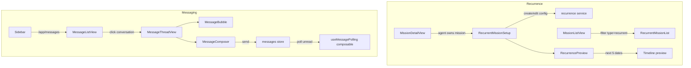

# Plan: Sections 5e & 5f — Recurrent Missions & Messaging Frontend

## Context

Backend APIs for recurrence and messaging are fully implemented:
- [`src/server/routes/recurrence.ts`](src/server/routes/recurrence.ts) — POST/PUT/DELETE recurrence config
- [`src/server/routes/messages.ts`](src/server/routes/messages.ts) — Messages CRUD, unread count
- [`netlify/functions/scheduler.ts`](netlify/functions/scheduler.ts) — Recurrent mission auto-generation
- Database models: [`RecurrentMissionConfig`](src/server/database/models/index.ts:307), [`Conversation`](src/server/database/models/index.ts:397), [`Message`](src/server/database/models/index.ts:422), [`MessageAttachment`](src/server/database/models/index.ts:460)

Frontend partially built:
- [`src/services/messages.ts`](src/services/messages.ts) — Message API calls exist
- [`src/stores/messages.ts`](src/stores/messages.ts) — Messages Pinia store exists
- **No** recurrence frontend service or store
- **No** recurrence or messaging Vue components
- Router placeholder at `/app/messages` pointing to `DashboardView.vue`

---

## Architecture Decisions



### Key Decisions

1. **Recurrence setup** integrates into [`MissionDetailView.vue`](src/views/missions/MissionDetailView.vue) as an expandable card section (agent-only, for owned missions). No separate page needed.
2. **RecurrentMissionList** replaces the current placeholder at `/app/messages` route... no — it's a separate section in the missions list view as a filterable sub-view, or as a card within the dashboard for agents with active recurrent missions.
3. **RecurrencePreview** is a child of `RecurrentMissionSetup` showing the next 5 computed run dates as a simple timeline.
4. **MessageListView** is the new `/app/messages` route — a list of all conversations with unread indicators.
5. **MessageThreadView** is accessed from MessageListView or from a "Messages" tab within MissionDetailView. Route: `/app/messages/:missionId`.
6. **MessageComposer** is part of MessageThreadView (not standalone) — positioned at the bottom of the thread.
7. **Polling** via a new [`useMessagePolling`](src/composables/useMessagePolling.ts) composable that polls unread count every 30s, integrated into the AppLayout.

---

## File Plan

### New Files to Create

| # | File | Purpose |
|---|------|---------|
| 1 | `src/services/recurrence.ts` | API service: create, update, delete recurrence config |
| 2 | `src/stores/recurrence.ts` | Pinia store for recurrence state |
| 3 | `src/components/mission/RecurrentMissionSetup.vue` | Form UI for configuring recurrence on a mission |
| 4 | `src/components/mission/RecurrencePreview.vue` | Visual timeline preview of upcoming run dates |
| 5 | `src/components/mission/RecurrentMissionList.vue` | List of active recurrent mission schedules |
| 6 | `src/views/messages/MessageListView.vue` | List of all mission conversations with unread indicators |
| 7 | `src/views/messages/MessageThreadView.vue` | Full message thread for a mission conversation |
| 8 | `src/components/messaging/MessageBubble.vue` | Single message display (sender, time, content, read status) |
| 9 | `src/components/messaging/MessageComposer.vue` | Text input + send button for composing messages |
| 10 | `src/composables/useMessagePolling.ts` | Polling composable for unread message count |
| 11 | `tests/components/mission/RecurrentMissionSetup.spec.ts` | Tests for recurrence setup component |
| 12 | `tests/components/mission/RecurrencePreview.spec.ts` | Tests for recurrence preview |
| 13 | `tests/components/mission/RecurrentMissionList.spec.ts` | Tests for recurrence list |
| 14 | `tests/components/messaging/MessageBubble.spec.ts` | Tests for message bubble |
| 15 | `tests/components/messaging/MessageComposer.spec.ts` | Tests for message composer |
| 16 | `tests/views/messages/MessageListView.spec.ts` | Tests for message list view |
| 17 | `tests/views/messages/MessageThreadView.spec.ts` | Tests for message thread view |

### Files to Modify

| # | File | Change |
|---|------|--------|
| 1 | [`src/router/index.ts`](src/router/index.ts) | Add routes: `/app/messages` → MessageListView, `/app/messages/:missionId` → MessageThreadView |
| 2 | [`src/views/missions/MissionDetailView.vue`](src/views/missions/MissionDetailView.vue) | Add RecurrentMissionSetup section + messages link |
| 3 | [`src/components/layout/TopNavbar.vue`](src/components/layout/TopNavbar.vue) | Add unread message badge to bell/icon |
| 4 | [`src/stores/messages.ts`](src/stores/messages.ts) | Add `conversations` list state, `fetchConversations` action, sender info interface |
| 5 | [`src/services/messages.ts`](src/services/messages.ts) | Add `getConversations()` API call, file attachment upload |
| 6 | [`src/locales/en.json`](src/locales/en.json) | Add i18n keys for recurrence and messaging |
| 7 | [`src/locales/fr.json`](src/locales/fr.json) | Add i18n keys for recurrence and messaging |
| 8 | [`src/locales/ar.json`](src/locales/ar.json) | Add i18n keys for recurrence and messaging |
| 9 | [`src/assets/main.css`](src/assets/main.css) | Add scoped styles for new components |
| 10 | [`src/views/missions/MissionListView.vue`](src/views/missions/MissionListView.vue) | Add recurrent missions list section (filtered view) |

---

## Execution Order — Todo List

### Phase 1: Foundation — Services, Stores & Routes

- [ ] **1. Create [`src/services/recurrence.ts`](src/services/recurrence.ts)** — API service with `createRecurrence(missionId, data)`, `updateRecurrence(missionId, data)`, `deleteRecurrence(missionId)` using existing backend routes
- [ ] **2. Create [`src/stores/recurrence.ts`](src/stores/recurrence.ts)** — Pinia store with `createConfig`, `updateConfig`, `deleteConfig` actions, `loading`/`error` state, and `currentConfig` ref
- [ ] **3. Update [`src/services/messages.ts`](src/services/messages.ts)** — Add `getConversations()`, `uploadMessageAttachment(messageId, file)`, and `getConversationsList()` API calls
- [ ] **4. Update [`src/stores/messages.ts`](src/stores/messages.ts)** — Add `Conversation` interface with last message preview, unread count per conversation; add `fetchConversations` action
- [ ] **5. Update [`src/router/index.ts`](src/router/index.ts)** — Replace `/app/messages` placeholder with real `MessageListView`, add `/app/messages/:missionId` → `MessageThreadView`

### Phase 2: Recurrent Missions UI

- [ ] **6. Create [`src/components/mission/RecurrencePreview.vue`](src/components/mission/RecurrencePreview.vue)** — Pure display component showing next 5 computed dates as a timeline; props: `frequency`, `interval`, `dayOfMonth`, `dayOfWeek`
- [ ] **7. Create [`tests/components/mission/RecurrencePreview.spec.ts`](tests/components/mission/RecurrencePreview.spec.ts)** — TDD: Write tests first for various frequency configurations, date calculations, edge cases
- [ ] **8. Create [`src/components/mission/RecurrentMissionSetup.vue`](src/components/mission/RecurrentMissionSetup.vue)** — Form with frequency select, interval input, day-of-week/day-of-month selectors, toggle to enable/disable; uses recurrence store; embeds RecurrencePreview
- [ ] **9. Create [`tests/components/mission/RecurrentMissionSetup.spec.ts`](tests/components/mission/RecurrentMissionSetup.spec.ts)** — TDD: Tests for form rendering, validation, submit flow, edit mode, delete/disable
- [ ] **10. Create [`src/components/mission/RecurrentMissionList.vue`](src/components/mission/RecurrentMissionList.vue)** — Table/card list of active recurrent missions with next run date, frequency label, quick edit/disable actions
- [ ] **11. Create [`tests/components/mission/RecurrentMissionList.spec.ts`](tests/components/mission/RecurrentMissionList.spec.ts)** — TDD: Tests for empty state, list rendering, action buttons
- [ ] **12. Update [`src/views/missions/MissionDetailView.vue`](src/views/missions/MissionDetailView.vue)** — Add collapsible "Recurrence" card section below the checklist, visible only to agents who own the mission; integrate `RecurrentMissionSetup`

### Phase 3: Messaging UI

- [ ] **13. Create [`src/components/messaging/MessageBubble.vue`](src/components/messaging/MessageBubble.vue)** — Displays single message: sender avatar/initials, name, timestamp (relative), content, read status indicator (double-check icon); props: `message`, `isOwn`
- [ ] **14. Create [`tests/components/messaging/MessageBubble.spec.ts`](tests/components/messaging/MessageBubble.spec.ts)** — TDD: Tests for own vs other message layout, read status display, timestamp formatting
- [ ] **15. Create [`src/components/messaging/MessageComposer.vue`](src/components/messaging/MessageComposer.vue**) — Text input area + send button; emits `send(content)` and `attach(file)`; auto-resize textarea
- [ ] **16. Create [`tests/components/messaging/MessageComposer.spec.ts`](tests/components/messaging/MessageComposer.spec.ts)** — TDD: Tests for empty input prevention, submit on Enter, emit events
- [ ] **17. Create [`src/views/messages/MessageListView.vue`](src/views/messages/MessageListView.vue**) — List of all mission conversations; each row shows mission title, counterparty name, last message preview, timestamp, unread badge; click navigates to thread
- [ ] **18. Create [`tests/views/messages/MessageListView.spec.ts`](tests/views/messages/MessageListView.spec.ts**) — TDD: Tests for empty state, conversation list rendering, unread indicators, click navigation
- [ ] **19. Create [`src/views/messages/MessageThreadView.vue`](src/views/messages/MessageThreadView.vue**) — Full conversation view: header with mission title + counterparty, scrollable message list (auto-scroll to bottom on new message), MessageComposer at bottom, mark-as-read on view
- [ ] **20. Create [`tests/views/messages/MessageThreadView.spec.ts`](tests/views/messages/MessageThreadView.spec.ts**) — TDD: Tests for message loading, send flow, auto-scroll, empty state

### Phase 4: Polling & Integration

- [ ] **21. Create [`src/composables/useMessagePolling.ts`](src/composables/useMessagePolling.ts**) — Composable that polls `getUnreadCount()` every 30 seconds when user is authenticated; updates messages store `unreadCount`; auto-cleanup on unmount
- [ ] **22. Integrate polling** — Add `useMessagePolling()` call in [`AppLayout.vue`](src/components/layout/AppLayout.vue) or [`TopNavbar.vue`](src/components/layout/TopNavbar.vue) to show unread badge on messages nav link
- [ ] **23. Update Sidebar** — Add unread count badge to the messages link in [`Sidebar.vue`](src/components/layout/Sidebar.vue)
- [ ] **24. Add i18n keys** — Update [`en.json`](src/locales/en.json), [`fr.json`](src/locales/fr.json), [`ar.json`](src/locales/ar.json) with all new component translation keys

### Phase 5: Styling & Final Polish

- [ ] **25. Add CSS styles** — Add all new component styles to [`src/assets/main.css`](src/assets/main.css) following the existing `ds-` prefix BEM convention
- [ ] **26. Run full test suite** — `pnpm test` to verify no regressions
- [ ] **27. Update [`docs/TODO.md`](docs/TODO.md) and [`ARCHITECTURE.md`](ARCHITECTURE.md)** — Check off completed items, document new components and routes

---

## Component APIs

### RecurrentMissionSetup

```typescript
interface Props {
  missionId: number
  existingConfig?: RecurrenceConfig | null
}

interface RecurrenceConfig {
  frequency: 'daily' | 'weekly' | 'monthly' | 'annual'
  interval: number
  dayOfMonth?: number | null
  dayOfWeek?: number | null
}

// Emits: 'saved', 'deleted', 'error'
```

### RecurrencePreview

```typescript
interface Props {
  frequency: 'daily' | 'weekly' | 'monthly' | 'annual'
  interval: number
  dayOfMonth?: number | null
  dayOfWeek?: number | null
}

// Pure display — computes next 5 dates from now
// Returns: computed array of Date objects
```

### MessageBubble

```typescript
interface Message {
  id: number
  senderId: number
  content: string
  readAt?: string | null
  createdAt?: string
  sender?: { id: number; firstName: string; lastName: string }
  attachments?: MessageAttachment[]
}

interface Props {
  message: Message
  isOwn: boolean
}

// Pure display component — no emits
```

### MessageComposer

```typescript
// Emits: 'send' with content string, 'attach' with File object
// Props: disabled — boolean
```

### MessageListView

```typescript
interface Conversation {
  missionId: number
  missionTitle: string
  counterparty: { firstName: string; lastName: string }
  lastMessage: { content: string; createdAt: string; senderId: number }
  unreadCount: number
}
```

---

## Notes

- The recurrence backend does NOT have a GET endpoint to list all active recurrence configs for a user. We'll need to either:
  - (a) Add a GET endpoint to [`src/server/routes/recurrence.ts`](src/server/routes/recurrence.ts), or
  - (b) Use the existing missions list with `type=recurrent` filter and include `recurrenceConfig` in the response.

  **Decision:** Option (a) is cleaner — add `GET /api/recurrences` endpoint that lists all active recurrence configs for the authenticated user's missions.

- For conversations list, the backend also lacks a `GET /api/conversations` endpoint. We'll need to add one or derive it from the messages routes. **Decision:** Add `GET /api/conversations` to [`src/server/routes/messages.ts`](src/server/routes/messages.ts).

- Both of these new backend endpoints need tests added to [`tests/server/routes/`](tests/server/routes/).
