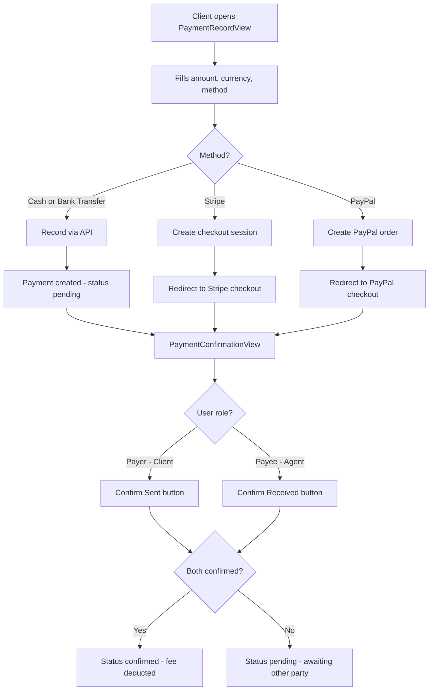

# Section 5g — Payment Frontend Pages

## Context

Section 5g in `docs/TODO.md` (lines 341-348) requires 6 new payment-related views. The backend API, services, and store already exist. The router has placeholder `DashboardView` components for `/payments`, `/credits`, `/invoices`. This plan uses a TDD approach — tests first, then implementation.

## Current State

### Already Implemented
- **Backend routes** — [`src/server/routes/payments.ts`](src/server/routes/payments.ts) with all endpoints: list payments, record payment, confirm payer/payee, credits CRUD, invoices
- **Stripe routes** — [`src/server/routes/stripe.ts`](src/server/routes/stripe.ts) with connect, checkout session, webhook, status
- **Payment service** — [`src/services/payments.ts`](src/services/payments.ts) with `getPayments`, `recordPayment`, `confirmPayer`, `confirmPayee`, `getCreditBalance`, `purchaseCredits`, `getCreditTransactions`, `getInvoices`
- **Payments store** — [`src/stores/payments.ts`](src/stores/payments.ts) with `fetchPayments`, `fetchCreditBalance`, `fetchCreditTransactions`, `fetchInvoices`
- **Router placeholders** — `/payments`, `/credits`, `/invoices` all point to `DashboardView.vue`

### Missing
- No Stripe service functions (`getStripeStatus`, `connectStripe`)
- Store lacks `recordPayment`, `confirmPayer`, `confirmPayee`, `purchaseCredits` actions
- No payment view components
- No i18n keys for payment views
- Router needs real view components

## Architecture Decisions

1. **Views in `src/views/payments/`** — New directory, consistent with `missions/`, `messages/`, `auth/` patterns
2. **Extend existing store** — Add missing actions to [`src/stores/payments.ts`](src/stores/payments.ts) rather than creating new stores
3. **Extend existing service** — Add Stripe functions to [`src/services/payments.ts`](src/services/payments.ts)
4. **Reuse base components** — `BCard`, `BButton`, `BBadge`, `BTable`, `BInput`, `BModal`, `BAlert`
5. **TDD approach** — Write all tests first, then create views to make them pass

## Implementation Steps

### Step 1: Extend Service & Store (Code mode)

**File: [`src/services/payments.ts`](src/services/payments.ts)**
- Add `getStripeStatus()` — calls `GET /payments/stripe/status`
- Add `connectStripe()` — calls `POST /payments/stripe/connect`

**File: [`src/stores/payments.ts`](src/stores/payments.ts)**
- Add `Payment` interface fields: `payerId`, `payeeId`, `netAmount`, `platformFee`, `gatewayFee`, `confirmedByPayer`, `confirmedByPayee`, `confirmedAt`, `mission.title`
- Add `recordPayment(missionId, data)` action
- Add `confirmPayer(paymentId)` action
- Add `confirmPayee(paymentId)` action
- Add `purchaseCredits(amount)` action
- Add `stripeStatus` ref and `fetchStripeStatus()` action
- Add `connectStripe()` action

### Step 2: Add i18n Keys (Code mode)

Add `payments` namespace to all 3 locale files:
- `src/locales/en.json`
- `src/locales/fr.json`
- `src/locales/ar.json`

Keys needed:
```
payments.summary.title, subtitle
payments.summary.columns.status, amount, method, mission, date, actions
payments.summary.filters.all, sent, received, pending, confirmed
payments.summary.noPayments, noPaymentsHint
payments.record.title, subtitle
payments.record.fields.amount, currency, method, mission, payee
payments.record.methods.cash, bankTransfer, stripe, paypal
payments.record.submit, cancel, recording, recorded
payments.record.validation.amountRequired, missionRequired
payments.confirm.title, subtitle
payments.confirm.sent, received
payments.confirm.payerConfirm, payeeConfirm
payments.confirm.confirmed, pending
payments.confirm.status.confirmed, pending, awaitingPayer, awaitingPayee, awaitingBoth
payments.credits.title, subtitle
payments.credits.balance, purchaseTitle
payments.credits.purchaseAmount, purchaseButton, purchasing
payments.credits.transactions, transactionsTitle
payments.credits.columns.type, amount, description, date
payments.credits.types.purchase, deduction, refund, adjustment
payments.credits.noTransactions
payments.invoices.title, subtitle
payments.invoices.columns.period, totalFees, status, paidAt
payments.invoices.status.draft, sent, paid
payments.invoices.noInvoices
payments.stripe.title, subtitle
payments.stripe.status.connected, notConnected, connecting
payments.stripe.connect, disconnect
payments.stripe.configured, notConfigured
```

### Step 3: Create Test Files First (TDD — Code mode)

For each view, create a spec file following the pattern in [`tests/components/DashboardView.spec.ts`](tests/components/DashboardView.spec.ts):

1. **`tests/components/payments/PaymentSummaryView.spec.ts`**
   - Renders container, title, filters
   - Shows payments table when payments exist
   - Shows empty state when no payments
   - Filters by sent/received/pending/confirmed

2. **`tests/components/payments/PaymentRecordView.spec.ts`**
   - Renders form with amount, currency, method fields
   - Validates required fields
   - Calls store.recordPayment on submit
   - Shows success toast after recording

3. **`tests/components/payments/PaymentConfirmationView.spec.ts`**
   - Renders payment details
   - Shows payer confirm button (for payer role)
   - Shows payee confirm button (for payee role)
   - Displays confirmation status badges

4. **`tests/components/payments/CreditBalanceView.spec.ts`**
   - Renders credit balance
   - Shows purchase form
   - Lists transaction history
   - Shows empty state

5. **`tests/components/payments/InvoiceListView.spec.ts`**
   - Renders invoices table
   - Shows status badges
   - Shows empty state

6. **`tests/components/payments/StripeConnectView.spec.ts`**
   - Renders connection status
   - Shows connect button when disconnected
   - Shows connected status when connected
   - Shows unconfigured message when Stripe not configured

### Step 4: Create View Components (Code mode)

All views in `src/views/payments/`:

1. **`PaymentSummaryView.vue`** — Overview with stat cards (total sent, total received, pending confirmations), filterable payments table using BTable pattern from [`MissionListView.vue`](src/views/missions/MissionListView.vue)

2. **`PaymentRecordView.vue`** — Form with BInput for amount, currency select, method radio group (cash/bank_transfer/stripe/paypal), mission selector. Uses BCard, BButton, BAlert

3. **`PaymentConfirmationView.vue`** — Payment detail card with dual confirmation toggles. Payer sees "Confirm Sent", payee sees "Confirm Received". Status badges show awaiting state

4. **`CreditBalanceView.vue`** — Large balance display card, purchase credits form (BInput + BButton), transaction history table with type badges

5. **`InvoiceListView.vue`** — Table of invoices with period, total fees, status badge, paid date. Uses BTable pattern

6. **`StripeConnectView.vue`** — Connection status card, connect/disconnect button, OAuth redirect handling

### Step 5: Update Router (Code mode)

**File: [`src/router/index.ts`](src/router/index.ts)**

Replace DashboardView placeholders:
- `/payments` → `PaymentSummaryView.vue`
- `/credits` → `CreditBalanceView.vue`
- `/invoices` → `InvoiceListView.vue`

Add new routes:
- `/payments/record` → `PaymentRecordView.vue` (with optional `missionId` query param)
- `/payments/:id/confirm` → `PaymentConfirmationView.vue`
- `/stripe/connect` → `StripeConnectView.vue` (agent-only)

### Step 6: Run Tests & Fix Regressions (Code mode)

- Run `pnpm test` and ensure all tests pass
- Fix any regressions

### Step 7: Check off TODO items (Architect mode)

Update `docs/TODO.md` lines 343-348 to mark all 6 items as done.

### Step 8: Write Memory Summary (Architect mode)

Create `.memory/section-5g-payments/summary.md`

## File Summary

### New Files (8)
| File | Description |
|------|-------------|
| `src/views/payments/PaymentSummaryView.vue` | Payments overview page |
| `src/views/payments/PaymentRecordView.vue` | Record payment form |
| `src/views/payments/PaymentConfirmationView.vue` | Dual-party confirmation UI |
| `src/views/payments/CreditBalanceView.vue` | Credit balance + purchase + history |
| `src/views/payments/InvoiceListView.vue` | Agent invoices list |
| `src/views/payments/StripeConnectView.vue` | Stripe connection flow |
| `tests/components/payments/*.spec.ts` | 6 test files |

### Modified Files (5)
| File | Changes |
|------|---------|
| `src/services/payments.ts` | Add `getStripeStatus`, `connectStripe` |
| `src/stores/payments.ts` | Add actions, extend interfaces |
| `src/router/index.ts` | Replace placeholders, add new routes |
| `src/locales/en.json` | Add `payments` namespace |
| `src/locales/fr.json` | Add `payments` namespace |
| `src/locales/ar.json` | Add `payments` namespace |
| `docs/TODO.md` | Check off 5g items |

## Mermaid Flow: Payment Record → Confirm Flow


