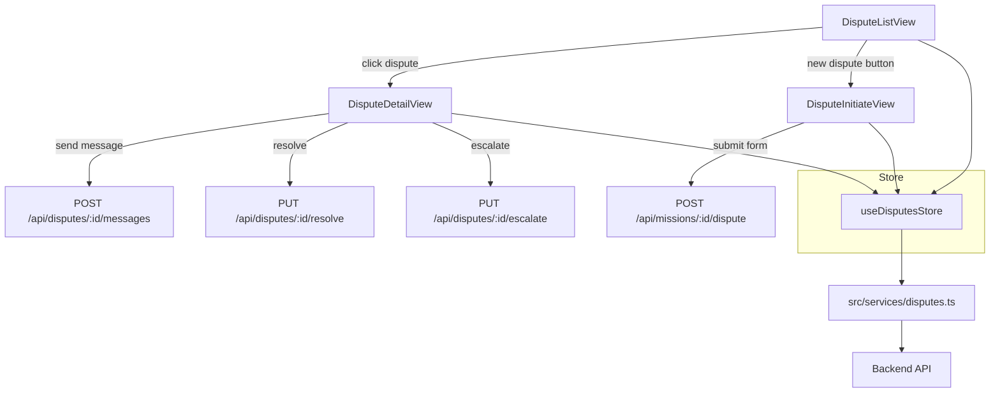

# Section 5i — Disputes Implementation Plan

## Context

The backend for disputes is already fully implemented:
- **Routes:** [`src/server/routes/disputes.ts`](src/server/routes/disputes.ts) — all endpoints exist: `GET /disputes`, `GET /disputes/:id`, `POST /disputes/:id/messages`, `PUT /disputes/:id/resolve`, `PUT /disputes/:id/escalate`, `POST /missions/:id/dispute`
- **Models:** [`Dispute`](src/server/database/models/index.ts:828) and [`DisputeMessage`](src/server/database/models/index.ts:871) models with full associations
- **Service:** [`src/services/disputes.ts`](src/services/disputes.ts) — has `getDisputes`, `getDispute`, `sendMessage`, `resolveDispute`, `escalateDispute` but is **missing** `createDispute(missionId, reason)` for the `POST /missions/:id/dispute` endpoint
- **Tests:** [`tests/services/disputes.spec.ts`](tests/services/disputes.spec.ts) — tests exist for all existing service functions

What's missing is the **frontend layer**: Pinia store, i18n keys, router configuration, and the three Vue views.

## Architecture Overview



## Implementation Steps

### Step 1: Extend Service Layer
**File:** [`src/services/disputes.ts`](src/services/disputes.ts)

Add missing `createDispute` function:
```ts
export function createDispute(missionId: string, reason: string) {
  return post(`/missions/${missionId}/dispute`, { reason })
}
```

### Step 2: Create Disputes Store
**File:** `src/stores/disputes.ts` (new)

Pinia store with the following interface:

```ts
interface Dispute {
  id: number
  missionId: number
  initiatedBy: number
  reason: string
  status: 'open' | 'reconciling' | 'resolved' | 'escalated'
  resolution: string | null
  resolvedAt: string | null
  mission?: { id: number; title: string; status: string }
  initiator?: { id: number; firstName: string; lastName: string }
  messages?: DisputeMessage[]
  createdAt?: string
  updatedAt?: string
}

interface DisputeMessage {
  id: number
  disputeId: number
  senderId: number
  content: string
  createdAt?: string
  sender?: { id: number; firstName: string; lastName: string }
}
```

**Actions:**
| Action | API Call | Purpose |
|--------|----------|---------|
| `fetchDisputes()` | `GET /api/disputes` | Load paginated dispute list |
| `fetchDispute(id)` | `GET /api/disputes/:id` | Load single dispute with messages |
| `sendMessage(disputeId, content)` | `POST /api/disputes/:id/messages` | Send message in dispute room |
| `resolveDispute(id, resolution)` | `PUT /api/disputes/:id/resolve` | Resolve the dispute |
| `escalateDispute(id)` | `PUT /api/disputes/:id/escalate` | Escalate to admin |
| `createDispute(missionId, reason)` | `POST /api/missions/:id/dispute` | Initiate a new dispute |

Pattern follows [`src/stores/messages.ts`](src/stores/messages.ts) exactly.

### Step 3: Add i18n Keys

Add a `disputes` section to all three locale files. Keys needed:

```json
{
  "disputes": {
    "title": "Disputes",
    "subtitle": "View and manage dispute reconciliation rooms.",
    "noDisputes": "No disputes yet.",
    "noDisputesHint": "If a mission has issues, you can initiate a dispute from the mission detail page.",
    "initiate": "Initiate Dispute",
    "view": "View",
    "status": {
      "open": "Open",
      "reconciling": "Reconciling",
      "resolved": "Resolved",
      "escalated": "Escalated"
    },
    "columns": {
      "mission": "Mission",
      "initiatedBy": "Initiated By",
      "status": "Status",
      "created": "Created",
      "actions": "Actions"
    },
    "detail": {
      "title": "Dispute #{id}",
      "mission": "Mission",
      "initiator": "Initiated By",
      "reason": "Reason",
      "status": "Status",
      "resolution": "Resolution",
      "resolvedAt": "Resolved At",
      "messages": "Messages",
      "noMessages": "No messages yet. Start the conversation below.",
      "composerPlaceholder": "Type a message to the other party...",
      "actions": {
        "resolve": "Resolve Dispute",
        "escalate": "Escalate to Admin",
        "back": "← Back to Disputes"
      },
      "resolveModal": {
        "title": "Resolve Dispute",
        "message": "Describe the resolution agreed upon by both parties.",
        "placeholder": "Enter the resolution details...",
        "confirm": "Confirm Resolution",
        "cancel": "Cancel"
      },
      "escalateConfirm": "Are you sure you want to escalate this dispute to admin review?",
      "resolved": "Dispute resolved successfully.",
      "escalated": "Dispute escalated to admin.",
      "messageSent": "Message sent."
    },
    "initiate": {
      "title": "Initiate Dispute",
      "subtitle": "Report an issue with a mission to start the reconciliation process.",
      "fields": {
        "mission": "Mission",
        "missionPlaceholder": "Select a mission",
        "reason": "Reason for Dispute",
        "reasonPlaceholder": "Describe the issue you are experiencing with this mission..."
      },
      "submit": "Submit Dispute",
      "submitting": "Submitting...",
      "submitted": "Dispute initiated successfully.",
      "back": "← Back",
      "validation": {
        "missionRequired": "Please select a mission.",
        "reasonRequired": "Please describe the reason for this dispute."
      }
    }
  }
}
```

### Step 4: Create DisputeListView

**File:** `src/views/disputes/DisputeListView.vue` (new)

Pattern: follows [`MessageListView.vue`](src/views/messages/MessageListView.vue)

**Features:**
- Page title + "Initiate Dispute" button
- Loading spinner
- Empty state with icon + hint text
- Card list of disputes showing: mission title, initiator name, status badge (color-coded), created date, "View" button
- Status badge color mapping: open=accent, reconciling=info, resolved=success, escalated=warning
- Click navigates to dispute detail

**Scoped CSS:** uses BEM naming `ds-dispute-list`, consistent with existing views.

### Step 5: Create DisputeDetailView

**File:** `src/views/disputes/DisputeDetailView.vue` (new)

Pattern: follows [`MessageThreadView.vue`](src/views/messages/MessageThreadView.vue)

**Features:**
- Header with back button + dispute title (`Dispute #{id}`)
- Info cards: Mission, Initiated By, Status, Reason
- Message thread area (reuses [`MessageBubble`](src/components/messaging/MessageBubble.vue))
- [`MessageComposer`](src/components/messaging/MessageComposer.vue) at the bottom
- Action buttons (conditional on status):
  - "Resolve" button → opens a modal with resolution textarea → calls `resolveDispute`
  - "Escalate" button → confirm dialog → calls `escalateDispute`
  - Both buttons hidden when status is `resolved`
- Auto-scroll to bottom on new message

**Scoped CSS:** uses BEM naming `ds-dispute-detail`.

### Step 6: Create DisputeInitiateView

**File:** `src/views/disputes/DisputeInitiateView.vue` (new)

Pattern: follows [`PaymentRecordView.vue`](src/views/payments/PaymentRecordView.vue)

**Features:**
- Back button + page title
- Form with:
  - Mission select dropdown (fetched from missions store — shows available missions that are `in_progress` or `completed`)
  - Reason textarea (required)
- Submit button (disabled until valid)
- Validation: mission required, reason required
- On submit: calls `createDispute`, then navigates to dispute list on success
- Optionally auto-fill mission from query param `?missionId=X`

**Scoped CSS:** uses BEM naming `ds-dispute-initiate`.

### Step 7: Update Router

**File:** [`src/router/index.ts`](src/router/index.ts)

Replace the placeholder disputes route (line 173-178) with proper routes:

```ts
{
  path: 'disputes',
  name: 'disputes',
  component: () => import('@/views/disputes/DisputeListView.vue'),
  meta: { requiresAuth: true, title: 'Disputes' },
},
{
  path: 'disputes/initiate',
  name: 'dispute-initiate',
  component: () => import('@/views/disputes/DisputeInitiateView.vue'),
  meta: { requiresAuth: true, title: 'Initiate Dispute' },
},
{
  path: 'disputes/:id',
  name: 'dispute-detail',
  component: () => import('@/views/disputes/DisputeDetailView.vue'),
  meta: { requiresAuth: true, title: 'Dispute Detail' },
},
```

### Step 8: Write Tests (TDD — tests first)

#### 8a. Store Test: `tests/stores/disputes.spec.ts`

Following pattern of [`tests/stores/messages.spec.ts`](tests/stores/messages.spec.ts):

| Test | Description |
|------|-------------|
| Initial state | Empty disputes list, no current dispute, loading false |
| `fetchDisputes()` | Loads disputes from API, sets error on failure |
| `fetchDispute()` | Loads single dispute with messages, sets error on failure |
| `sendMessage()` | Appends new message to dispute messages |
| `resolveDispute()` | Updates dispute status to resolved, sets resolution |
| `escalateDispute()` | Updates dispute status to escalated |
| `createDispute()` | Creates dispute, returns new dispute data |

#### 8b. View Tests: `tests/components/disputes/DisputeListView.spec.ts`

Following pattern of [`tests/components/payments/PaymentSummaryView.spec.ts`](tests/components/payments/PaymentSummaryView.spec.ts):

| Test | Description |
|------|-------------|
| Renders container | `.ds-dispute-list` exists |
| Renders title | Title element exists |
| Shows empty state | When no disputes |
| Calls fetchDisputes on mount | Store action called |
| Renders dispute list items | Card items rendered when data present |
| Shows initiate button | Button exists for creating disputes |
| Click navigates to detail | Router push on item click |

#### 8c. View Tests: `tests/components/disputes/DisputeDetailView.spec.ts`

| Test | Description |
|------|-------------|
| Renders container | `.ds-dispute-detail` exists |
| Renders header | Title and back button present |
| Shows loading state | Spinner shown when loading |
| Renders info cards | Mission, status, reason cards present |
| Renders message thread | Messages displayed when present |
| Renders composer | MessageComposer at bottom |
| Shows resolve button | Button visible for open/reconciling status |
| Shows escalate button | Button visible for open/reconciling status |
| Hides actions when resolved | Buttons hidden for resolved status |

#### 8d. View Tests: `tests/components/disputes/DisputeInitiateView.spec.ts`

| Test | Description |
|------|-------------|
| Renders container | `.ds-dispute-initiate` exists |
| Renders form | Mission select and reason textarea present |
| Submit disabled initially | Button disabled when form empty |
| Validation messages | Error shown when submitting empty form |
| Calls createDispute on submit | Store action called with form data |
| Shows success and navigates | Toast + router push after success |

#### 8e. Update existing test: `tests/services/disputes.spec.ts`

Add test for `createDispute`:
```ts
describe('createDispute()', () => {
  it('calls POST /api/missions/:id/dispute with reason', async () => { ... })
})
```

### Step 9: Run Tests & Verify No Regressions

```bash
pnpm test
```

### Step 10: Update TODO

Check off the 3 items in [`docs/TODO.md`](docs/TODO.md:356):
- `DisputeListView.vue`
- `DisputeDetailView.vue`
- `DisputeInitiateView.vue`

## File Summary

| # | File | Action |
|---|------|--------|
| 1 | `src/services/disputes.ts` | Modify — add `createDispute` |
| 2 | `src/stores/disputes.ts` | Create — new Pinia store |
| 3 | `src/locales/en.json` | Modify — add `disputes` keys |
| 4 | `src/locales/fr.json` | Modify — add `disputes` keys |
| 5 | `src/locales/ar.json` | Modify — add `disputes` keys |
| 6 | `src/views/disputes/DisputeListView.vue` | Create |
| 7 | `src/views/disputes/DisputeDetailView.vue` | Create |
| 8 | `src/views/disputes/DisputeInitiateView.vue` | Create |
| 9 | `src/router/index.ts` | Modify — update dispute routes |
| 10 | `tests/stores/disputes.spec.ts` | Create |
| 11 | `tests/components/disputes/DisputeListView.spec.ts` | Create |
| 12 | `tests/components/disputes/DisputeDetailView.spec.ts` | Create |
| 13 | `tests/components/disputes/DisputeInitiateView.spec.ts` | Create |
| 14 | `tests/services/disputes.spec.ts` | Modify — add `createDispute` test |
| 15 | `docs/TODO.md` | Modify — check off items |

## Reused Components

- [`MessageBubble`](src/components/messaging/MessageBubble.vue) — dispute message rendering
- [`MessageComposer`](src/components/messaging/MessageComposer.vue) — dispute message input
- [`BCard`](src/components/base/BCard.vue) — card layout
- [`BBadge`](src/components/base/BBadge.vue) — status badges
- [`BButton`](src/components/base/BButton.vue) — action buttons
- [`BSelect`](src/components/base/BSelect.vue) — mission selector in initiate form
- [`BAlert`](src/components/base/BAlert.vue) — success/error messages
- [`useToast`](src/composables/useToast.ts) — toast notifications

## Execution Order

The TDD approach means **tests are written before implementation** within each layer:

1. Service layer: add `createDispute` + test
2. Store: write tests, then implement
3. i18n: add all keys
4. Views: write tests for each, then implement views
5. Router: update routes
6. Full test suite run
