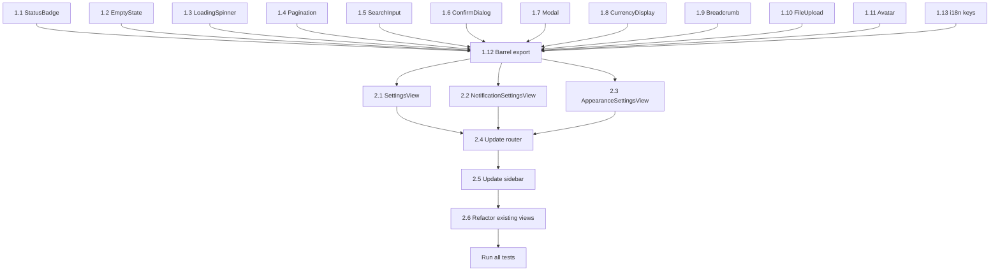

# Plan: Section 5j (Settings) & 5k (Shared Components)

## Overview

Create shared/common components first, then build Settings views that leverage them. All components follow the existing design system (`ds-*` CSS classes, `<script lang="ts" setup>`, scoped styles, i18n for 3 locales).

## Context

### Existing Foundations to Leverage

| What | Location | Notes |
|------|----------|-------|
| `BModal` | [`src/components/base/BModal.vue`](src/components/base/BModal.vue) | v-model, title, size, footer slot |
| `BBadge` | [`src/components/base/BBadge.vue`](src/components/base/BBadge.vue) | variant (success/info/warning/danger/accent/default), size |
| `BAvatar` | [`src/components/base/BAvatar.vue`](src/components/base/BAvatar.vue) | src, name, initials fallback, online dot |
| `BButton` | [`src/components/base/BButton.vue`](src/components/base/BButton.vue) | accent/outline/ghost/danger variants, loading, to/href |
| `BCard` | [`src/components/base/BCard.vue`](src/components/base/BCard.vue) | bordered/transparent/elevated, header/footer slots |
| `BInput` | [`src/components/base/BInput.vue`](src/components/base/BInput.vue) | v-model, label, error, hint, icon, type |
| `usePagination` | [`src/composables/usePagination.ts`](src/composables/usePagination.ts) | page, perPage, total, totalPages, next, prev, goTo |
| `useDebounce` | [`src/composables/useDebounce.ts`](src/composables/useDebounce.ts) | immediateValue, debouncedValue, update |
| `useConfirmDialog` | [`src/composables/useConfirmDialog.ts`](src/composables/useConfirmDialog.ts) | isVisible, title, message, showConfirm, confirm, cancel |
| `useToast` | [`src/composables/useToast.ts`](src/composables/useToast.ts) | success, error, warning, info |
| `useUiStore` | [`src/stores/ui.ts`](src/stores/ui.ts) | theme (dark/light), setTheme |
| CSS classes | [`src/assets/main.css`](src/assets/main.css) | ds-badge, ds-avatar, ds-modal, ds-empty-state, ds-table-pager, ds-spin |
| `MissionAttachments.vue` | [`src/components/mission/MissionAttachments.vue`](src/components/mission/MissionAttachments.vue) | Drag-and-drop upload pattern to extract |

### Design Conventions

- CSS prefix: `ds-` for all class names
- Font: Fraunces (headings), Inter (body), Space Grotesk (mono/technical)
- Colors: `--ds-accent` (#c8ff00), `--ds-accent-2` (#7c5cff), `--ds-accent-3` (#00d4ff), `--ds-warm` (#ff7a59)
- RTL support: use logical properties (inset-inline-start/end), no-flip class for LTR content
- Tests: Vitest + `@vue/test-utils`, setup in [`tests/helpers/setup.ts`](tests/helpers/setup.ts), test files in `tests/components/` mirroring source structure

---

## Phase 1: Shared Components 5k

### Task 1.1 — `StatusBadge.vue`

**File:** `src/components/common/StatusBadge.vue`

Wraps `BBadge` with a status-to-variant mapping. Extracts the duplicated `statusBadgeVariant()` logic found in [`MissionListView.vue`](src/views/missions/MissionListView.vue:18) and similar views.

**Props:**
- `status: string` — e.g. `in_progress`, `agreed`, `completed`, `pending_agreement`, `disputed`, `draft`, `cancelled`, or payment statuses
- `type?: 'mission' | 'payment' | 'subscription'` — which status mapping to use (default: `mission`)
- `size?: 'sm' | 'md'` — forwarded to BBadge

**Slots:**
- `default` — override the auto-generated label

**Behavior:**
- Maps status strings to BBadge variant and i18n label key
- Mission statuses: `in_progress` → info, `agreed` → accent, `pending_agreement` → warning, `completed` → success, `disputed` → danger, `draft`/`cancelled` → default
- Payment statuses: `completed` → success, `pending` → warning, `failed` → danger, etc.
- Subscription statuses: `active` → success, `past_due` → warning, `cancelled` → default

**Test:** `tests/components/common/StatusBadge.spec.ts`

---

### Task 1.2 — `EmptyState.vue`

**File:** `src/components/common/EmptyState.vue`

Wraps the existing `.ds-empty-state` CSS classes into a reusable component.

**Props:**
- `icon?: string` — Bootstrap icon class (default: `bi-inbox`)
- `title?: string` — heading text
- `hint?: string` — description text

**Slots:**
- `default` — action buttons area (below hint)
- `icon` — override icon slot

**Test:** `tests/components/common/EmptyState.spec.ts`

---

### Task 1.3 — `LoadingSpinner.vue`

**File:** `src/components/common/LoadingSpinner.vue`

**Props:**
- `size?: 'sm' | 'md' | 'lg'` — default `md`
- `label?: string` — optional loading text

**Slots:**
- `default` — alternative to `label` prop

**Behavior:** Uses the existing `ds-spin` keyframe animation from [`main.css`](src/assets/main.css:453).

**Test:** `tests/components/common/LoadingSpinner.spec.ts`

---

### Task 1.4 — `Pagination.vue`

**File:** `src/components/common/Pagination.vue`

Wraps the existing `.ds-table-pager` CSS and `usePagination` composable logic.

**Props:**
- `modelValue: number` — current page (v-model)
- `totalPages: number`
- `siblingCount?: number` — pages shown on each side of current (default: 1)

**Events:**
- `update:modelValue` — page changed

**Behavior:**
- Renders prev/next arrows + page numbers with ellipsis
- Uses `ds-table-pager` / `ds-table-pager__link` / `ds-table-pager__item` classes
- RTL-aware via existing CSS rules for chevron flipping

**Test:** `tests/components/common/Pagination.spec.ts`

---

### Task 1.5 — `SearchInput.vue`

**File:** `src/components/common/SearchInput.vue`

Debounced search input using `useDebounce`.

**Props:**
- `modelValue: string` — search text (v-model)
- `placeholder?: string`
- `debounce?: number` — delay in ms (default: 300)

**Events:**
- `update:modelValue` — immediate value change
- `search` — debounced value emitted

**Behavior:**
- Uses `ds-topnavbar__search` style pattern (icon + input + clear button)
- Shows clear button when value is non-empty
- Supports v-model for immediate value

**Test:** `tests/components/common/SearchInput.spec.ts`

---

### Task 1.6 — `ConfirmDialog.vue`

**File:** `src/components/common/ConfirmDialog.vue`

Visual confirmation dialog pairing with `useConfirmDialog` composable.

**Props:**
- `modelValue: boolean` — visibility (v-model)
- `title: string`
- `message?: string`
- `confirmLabel?: string`
- `cancelLabel?: string`
- `variant?: 'danger' | 'accent'` — confirm button style

**Events:**
- `update:modelValue`
- `confirm`
- `cancel`

**Behavior:**
- Uses `BModal` (size `sm`) internally
- Footer has Cancel (ghost) and Confirm (accent/danger) buttons
- Emits confirm/cancel events for parent to handle

**Test:** `tests/components/common/ConfirmDialog.spec.ts`

---

### Task 1.7 — `Modal.vue`

**File:** `src/components/common/Modal.vue`

Enhanced wrapper around `BModal` with loading state and confirm/cancel pattern.

**Props:**
- `modelValue: boolean` — visibility (v-model)
- `title?: string`
- `size?: 'sm' | 'md' | 'lg'`
- `loading?: boolean` — disables footer buttons, shows spinner on confirm
- `confirmLabel?: string`
- `cancelLabel?: string`
- `hideFooter?: boolean`

**Events:**
- `update:modelValue`
- `confirm`
- `cancel`

**Slots:**
- `default` — body content
- `footer` — override footer

**Behavior:**
- Delegates to `BModal`
- Footer: Cancel (ghost) + Confirm (accent, with loading spinner)
- Escape key and overlay click close the modal

**Test:** `tests/components/common/Modal.spec.ts`

---

### Task 1.8 — `CurrencyDisplay.vue`

**File:** `src/components/common/CurrencyDisplay.vue`

Formatted currency amount using Space Grotesk font.

**Props:**
- `amount: number`
- `currency: string` — currency code (e.g. `USD`)
- `size?: 'sm' | 'md' | 'lg'` — default `md`

**Behavior:**
- Formats amount with Intl.NumberFormat
- Uses `font-mono` class for Space Grotesk rendering
- Optionally shows currency symbol/code

**Test:** `tests/components/common/CurrencyDisplay.spec.ts`

---

### Task 1.9 — `Breadcrumb.vue`

**File:** `src/components/common/Breadcrumb.vue`

Page breadcrumb navigation.

**Props:**
- `items: Array<{ label: string; to?: string }>` — each item has label and optional route

**Behavior:**
- Renders as horizontal nav with `/` separators
- Last item is plain text (current page), others are RouterLinks
- Uses `ds-text-muted` for separators and non-current items
- RTL-aware

**Test:** `tests/components/common/Breadcrumb.spec.ts`

---

### Task 1.10 — `FileUpload.vue`

**File:** `src/components/common/FileUpload.vue`

Generalized drag-and-drop file upload extracted from [`MissionAttachments.vue`](src/components/mission/MissionAttachments.vue:30).

**Props:**
- `accept?: string` — file types (default: `.pdf,.doc,.docx,.jpg,.jpeg,.png`)
- `maxSize?: number` — max file size in bytes (default: 10MB)
- `loading?: boolean`

**Events:**
- `upload:file` — File object
- `error` — validation error message

**Slots:**
- `default` — override the upload area content

**Behavior:**
- Drag-and-drop zone with visual feedback
- Click to browse files
- File validation (size, type)
- Uses existing `.ds-mission-attachments__upload` CSS pattern

**Test:** `tests/components/common/FileUpload.spec.ts`

---

### Task 1.11 — `Avatar.vue`

**File:** `src/components/common/Avatar.vue`

Thin wrapper around `BAvatar` with additional features.

**Props:** Same as BAvatar (src, name, size, online)

**Additional behavior:**
- Emits `click` event
- Optional `ring` prop for highlighted state (accent-colored border)

**Note:** BAvatar already handles image + initials fallback. This component adds a consistent common-level entry point.

**Test:** `tests/components/common/Avatar.spec.ts`

---

### Task 1.12 — Update barrel export

**File:** `src/components/common/index.ts`

Export all common components for convenient importing.

---

### Task 1.13 — Add i18n keys

**Files:** `src/locales/en.json`, `src/locales/fr.json`, `src/locales/ar.json`

Add a `"common"` section with keys for:
- `common.status.*` — status labels (mission + payment + subscription statuses)
- `common.emptyState.*` — default titles/hints
- `common.loading` — default loading text
- `common.pagination.*` — prev/next/ellipsis labels
- `common.search.*` — placeholder
- `common.confirm.*` — confirm/cancel labels
- `common.fileUpload.*` — upload hints, error messages
- `common.breadcrumb.*` — home label
- `common.currency.*` — currency formatting hints

---

## Phase 2: Settings Views 5j

### Task 2.1 — `SettingsView.vue`

**File:** `src/views/settings/SettingsView.vue`

Unified account settings page with tabs/sections for email, name, and password change.

**Sections:**
1. **Personal Info** — First name, last name, email (read-only with verify link)
2. **Change Password** — Current password, new password, confirm password

**Behavior:**
- Uses `BCard` for each section
- Uses `BInput` for form fields
- Uses `BButton` with `loading` prop for save actions
- Validates password match before submit
- Uses `useToast` for success/error feedback
- Calls `useAuthStore` for user data
- Calls `users` service for profile updates

**Router:** Add route under `/app/settings` that renders a settings layout with sub-routes (replacing current agent-only route)

**Test:** `tests/components/settings/SettingsView.spec.ts`

---

### Task 2.2 — `NotificationSettingsView.vue`

**File:** `src/views/settings/NotificationSettingsView.vue`

Email notification preferences.

**Settings:**
- Mission updates (on/off)
- Payment notifications (on/off)
- New messages (on/off)
- Dispute updates (on/off)
- Marketing emails (on/off)

**Behavior:**
- Toggle switches using `BCheckbox` components
- Save button to persist preferences
- Uses `BCard` layout

**Test:** `tests/components/settings/NotificationSettingsView.spec.ts`

---

### Task 2.3 — `AppearanceSettingsView.vue`

**File:** `src/views/settings/AppearanceSettingsView.vue`

Theme and display preferences.

**Settings:**
- Dark/Light mode toggle (uses `useUiStore().setTheme()`)
- Language selector (uses vue-i18n locale switching)

**Behavior:**
- Radio group or toggle for theme
- Language dropdown with en/fr/ar options
- Saves to UI store and localStorage

**Test:** `tests/components/settings/AppearanceSettingsView.spec.ts`

---

### Task 2.4 — Update router

**File:** `src/router/index.ts`

Restructure `/app/settings` to use a settings layout:
- `/app/settings` → `SettingsView` (account settings, default)
- `/app/settings/notifications` → `NotificationSettingsView`
- `/app/settings/appearance` → `AppearanceSettingsView`

Remove role restriction (`roles: ['agent']`) from settings route so both agents and clients can access.

---

### Task 2.5 — Update sidebar

**File:** `src/components/layout/Sidebar.vue`

Update settings link to point to the unified `/app/settings` route. Remove the separate client settings link.

---

### Task 2.6 — Refactor existing views to use common components

Replace duplicated patterns in existing views:

| View | Component to use |
|------|-----------------|
| [`MissionListView.vue`](src/views/missions/MissionListView.vue:18) `statusBadgeVariant()` | `StatusBadge` |
| [`MissionListView.vue`](src/views/missions/MissionListView.vue:119) empty state | `EmptyState` |
| [`MissionListView.vue`](src/views/missions/MissionListView.vue:114) loading spinner | `LoadingSpinner` |
| [`DisputeListView.vue`](src/views/disputes/DisputeListView.vue) empty state | `EmptyState` |
| [`MessageListView.vue`](src/views/messages/MessageListView.vue) empty state | `EmptyState` |
| [`MissionAttachments.vue`](src/components/mission/MissionAttachments.vue) upload area | `FileUpload` |
| [`CreditBalanceView.vue`](src/views/payments/CreditBalanceView.vue) currency display | `CurrencyDisplay` |

---

## Execution Order

## Files to Create

- `src/components/common/StatusBadge.vue`
- `src/components/common/EmptyState.vue`
- `src/components/common/LoadingSpinner.vue`
- `src/components/common/Pagination.vue`
- `src/components/common/SearchInput.vue`
- `src/components/common/ConfirmDialog.vue`
- `src/components/common/Modal.vue`
- `src/components/common/CurrencyDisplay.vue`
- `src/components/common/Breadcrumb.vue`
- `src/components/common/FileUpload.vue`
- `src/components/common/Avatar.vue`
- `src/components/common/index.ts`
- `src/views/settings/SettingsView.vue`
- `src/views/settings/NotificationSettingsView.vue`
- `src/views/settings/AppearanceSettingsView.vue`
- `tests/components/common/StatusBadge.spec.ts`
- `tests/components/common/EmptyState.spec.ts`
- `tests/components/common/LoadingSpinner.spec.ts`
- `tests/components/common/Pagination.spec.ts`
- `tests/components/common/SearchInput.spec.ts`
- `tests/components/common/ConfirmDialog.spec.ts`
- `tests/components/common/Modal.spec.ts`
- `tests/components/common/CurrencyDisplay.spec.ts`
- `tests/components/common/Breadcrumb.spec.ts`
- `tests/components/common/FileUpload.spec.ts`
- `tests/components/common/Avatar.spec.ts`
- `tests/components/settings/SettingsView.spec.ts`
- `tests/components/settings/NotificationSettingsView.spec.ts`
- `tests/components/settings/AppearanceSettingsView.spec.ts`

## Files to Modify

- `src/locales/en.json` — add `common.*` i18n keys
- `src/locales/fr.json` — add `common.*` i18n keys
- `src/locales/ar.json` — add `common.*` i18n keys
- `src/router/index.ts` — restructure settings routes
- `src/components/layout/Sidebar.vue` — unified settings link
- `src/views/missions/MissionListView.vue` — use StatusBadge, EmptyState, LoadingSpinner
- `src/views/disputes/DisputeListView.vue` — use EmptyState
- `src/views/messages/MessageListView.vue` — use EmptyState
- `src/components/mission/MissionAttachments.vue` — use FileUpload
- `src/views/payments/CreditBalanceView.vue` — use CurrencyDisplay
- `docs/TODO.md` — check off completed items
