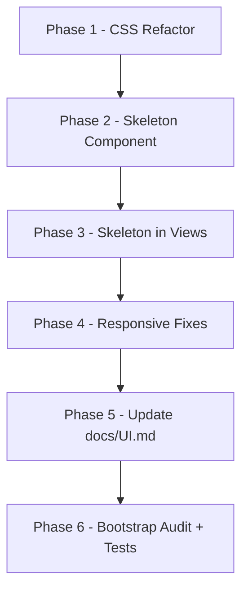

# Section 6: Styling & UI

## Overview

Refactor and enhance the CSS system, add skeleton loading screens, fix responsive design gaps, update the UI documentation, and audit Bootstrap consistency.

## Current State Analysis

**What already works well:**
- CSS variables exist in `:root` for backgrounds, text, accents, borders, and gradients
- Dark theme is consistent across the app
- `LoadingSpinner` component exists
- 11 of 18 scoped-style views already have `@media` responsive queries
- Component design system (`ds-*` classes) is well established

**What needs work:**
- 7 views lack responsive styles entirely
- No skeleton loading screens (only spinner)
- Some scoped styles use hardcoded fallback hex values (e.g., `#64748b`, `#f1f5f9`) instead of CSS variables
- Missing spacing/sizing/shadow design tokens
- No responsive utility classes (show/hide on mobile/desktop)
- No skeleton screen CSS

## Execution Plan (6 Phases)

### Phase 1: CSS Variables & Utility Classes

**File:** `src/assets/main.css`

1. Add missing design tokens to `:root`:
   - Spacing scale: `--ds-space-1` through `--ds-space-8`
   - Font size scale: `--ds-text-xs` through `--ds-text-3xl`
   - Border radius scale: `--ds-radius-sm` through `--ds-radius-full`
   - Shadow scale: `--ds-shadow-sm` through `--ds-shadow-lg`
   - Transition durations: `--ds-duration-fast`, `--ds-duration-normal`, `--ds-duration-slow`

2. Extract hardcoded fallback values from scoped styles:
   - Replace `#64748b` with `var(--ds-text-muted)`
   - Replace `#f1f5f9` with `var(--ds-text)`
   - Replace `#334155` with `var(--ds-border)`
   - Replace `#1e293b` with `var(--ds-surface)`
   - Replace `#6366f1` with `var(--ds-accent-2)`

3. Add layout utility classes:
   - `.ds-flex`, `.ds-flex-col`, `.ds-flex-wrap`
   - `.ds-items-center`, `.ds-justify-between`, `.ds-justify-center`
   - `.ds-gap-{1-8}`, `.ds-p-{1-8}`, `.ds-m-{1-8}`, `.ds-mt-{1-8}`, `.ds-mb-{1-8}`
   - `.ds-text-center`, `.ds-text-start`, `.ds-text-end`
   - `.ds-w-full`, `.ds-h-full`

4. Add responsive utility classes:
   - `.ds-hidden-mobile` — hidden below 768px
   - `.ds-hidden-desktop` — hidden above 768px
   - `.ds-show-mobile` — visible only below 768px
   - `.ds-show-desktop` — visible only above 768px

5. Add skeleton screen CSS:
   - `.ds-skeleton` — base shimmer animation
   - `.ds-skeleton--text` — text line placeholder
   - `.ds-skeleton--circle` — circular placeholder
   - `.ds-skeleton--card` — card-shaped placeholder
   - `.ds-skeleton--line` — single line placeholder

### Phase 2: SkeletonLoader Component

**New file:** `src/components/common/SkeletonLoader.vue`

Props:
- `variant`: `'text' | 'circle' | 'card' | 'line' | 'custom'` (default: `'text'`)
- `width`: `string` (default: `'100%'`)
- `height`: `string` (default: depends on variant)
- `lines`: `number` (default: 3, for text variant)
- `rounded`: `boolean` (default: `true`)

Export from `src/components/common/index.ts`.

Write unit test: `tests/components/common/SkeletonLoader.spec.ts`

### Phase 3: Skeleton Loading in Views

Add skeleton loading placeholders to these views (show skeleton while `store.loading` is true and data hasn't loaded yet):

1. `src/views/agent/AgentDashboard.vue` — stats grid + mission list skeleton
2. `src/views/client/ClientDashboard.vue` — stats grid + mission list skeleton
3. `src/views/missions/MissionDetailView.vue` — header + info cards + content grid skeleton
4. `src/views/missions/MissionListView.vue` — table rows skeleton
5. `src/views/messages/MessageListView.vue` — conversation list skeleton
6. `src/views/messages/MessageThreadView.vue` — message bubbles skeleton
7. `src/views/payments/PaymentSummaryView.vue` — stats + table skeleton
8. `src/views/payments/CreditBalanceView.vue` — balance + transactions skeleton

### Phase 4: Responsive Design Fixes

Add `@media` responsive styles to views that lack them:

1. `src/views/missions/MissionCreateView.vue` — form fields stack on mobile
2. `src/views/missions/MissionAgreementView.vue` — checklist stacks on mobile
3. `src/views/messages/MessageThreadView.vue` — message layout adjusts on mobile
4. `src/views/payments/PaymentRecordView.vue` — form stacks on mobile
5. `src/views/disputes/DisputeInitiateView.vue` — form stacks on mobile
6. `src/views/disputes/DisputeListView.vue` — list adjusts on mobile
7. `src/views/payments/StripeConnectView.vue` — content adjusts on mobile
8. Settings views — ensure responsive (SettingsView, NotificationSettings, AppearanceSettings)
9. Agent views — ensure responsive (AgentProfileSetup, AgentProfileView, AgentSettingsView)
10. Client views — ensure responsive (ClientProfileView, ClientSettingsView, AgentDiscoveryView)
11. Sidebar — add mobile hamburger menu toggle
12. LandingPage.vue — ensure responsive

### Phase 5: Update docs/UI.md

Add the following sections to `docs/UI.md`:

1. **Design Tokens** section documenting:
   - Color palette with CSS variable names
   - Typography scale with font families
   - Spacing scale
   - Border radius scale
   - Shadow scale
   - Transition durations

2. **SkeletonLoader** component documentation in the Components Library section

3. **Responsive Design** section documenting breakpoints and patterns

### Phase 6: Bootstrap Audit & Final Validation

1. Audit all views for inconsistent use of Bootstrap grid vs custom CSS
2. Replace hardcoded pixel values with CSS variables where appropriate
3. Ensure all forms use consistent spacing patterns
4. Run full test suite: `pnpm test`
5. Update `docs/TODO.md` — check off completed Section 6 items
6. Create memory summary in `.memory/section-6-styling-ui/summary.md`

## Mermaid Diagram

