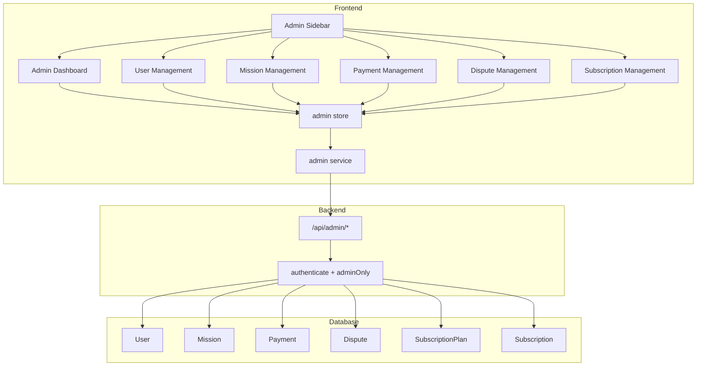
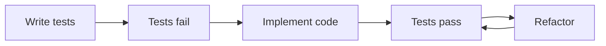

# Section 7 — Admin Management Features

> Full admin panel: backend CRUD routes, frontend views, service, store, sidebar — all with TDD.

---

## 1. Architecture Overview



---

## 2. TDD Strategy

Every feature follows this cycle per layer:



**Test layers (in order):**

1. **Backend route tests** — `tests/server/routes/admin.spec.ts` (using `app.request()` pattern)
2. **Frontend service tests** — `tests/services/admin.spec.ts` (mock `@/services/api`)
3. **Frontend store tests** — `tests/stores/admin.spec.ts` (mock `@/services/admin`)
4. **Frontend component tests** — `tests/components/admin/*.spec.ts` (mount with `@vue/test-utils`)

**Existing conventions to follow:**
- Backend tests: use `app.request('/api/admin/...')` with Hono's built-in test helper
- Frontend service tests: mock `@/services/api` (get, post, put, del)
- Frontend store tests: mock `@/services/admin`, use `setActivePinia(createPinia())`
- Component tests: mount with `createPinia()` + `createMemoryHistory()` router
- All tests in `tests/` directory, `.spec.ts` extension

---

## 3. Backend Routes — `/api/admin`

Existing routes to expand in [`src/server/routes/admin.ts`](src/server/routes/admin.ts):

### 3a. User Management

| Method | Endpoint | Description | Status |
|--------|----------|-------------|--------|
| `GET` | `/api/admin/users` | List all users with pagination, search, role filter | ✅ exists (needs search/filter) |
| `GET` | `/api/admin/users/:id` | Get user detail with profile | ❌ new |
| `PUT` | `/api/admin/users/:id` | Update user (role, emailVerified) | ❌ new |
| `DELETE` | `/api/admin/users/:id` | Soft-delete or deactivate user | ❌ new |

### 3b. Mission Management

| Method | Endpoint | Description | Status |
|--------|----------|-------------|--------|
| `GET` | `/api/admin/missions` | List all missions with filters | ❌ new |
| `GET` | `/api/admin/missions/:id` | Get mission detail | ❌ new |
| `PUT` | `/api/admin/missions/:id/status` | Override mission status | ❌ new |

### 3c. Payment Management

| Method | Endpoint | Description | Status |
|--------|----------|-------------|--------|
| `GET` | `/api/admin/payments` | List all payments with filters | ❌ new |
| `GET` | `/api/admin/payments/:id` | Get payment detail | ❌ new |

### 3d. Dispute Management

| Method | Endpoint | Description | Status |
|--------|----------|-------------|--------|
| `GET` | `/api/admin/disputes` | List all disputes (all statuses) | ✅ exists (only open) |
| `GET` | `/api/admin/disputes/:id` | Get dispute detail with messages | ❌ new |
| `PUT` | `/api/admin/disputes/:id/resolve` | Resolve dispute as admin | ❌ new |

### 3e. Subscription Plan Management

| Method | Endpoint | Description | Status |
|--------|----------|-------------|--------|
| `GET` | `/api/admin/subscription-plans` | List all plans | ❌ new |
| `POST` | `/api/admin/subscription-plans` | Create new plan | ❌ new |
| `PUT` | `/api/admin/subscription-plans/:id` | Update plan | ❌ new |
| `DELETE` | `/api/admin/subscription-plans/:id` | Deactivate plan | ❌ new |

### 3f. Stats (existing, enhanced)

| Method | Endpoint | Description | Status |
|--------|----------|-------------|--------|
| `GET` | `/api/admin/stats` | Platform overview stats | ✅ exists |
| `GET` | `/api/admin/stats/revenue` | Revenue breakdown by period | ❌ new |
| `GET` | `/api/admin/stats/activity` | Recent activity feed | ❌ new |

---

## 4. Frontend Files to Create/Modify

### 4a. Admin Service — `src/services/admin.ts` (new)

Functions to implement:

```ts
// Users
getUsers(params)           // GET /admin/users
getUser(id)                // GET /admin/users/:id
updateUser(id, data)       // PUT /admin/users/:id
 deleteUser(id)            // DELETE /admin/users/:id

// Missions
getMissions(params)        // GET /admin/missions
getMission(id)             // GET /admin/missions/:id
updateMissionStatus(id, s) // PUT /admin/missions/:id/status

// Payments
getPayments(params)        // GET /admin/payments
getPayment(id)             // GET /admin/payments/:id

// Disputes
getDisputes(params)        // GET /admin/disputes
getDispute(id)             // GET /admin/disputes/:id
resolveDispute(id, data)   // PUT /admin/disputes/:id/resolve

// Subscription Plans
getPlans()                 // GET /admin/subscription-plans
createPlan(data)           // POST /admin/subscription-plans
updatePlan(id, data)       // PUT /admin/subscription-plans/:id
deletePlan(id)             // DELETE /admin/subscription-plans/:id

// Stats
getStats()                 // GET /admin/stats
getRevenueStats(params)    // GET /admin/stats/revenue
getActivity(params)        // GET /admin/stats/activity
```

### 4b. Admin Store — `src/stores/admin.ts` (new)

State:

```ts
users: User[]
selectedUser: User | null
missions: Mission[]
selectedMission: Mission | null
payments: Payment[]
selectedPayment: Payment | null
disputes: Dispute[]
selectedDispute: Dispute | null
plans: SubscriptionPlan[]
stats: AdminStats | null
loading: Record<string, boolean>
error: string | null
pagination: Record<string, { page: number; total: number; limit: number }>
```

Actions: CRUD operations for each entity, fetchStats, pagination helpers.

### 4c. Admin Views

| File | Description |
|------|-------------|
| `src/views/admin/AdminLayout.vue` | Admin layout with admin-specific sidebar |
| `src/views/admin/AdminDashboardView.vue` | Stats overview cards, recent activity |
| `src/views/admin/AdminUsersView.vue` | User list table with search, role filter, actions |
| `src/views/admin/AdminUserDetailView.vue` | User detail, edit role, view profiles |
| `src/views/admin/AdminMissionsView.vue` | All missions list with filters |
| `src/views/admin/AdminMissionDetailView.vue` | Mission detail with status override |
| `src/views/admin/AdminPaymentsView.vue` | All payments list with filters |
| `src/views/admin/AdminDisputesView.vue` | All disputes list (all statuses) |
| `src/views/admin/AdminDisputeDetailView.vue` | Dispute detail with admin resolve |
| `src/views/admin/AdminSubscriptionsView.vue` | Subscription plans CRUD |

### 4d. Router Changes — `src/router/index.ts`

Replace the single `/app/admin` route with a nested admin route group:

```ts
{
  path: 'admin',
  component: () => import('@/views/admin/AdminLayout.vue'),
  meta: { requiresAuth: true, roles: ['admin'] },
  children: [
    { path: '', name: 'admin-dashboard', ... },
    { path: 'users', name: 'admin-users', ... },
    { path: 'users/:id', name: 'admin-user-detail', ... },
    { path: 'missions', name: 'admin-missions', ... },
    { path: 'missions/:id', name: 'admin-mission-detail', ... },
    { path: 'payments', name: 'admin-payments', ... },
    { path: 'disputes', name: 'admin-disputes', ... },
    { path: 'disputes/:id', name: 'admin-dispute-detail', ... },
    { path: 'subscriptions', name: 'admin-subscriptions', ... },
  ],
}
```

### 4e. Admin Sidebar — `src/views/admin/AdminSidebar.vue` (new)

Dedicated sidebar for admin section with navigation links:

- Dashboard (stats overview)
- Users (user management)
- Missions (all missions)
- Payments (all payments)
- Disputes (all disputes)
- Subscriptions (plan management)

### 4f. Sidebar.vue Update — `src/components/layout/Sidebar.vue`

Update the admin link to point to the new admin layout instead of generic dashboard.

### 4g. i18n Keys

Add admin-specific translations to all 3 locale files (`en.json`, `fr.json`, `ar.json`) under an `admin` namespace:

```json
{
  "admin": {
    "sidebar": { "dashboard": "...", "users": "...", ... },
    "dashboard": { "title": "...", "totalUsers": "...", ... },
    "users": { "title": "...", "search": "...", "role": "...", ... },
    "missions": { "title": "...", ... },
    "payments": { "title": "...", ... },
    "disputes": { "title": "...", ... },
    "subscriptions": { "title": "...", ... }
  }
}
```

---

## 5. Implementation Order (TDD)

### Phase 1: Backend Routes + Tests

Each sub-step: write tests first, then implement.

| Step | Tests | Implementation |
|------|-------|---------------|
| 1.1 | `tests/server/routes/admin.spec.ts` — user management tests | Enhance `src/server/routes/admin.ts` — user CRUD |
| 1.2 | Add mission management tests | Add mission admin endpoints |
| 1.3 | Add payment management tests | Add payment admin endpoints |
| 1.4 | Add dispute management tests (enhance existing) | Add dispute admin detail + resolve |
| 1.5 | Add subscription plan CRUD tests | Add subscription plan admin endpoints |
| 1.6 | Add stats enhancement tests | Add revenue/activity stats endpoints |

### Phase 2: Frontend Service + Tests

| Step | Tests | Implementation |
|------|-------|---------------|
| 2.1 | `tests/services/admin.spec.ts` — all service function tests | Create `src/services/admin.ts` |

### Phase 3: Frontend Store + Tests

| Step | Tests | Implementation |
|------|-------|---------------|
| 3.1 | `tests/stores/admin.spec.ts` — all store action tests | Create `src/stores/admin.ts` |

### Phase 4: Frontend Views + Component Tests

| Step | Tests | Implementation |
|------|-------|---------------|
| 4.1 | `tests/components/admin/AdminLayout.spec.ts` | Create `AdminLayout.vue` + `AdminSidebar.vue` |
| 4.2 | `tests/components/admin/AdminDashboardView.spec.ts` | Create `AdminDashboardView.vue` |
| 4.3 | `tests/components/admin/AdminUsersView.spec.ts` | Create `AdminUsersView.vue` |
| 4.4 | `tests/components/admin/AdminUserDetailView.spec.ts` | Create `AdminUserDetailView.vue` |
| 4.5 | `tests/components/admin/AdminMissionsView.spec.ts` | Create `AdminMissionsView.vue` |
| 4.6 | `tests/components/admin/AdminMissionDetailView.spec.ts` | Create `AdminMissionDetailView.vue` |
| 4.7 | `tests/components/admin/AdminPaymentsView.spec.ts` | Create `AdminPaymentsView.vue` |
| 4.8 | `tests/components/admin/AdminDisputesView.spec.ts` | Create `AdminDisputesView.vue` |
| 4.9 | `tests/components/admin/AdminDisputeDetailView.spec.ts` | Create `AdminDisputeDetailView.vue` |
| 4.10 | `tests/components/admin/AdminSubscriptionsView.spec.ts` | Create `AdminSubscriptionsView.vue` |

### Phase 5: Router + Layout Integration

| Step | Tests | Implementation |
|------|-------|---------------|
| 5.1 | `tests/router/router.spec.ts` — add admin route tests | Update `src/router/index.ts` — nested admin routes |
| 5.2 | `tests/components/layout/Sidebar.spec.ts` — update admin link test | Update `src/components/layout/Sidebar.vue` |

### Phase 6: i18n

| Step | Implementation |
|------|---------------|
| 6.1 | Add admin translation keys to `src/locales/en.json` |
| 6.2 | Add admin translation keys to `src/locales/fr.json` |
| 6.3 | Add admin translation keys to `src/locales/ar.json` |
| 6.4 | Run `pnpm i18n:sync` to validate |

---

## 6. Files Summary

### New Files

```
src/services/admin.ts                              # Admin API service
src/stores/admin.ts                                # Admin Pinia store
src/views/admin/AdminLayout.vue                    # Admin layout with sidebar
src/views/admin/AdminSidebar.vue                   # Admin navigation sidebar
src/views/admin/AdminDashboardView.vue             # Admin stats dashboard
src/views/admin/AdminUsersView.vue                 # User management
src/views/admin/AdminUserDetailView.vue            # User detail/edit
src/views/admin/AdminMissionsView.vue              # Mission management
src/views/admin/AdminMissionDetailView.vue         # Mission detail
src/views/admin/AdminPaymentsView.vue              # Payment management
src/views/admin/AdminDisputesView.vue              # Dispute management
src/views/admin/AdminDisputeDetailView.vue         # Dispute detail/resolve
src/views/admin/AdminSubscriptionsView.vue         # Subscription plans CRUD

tests/server/routes/admin.spec.ts                  # Backend admin route tests
tests/services/admin.spec.ts                       # Frontend service tests
tests/stores/admin.spec.ts                         # Frontend store tests
tests/components/admin/AdminLayout.spec.ts         # Admin layout tests
tests/components/admin/AdminDashboardView.spec.ts  # Dashboard tests
tests/components/admin/AdminUsersView.spec.ts      # Users list tests
tests/components/admin/AdminUserDetailView.spec.ts # User detail tests
tests/components/admin/AdminMissionsView.spec.ts   # Missions list tests
tests/components/admin/AdminMissionDetailView.spec.ts
tests/components/admin/AdminPaymentsView.spec.ts
tests/components/admin/AdminDisputesView.spec.ts
tests/components/admin/AdminDisputeDetailView.spec.ts
tests/components/admin/AdminSubscriptionsView.spec.ts
```

### Modified Files

```
src/server/routes/admin.ts                         # Expand with full CRUD
src/router/index.ts                                # Nested admin routes
src/components/layout/Sidebar.vue                  # Fix admin link target
src/locales/en.json                                # Add admin keys
src/locales/fr.json                                # Add admin keys
src/locales/ar.json                                # Add admin keys
tests/router/router.spec.ts                        # Add admin route tests
tests/components/layout/Sidebar.spec.ts            # Update admin link test
docs/TODO.md                                       # Add dedicated admin section
```

---

## 7. Key Design Decisions

1. **Admin has its own layout** (`AdminLayout.vue`) with a dedicated sidebar — keeps admin UX separate from the main app
2. **Reuse existing components** — `BTable`, `BModal`, `BButton`, `StatusBadge`, `Pagination`, `SearchInput`, `ConfirmDialog`, `LoadingSpinner`, `EmptyState`
3. **No role change to self** — admin cannot change their own role via the admin panel (prevents accidental lockout)
4. **Soft-delete for users** — deactivate rather than hard delete (preserve referential integrity)
5. **All admin routes protected** by both `authenticate()` and `adminOnly()` middleware (already in place)
6. **Pagination on all list endpoints** — consistent `page` + `limit` query params
7. **Search/filter support** — backend accepts `search`, `role`, `status`, `dateFrom`, `dateTo` query params
