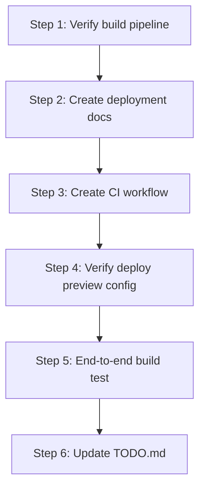

# Section 7 — Deployment & DevOps

> Complete the deployment pipeline: verify existing Netlify functions, document env vars, create CI/CD workflow, and ensure the build pipeline works end-to-end.

---

## 1. Current State Analysis

Several deployment items are already implemented but not checked off in `docs/TODO.md`:

| TODO Item | Status | Evidence |
|-----------|--------|----------|
| Create `netlify/functions/` directory | ✅ Done | [`netlify/functions/`](netlify/functions/) exists with `api.ts` and `scheduler.ts` |
| Create `netlify/functions/api.ts` entry point | ✅ Done | [`netlify/functions/api.ts`](netlify/functions/api.ts) wraps Hono app |
| Configure Netlify redirects for `/api/*` | ✅ Done | [`netlify.toml`](netlify.toml:17-18) has `path: '/api/*'` config and functions directory |
| Create `netlify/functions/scheduler.ts` | ✅ Done | [`netlify/functions/scheduler.ts`](netlify/functions/scheduler.ts) with 4 scheduled tasks |
| Set up Netlify env vars for production | ❌ Pending | No `.env.prod` or documentation |
| Test full build + deploy pipeline | ❌ Pending | No evidence of end-to-end testing |
| Set up Netlify deploy previews for PRs | ❌ Pending | No configuration found |
| Create `.github/workflows/ci.yml` | ❌ Pending | No `.github/` directory exists |

---

## 2. Remaining Work Items

### Step 1: Verify Build Pipeline

Ensure `pnpm run build` completes successfully (TypeScript check + Vite build). Fix any build errors.

### Step 2: Create Production Environment Variable Documentation

Create a deployment guide (`docs/DEPLOYMENT.md`) documenting:
- All required environment variables for production
- Which variables are server-only vs. client-exposed (`VITE_*`)
- Database setup instructions for production PostgreSQL
- Netlify site configuration steps

### Step 3: Create GitHub Actions CI Workflow

Create `.github/workflows/ci.yml` that runs on pull requests:
- Install dependencies with `pnpm`
- Run TypeScript type-check (`pnpm check`)
- Run linting (if configured)
- Run tests (`pnpm test`)
- Run build (`pnpm run build`)

### Step 4: Configure Netlify Deploy Previews

Verify or configure Netlify to automatically create deploy previews for PRs. This is typically enabled by default when connecting a Git repo, but we should ensure:
- The `netlify.toml` build settings are correct
- Environment variable scoping is documented (production vs. deploy-preview)

### Step 5: End-to-End Build Test

Run the full build pipeline locally and verify:
- `pnpm install` succeeds
- `pnpm check` passes (TypeScript)
- `pnpm test` passes
- `pnpm run build` produces `dist/` output
- Netlify function bundling is compatible (check that `esbuild` can resolve `@/` aliases)

### Step 6: Update TODO.md

Check off completed items in Section 7 of `docs/TODO.md`.

---

## 3. Files to Create

| File | Purpose |
|------|---------|
| `.github/workflows/ci.yml` | GitHub Actions CI pipeline |
| `docs/DEPLOYMENT.md` | Production deployment guide with env var reference |

## 4. Files to Modify

| File | Changes |
|------|---------|
| `docs/TODO.md` | Check off completed Section 7 items |
| `netlify.toml` | Minor adjustments if needed for build verification |

---

## 4. Implementation Order



---

## 5. Key Considerations

1. **pnpm on CI** — GitHub Actions needs `pnpm` installed via `pnpm/action-setup`
2. **Node version** — Pin Node.js 20+ in CI workflow
3. **Netlify CLI** — Optional for local deploy testing, not required for CI
4. **Build aliases** — Vite `@/` alias must resolve in Netlify function bundling (already handled in `netlify.toml` via `external_node_modules`)
5. **No secrets in CI** — Tests should not require real API keys; use mocks/stubs

---

## 6. CI Workflow Design

```yaml
name: CI
on:
  pull_request:
    branches: [main, develop]
  push:
    branches: [main, develop]

jobs:
  check-and-test:
    runs-on: ubuntu-latest
    steps:
      - Checkout
      - Setup pnpm
      - Setup Node.js 20
      - Install dependencies
      - Run TypeScript type-check
      - Run tests
      - Run build
```
