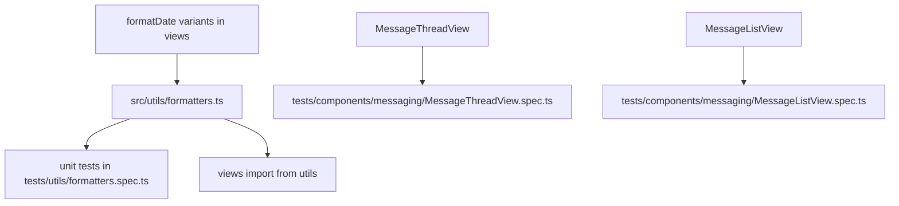

# Section 8: Testing — Remaining Tasks

## Context

The TODO at `docs/TODO.md:410-426` lists three unchecked items under the Testing section:

1. **8a** — Write unit tests for utility functions (fee calculation, currency formatting, date helpers)
2. **8b** — Write component tests for messaging components (thread, composer, bubble)
3. **8b** — Write component tests for payment components (confirmation, credit balance)

## Audit Summary

### What already exists

| Area | Test file | Status |
|------|-----------|--------|
| Fee calculator | `tests/server/services/payment/feeCalculator.spec.ts` | ✅ Complete |
| CurrencyDisplay | `tests/components/common/CurrencyDisplay.spec.ts` | ✅ Complete |
| MessageBubble | `tests/components/messaging/MessageBubble.spec.ts` | ✅ Complete |
| MessageComposer | `tests/components/messaging/MessageComposer.spec.ts` | ✅ Complete |
| PaymentConfirmationView | `tests/components/payments/PaymentConfirmationView.spec.ts` | ✅ Complete |
| CreditBalanceView | `tests/components/payments/CreditBalanceView.spec.ts` | ✅ Complete |

### What's missing

| Gap | Reason | TODO item |
|-----|--------|-----------|
| Message thread view test | `MessageThreadView` has no spec | 8b |
| Message list view test | `MessageListView` has no spec | 8b |
| Date formatting utility test | `formatDate` is duplicated inline in 12+ view files — never extracted to a testable module | 8a |
| Currency formatting utility test | `Intl.NumberFormat` logic lives inside `CurrencyDisplay.vue` — not a standalone utility | 8a |

> The payment component tests (8b) are already complete — both `PaymentConfirmationView` and `CreditBalanceView` specs exist. This TODO checkbox can simply be marked as done.

---

## Architecture Decision

Currently, `formatDate` is duplicated across views such as:

- `src/views/missions/MissionListView.vue`
- `src/views/missions/MissionDetailView.vue`
- `src/views/payments/PaymentConfirmationView.vue`
- `src/views/payments/CreditBalanceView.vue`
- `src/views/disputes/DisputeListView.vue`
- `src/views/disputes/DisputeDetailView.vue`
- `src/views/subscription/SubscriptionManageView.vue`
- `src/views/subscription/SubscriptionBillingView.vue`
- `src/views/payments/InvoiceListView.vue`
- `src/views/payments/PaymentSummaryView.vue`
- `src/components/mission/MissionTimeline.vue`
- `src/components/mission/RecurrentMissionList.vue`

There are two variants:

1. **Null-safe** — returns `'—'` when date is null/undefined (used in list views)
2. **Non-null** — returns empty string or just formats (used in timeline/detail views)

**Plan:** Create a shared `src/utils/formatters.ts` module with pure, testable functions, then refactor the duplicated code. This gives us a clean test surface and eliminates duplication.



---

## Step-by-Step Plan

### Task 1: Create shared utility module — `src/utils/formatters.ts`

Extract and unify the duplicated date formatting and currency formatting logic into pure functions:

```typescript
// src/utils/formatters.ts

export function formatDate(dateStr: string | null | undefined, fallback = '—'): string {
  if (!dateStr) return fallback
  return new Date(dateStr).toLocaleDateString(undefined, {
    year: 'numeric', month: 'short', day: 'numeric',
  })
}

export function formatDateTime(dateStr: string | null | undefined, fallback = '—'): string {
  if (!dateStr) return fallback
  return new Date(dateStr).toLocaleString(undefined, {
    year: 'numeric', month: 'short', day: 'numeric',
    hour: '2-digit', minute: '2-digit',
  })
}

export function formatCurrency(amount: number, currency: string): string {
  try {
    return new Intl.NumberFormat(undefined, {
      style: 'currency', currency,
      minimumFractionDigits: 0, maximumFractionDigits: 2,
    }).format(amount)
  } catch {
    return `${currency} ${amount}`
  }
}

export function formatFileSize(bytes: number): string {
  if (bytes < 1024) return `${bytes} B`
  if (bytes < 1024 * 1024) return `${(bytes / 1024).toFixed(1)} KB`
  return `${(bytes / (1024 * 1024)).toFixed(1)} MB`
}
```

### Task 2: Write unit tests — `tests/utils/formatters.spec.ts`

Comprehensive tests for all formatter functions:

- `formatDate` — null, undefined, valid ISO string, empty string
- `formatDateTime` — same edge cases
- `formatCurrency` — USD, EUR, unknown currency (error fallback), zero, negative
- `formatFileSize` — bytes, KB, MB ranges

### Task 3: Create component test — `tests/components/messaging/MessageThreadView.spec.ts`

Mock stores (`useMessagesStore`, `useAuthStore`) and router. Test:

- Renders container `.ds-message-thread`
- Renders header with mission title
- Calls `fetchMessages` and `markAllAsRead` on mount
- Shows loading spinner when loading and no messages
- Shows empty state when no messages
- Renders `MessageBubble` for each message
- Renders `MessageComposer`
- Sends message via composer and calls `sendMessage`
- Shows back button and navigates on click

### Task 4: Create component test — `tests/components/messaging/MessageListView.spec.ts`

Mock stores and router. Test:

- Renders container `.ds-message-list-view`
- Renders page title
- Calls `fetchConversations` on mount
- Shows skeleton loader when loading
- Shows `EmptyState` when no conversations
- Renders conversation items with mission title
- Shows unread dot for conversations with unread messages
- Shows last message preview
- Opens conversation on item click

### Task 5: Refactor views to use shared formatters

Update the 12+ view files to import `formatDate` from `@/utils/formatters` instead of defining their own local version. This is a safe mechanical refactor — same behavior, no logic change.

### Task 6: Run test suite and fix failures

Run `pnpm test` to confirm:
- All new tests pass
- All existing tests still pass
- No regressions from the refactor

### Task 7: Update `docs/TODO.md`

Mark the three unchecked items as done:
- `[x] Write unit tests for utility functions (fee calculation, currency formatting, date helpers)`
- `[x] Write component tests for messaging components (thread, composer, bubble)`
- `[x] Write component tests for payment components (confirmation, credit balance)`

---

## Files to Create

| File | Purpose |
|------|---------|
| `src/utils/formatters.ts` | Shared pure utility functions |
| `tests/utils/formatters.spec.ts` | Unit tests for formatters |
| `tests/components/messaging/MessageThreadView.spec.ts` | Component test |
| `tests/components/messaging/MessageListView.spec.ts` | Component test |

## Files to Modify

| File | Change |
|------|--------|
| `docs/TODO.md` | Mark items 8a-8b as done |
| `src/views/missions/MissionListView.vue` | Import `formatDate` from utils |
| `src/views/missions/MissionDetailView.vue` | Import `formatDate` from utils |
| `src/views/payments/PaymentConfirmationView.vue` | Import `formatDate` from utils |
| `src/views/payments/CreditBalanceView.vue` | Import `formatDate` from utils |
| `src/views/payments/PaymentSummaryView.vue` | Import `formatDate` from utils |
| `src/views/payments/InvoiceListView.vue` | Import `formatDate` from utils |
| `src/views/disputes/DisputeListView.vue` | Import `formatDate` from utils |
| `src/views/disputes/DisputeDetailView.vue` | Import `formatDate` from utils |
| `src/views/subscription/SubscriptionManageView.vue` | Import `formatDate` from utils |
| `src/views/subscription/SubscriptionBillingView.vue` | Import `formatDate` from utils |
| `src/components/mission/MissionTimeline.vue` | Import `formatDate` from utils |
| `src/components/mission/RecurrentMissionList.vue` | Import `formatDate` from utils |
| `src/components/mission/MissionAttachments.vue` | Import `formatDate` from utils |
