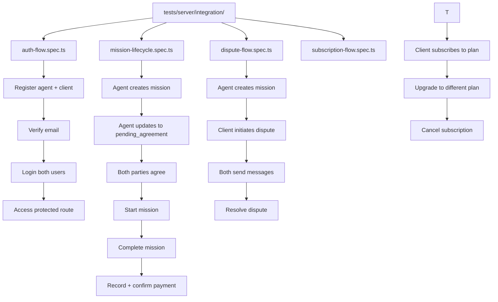

# Section 8c: Integration Tests

## Context

The TODO at `docs/TODO.md:428-433` lists four unchecked items under Integration Tests:

1. Write integration tests for authentication flow (register → verify → login → access protected route)
2. Write integration tests for mission lifecycle (create → agree → progress → complete → pay)
3. Write integration tests for dispute flow (initiate → message → resolve)
4. Write integration tests for subscription flow (subscribe → upgrade → cancel)

## Audit Summary

### Existing Test Patterns

| Pattern | File | Notes |
|---------|------|-------|
| API test via `app.request()` | `tests/server/routes/*.spec.ts` | Uses Hono's built-in test client |
| DB setup | `tests/server/helpers/setup.ts` | `sequelize.sync({ force: true })` for clean state |
| Auth tokens | `tests/server/routes/missions.spec.ts` | Register via API, extract `accessToken` |
| Sequential execution | `vitest.config.ts` | `fileParallelism: false` for SQLite safety |

### Key Difference: Unit vs Integration

The existing `tests/server/routes/*.spec.ts` files test **individual endpoints** in isolation. The integration tests test **complete multi-step workflows** — verifying that state transitions carry through correctly across multiple API calls in sequence.

### Existing Coverage Gaps

The existing route tests already cover individual endpoints but don't test the full chained flow. For example:
- `auth.spec.ts` tests register and login separately, but doesn't chain: register → verify → login → access protected route
- `missions.spec.ts` tests mission CRUD but doesn't include payment at the end of the lifecycle
- No tests exist for dispute creation via `POST /api/missions/:id/dispute` followed by messaging and resolution
- `subscriptions.spec.ts` tests subscribe and cancel but not upgrade flow

---

## Architecture

All four integration test files will live in `tests/server/integration/` to clearly separate them from the endpoint-level tests. Each test file:

- Uses the Hono `app.request()` pattern consistent with existing tests
- Chains API calls sequentially within a single `describe` block
- Registers fresh users per test to avoid cross-contamination
- Uses `beforeAll` for DB sync and `afterAll` for cleanup
- Tests the **happy path** end-to-end flow
- Includes negative assertions at critical points (e.g., unauthenticated access fails)



---

## Step-by-Step Plan

### Task 1: Create `tests/server/integration/auth-flow.spec.ts`

**Flow:** register agent → register client → verify agent email → login agent → login client → access protected route (GET /api/users/me) → access protected route as client

**Steps tested:**
1. `POST /api/auth/register` — agent registers successfully, receives `accessToken` + `verificationToken`
2. `POST /api/auth/register` — client registers successfully
3. `GET /api/auth/verify-email/:token` — verify agent's email using verification token
4. `POST /api/auth/login` — agent logs in, receives new tokens
5. `POST /api/auth/login` — client logs in
6. `GET /api/users/me` — agent accesses protected route with token, gets profile
7. `GET /api/users/me` — client accesses protected route with token, gets profile
8. `GET /api/users/me` — unauthenticated request returns 401
9. `POST /api/auth/refresh` — refresh token works
10. `POST /api/auth/logout` — logout invalidates refresh token, subsequent refresh fails

### Task 2: Create `tests/server/integration/mission-lifecycle.spec.ts`

**Flow:** create mission → send for agreement → both agree → start → add message → complete → record payment → confirm payer → confirm payee → payment confirmed

**Steps tested:**
1. Register agent + client (via API)
2. `POST /api/missions` — agent creates mission with checklist
3. `PUT /api/missions/:id/status` — agent sends mission for agreement (→ `pending_agreement`)
4. `POST /api/missions/:id/agree` — agent agrees
5. `POST /api/missions/:id/agree` — client agrees (→ `agreed`)
6. `PUT /api/missions/:id/status` — agent starts mission (→ `in_progress`, `startedAt` set)
7. `POST /api/missions/:id/messages` — agent sends message in mission conversation
8. `POST /api/missions/:id/messages` — client replies
9. `PUT /api/missions/:id/status` — agent completes mission (→ `completed`, `completedAt` set)
10. `POST /api/missions/:id/payments` — client records payment
11. `POST /api/payments/:id/confirm-payer` — client confirms payment sent
12. `POST /api/payments/:id/confirm-payee` — agent confirms payment received
13. `GET /api/missions/:id/payments` — verify payment status is `confirmed`

### Task 3: Create `tests/server/integration/dispute-flow.spec.ts`

**Flow:** create mission → advance to in_progress → client initiates dispute → both send messages → resolve dispute

**Steps tested:**
1. Register agent + client (via API)
2. Create mission and advance to `in_progress` status
3. `POST /api/missions/:id/dispute` — client initiates dispute (mission → `disputed`)
4. `GET /api/disputes` — client sees their dispute
5. `GET /api/disputes/:id` — get dispute details with messages array
6. `POST /api/disputes/:id/messages` — client sends message in dispute room
7. `POST /api/disputes/:id/messages` — agent sends message in dispute room
8. `GET /api/disputes/:id` — verify both messages present
9. `PUT /api/disputes/:id/resolve` — agent resolves dispute with resolution note
10. `GET /api/disputes/:id` — verify status is `resolved` and resolution text is set
11. `POST /api/disputes/:id/escalate` — test escalate path on a new dispute (create fresh)

### Task 4: Create `tests/server/integration/subscription-flow.spec.ts`

**Flow:** list plans → subscribe to plan → verify subscription → upgrade to different plan → verify upgrade → cancel subscription → verify cancellation

**Steps tested:**
1. Register client (via API)
2. `POST /api/admin/subscription-plans` or seed plans via DB directly
3. `GET /api/subscriptions/plans` — list available plans
4. `POST /api/subscriptions` — client subscribes to Small Business plan
5. `GET /api/subscriptions/me` — verify subscription details (plan, status `active`)
6. `PUT /api/subscriptions/me` — upgrade to Professional plan
7. `GET /api/subscriptions/me` — verify plan changed
8. `DELETE /api/subscriptions/me` — cancel subscription
9. `GET /api/subscriptions/me` — verify no active subscription (returns empty/null)
10. `POST /api/subscriptions` — cannot subscribe while already having active (edge case with new sub after cancel)

---

## Files to Create

| File | Purpose |
|------|---------|
| `tests/server/integration/auth-flow.spec.ts` | Authentication flow integration test |
| `tests/server/integration/mission-lifecycle.spec.ts` | Mission lifecycle integration test |
| `tests/server/integration/dispute-flow.spec.ts` | Dispute flow integration test |
| `tests/server/integration/subscription-flow.spec.ts` | Subscription flow integration test |

## Files to Modify

| File | Change |
|------|--------|
| `docs/TODO.md` | Mark items 8c (lines 430-433) as done |
| `vitest.config.ts` | Add `tests/server/integration/**` to `environmentMatchGlobs` mapping to `node` |

## vitest.config.ts Change

```typescript
environmentMatchGlobs: [
  ['tests/server/**', 'node'],          // already covers integration/
  ['tests/components/**', 'jsdom'],
  ['tests/composables/**', 'jsdom'],
  ['tests/router/**', 'jsdom'],
  ['tests/App.spec.ts', 'jsdom'],
],
```

No change needed — `tests/server/integration/**` is already matched by `tests/server/**`.

---

## Implementation Notes

- Each test uses `app.request()` for HTTP calls (no supertest needed)
- Users are registered via the API in `beforeAll` to get real tokens
- DB is synced with `{ force: true }` for a clean state
- Tests run sequentially (`fileParallelism: false` in vitest config)
- Each test file uses unique email addresses (`Date.now()` + random suffix) to avoid conflicts
- The `generateAccessToken` utility from `@/server/utils/jwt` is available if needed for crafting tokens
- All assertions check both `res.status` and `body.success` / `body.data` for completeness
