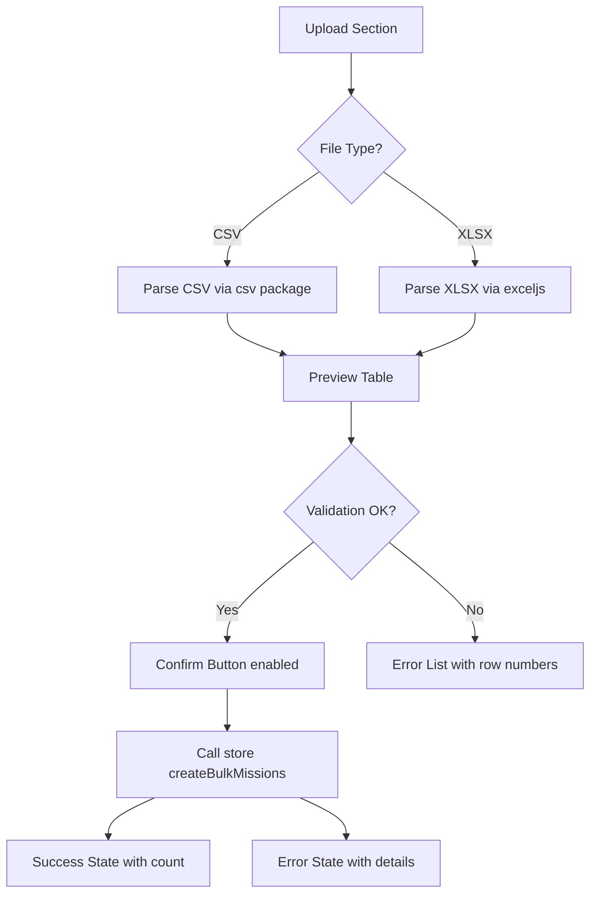

# Section 9 — CSV Bulk Mission Creation for Enterprise Tier

> Implements the remaining unchecked item in [`docs/TODO.md`](docs/TODO.md:461).
>
> **Revision (2026-07):** XLSX support was dropped. `exceljs` crashed the
> `/app/missions/bulk` route in the browser
> (`TypeError: import_util.default.inherits is not a function`) because its Node
> entry uses Node core modules Vite cannot polyfill. Bulk creation is now
> **CSV-only** (parse + template download). See
> [`plans/remove-exceljs-csv-only.md`](plans/remove-exceljs-csv-only.md:1) for
> the removal rationale. The XLSX sections below are kept for historical
> reference only and are **no longer implemented**.

---

## Current State

| Layer | Status | Details |
|-------|--------|---------|
| Backend route | ✅ Done | [`POST /api/missions/bulk`](src/server/routes/missions.ts:107) — Enterprise check, validation, creates missions + conversations |
| Frontend service | ✅ Done | [`createBulkMissions()`](src/services/missions.ts:44) |
| Frontend store | ⚠️ Partial | [`useMissionsStore`](src/stores/missions.ts:77) imports `apiCreateBulkMissions` but does not expose a `createBulkMissions` action |
| Frontend view | ❌ Missing | No `BulkMissionCreateView.vue` |
| Router | ❌ Missing | No `/app/missions/bulk` route |
| Sidebar | ❌ Missing | No "Bulk Create" link |
| i18n | ❌ Missing | No `missions.bulk.*` keys |
| Tests | ❌ Missing | No backend or frontend tests for bulk |

---

## Installed Dependencies

| Package | Version | Purpose |
|---------|---------|---------|
| _(none)_ | — | CSV parsing is now done by a hand-rolled, dependency-free parser at [`src/utils/csv.ts`](src/utils/csv.ts:1) |

> `exceljs` and `csv` were both removed — both are Node stream-based and pulled
> in Node core modules (`util.inherits`, `stream`, …) that Vite cannot polyfill
> in the browser, crashing the `/app/missions/bulk` route with
> `TypeError: import_util.default.inherits is not a function`. See the revision
> note at the top of this file and [`plans/remove-exceljs-csv-only.md`](plans/remove-exceljs-csv-only.md:1).

---

## Updated Plan — CSV + XLSX Support

### Step 1 — Pinia Store Action

**File:** [`src/stores/missions.ts`](src/stores/missions.ts:282)

- Add `createBulkMissions(data: CreateMissionData[])` action to the returned object.
- Calls `apiCreateBulkMissions`, prepends created missions to `missions.value`, returns count.
- Handles errors via `error.value` and rethrows.

---

### Step 2 — New View: `BulkMissionCreateView.vue`

**New file:** `src/views/missions/BulkMissionCreateView.vue`

Uses `<script lang="ts" setup>` per project conventions.

#### UI Flow



#### File Upload

- Use existing [`FileUpload.vue`](src/components/common/FileUpload.vue:1) with `accept=".csv,.xlsx,.xls"`.
- Accept only `.csv`, `.xlsx`, `.xls` file extensions.

#### CSV Parsing — `csv` package

The `csv` package is Node.js stream-based. Since this runs in the browser via Vite, we use the `csv/sync` sub-package which provides synchronous parsing without streams:

```typescript
import { parse } from 'csv/sync'

function parseCSV(text: string): Record<string, string>[] {
  const rows = parse(text, {
    columns: true,       // Use first row as headers
    skip_empty_lines: true,
    trim: true,
    relax_column_count: true,
  })
  return rows
}
```

- Read file with `FileReader.readAsText()`.
- Pass the text content to `parse()` from `csv/sync`.
- Returns array of objects keyed by column headers.

#### XLSX Parsing — `exceljs` package

```typescript
import ExcelJS from 'exceljs'

async function parseXLSX(buffer: ArrayBuffer): Promise<Record<string, any>[]> {
  const workbook = new ExcelJS.Workbook()
  await workbook.xlsx.load(buffer)

  const sheet = workbook.worksheets[0]
  if (!sheet || sheet.rowCount < 2) return []

  // Extract headers from first row
  const headers: string[] = []
  sheet.getRow(1).eachCell((cell, colNumber) => {
    headers[colNumber - 1] = String(cell.value || '').trim()
  })

  // Extract data rows
  const data: Record<string, any>[] = []
  sheet.eachRow((row, rowNumber) => {
    if (rowNumber === 1) return // Skip header
    const obj: Record<string, any> = {}
    row.eachCell((cell, colNumber) => {
      const key = headers[colNumber - 1]
      if (key) obj[key] = cell.value
    })
    data.push(obj)
  })

  return data
}
```

- Read file with `FileReader.readAsArrayBuffer()`.
- Load buffer into `ExcelJS.Workbook` via `workbook.xlsx.load(buffer)`.
- Read first worksheet, extract headers from row 1, map data rows.

#### Expected Column Headers

| Column | Required | Type | Notes |
|--------|----------|------|-------|
| `title` | ✅ | string | Mission title |
| `clientId` | ✅ | number | Client user ID |
| `pricingType` | ✅ | string | `fixed`, `hourly`, or `task_based` |
| `description` | ❌ | string | Mission description |
| `agreedAmount` | ❌ | number | Agreed payment amount |
| `currency` | ❌ | string | Currency code, defaults to `USD` |
| `agreedChecklist` | ❌ | string | Pipe-separated checklist items, e.g. `Task 1|Task 2|Task 3` |
| `type` | ❌ | string | `one_time` or `recurrent`, defaults to `one_time` |

#### Preview Table

- Display parsed missions in [`BTable.vue`](src/components/base/BTable.vue:1) with columns: Row #, Title, Client ID, Pricing Type, Amount, Status (✅ Valid / ❌ Error).
- Show validation errors inline per row (missing required fields, invalid pricingType, etc.).
- Summary bar: "X valid, Y errors" with total row count.

#### Actions

- **"Download Template CSV"** button — generates a sample CSV file with headers and one example row using the `csv` package's `stringify` function.
- **"Download Template XLSX"** button — generates a styled XLSX template via `ExcelJS`:
  ```typescript
  const workbook = new ExcelJS.Workbook()
  const sheet = workbook.addWorksheet('Missions')
  sheet.columns = [
    { header: 'title', key: 'title', width: 30 },
    { header: 'clientId', key: 'clientId', width: 12 },
    { header: 'pricingType', key: 'pricingType', width: 15 },
    { header: 'description', key: 'description', width: 40 },
    { header: 'agreedAmount', key: 'agreedAmount', width: 15 },
    { header: 'currency', key: 'currency', width: 10 },
    { header: 'agreedChecklist', key: 'agreedChecklist', width: 40 },
    { header: 'type', key: 'type', width: 12 },
  ]
  // Style header row
  sheet.getRow(1).eachCell(cell => {
    cell.fill = { type: 'pattern', pattern: 'solid', fgColor: { argb: '4F46E5' } }
    cell.font = { color: { argb: 'FFFFFF' }, bold: true }
  })
  sheet.addRow({ title: 'Example Mission', clientId: 1, pricingType: 'fixed', description: 'Sample mission', agreedAmount: 100, currency: 'USD', agreedChecklist: 'Task 1|Task 2', type: 'one_time' })
  const buffer = await workbook.xlsx.writeBuffer()
  const blob = new Blob([buffer], { type: 'application/vnd.openxmlformats-officedocument.spreadsheetml.sheet' })
  ```
- **"Confirm Create"** button — disabled if any validation errors exist; calls store `createBulkMissions` with valid entries only.
- **Toast notifications** via [`useToast`](src/composables/useToast.ts:1) for success/error feedback.

#### Validation Rules (per row)

- `title` must be non-empty string.
- `clientId` must be a positive integer.
- `pricingType` must be one of `fixed`, `hourly`, `task_based`.
- `agreedAmount` if present must be a positive number.
- `currency` if present must be a 3-letter string.
- Total rows must not exceed 100.

---

### Step 3 — Router Entry

**File:** [`src/router/index.ts`](src/router/index.ts:1)

- Add route `/app/missions/bulk` → `BulkMissionCreateView.vue` with `meta: { requiresAuth: true }`.
- Place under the missions route group, alongside existing mission routes.

---

### Step 4 — Sidebar Navigation

**File:** [`src/components/layout/Sidebar.vue`](src/components/layout/Sidebar.vue:1)

- Add "Bulk Create" link with `bi-file-earmark-spreadsheet` icon in the missions section.
- Show only when user role is `client`. The API will reject non-Enterprise users with 403 if they try to access it.

---

### Step 5 — i18n Keys

**Files:** [`en.json`](src/locales/en.json:1), [`fr.json`](src/locales/fr.json:1), [`ar.json`](src/locales/ar.json:1)

Add under `missions.bulk`:

| Key | EN | FR | AR |
|-----|----|----|-----|
| `title` | Bulk Create Missions | Créer des missions en masse | إنشاء مهام بالجملة |
| `subtitle` | Upload a CSV or XLSX file to create multiple missions at once | Téléchargez un fichier CSV ou XLSX pour créer plusieurs missions | قم بتحميل ملف CSV أو XLSX لإنشاء عدة مهام |
| `upload` | Upload File | Télécharger le fichier | تحميل الملف |
| `downloadTemplateCsv` | Download CSV Template | Télécharger le modèle CSV | تحميل نموذج CSV |
| `downloadTemplateXlsx` | Download XLSX Template | Télécharger le modèle XLSX | تحميل نموذج XLSX |
| `preview` | Preview | Aperçu | معاينة |
| `confirm` | Create Missions | Créer les missions | إنشاء المهام |
| `successMessage` | `{count} missions created successfully` | `{count} missions créées avec succès` | `تم إنشاء {count} مهام بنجاح` |
| `errorMax` | Maximum 100 missions per upload | Maximum 100 missions par téléchargement | الحد الأقصى 100 مهمة لكل تحميل |
| `errorEmpty` | No valid missions found | Aucune mission valide trouvée | لم يتم العثور على مهام صالحة |
| `errorFileFormat` | Please upload a CSV or XLSX file | Veuillez télécharger un fichier CSV ou XLSX | يرجى تحميل ملف CSV أو XLSX |
| `columnRow` | Row | Ligne | صف |
| `columnTitle` | Title | Titre | العنوان |
| `columnClientId` | Client ID | ID Client | معرّف العميل |
| `columnPricingType` | Pricing Type | Type de tarification | نوع التسعير |
| `columnAmount` | Amount | Montant | المبلغ |
| `columnStatus` | Status | Statut | الحالة |
| `statusValid` | Valid | Valide | صالح |
| `statusError` | Error | Erreur | خطأ |
| `validCount` | `{count} valid` | `{count} valide(s)` | `{count} صالح` |
| `errorCount` | `{count} errors` | `{count} erreur(s)` | `{count} أخطاء` |
| `requiredField` | Required field | Champ requis | حقل مطلوب |
| `invalidPricingType` | Must be fixed, hourly, or task_based | Doit être fixed, hourly ou task_based | يجب أن يكون fixed أو hourly أو task_based |

Run `pnpm i18n:sync` after adding keys.

---

### Step 6 — Backend Tests

**File:** `tests/server/routes/missions.spec.ts` (add new describe block)

| Test | Expected |
|------|----------|
| Enterprise client uploads 5 missions | All created, returns count 5 |
| Non-Enterprise client (no csv_import feature) | 403 |
| Agent uploads bulk missions | Succeeds (agents are allowed per route logic) |
| Missing `title` in an entry | 422 |
| Empty array | 422 |
| Over 100 missions | 422 |
| Invalid `pricingType` | 422 |
| Missing `clientId` | 422 |

---

### Step 7 — Frontend Component Tests

**New file:** `tests/components/missions/BulkMissionCreateView.spec.ts`

| Test | Expected |
|------|----------|
| Renders upload area | FileUpload component visible |
| Renders download template buttons | Both CSV and XLSX buttons visible |
| Parses valid CSV | Preview table shows correct rows via csv/sync |
| Parses valid XLSX | Preview table shows correct rows via exceljs |
| Rejects invalid CSV (missing columns) | Error messages shown |
| Rejects non-CSV/XLSX file type | Error toast displayed |
| Shows validation errors per row | Row-level error indicators |
| Confirm button disabled when errors exist | Button has disabled attribute |
| Confirm button calls store action | `createBulkMissions` called with correct data |
| Success state displays count | Success message with mission count |

---

### Step 8 — Validation & Cleanup

- `pnpm test` — all tests pass
- `pnpm type-check` — no type errors
- `pnpm i18n:sync` — translations valid
- Check off [`docs/TODO.md`](docs/TODO.md:461)

---

## Flow Diagram

```mermaid
flowchart LR
    subgraph Frontend
        A[User selects CSV or XLSX] --> B[FileUpload component]
        B --> C{File extension?}
        C -->|CSV| D[csv/sync parse]
        C -->|XLSX| E[ExcelJS workbook.xlsx.load]
        D --> F[ParseMissionRow array]
        E --> F
        F --> G[Validate each row]
        G --> H[Preview Table with status]
        H --> I[User clicks Confirm]
        I --> J[Missions store createBulkMissions]
    end

    subgraph Backend
        J --> K[POST /api/missions/bulk]
        K --> L{Enterprise tier check}
        L -->|Pass| M[Validate each entry]
        L -->|Fail| N[403 Forbidden]
        M --> O[Create missions in loop]
        O --> P[Create conversations]
        P --> Q[Send notifications]
        Q --> R[Return count + missions]
    end
```



---

## Constraints

- **No breaking changes** — purely additive (new view, route, store action).
- **No DB migration** — reuses existing `Mission` and `Conversation` models.
- **No third-party CSV/Excel deps** — parsing is done by a hand-rolled, browser-safe parser at [`src/utils/csv.ts`](src/utils/csv.ts:1). Both `exceljs` and `csv` were removed (they pulled in Node core modules that crashed the route in the browser).
- **Max 100 rows** per upload — enforced both frontend (preview) and backend (API).
- **Enterprise-only** — enforced backend via `csv_import` feature flag on `SubscriptionPlan.features`.
- **CSV-only** — XLSX/XLS parsing and template generation were dropped to avoid the `exceljs` browser polyfill crash.
